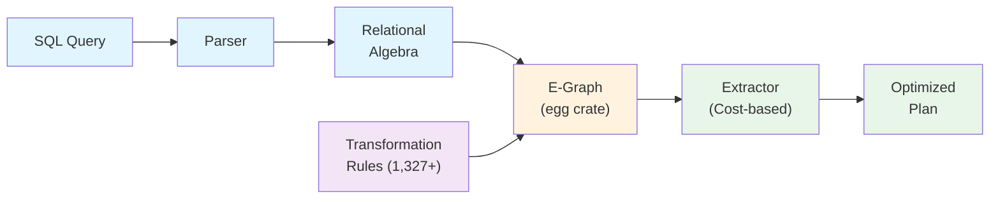

# RA Documentation

**RA** is a state-of-the-art query optimizer built on relational algebra transformation rules, equality saturation, and differential dataflow. It transforms SQL queries into optimal execution plans using **1,327+ transformation rules** derived from decades of database research and production experience.

## Key Features

- **1,327+ Transformation Rules** - Comprehensive rule library covering logical, physical, hardware, distributed, and multi-model optimizations
- **20+ Database Dialects** - Seamless SQL translation between PostgreSQL, MySQL, Oracle, SQL Server, SQLite, DuckDB, and more
- **Hardware-Aware Optimization** - Adaptive plans for CPU (SIMD), GPU, FPGA, and heterogeneous systems
- **Cost-Based Optimization** - Calibratable cost models with cardinality estimation and statistics management
- **Equality Saturation** - Explores all equivalent plans simultaneously via e-graphs
- **Performance Shortcuts** - MIN/MAX metadata lookups, COUNT(*) shortcuts, covering indexes, bitmap scans
- **Distributed Execution** - Partition-aware optimization, co-location awareness, minimal data movement
- **Columnar Format Support** - Parquet predicate pushdown, row group filtering, column pruning
- **WASM Integration** - Run queries in WebAssembly environments
- **Formal Verification** - Mathematically proven correctness of transformation rules

## Quick Start

```bash
# Install and build
cargo build --release

# Optimize your first query
ra-cli optimize \
  "SELECT * FROM orders WHERE amount > 1000 AND status = 'active'"

# Translate between databases
ra-cli translate --from postgres --to mysql \
  "SELECT * FROM orders WHERE created_at > NOW() - INTERVAL '7 days'"

# Launch web UI
./scripts/docker-compose-up.sh
# Open http://localhost:8000
```

## Documentation Structure

###  Core Documentation

- **[Getting Started](getting-started.md)** - Installation, quick examples of ALL major features
- **[Architecture](architecture.md)** - System design, components, and data flow
- **[Benchmarks](benchmarks.md)** - JOB and TPC-H benchmark results, plan cache performance
- **[PostgreSQL Extension](postgresql-extension.md)** - Native PostgreSQL integration guide
- **[API Reference](api-reference.md)** - Programmatic usage and integration
- **[Contributing](contributing.md)** - Development standards and contribution guidelines
- **[Deployment](deployment.md)** - Docker, Kubernetes, cloud deployment

###  Guides

Step-by-step instructions for specific tasks:

- **[Rule Authoring](guides/rule-authoring.md)** - Write custom `.rra` transformation rules
- **[Optimization](guides/optimization.md)** - Use the optimizer effectively
- **[Dialect Translation](guides/dialect-translation.md)** - Cross-database SQL translation
- **[Cost Models](guides/cost-models.md)** - Calibrate and customize cost estimation
- **[Testing](guides/testing.md)** - Test strategies and framework usage
- **[Test Format](guides/test-format.md)** - Literate test format specification

###  Concepts

Fundamental concepts and theory:

- **[Relational Algebra](concepts/relational-algebra.md)** - RA notation and operations
- **[Pre-Conditions](concepts/pre-conditions.md)** - Rule applicability system
- **[Facts Provider](concepts/facts-provider.md)** - Unified system facts interface
- **[Rule Categories](concepts/rule-categories.md)** - Taxonomy of transformation rules

###  Features

Deep dives into major capabilities:

- **[Adaptive Execution](features/adaptive-execution.md)** - Runtime query adaptation
- **[Bitmap Index Scan](features/bitmap-index-scan.md)** - Bitmap-based query acceleration
- **[Distributed Optimization](features/federated-queries.md)** - Cross-database federation
- **[Execution Models](features/execution-models.md)** - Volcano, vectorized, and compiled execution
- **[Formal Verification](features/formal-verification.md)** - Mathematical correctness proofs
- **[Function Catalog](features/function-catalog.md)** - Built-in and UDF support
- **[Hardware Acceleration](features/hardware-acceleration.md)** - GPU/FPGA/SIMD optimization
- **[Index Types](features/index-types.md)** - B-tree, hash, bitmap, and specialized indexes
- **[Integration Testing](features/integration-testing-report.md)** - Test coverage and results
- **[ML Cardinality](features/ml-cardinality.md)** - Machine learning for cardinality estimation
- **[Multi-Model Optimization](features/multi-model-optimization.md)** - Graph, document, time-series support
- **[Network Modeling](features/network-modeling.md)** - Network-aware distributed execution
- **[Platform Architecture](features/platform-architecture.md)** - System design details
- **[Resource Budgets](features/resource-budgets.md)** - Time and memory constraints
- **[Statistics Timeline](features/statistics-timeline-format.md)** - Time-aware statistics
- **[Unnest Implementation](features/unnest-implementation.md)** - Array and nested data handling
- **[WASM Databases](features/wasm-databases.md)** - WebAssembly database integration

###  Integrations

Database and system integrations:

- **[PostgreSQL](integrations/postgresql.md)** - PostgreSQL-specific optimizations
- **[Database Adapters](integrations/database-adapters.md)** - Connecting to various databases
- **[Web UI](integrations/web-ui.md)** - Interactive query visualization

###  Encyclopedia

Comprehensive reference for SQL patterns, schemas, and optimization:

- **[SQL Query Encyclopedia](encyclopedia/)** - 50+ query patterns with relational algebra and optimization details
  - **[Query Patterns](encyclopedia/query-patterns/)** - OLTP, OLAP, analytical, recursive, temporal, joins, subqueries
  - **[Schema Patterns](encyclopedia/schema-patterns/)** - Star, snowflake, normalized, partitioned designs
  - **[Dataset Characteristics](encyclopedia/dataset-characteristics/)** - Cardinality, distribution, skew, correlation
  - **[Workload Patterns](encyclopedia/workload-patterns/)** - OLTP, OLAP, HTAP, batch, real-time
  - **[Distributed Patterns](encyclopedia/distributed-patterns/)** - Shuffle joins, broadcast, co-located joins
  - **[Index Structures](encyclopedia/index-structures/)** - B-tree, hash, bitmap, covering indexes

###  Examples

Practical demonstrations:

- **[Simple Optimization](examples/simple-optimization.md)** - Basic query optimization
- **[Predicate Pushdown](examples/predicate-pushdown.md)** - Filter optimization
- **[Join Reordering](examples/join-reordering.md)** - Optimal join sequences
- **[Index Selection](examples/index-selection.md)** - Automatic index usage
- **[Cost Calibration](examples/cost-calibration.md)** - Hardware-specific tuning
- **[Hardware-Aware Optimization](examples/hardware-aware-optimization.md)** - SIMD/GPU usage
- **[Distributed Join Strategies](examples/distributed-join-strategies.md)** - Network-aware joins
- **[Subquery Unnesting](examples/subquery-unnesting.md)** - Nested query optimization

###  Research

Academic foundations and papers:

- **[Research Paper](research/paper.md)** - Core academic publication

## System Overview



## Performance Highlights

- **Plan Cache**: 37x OLTP speedup with template-based caching (97.5% hit rate)
- **Rule Prioritization**: 20-27% faster optimization from cost-to-benefit rule ordering
- **Query Optimization**: Up to 1000x speedup on complex analytical queries
- **Index Selection**: 85% I/O reduction with automatic covering index detection
- **Metadata Shortcuts**: O(1) MIN/MAX/COUNT operations on billion-row tables
- **Predicate Pushdown**: 95% data skip with Parquet row group filtering
- **Join Reordering**: 10-100x improvement on star schema queries
- **Hardware Adaptation**: 2-5x speedup with SIMD/GPU awareness

## Building Documentation

Multiple ways to build and serve the Ra documentation:

### Using Cargo (Recommended)

```bash
# Serve documentation locally (opens at http://localhost:5173/ra/)
cargo docs

# Just build without serving
cargo docs-build
```

### Using Nix

```bash
# Serve documentation locally
nix run .#docs

# Build static site for deployment
nix run .#docs-build
```

### Using npm Directly

```bash
cd docs

# Install dependencies (first time only)
npm install

# Serve locally at http://localhost:5173/ra/
npm run dev

# Build for production
npm run build:docs

# Preview production build
npm run preview
```

## Development

```bash
# Run tests
cargo test --all-features

# Run benchmarks
cargo bench

# Check code quality
cargo clippy --all-targets --all-features -- -D warnings

# Generate Rust API documentation
cargo doc --all-features --open

# Run web UI locally
cargo run --bin ra-web-ui
```

## Security

See [security.md](security.md) for information about npm dependency vulnerabilities and production deployment best practices.

## Architecture Highlights

- **26 Rust crates** - Modular design with clear separation of concerns
- **Literate Rules** - `.rra` format combining YAML metadata, markdown docs, algebra, and tests
- **Differential Dataflow** - Incremental computation for statistics and cost updates
- **Property Testing** - Automated correctness verification via quickcheck
- **Formal Methods** - Z3 SMT solver integration for rule verification

## Contributing

We welcome contributions! Please see our [Contributing Guide](contributing.md) for:
- Development standards and practices
- How to write and test transformation rules
- Code review process
- Performance benchmarking requirements

## Support

- **Documentation Issues**: [Issues](https://codeberg.org/gregburd/ra/issues)
- **Discord Community**: [Join our Discord](https://discord.gg/ra-optimizer)
- **Commercial Support**: contact@ra-optimizer.com

## License

RA is available under the Apache 2.0 license. See [LICENSE](../LICENSE) for details.

## Acknowledgments

RA builds on decades of database research. See our [Research Paper](research/paper.md) for academic foundations.

---

**Ready to optimize?** Start with [Getting Started](getting-started.md) or explore [Examples](examples/) to see RA in action!
