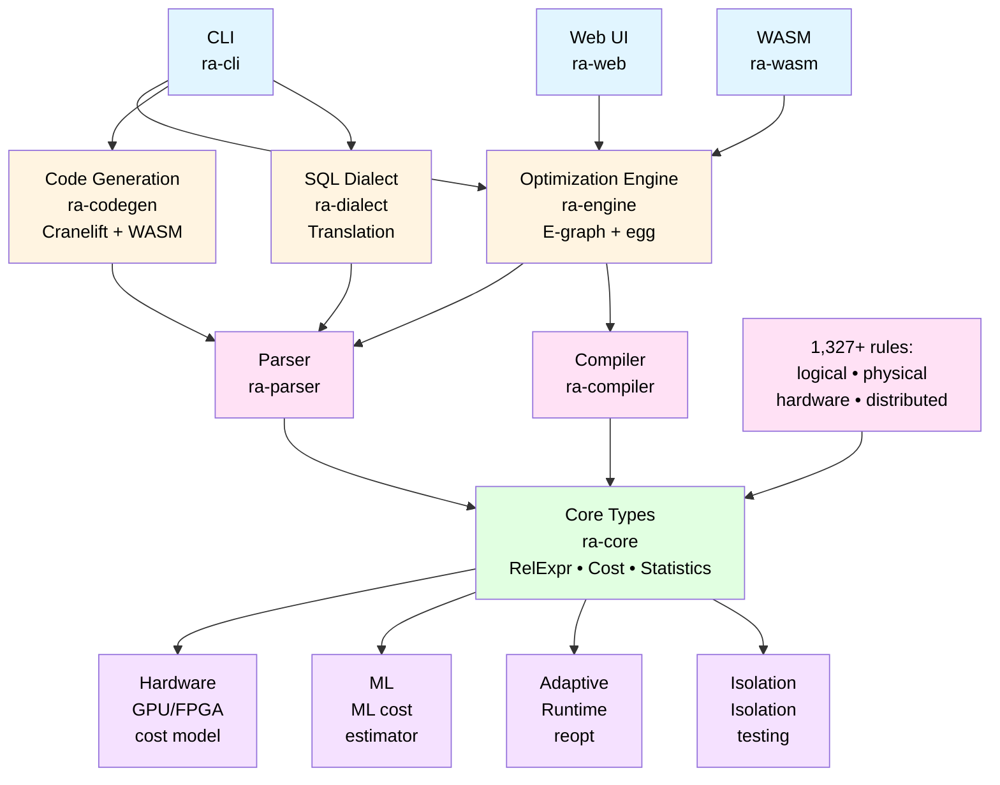
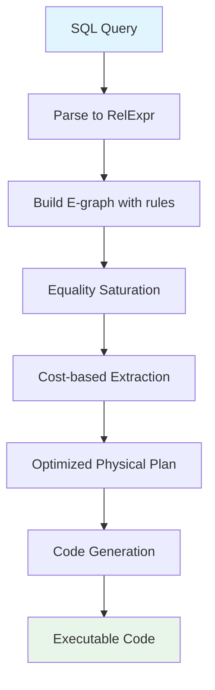
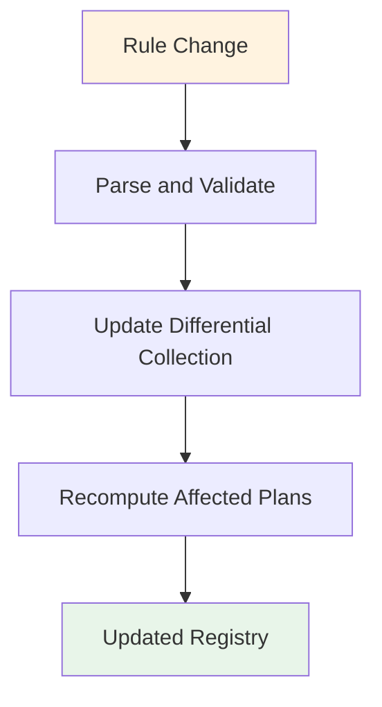
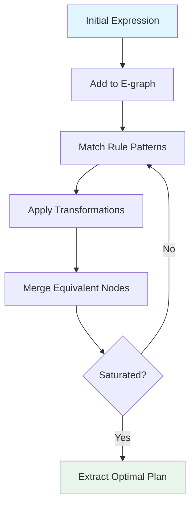
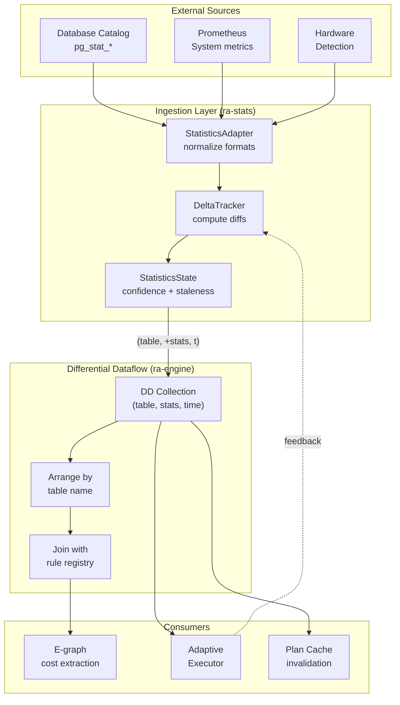
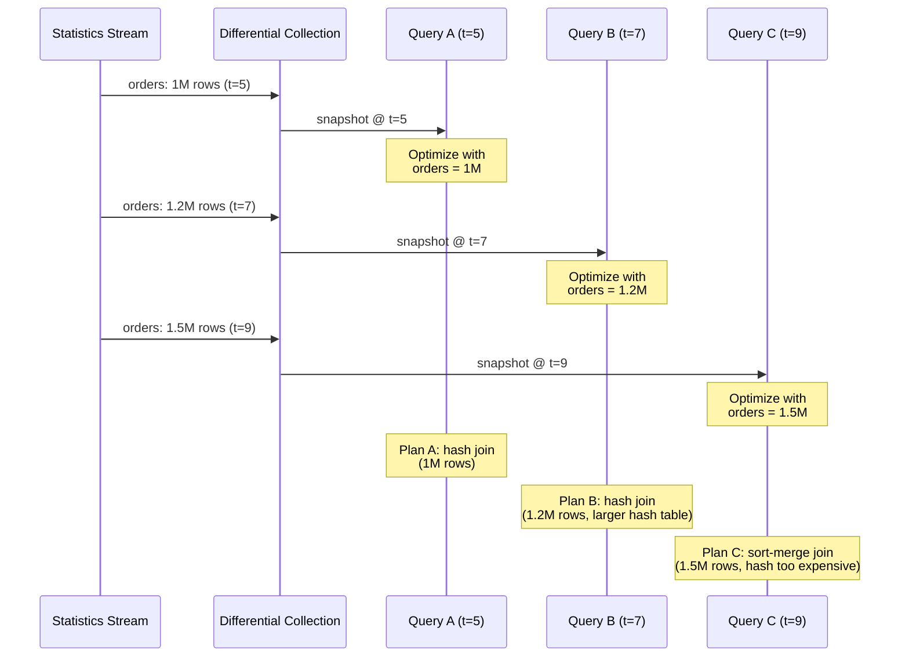
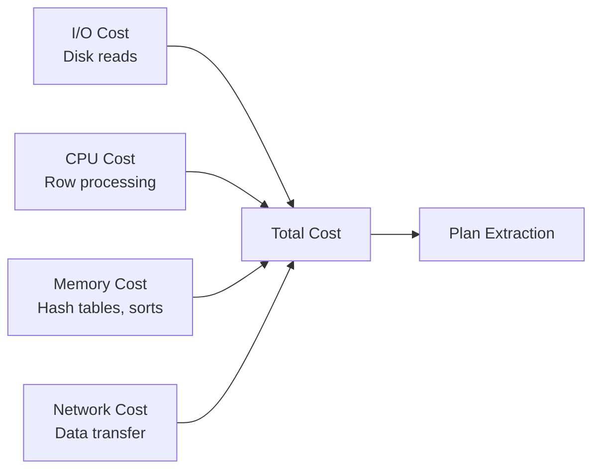

# Architecture

This document describes the architecture of the Relational Algebra Rule System.

## Overview

The system consists of several layers:

> **Interactive Diagram:** Click on any component box to jump to its documentation.



## Components

### ra-core {#ra-core}

The foundation layer providing core types and traits:

- **RelExpr**: Relational algebra AST (Scan, Filter, Join, Project, etc.)
- **Expr**: Expression types (Column, Const, BinOp, Function, etc.)
- **Rule**: Rule trait and metadata types
- **Pattern**: Pattern matching for rules
- **Cost**: Cost model traits and types
- **Statistics**: Cardinality, selectivity, histograms
- **Properties**: Physical properties (ordering, partitioning)

All types are designed to be:
- Serializable (for network transport and caching)
- Cloneable (for e-graph operations)
- Well-documented (literate programming philosophy)

### ra-parser {#ra-parser}

Parses `.rra` (Relational Rule Algebra) literate format files:

- **parser.rs**: Main parser combining YAML frontmatter and markdown
- **extractor.rs**: Extracts code blocks from markdown
- **validator.rs**: Validates frontmatter schema
- **lexer.rs**: Tokenization (if needed for custom syntax)

Input: `.rra` files
Output: `RuleFile` structs with metadata and code sections

### ra-compiler {#ra-compiler}

Compiles and indexes rules:

- **index.rs**: Builds searchable index of rules
- **analyzer.rs**: Analyzes rule dependencies and conflicts
- **checker.rs**: Type checks rule patterns and applications
- **registry.rs**: Manages loaded rules

Input: Parsed `RuleFile` structs
Output: Compiled rule registry with metadata

### ra-engine {#ra-engine}

The optimization engine:

- **egraph.rs**: E-graph construction using `egg` library
- **rewrite.rs**: Converts rules to egg rewrite rules
- **extract.rs**: Cost-based plan extraction from e-graph
- **analysis.rs**: E-graph analysis passes
- **differential.rs**: Differential dataflow for incremental updates
- **timely_integration.rs**: Timely dataflow integration

Key algorithms:
1. **Equality Saturation**: Uses egg's e-graph to explore equivalent plans
2. **Cost-Based Extraction**: Finds lowest-cost plan from e-graph
3. **Incremental Maintenance**: Differential dataflow for efficient updates

### ra-codegen {#ra-codegen}

Generates executable code:

- **ir.rs**: Internal intermediate representation
- **cranelift_backend.rs**: JIT compilation using Cranelift
- **wasm.rs**: WASM compilation using wasmtime
- **bytecode.rs**: Simple bytecode interpreter
- **volcano.rs**: Volcano-style iterator code generation

Input: Optimized physical plan
Output: Executable query code

### ra-cli {#ra-cli}

Command-line interface:

```bash
ra-cli validate <path>     # Validate .rra files
ra-cli test <path>         # Run rule test cases
ra-cli list                # List available rules
ra-cli show <rule-id>      # Show rule details
ra-cli optimize <query>    # Optimize a SQL query
ra-cli explain <query>     # Explain transformations
ra-cli benchmark           # Run benchmarks
```

### ra-web {#ra-web}

Web explorer backend API:

- REST API for optimization and exploration
- WebSocket for real-time updates
- URL shortening for sharing
- Static file serving

Endpoints:
- `POST /api/optimize` - Optimize a query
- `POST /api/explain` - Explain transformations
- `POST /api/share` - Generate shareable URL
- `GET /api/rules` - List available rules

### ra-wasm {#ra-wasm}

WebAssembly module for running the optimizer in the browser:

- **lib.rs**: WASM entry point exposing optimizer API via `wasm-bindgen`
- **bindings.rs**: JavaScript-friendly type conversions
- **playground.rs**: Interactive query playground support

Enables client-side query optimization without a backend server.
Used by the [Web UI](/integrations/web-ui) for the interactive
playground and by the documentation site for live examples.

### ra-dialect {#ra-dialect}

SQL dialect translation between database systems:

- **dialect.rs**: Dialect trait and registry
- **postgres.rs**: PostgreSQL dialect support
- **mysql.rs**: MySQL dialect support
- **sqlite.rs**: SQLite dialect support
- **duckdb.rs**: DuckDB dialect support

Translates between database-specific SQL syntax and the internal
RelExpr representation, handling differences in functions, types,
and query semantics.

## Data Flow

### Query Optimization Flow



### Rule Update Flow (Incremental)



### Component Interaction Dataflow

This diagram shows how data flows between components during a full
query optimization cycle, from SQL input through to executable output.

> **Interactive Diagram:** Click on any component to jump to its documentation.

```mermaid
flowchart LR
    subgraph Entry["Entry Points"]
        CLI["ra-cli"]
        Web["ra-web"]
        WASM["ra-wasm"]
    end

    subgraph Parse["Parsing"]
        Dialect["ra-dialect<br/>SQL normalization"]
        Parser["ra-parser<br/>.rra + SQL parsing"]
    end

    subgraph Compile["Compilation"]
        Compiler["ra-compiler<br/>rule indexing"]
        Core["ra-core<br/>RelExpr + types"]
    end

    subgraph Optimize["Optimization"]
        Engine["ra-engine<br/>equality saturation"]
        ML["ra-ml<br/>cardinality estimation"]
        HW["ra-hardware<br/>device cost models"]
    end

    subgraph Execute["Execution"]
        Codegen["ra-codegen<br/>JIT + WASM"]
        Adaptive["ra-adaptive<br/>runtime reopt"]
    end

    CLI -->|SQL query| Dialect
    Web -->|REST API| Dialect
    WASM -->|JS binding| Dialect

    Dialect -->|normalized SQL| Parser
    Parser -->|RuleFile / AST| Core
    Core -->|RelExpr| Compiler
    Compiler -->|rule registry| Engine

    ML -.->|cardinality estimates| Engine
    HW -.->|device costs| Engine

    Engine -->|optimized plan| Codegen
    Codegen -->|executable| Adaptive
    Adaptive -.->|reopt trigger| Engine

    click CLI "/ra/maintainers/cli-reference" "CLI Documentation"
    click Web "/ra/integrations/web-ui" "Web UI Documentation"
    click WASM "/ra/architecture#ra-wasm" "WASM Module"
    click Dialect "/ra/architecture#ra-dialect" "SQL Dialect"
    click Parser "/ra/architecture#ra-parser" "SQL Parser"
    click Core "/ra/architecture#ra-core" "Core Types"
    click Compiler "/ra/architecture#ra-compiler" "Rule Compiler"
    click Engine "/ra/architecture#ra-engine" "Optimization Engine"
    click ML "/ra/architecture#ra-ml" "ML Estimation"
    click HW "/ra/architecture#ra-hardware" "Hardware Costs"
    click Codegen "/ra/architecture#ra-codegen" "Code Generation"
    click Adaptive "/ra/architecture#ra-adaptive" "Adaptive Execution"

    style CLI fill:#e1f5ff,color:#000
    style Web fill:#e1f5ff,color:#000
    style WASM fill:#e1f5ff,color:#000
    style Dialect fill:#fff4e1,color:#000
    style Parser fill:#ffe1f5,color:#000
    style Core fill:#e1ffe1,color:#000
    style Compiler fill:#ffe1f5,color:#000
    style Engine fill:#fff4e1,color:#000
    style ML fill:#f5e1ff,color:#000
    style HW fill:#f5e1ff,color:#000
    style Codegen fill:#fff4e1,color:#000
    style Adaptive fill:#f5e1ff,color:#000
```



## Equality Saturation with egg

The optimization engine uses `egg` (e-graphs good) for equality saturation:



1. **E-graph Construction**: Convert query to e-graph representation
2. **Rule Application**: Apply all rules each iteration (see
   [Rule Selection and Application Strategy](#rule-selection-and-application-strategy)
   for how iteration budgets adapt to query complexity)
3. **Saturation**: Continue until no new expressions are added
4. **Extraction**: Find lowest-cost equivalent expression

Benefits:
- Explores all equivalent plans simultaneously
- Avoids local optima
- Composable rules without dependencies
- Terminates with saturation or timeout

## Rule Selection and Application Strategy

The optimizer applies transformation rules through two mechanisms:
hardcoded `egg::Rewrite` rules compiled into the engine, and `.rra`
rule files loaded at runtime from a rules directory. Understanding
how rules are selected, ordered, and applied is key to reasoning
about optimizer behavior.

### Current Rule Application

The `all_rules()` function in `ra-engine::rewrite` assembles all
`egg::Rewrite` rules in a fixed order. The e-graph `Runner` applies
every rule during each saturation iteration:

```
null simplification -> predicate pushdown -> join reordering ->
projection pushdown -> expression simplification -> join elimination ->
aggregate optimization -> limit/sort -> set operations -> subqueries ->
consensus rules -> DuckDB-inspired -> SQLite-inspired -> runtime filters ->
join transformations -> parquet pushdown -> count metadata ->
covering index -> min/max index
```

All rules fire on every iteration until the e-graph reaches saturation,
the iteration limit, the node limit, or the timeout. There is no
per-rule priority weighting or cost/benefit gating within a single
iteration.

### Adaptive Iteration Limits (Query Complexity)

Rather than selecting individual rules, the optimizer adapts its
*search budget* based on query complexity. The `QueryComplexity`
classifier (`ra-engine::query_complexity`) analyzes the input
expression to set iteration and timeout limits:

| Complexity  | Table Count | Iter Limit | Timeout |
|-------------|-------------|------------|---------|
| Trivial     | 0-1         | 3          | 10 ms   |
| Simple      | 2-4         | 5          | 50 ms   |
| Medium      | 5-7         | 10         | 100 ms  |
| Complex     | 8-9         | 15         | 300 ms  |
| VeryComplex | 10+         | 20         | 500 ms  |

Queries with outer joins or subqueries are promoted one complexity
level (e.g., a 2-table outer join is classified as Medium rather
than Simple). Enable adaptive limits with `OptimizerConfig::use_adaptive_limits`.

### Precondition-Based Filtering

The `optimize_with_facts()` method loads `.rra` files from the
`RA_RULES_DIR` environment variable and evaluates their preconditions
against runtime facts (database system, hardware profile, feature
flags). Rules whose preconditions fail are filtered out.

Precondition types supported:

| Type        | Example                        | Evaluated Against       |
|-------------|--------------------------------|-------------------------|
| `database`  | `system: postgresql`           | `FactsProvider::database_name()` |
| `hardware`  | `requirement: "GPU required"`  | `FactsProvider::has_gpu()` |
| `predicate` | `condition: "cpu_cores() >= 4"`| Hardware profile values  |
| `feature`   | `flag: vectorized_exec`        | Feature flag config      |
| `pattern`   | `must_match: "..."`            | Deferred to rewrite time |

Currently, filtered `.rra` rule IDs are not mapped to compiled
`egg::Rewrite` rules, so the filtering is logged but does not yet
reduce the active rule set. See the roadmap below.

### Rule Metadata Fields

`.rra` file frontmatter can include `complexity` and `benefit_range`
fields. These are present in many rules (particularly federated and
cost-model rules) but are **not currently parsed** by either
`RuleMetadata` struct. They are silently ignored by `serde_yaml`.

Example from `rules/federated/aggregate-pushdown-remote-sum.rra`:

```yaml
complexity: "O(1)"
benefit_range: [10.0, 10000.0]
```

The `ra-core::rule::RuleMetadata` struct defines a `priority: i32`
field (lower values run first), but the hardcoded `egg::Rewrite`
rules in `rewrite.rs` do not use it.

### Roadmap: Adaptive Rule Selection

The infrastructure for metadata-driven rule selection is partially
built. Completing it requires:

1. **Parse `complexity` and `benefit_range`** -- Add these fields to
   `ra-parser::RuleMetadata` and `ra-engine::rule_metadata::RuleMetadata`.

2. **Map .rra IDs to egg rewrites** -- Build a `HashMap<String, Rewrite>`
   so that precondition filtering can select the actual rules passed
   to the `Runner`.

3. **Complexity-weighted ordering** -- Sort rules by estimated
   benefit/complexity ratio within each iteration so that cheaper,
   high-benefit rules fire first.

4. **Budget-based pruning** -- Skip high-complexity rules when the
   query is classified as Trivial or Simple, since the search budget
   is already small.

5. **Learned rule effectiveness** -- Use execution feedback from
   `ra-adaptive` to track which rules produce cost improvements for
   which query shapes, and prioritize accordingly.

## Differential Dataflow

For incremental maintenance when rules change:

1. **Initial Computation**: Build optimization graph
2. **Change Detection**: Detect rule additions/removals/changes
3. **Incremental Update**: Recompute only affected parts
4. **Consolidation**: Merge results

Benefits:
- Efficient rule updates
- Minimal recomputation
- Scales to large rule sets

## Dataflow Architecture

Ra uses [differential dataflow](https://github.com/TimelyDataflow/differential-dataflow)
and [timely dataflow](https://github.com/TimelyDataflow/timely-dataflow) as its
incremental computation backbone. Statistics, rules, and execution
feedback all flow through differential collections, enabling the
system to react to changes without full recomputation.

### How Statistics Flow Through the System

Statistics enter the system from external sources (database catalogs,
Prometheus exporters, hardware sensors) and are transformed through
a pipeline of differential operators before reaching consumers.



Each statistics update is a timestamped differential: `(table, +new_stats, time)`.
When a table's row count changes from 1M to 1.2M, the system emits a
retraction of the old count and an insertion of the new count at the current
logical time. Downstream operators (cost model, plan extraction) recompute
only the parts of their output affected by this change.

### Differential Dataflow Integration

The `ra-engine` crate uses differential dataflow in two areas:

1. **Rule registry updates**: When rules are added, modified, or removed,
   differential dataflow propagates changes through the e-graph to
   recompute affected plan equivalences.

2. **Statistics-driven re-costing**: When statistics change (new row counts,
   updated histograms), the cost model re-evaluates affected operators
   without rebuilding the entire e-graph.

The key data structures are differential collections keyed by table name
and logical timestamp. Timely dataflow provides the progress tracking
that ensures all consumers see a consistent snapshot.

### Concurrent Planner Contexts

Multiple queries can be optimized simultaneously, each pinning a
logical timestamp for a consistent view of statistics:



Each planner context reads from the differential collection at its
pinned timestamp. New statistics arriving at later timestamps do not
disturb in-progress optimization. This provides snapshot isolation
without locks.

### Real-Time vs Batch Statistics

Ra supports two modes of statistics ingestion:

| Mode | Mechanism | Latency | Use Case |
|------|-----------|---------|----------|
| **Real-time** | Differential dataflow with streaming updates | Sub-second | OLTP with frequent DML |
| **Batch** | Periodic polling with `DeltaTracker` | Configurable (30s--5min) | OLAP with scheduled loads |

In real-time mode, every DML operation can emit a statistics delta
into the differential collection. The cost model and plan cache
observe these changes continuously.

In batch mode, the `DeltaTracker` polls database catalogs at a
configured interval, computes diffs against the previous snapshot,
and emits deltas. This reduces overhead for workloads where
sub-second freshness is unnecessary.

### Feedback Loop with Adaptive Execution

The adaptive executor (`ra-adaptive`) closes the loop by feeding
runtime observations back into the statistics pipeline:

1. **During execution**: The `AdaptiveExecutor` collects per-operator
   row counts, memory usage, and column sketches.
2. **At adaptation points**: Triggers compare actual vs estimated
   cardinalities. If they diverge beyond a threshold, the executor
   applies adaptations (join algorithm switches, input swaps, or
   full reoptimization).
3. **After execution**: The `FeedbackCollector` records actual
   cardinalities and sends corrections back to `ManagedTableStats`,
   which updates the differential collection for future queries.

This feedback loop means that even without a fresh `ANALYZE` run,
the system self-corrects based on observed query behavior.

See [Adaptive Execution](features/adaptive-execution.md) for the
full adaptive execution pipeline, and
[Statistics Streaming](guides/statistics-streaming.md) for
configuration and API details.

## Cost Model

Cost estimation considers:



- **I/O Cost**: Disk reads, sequential vs random access
- **CPU Cost**: Row processing, expression evaluation
- **Memory Cost**: Hash tables, sorts, buffers
- **Network Cost**: Data transfer for distributed queries

Cost formula:
```
TotalCost = IO_Cost + CPU_Cost + Memory_Cost + Network_Cost
```

Statistics used:
- Table cardinality (row count)
- Column cardinality (distinct values)
- Data distribution (histograms)
- Correlation between columns

## Formal Verification

### TLA+ Specifications

Critical properties verified:

1. **Termination**: Optimization always terminates
2. **Equivalence**: Transformations preserve semantics
3. **Cost Monotonicity**: Logical rules never increase cost
4. **Confluence**: Rule order doesn't affect final result

### Property-Based Testing

Using `proptest` to verify:

- Semantic equivalence of transformations
- Cost model consistency
- Termination guarantees
- Idempotence of rules

### Differential Testing

Compare against reference databases:
- PostgreSQL
- DuckDB
- SQLite

Verify that:
- Results match reference implementation
- Plans are at least as good (lower cost)

## Performance Considerations

### Optimization Time

Target: <100ms for typical queries

Strategies:
- Adaptive timeout and iteration limits based on query complexity
  (see [Rule Selection and Application Strategy](#rule-selection-and-application-strategy))
- Incremental optimization (return best so far)
- Rule prioritization (planned; currently all rules fire each iteration)
- Memoization of subplans

### Memory Usage

E-graphs can grow large. Mitigations:
- Node limits
- Garbage collection of unreachable nodes
- Compression of equivalent nodes

### Parallelization

Opportunities:
- Parallel rule application
- Parallel cost estimation
- Parallel code generation

## Extension Points

The system is designed to be extensible:

1. **Custom Rules**: Add new `.rra` files
2. **Custom Cost Models**: Implement `CostModel` trait
3. **Custom Backends**: Implement code generation for new targets
4. **Custom Statistics**: Extend statistics types

### ra-hardware {#ra-hardware}

Hardware-aware cost models and operator placement:

- **device.rs**: Device enum (CPU, GPU, FPGA) and transfer path modeling
- **profile.rs**: HardwareProfile describing system capabilities with
  preset profiles for GPU servers (A100), FPGA appliances (Alveo), and
  CPU-only systems
- **cost.rs**: HardwareCostModel implementing CostModel trait, estimating
  execution cost on each device including PCIe transfer overhead

See [hardware-acceleration.md](features/hardware-acceleration.md) for details on
the 21 hardware-specific optimization rules covering GPU scans/joins/
aggregations, FPGA streaming filters, SIMD vectorization, and NUMA-aware
partitioning.

### ra-adaptive {#ra-adaptive}

Runtime reoptimization and adaptive execution:

- **runtime_stats.rs**: Runtime statistics collection
- **triggers.rs**: Reoptimization trigger conditions
- **plan_switch.rs**: Mid-execution plan switching
- **executor.rs**: Adaptive query executor
- **checkpoint.rs**: Checkpoint/restart for plan transitions

### ra-ml {#ra-ml}

ML-based cardinality estimation:

- **features.rs**: Feature extraction from query plans
- **nn.rs**: Neural network model for cardinality prediction
- **estimator.rs**: ML-enhanced cost estimator
- **training.rs**: Online model training from execution feedback

### ra-synthesis {#ra-synthesis}

Query synthesis from natural language:

- **intent.rs**: Intent parser for natural language queries
- **generator.rs**: Query generator from parsed intent to RelExpr
- **validator.rs**: Query validation
- **render.rs**: SQL rendering from RelExpr

### ra-discovery {#ra-discovery}

Automatic rule discovery from execution logs:

- **log.rs**: Execution log parsing
- **fingerprint.rs**: Query fingerprinting
- **mining.rs**: Pattern mining from log data
- **synthesis.rs**: Rule synthesis from discovered patterns
- **validation.rs**: Discovered rule validation

## Future Enhancements

- **CXL Memory**: Rules for CXL-attached memory pooling
- **Disaggregated Storage**: Rules for compute-storage separation
- **Learned Indexes**: ML-based index structure selection

## References

- [egg: Fast and Extensible Equality Saturation](https://arxiv.org/abs/2004.03082)
- [Differential Dataflow](https://github.com/TimelyDataflow/differential-dataflow)
- [The Volcano Optimizer Generator](https://dl.acm.org/doi/10.1109/69.273032)
- [Access Path Selection in a Relational Database (System R)](https://dl.acm.org/doi/10.1145/582095.582099)
