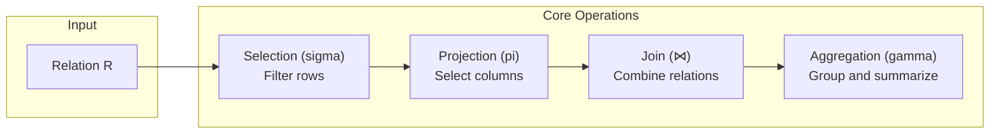

# Relational Algebra Fundamentals

This document covers the relational algebra concepts that underpin the
RA optimizer's transformation rules.

## Core Operations



### Selection (sigma)

Filters rows matching a predicate:

```
sigma[p](R) -- select rows from R where predicate p holds
```

### Projection (pi)

Selects a subset of columns:

```
pi[A1, A2, ...](R) -- project columns A1, A2, ... from R
```

### Join

Combines rows from two relations:

```
R join[c] S -- join R and S on condition c
R cross S   -- Cartesian product
R natural S -- natural join (on shared column names)
```

Join types: inner, left outer, right outer, full outer, semi, anti.

### Set Operations

```
R union S      -- all rows in R or S (deduplicated)
R intersect S  -- rows in both R and S
R except S     -- rows in R but not in S
```

### Aggregation

```
gamma[G; agg(A)](R) -- group by G, aggregate A
```

## Equivalence Rules

The optimizer uses equivalence rules to transform one relational
algebra expression into another that produces the same result but
may have lower cost. Examples:

- **Predicate pushdown**: `sigma[p](R join[c] S)` becomes
  `(sigma[p](R)) join[c] S` when `p` references only `R`
- **Join commutativity**: `R join S` is equivalent to `S join R`
- **Join associativity**: `(R join S) join T` is equivalent to
  `R join (S join T)`

## Notation in RA

Rule files use a text-based notation for relational algebra. The
[Rule Authoring Guide](../guides/rule-authoring.md) documents the
full syntax.

## Further Reading

- [Architecture](../architecture.md) -- How expressions are
  represented as `RelExpr` AST nodes
- [Rule Categories](rule-categories.md) -- Taxonomy of transformation
  rules
- [Cost Models](../guides/cost-models.md) -- How alternative plans
  are compared
