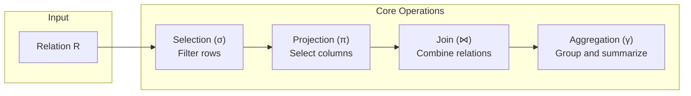

# Relational Algebra Fundamentals

This document covers the relational algebra concepts that underpin the
RA optimizer's transformation rules.

## Core Operations

### Selection ($\sigma$)

Filters rows matching a predicate. \ra{sigma[p](R)} selects rows
from $R$ where predicate $p$ holds.

$$\sigma_{p}(R)$$

**Text notation:** `sigma[p](R)`

### Projection ($\pi$)

Selects a subset of columns. \ra{pi[A1, A2](R)} projects columns
$A_1, A_2$ from $R$.

$$\pi_{A_1, A_2, \ldots}(R)$$

**Text notation:** `pi[A1, A2, ...](R)`

### Join ($\bowtie$)

Combines rows from two relations:

| Operation | Notation | Symbol |
|-----------|----------|--------|
| Inner join | \ra{R join[c] S} | $R \bowtie_{c} S$ |
| Cross product | \ra{R cross S} | $R \times S$ |
| Natural join | \ra{R natural S} | $R \bowtie S$ |
| Left outer join | \ra{R leftjoin S} | $R \mathbin{\ojoin\bowtie} S$ |
| Right outer join | \ra{R rightjoin S} | $R \mathbin{\bowtie\ojoin} S$ |
| Semijoin | \ra{R semijoin S} | $R \ltimes S$ |
| Antijoin | \ra{R antijoin S} | $R \rhd S$ |

### Set Operations

| Operation | Notation | Symbol |
|-----------|----------|--------|
| Union | \ra{R union S} | $R \cup S$ |
| Intersection | \ra{R intersect S} | $R \cap S$ |
| Difference | \ra{R except S} | $R - S$ |

### Aggregation ($\gamma$)

Groups and summarizes data. \ra{gamma[G; agg(A)](R)} groups $R$ by
$G$ and computes aggregate $\text{agg}(A)$.

$$\gamma_{G;\; \text{agg}(A)}(R)$$

**Text notation:** `gamma[G; agg(A)](R)`

## Equivalence Rules

The optimizer uses equivalence rules to transform one relational
algebra expression into another that produces the same result but
may have lower cost. Examples:

- **Predicate pushdown**: \ra{sigma[p](R join[c] S)} becomes
  \ra{sigma[p](R) join[c] S} when $p$ references only $R$

  $$\sigma_{p}(R \bowtie_{c} S) \Rightarrow \sigma_{p}(R) \bowtie_{c} S$$

- **Join commutativity**: \ra{R join S} is equivalent to \ra{S join R}

  $$R \bowtie S \equiv S \bowtie R$$

- **Join associativity**: \ra{(R join S) join T} is equivalent to
  \ra{R join (S join T)}

  $$\left(R \bowtie S\right) \bowtie T \equiv R \bowtie \left(S \bowtie T\right)$$

## Notation in RA

Rule files use a text-based notation for relational algebra. The
[Rule Authoring Guide](../guides/rule-authoring.md) documents the
full syntax. In this documentation, relational algebra expressions
can be written as:

- **KaTeX math**: `$\sigma_{p}(R)$` renders as $\sigma_{p}(R)$
- **Inline plugin**: `\ra{sigma[p](R)}` renders as \ra{sigma[p](R)}
- **Vue component**: `<RelAlgebra expr="sigma[p](R)" />` renders
  with hover tooltips

## Further Reading

- [Architecture](../architecture.md) -- How expressions are
  represented as `RelExpr` AST nodes
- [Rule Categories](rule-categories.md) -- Taxonomy of transformation
  rules
- [Cost Models](../guides/cost-models.md) -- How alternative plans
  are compared
