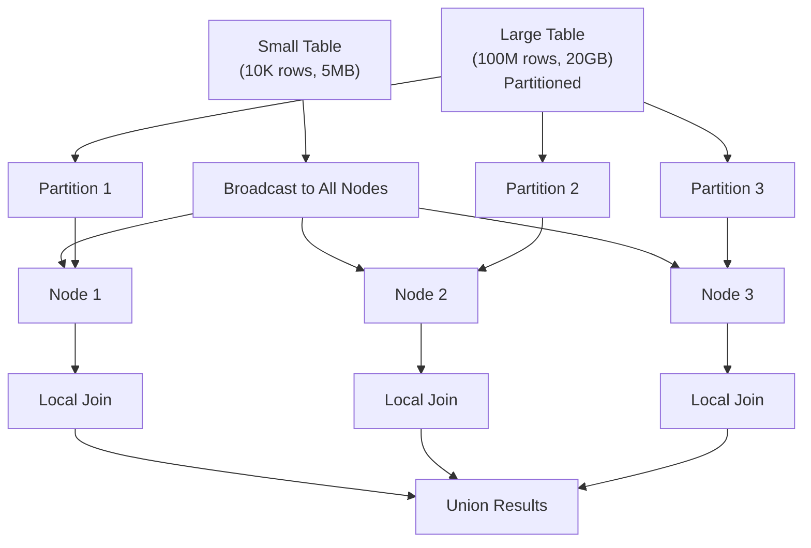
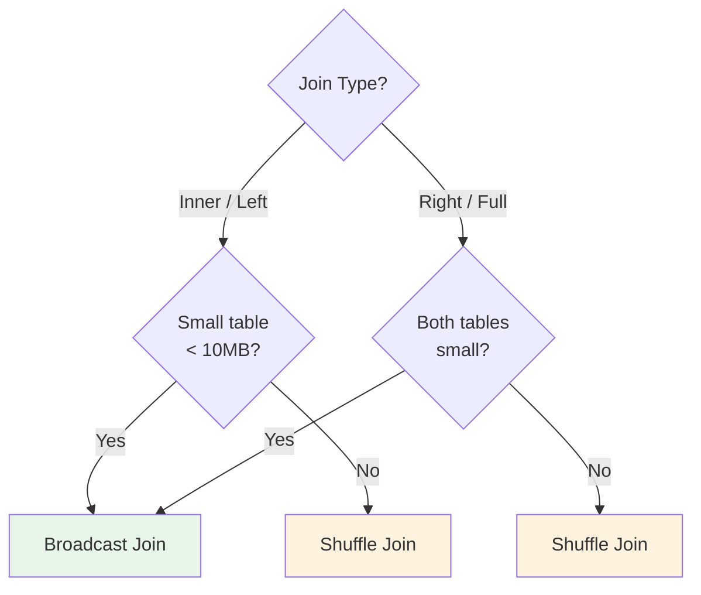

# Broadcast Joins

**Category:** Distributed Patterns
**Impact:** High - Eliminates shuffle for dimension tables (5-50x speedup)
**Complexity:** Medium

## Overview

A broadcast join replicates the smaller table to all nodes, allowing each node to join its local partition of the large table with the complete small table. This eliminates the need to shuffle the large table across the network.



**Rule of thumb:** Use broadcast join when small table < 10MB or < 1% of large table size.

## SQL Pattern

```sql
-- Small dimension table (10K customers, ~5MB)
-- Large fact table (100M orders, ~20GB)
SELECT c.customer_name, o.order_id, o.total
FROM orders o
JOIN customers c ON o.customer_id = c.customer_id
WHERE o.order_date >= '2024-01-01';
```

Broadcast `customers` to all nodes, avoid shuffling 100M `orders` rows.

## Relational Algebra

### Standard Shuffle Join

$$
R \bowtie S = \bigcup_{i=1}^{P} \left(\text{shuffle}(R)_i \bowtie \text{shuffle}(S)_i\right)
$$

Both tables shuffled across network:
$$
\text{Cost}_{\text{network}} = (|R| + |S|) \times \text{size}_{\text{tuple}} \times C_{\text{network}}
$$

### Broadcast Join

$$
R \bowtie S = \bigcup_{i=1}^{P} \left(R_i \bowtie \text{broadcast}(S)\right)
$$

Small table $S$ replicated to all nodes, large table $R$ stays partitioned:
$$
\text{Cost}_{\text{network}} = |S| \times \text{size}_{\text{tuple}} \times P \times C_{\text{network}}
$$

**Savings when** $|S| \times P \ll |R| + |S|$

## Cost Analysis

### Broadcast Join Decision Formula

Use broadcast join if:
$$
|S| \times P < |R|
$$

Where:
- $|S|$ = row count of small table
- $P$ = number of nodes/partitions
- $|R|$ = row count of large table

### Detailed Cost Comparison

**Shuffle Join:**
$$
\begin{align}
\text{Cost}_{\text{shuffle}} &= (|R| + |S|) \times \text{size}_{\text{tuple}} \times C_{\text{network}} \\
&\quad + \frac{|R| \times |S|}{P} \times C_{\text{cpu}}
\end{align}
$$

**Broadcast Join:**
$$
\begin{align}
\text{Cost}_{\text{broadcast}} &= |S| \times \text{size}_{\text{tuple}} \times P \times C_{\text{network}} \\
&\quad + |R| \times |S| \times C_{\text{cpu}}
\end{align}
$$

**Note:** Broadcast join has higher CPU cost (no partitioning benefit), but much lower network cost for small $|S|$.

## Ra Optimization Rules

1. **[broadcast-join-selection](../../rules/distributed/broadcast-join-selection.rra)** - Choose broadcast vs shuffle
2. **[broadcast-small-table](../../rules/distributed/broadcast-small-table.rra)** - Replicate dimension tables
3. **[eliminate-shuffle-broadcast](../../rules/distributed/eliminate-shuffle-broadcast.rra)** - Remove redundant shuffles

## Providing Table Size Information to Ra

### API Usage

```rust
use ra_core::TableStatistics;

// Small dimension table
optimizer.set_statistics("customers", TableStatistics {
    row_count: 10_000,
    size_bytes: 5_000_000, // 5MB
    distinct_values: hashmap! {
        "customer_id" => 10_000,
    },
});

// Large fact table
optimizer.set_statistics("orders", TableStatistics {
    row_count: 100_000_000,
    size_bytes: 20_000_000_000, // 20GB
    distinct_values: hashmap! {
        "customer_id" => 10_000,
        "order_id" => 100_000_000,
    },
});

// Ra will automatically choose broadcast join
```

### Size Thresholds

Configure broadcast threshold:
```rust
optimizer.config.broadcast_threshold = 10 * 1024 * 1024; // 10MB
optimizer.config.broadcast_max_ratio = 0.01; // Small table < 1% of large
```

## Examples

### Star Schema: Fact $\bowtie$ Dimensions

```sql
-- Fact table: 1B rows, 200GB
-- Dimension tables: 10K-100K rows each, <10MB
SELECT
    d.date,
    c.customer_name,
    p.product_name,
    s.store_name,
    f.sales_amount
FROM sales_fact f
JOIN date_dim d ON f.date_id = d.date_id
JOIN customer_dim c ON f.customer_id = c.customer_id
JOIN product_dim p ON f.product_id = p.product_id
JOIN store_dim s ON f.store_id = s.store_id
WHERE d.year = 2024;
```

**Execution plan:**
1. Broadcast all 4 dimension tables (total <50MB)
2. Each node joins local `sales_fact` partition with dimensions
3. No shuffle of 1B row fact table

**Network cost:**
- Broadcast: $50\text{MB} \times 100\text{ nodes} = 5\text{GB}$
- Shuffle alternative: $200\text{GB} \times 2 = 400\text{GB}$ (fact + dims)
- **Savings: 395GB network transfer -> 80x reduction**

### Lookup Table Join

```sql
-- Log table: 10M rows/day, streaming
-- Country codes: 200 rows, 10KB
SELECT
    l.user_id,
    l.ip_address,
    c.country_name,
    c.continent
FROM access_logs l
LEFT JOIN country_codes c ON l.country_code = c.code
WHERE l.timestamp >= CURRENT_DATE;
```

Broadcast tiny `country_codes` table (10KB) to all nodes processing logs.

### Multiple Small Tables

```sql
-- Product catalog: 50K products, 25MB
-- Categories: 500 categories, 100KB
-- Brands: 1K brands, 500KB
-- Order items: 1B rows, 100GB
SELECT
    p.product_name,
    c.category_name,
    b.brand_name,
    SUM(oi.quantity) as total_sold
FROM order_items oi
JOIN products p ON oi.product_id = p.product_id
JOIN categories c ON p.category_id = c.category_id
JOIN brands b ON p.brand_id = b.brand_id
WHERE oi.order_date >= '2024-01-01'
GROUP BY p.product_name, c.category_name, b.brand_name;
```

**Plan:**
1. Broadcast `categories` (100KB) and `brands` (500KB) to all nodes
2. Broadcast `products` (25MB) to all nodes
3. Each node joins local `order_items` partition
4. Total broadcast: 26MB -> much smaller than 100GB shuffle

## Broadcast vs Shuffle Decision Tree



## Performance Characteristics

| Small Table Size | Large Table Size | Nodes | Broadcast Time | Shuffle Time | Speedup |
|------------------|------------------|-------|----------------|--------------|---------|
| 1MB | 10GB | 10 | 0.5s | 15s | **30x** |
| 10MB | 100GB | 20 | 2s | 120s | **60x** |
| 100MB | 1TB | 50 | 20s | 1800s | **90x** |
| 500MB | 1TB | 50 | 100s | 1800s | **18x** |

**Crossover point:** When small table $\times$ nodes $\approx$ large table size, shuffle becomes better.

## Broadcast Strategies

### Eager Broadcast (Default)

Broadcast table before executing join:
```
1. Broadcast S to all nodes
2. Wait for broadcast to complete
3. Execute local joins in parallel
```

**Pros:** Simple, predictable
**Cons:** Upfront cost even if query cancelled

### Lazy Broadcast

Broadcast on-demand as joins execute:
```
1. Start local joins
2. Fetch broadcasted data as needed
3. Cache for subsequent uses
```

**Pros:** Lower latency for selective queries
**Cons:** More complex, potential cache misses

### Persistent Broadcast

Cache dimension tables across queries:
```
1. Broadcast once
2. Pin in memory on all nodes
3. Reuse for all queries
```

**Pros:** Amortize broadcast cost across queries
**Cons:** Memory pressure, staleness concerns

Ra supports all three strategies via configuration.

## Common Pitfalls

### [FAIL] Broadcasting Large Tables

```sql
-- customers: 10M rows, 5GB (TOO LARGE)
SELECT * FROM orders o
JOIN customers c ON o.customer_id = c.customer_id;
```

**Fix:** Use shuffle join or partition both tables on join key.

### [FAIL] Broadcasting Both Tables

```sql
-- Both tables small
SELECT * FROM small_table_a a
JOIN small_table_b b ON a.id = b.id;
```

Ra might broadcast both, causing redundant network traffic.

**Fix:** Only broadcast one table, collect the other to coordinator.

### [FAIL] Broadcast + Large Result Set

```sql
-- Broadcast products, but Cartesian product result is huge
SELECT * FROM products p
CROSS JOIN orders o;
```

Broadcast is cheap, but result requires massive network transfer.

**Fix:** Add proper join conditions, or rethink query design.

## Broadcast Join with Filters

Push filters before broadcast to reduce size:

```sql
-- Only broadcast active customers
SELECT o.order_id, c.name
FROM orders o
JOIN customers c ON o.customer_id = c.customer_id
WHERE c.status = 'active'
  AND o.order_date >= '2024-01-01';
```

**Optimization:**
1. Filter `customers` to only `status='active'` (reduces 10K -> 8K rows)
2. Broadcast filtered customers (20% smaller)
3. Filter `orders` locally on each node
4. Execute join

Ra's **[filter-before-broadcast](../../rules/distributed/filter-before-broadcast.rra)** rule applies this.

## Testing Broadcast Joins

```rust
#[test]
fn test_broadcast_join_selection() {
    let sql = "
        SELECT o.order_id, c.name
        FROM orders o
        JOIN customers c ON o.customer_id = c.customer_id
    ";

    let plan = optimize(sql)
        .with_statistics("orders", TableStatistics {
            row_count: 100_000_000,
            size_bytes: 20_000_000_000,
        })
        .with_statistics("customers", TableStatistics {
            row_count: 10_000,
            size_bytes: 5_000_000,
        })
        .with_nodes(20)
        .build();

    // Verify broadcast join chosen
    assert!(plan.contains_node_type("BroadcastJoin"));
    assert_eq!(plan.broadcasted_tables(), vec!["customers"]);

    // Verify no shuffle of orders
    assert!(!plan.contains_shuffle("orders"));
}
```

## Multi-Level Broadcast

In multi-stage queries, broadcast decisions cascade:

```sql
-- Stage 1: Broadcast dim tables to join with fact
-- Stage 2: Broadcast stage 1 result if small
SELECT ...
FROM (
    SELECT f.*, d.attribute
    FROM fact f
    JOIN dim d ON f.dim_id = d.id
) AS enriched
JOIN another_table a ON enriched.key = a.key;
```

Ra re-evaluates broadcast decision at each stage based on intermediate result sizes.

## References

- [Distributed Query Optimization Guide](../guides/distributed-optimization.md)
- [Broadcast Join Selection Rule](../../rules/distributed/broadcast-join-selection.rra)
- [Co-located Joins](co-located-joins.md) - Zero-shuffle alternative
- [Shuffle Joins](shuffle-joins.md) - Fallback for large tables
- [Star Schema Pattern](../schema-patterns/star-schema.md) - Common use case

## Related Patterns

- [Co-located Joins](co-located-joins.md) - Best option if possible
- [Shuffle Joins](shuffle-joins.md) - Alternative for large tables
- [Star Schema](../schema-patterns/star-schema.md) - Primary use case
