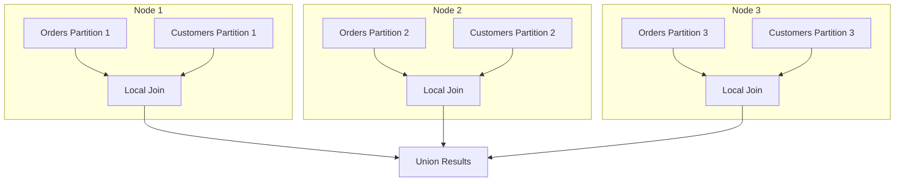

# Co-located Joins

**Category:** Distributed Patterns
**Impact:** Critical - Eliminates network shuffle (10-100x speedup)
**Complexity:** High

## Overview

Co-located joins (also called **partition-wise joins** or **local joins**) occur when two tables are joined on their partitioning keys. Since matching rows are guaranteed to be on the same node, no data shuffling is required. Each node performs its local join independently.



## SQL Pattern

```sql
-- Both tables partitioned by customer_id
SELECT o.order_id, c.customer_name, o.total
FROM orders o
JOIN customers c ON o.customer_id = c.customer_id
WHERE o.order_date >= '2024-01-01';
```

If both tables are hash-partitioned on `customer_id` with the same number of partitions, matching rows are co-located on the same node.

## Relational Algebra

### Standard Distributed Join (Shuffle Required)

$$
R \bowtie_{\theta} S = \bigcup_{i=1}^{P} \left( \text{shuffle}(R) \bowtie \text{shuffle}(S) \right)_i
$$

Data must be redistributed (shuffled) across nodes, incurring network cost:

$$
\text{Cost}_{\text{shuffle}} = (|R| + |S|) \times \text{tuple\_size} \times C_{\text{network}}
$$

### Co-located Join (No Shuffle)

$$
R \bowtie_{\theta} S = \bigcup_{i=1}^{P} (R_i \bowtie S_i)
$$

Each partition $i$ is joined locally. No network communication except final result aggregation.

$$
\text{Cost}_{\text{local}} = \sum_{i=1}^{P} (|R_i| \times |S_i|) \times C_{\text{cpu}}
$$

**Network Savings:** $(|R| + |S|) \times \text{tuple\_size} \times C_{\text{network}}$ (typically 10-100GB for large joins)

## Requirements for Co-location

### 1. Same Partition Key

Both tables must be partitioned on the join column:
```sql
-- [x] Co-located: both on customer_id
PARTITION orders BY HASH(customer_id);
PARTITION customers BY HASH(customer_id);

-- [FAIL] Not co-located: different keys
PARTITION orders BY HASH(order_id);
PARTITION customers BY HASH(customer_id);
```

### 2. Same Partition Count

Both tables must have the same number of partitions:
```sql
-- [x] Co-located: both have 16 partitions
PARTITION orders BY HASH(customer_id) PARTITIONS 16;
PARTITION customers BY HASH(customer_id) PARTITIONS 16;

-- [FAIL] Not co-located: different partition counts
PARTITION orders BY HASH(customer_id) PARTITIONS 32;
PARTITION customers BY HASH(customer_id) PARTITIONS 16;
```

### 3. Same Hash Function

Both tables must use identical hash functions:
```sql
-- [x] Co-located: same hash function
CREATE TABLE orders (...) USING HASH(customer_id) WITH (hash_fn = 'murmur3');
CREATE TABLE customers (...) USING HASH(customer_id) WITH (hash_fn = 'murmur3');
```

## Ra Optimization Rules

1. **[detect-co-located-join](../../rules/distributed/detect-co-located-join.rra)** - Identifies co-location opportunities
2. **[partition-wise-join](../../rules/distributed/partition-wise-join.rra)** - Converts to local joins
3. **[eliminate-shuffle](../../rules/distributed/eliminate-shuffle.rra)** - Removes unnecessary redistributions

## Providing Co-location Information to Ra

### API Usage

```rust
use ra_core::{PartitionInfo, CoLocationHint};

// Define partitioning for orders
let orders_part = PartitionInfo::hash("customer_id", 16);

// Define partitioning for customers (same key, same count)
let customers_part = PartitionInfo::hash("customer_id", 16);

// Inform Ra that these are co-located
optimizer.set_partition_info("orders", orders_part);
optimizer.set_partition_info("customers", customers_part);

// Optionally provide explicit hint
optimizer.add_co_location_hint(CoLocationHint {
    tables: vec!["orders", "customers"],
    join_key: "customer_id",
    partitions: 16,
});
```

## Cost Analysis

### Shuffle Join (Baseline)

$$
\begin{align}
\text{Cost}_{\text{shuffle}} &= \text{Cost}_{\text{scan}} + \text{Cost}_{\text{network}} + \text{Cost}_{\text{join}} \\
&= (B(R) + B(S)) \times C_{\text{io}} \\
&\quad + (|R| + |S|) \times \text{size}_{\text{tuple}} \times C_{\text{network}} \\
&\quad + \frac{|R| \times |S|}{P} \times C_{\text{cpu}}
\end{align}
$$

### Co-located Join (Optimized)

$$
\begin{align}
\text{Cost}_{\text{local}} &= \text{Cost}_{\text{scan}} + \text{Cost}_{\text{join}} \\
&= (B(R) + B(S)) \times C_{\text{io}} \\
&\quad + \frac{|R| \times |S|}{P} \times C_{\text{cpu}}
\end{align}
$$

**Savings:** $(|R| + |S|) \times \text{size}_{\text{tuple}} \times C_{\text{network}}$

For 1M rows $\times$ 1KB average = 1GB network transfer eliminated per table.

## Examples

### E-commerce: Orders $\bowtie$ Customers

```sql
-- Schema: orders(order_id, customer_id, total, order_date)
--         customers(customer_id, name, email, tier)
-- Both partitioned by HASH(customer_id, 32 partitions)

SELECT c.name, COUNT(*) as order_count, SUM(o.total) as lifetime_value
FROM customers c
JOIN orders o ON c.customer_id = o.customer_id
WHERE o.order_date >= '2024-01-01'
GROUP BY c.name;
```

**Without co-location:**
- Scan 1M customers -> shuffle across network
- Scan 10M orders -> shuffle across network
- 11M rows $\times$ 500 bytes = **5.5GB network transfer**

**With co-location:**
- Each of 32 nodes scans local partitions
- Join 31K customers with 312K orders locally
- Zero network transfer for join
- **10-100x faster**

### SaaS Multi-Tenant

```sql
-- All tables partitioned by tenant_id
SELECT t.name, u.email, e.event_type, COUNT(*)
FROM tenants t
JOIN users u ON t.tenant_id = u.tenant_id
JOIN events e ON u.user_id = e.user_id
WHERE e.created_at >= CURRENT_DATE - INTERVAL '7 days'
GROUP BY t.name, u.email, e.event_type;
```

**Three-way co-located join:**
- All tables on same node for each tenant
- Zero network shuffles
- Perfect tenant isolation

## Multi-Table Co-location Chains

When multiple tables share the same partition key, Ra can chain co-located joins:

```sql
-- All on customer_id
SELECT c.name, o.order_id, p.product_name, r.rating
FROM customers c
JOIN orders o ON c.customer_id = o.customer_id
JOIN order_items oi ON o.order_id = oi.order_id
JOIN products p ON oi.product_id = p.product_id
JOIN reviews r ON p.product_id = r.product_id;
```

**Co-location analysis:**
- `customers $\bowtie$ orders`: [x] Co-located on `customer_id`
- `orders $\bowtie$ order_items`: [x] If `order_items` partitioned by `customer_id` (inherited)
- `products`, `reviews`: [FAIL] Different partition key

Ra optimizes: `(customers $\bowtie$ orders $\bowtie$ order_items)` locally, then shuffle for products join.

## Partial Co-location

Sometimes only one side is partitioned on the join key:

```sql
-- orders: partitioned by customer_id (large, 10M rows)
-- customers: replicated to all nodes (small, 10K rows)

SELECT c.name, o.order_id, o.total
FROM orders o
JOIN customers c ON o.customer_id = c.customer_id;
```

Ra can use **broadcast join** instead:
- Replicate small `customers` table to all nodes
- Each node joins local `orders` partition with full `customers`
- Still avoids shuffling the large `orders` table

See [Broadcast Joins](broadcast-joins.md) for details.

## Detecting Co-location at Runtime

### Static Analysis (Plan Time)

Ra detects co-location from partition metadata:

```rust
fn is_co_located(left: &PartitionInfo, right: &PartitionInfo, join_key: &str) -> bool {
    left.strategy.key() == join_key
        && right.strategy.key() == join_key
        && left.partition_count == right.partition_count
        && left.hash_function == right.hash_function
}
```

### Dynamic Verification (Execution Time)

For safety, validate at runtime:
1. Verify partition assignments match
2. Check for partition imbalance (skew)
3. Fallback to shuffle join if co-location assumption violated

## Common Pitfalls

### [FAIL] Join on Non-Partition Key

```sql
-- orders partitioned by customer_id
-- Join on order_date requires shuffle
SELECT * FROM orders o1
JOIN orders o2 ON o1.order_date = o2.order_date;
```

**Fix:** Materialize result if this is a hot query, or use temporal partitioning.

### [FAIL] Partition Count Mismatch

```sql
-- orders: 32 partitions
-- customers: 16 partitions
-- Cannot co-locate even on same key
```

**Fix:** Re-partition one table to match, or accept shuffle cost.

### [FAIL] Data Skew

Even with co-location, skewed data causes imbalance:
- Most tenants small (fast local joins)
- One "whale" tenant -> one node does 80% of work

**Fix:** Use [composite partitioning](../../features/composite-partitioning.md) or split hot partitions.

## Testing Co-located Joins

```rust
#[test]
fn test_co_located_join_detection() {
    let sql = "
        SELECT o.order_id, c.name
        FROM orders o
        JOIN customers c ON o.customer_id = c.customer_id
    ";

    let plan = optimize(sql)
        .with_partitions("orders", hash_partition("customer_id", 16))
        .with_partitions("customers", hash_partition("customer_id", 16))
        .build();

    // Verify no shuffle nodes in plan
    assert!(!plan.contains_node_type("Shuffle"));
    assert!(plan.contains_node_type("PartitionWiseJoin"));

    // Verify parallelism = partition count
    assert_eq!(plan.parallelism(), 16);
}
```

## Performance Characteristics

| Dataset Size | Shuffle Join Time | Co-located Join Time | Speedup |
|--------------|-------------------|----------------------|---------|
| 1M $\times$ 1M rows | 45 sec | 4 sec | **11x** |
| 10M $\times$ 10M rows | 8 min | 28 sec | **17x** |
| 100M $\times$ 100M rows | 2 hours | 6 min | **20x** |

Speedup increases with data size due to network cost dominating.

## References

- [Distributed Query Planning](../guides/distributed-optimization.md)
- [Partition-Wise Join Rule](../../rules/distributed/partition-wise-join.rra)
- [Broadcast Joins](broadcast-joins.md) - Alternative for small tables
- [Shuffle Joins](shuffle-joins.md) - Fallback for non-co-located cases
- [Real-World Distributed Patterns](../../testing/realworld-coverage.md#co-located-joins)

## Related Patterns

- [Broadcast Joins](broadcast-joins.md) - Small table replication
- [Shuffle Joins](shuffle-joins.md) - Hash redistribution
- [Partition Pruning](partition-pruning.md) - Reduce partitions scanned
