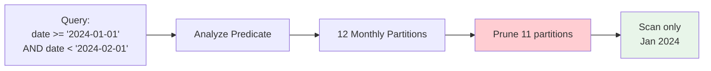

# Partition Pruning

**Category:** Distributed Patterns
**Impact:** Critical - Eliminates 70-99% of partitions from scan
**Complexity:** Medium

## Overview

Partition pruning eliminates unnecessary partitions from table scans based on query predicates. When a query filters on the partitioning key, Ra can determine at plan time which partitions contain no matching rows and skip them entirely.



## SQL Pattern

```sql
-- Table partitioned by date (monthly partitions)
SELECT order_id, total
FROM orders
WHERE order_date >= '2024-01-01'
  AND order_date < '2024-02-01';
```

With monthly partitions, this query only needs to scan the January 2024 partition, not all 120+ months of historical data.

## Relational Algebra

### Before Optimization

$$
\sigma_{\text{order\_date} \geq \text{'2024-01-01'} \land \text{order\_date} < \text{'2024-02-01'}}(\text{orders})
$$

This scans all partitions, applying the filter to every tuple.

### After Partition Pruning

$$
\sigma_{\text{order\_date} \geq \text{'2024-01-01'} \land \text{order\_date} < \text{'2024-02-01'}}(\text{orders}_{\text{2024-01}})
$$

Only scan the single partition containing matching data. Cost reduced by factor of $P$ where $P$ is partition count.

## Cost Analysis

### Without Partition Pruning

$$
\text{Cost} = P \times B(R_p) \times C_{\text{io}} + P \times |R_p| \times C_{\text{cpu}}
$$

Where:
- $P$ = number of partitions
- $B(R_p)$ = blocks per partition
- $|R_p|$ = tuples per partition

### With Partition Pruning

$$
\text{Cost} = P_{\text{match}} \times B(R_p) \times C_{\text{io}} + P_{\text{match}} \times |R_p| \times C_{\text{cpu}}
$$

Where $P_{\text{match}}$ is the number of partitions matching the predicate.

**Speedup:** $\frac{P}{P_{\text{match}}}$ (typically 10-100x for date range queries)

## Ra Optimization Rules

Ra applies partition pruning through these rules:

1. **[partition-prune-range](../../rules/distributed/partition-prune-range.rra)** - Range-based partition elimination
2. **[partition-prune-equality](../../rules/distributed/partition-prune-equality.rra)** - Exact partition match
3. **[partition-prune-in-list](../../rules/distributed/partition-prune-in-list.rra)** - IN list pruning

## Providing Partition Information to Ra

### API Usage

```rust
use ra_core::{PartitionInfo, PartitionStrategy, PartitionBounds};

// Define partition scheme
let partitions = PartitionInfo {
    strategy: PartitionStrategy::Range {
        column: "order_date".into(),
    },
    partition_count: 48, // 4 years $\times$ 12 months
    partitions: vec![
        PartitionBounds::Range {
            id: "orders_2024_01",
            lower: "2024-01-01",
            upper: "2024-02-01",
            row_count: 1_500_000,
            size_bytes: 250_000_000,
        },
        // ... more partitions
    ],
};

// Provide to optimizer
optimizer.set_partition_info("orders", partitions);
```

### Statistics Required

- **Partition bounds** - Min/max values for each partition
- **Row counts** - Tuples per partition (for cost estimation)
- **Size** - Bytes per partition (for I/O cost)
- **Partition key** - Column(s) used for partitioning

## Examples

### Time-Series Data

```sql
-- 5 years of daily measurements, partitioned by month (60 partitions)
SELECT sensor_id, AVG(temperature)
FROM sensor_readings
WHERE reading_time >= '2025-12-01'
  AND reading_time < '2026-01-01'
GROUP BY sensor_id;
```

**Pruning:** Scans 1 partition instead of 60 -> **60x speedup**

### Multi-Tenant SaaS

```sql
-- Partitioned by tenant_id (hash partitioning)
SELECT * FROM events
WHERE tenant_id = 'acme-corp'
  AND event_type = 'login';
```

With 100 partitions, hash-based pruning scans 1 partition -> **100x speedup**

### List Partitioning

```sql
-- Partitioned by region (US, EU, APAC, LATAM)
SELECT order_id, total
FROM orders
WHERE region IN ('US', 'APAC');
```

Scans 2 of 4 partitions -> **2x speedup**

## Partition Strategy Comparison

| Strategy | Pruning Quality | Use Case | Example |
|----------|-----------------|----------|---------|
| **Range** | Excellent (90-99%) | Time series, dates, sequential IDs | `order_date`, `created_at` |
| **Hash** | Perfect (100%) | Tenant isolation, sharding | `tenant_id`, `user_id` |
| **List** | Perfect (100%) | Categorical data | `region`, `country`, `status` |

## Common Pitfalls

### [FAIL] Non-Sargable Predicates

```sql
-- Cannot prune: function on partition key
SELECT * FROM orders
WHERE YEAR(order_date) = 2024;
```

**Fix:** Rewrite to use sargable form:
```sql
SELECT * FROM orders
WHERE order_date >= '2024-01-01'
  AND order_date < '2025-01-01';
```

### [FAIL] OR Conditions Across Partitions

```sql
-- Requires union of multiple partition sets
SELECT * FROM orders
WHERE order_date = '2024-01-15'
   OR order_date = '2024-06-15';
```

Ra still prunes, but must scan 2 partitions. Decompose to UNION if selectivity is very low.

### [FAIL] Implicit Type Conversions

```sql
-- String comparison forces scan of all partitions
SELECT * FROM orders
WHERE order_date = '20240115';  -- Wrong format
```

**Fix:** Use proper date literals matching column type.

## Distributed Considerations

In distributed databases, partition pruning is even more critical:

- **Network cost:** Avoid fetching data from remote nodes
- **Parallel execution:** Only involved nodes participate
- **Lock contention:** Fewer partitions = fewer locks

### Distributed Cost Model

$$
\text{Cost}_{\text{dist}} = P_{\text{match}} \times (C_{\text{network}} + C_{\text{scan}}) + C_{\text{coord}}
$$

Where:
- $C_{\text{network}}$ = cost to fetch partition metadata
- $C_{\text{scan}}$ = cost to scan partition on remote node
- $C_{\text{coord}}$ = coordinator overhead

## Testing Partition Pruning

```rust
#[test]
fn test_partition_pruning_range() {
    let sql = "SELECT * FROM orders WHERE order_date >= '2024-01-01' AND order_date < '2024-02-01'";

    let plan = optimize(sql)
        .with_partitions(monthly_partitions())
        .build();

    // Verify only January partition is scanned
    assert_eq!(plan.partitions_scanned(), vec!["orders_2024_01"]);
    assert_eq!(plan.partitions_pruned(), 47); // 4 years - 1 month
}
```

## References

- [Distributed Query Optimization Guide](../guides/distributed-optimization.md)
- [Partition Metadata API](../api-reference.md#partition-info)
- [Range-based Pruning Rule](../../rules/distributed/partition-prune-range.rra)
- [Real-World Distributed Patterns](../../testing/realworld-coverage.md#distributed-patterns)

## Related Patterns

- [Union Over Partitions](union-over-partitions.md) - Parallel partition scans
- [Co-located Joins](co-located-joins.md) - Joining on partition keys
- [Push-down Aggregation](pushdown-aggregation.md) - Aggregating per partition
