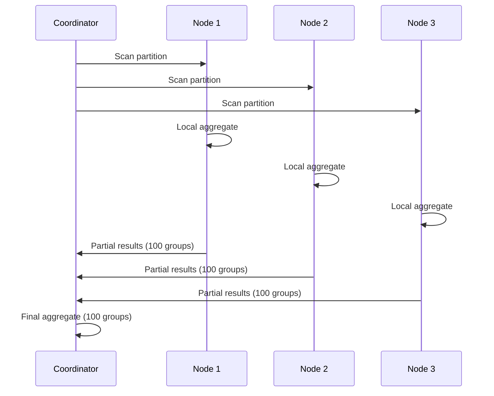
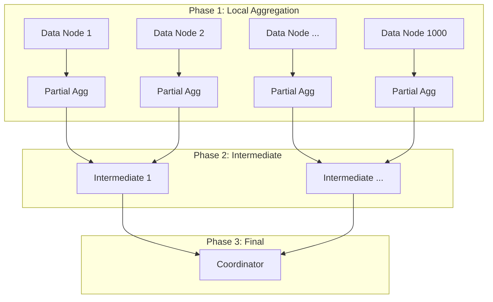

# Push-down Aggregation

**Category:** Distributed Patterns
**Impact:** High - Reduces network transfer by 10-1000x
**Complexity:** Medium

## Overview

Push-down aggregation (also called **pre-aggregation** or **partial aggregation**) performs aggregation locally on each node before transferring results across the network. This dramatically reduces network traffic by sending aggregated results instead of raw tuples.



## SQL Pattern

```sql
-- Count orders per customer across 100M orders
SELECT customer_id, COUNT(*) as order_count
FROM orders
GROUP BY customer_id;
```

Without push-down: transfer 100M rows across network, then aggregate.
With push-down: aggregate locally on each node, transfer only partial results.

## Relational Algebra

### Without Push-down

$$
\gamma_{\text{customer\_id}, \text{COUNT}(*)}(\text{shuffle}(\text{orders}))
$$

All 100M tuples shuffled across network, then aggregated:
$$
\text{Cost}_{\text{network}} = |R| \times \text{size}_{\text{tuple}} \times C_{\text{network}}
$$

### With Push-down

$$
\gamma_{\text{customer\_id}, \text{SUM}(\text{partial\_count})}(
    \bigcup_{i=1}^{P} \gamma_{\text{customer\_id}, \text{COUNT}(*) \text{ as partial\_count}}(R_i)
)
$$

Two-phase aggregation:
1. **Local phase:** Aggregate on each node's partition
2. **Global phase:** Combine partial aggregates

$$
\text{Cost}_{\text{network}} = |\text{distinct}(\text{customer\_id})| \times \text{size}_{\text{agg}} \times C_{\text{network}}
$$

**Reduction:** From 100M rows to ~10K distinct customers = **10,000x less network traffic**

## Aggregation Functions

### Decomposable Functions (Perfect Push-down)

These can be computed in two phases:

| Function | Local Phase | Global Phase | Example |
|----------|-------------|--------------|---------|
| `COUNT(*)` | `COUNT(*)` | `SUM(partial_count)` | Row counting |
| `SUM(x)` | `SUM(x)` | `SUM(partial_sum)` | Total sales |
| `MIN(x)` | `MIN(x)` | `MIN(partial_min)` | Oldest date |
| `MAX(x)` | `MAX(x)` | `MAX(partial_max)` | Highest price |
| `COUNT(DISTINCT x)` | `HyperLogLog(x)` | `MERGE(sketches)` | Approximate distinct |

### Algebraic Functions (Requires Extra Data)

Need additional information for global aggregation:

| Function | Local Phase | Global Phase | Extra Data |
|----------|-------------|--------------|------------|
| `AVG(x)` | `SUM(x), COUNT(*)` | `SUM(partial_sum) / SUM(partial_count)` | Sum + Count |
| `STDDEV(x)` | `SUM(x), SUM(x²), COUNT(*)` | Calculate from sums | Sum, Sum of squares, Count |
| `VARIANCE(x)` | `SUM(x), SUM(x²), COUNT(*)` | $(n \sum x^2 - (\sum x)^2) / n(n-1)$ | Same as STDDEV |

### Holistic Functions (Cannot Push-down Perfectly)

These require seeing all data or use approximations:

| Function | Approach | Accuracy |
|----------|----------|----------|
| `MEDIAN(x)` | Quantile sketch (T-Digest) | ~1% error |
| `PERCENTILE(x, p)` | Quantile sketch | ~1% error |
| `MODE(x)` | Top-K frequent items | Approximate |
| `DISTINCT` array | Bloom filter or exact set | Configurable |

## Cost Analysis

### Full Shuffle (Baseline)

$$
\text{Cost}_{\text{shuffle}} = |R| \times \text{size}_{\text{tuple}} \times C_{\text{network}}
$$

For 100M rows × 100 bytes = 10GB network transfer.

### Push-down Aggregation

$$
\text{Cost}_{\text{pushdown}} = |\text{distinct}(G)| \times \text{size}_{\text{agg}} \times C_{\text{network}}
$$

For 10K distinct groups × 20 bytes = 200KB network transfer.

**Reduction factor:**
$$
\frac{|R| \times \text{size}_{\text{tuple}}}{|\text{distinct}(G)| \times \text{size}_{\text{agg}}} = \frac{10\text{GB}}{200\text{KB}} = 50,000\text{x}
$$

## Ra Optimization Rules

1. **[two-phase-aggregate](../../rules/distributed/two-phase-aggregate.rra)** - Decompose aggregation into local + global
2. **[partial-aggregate-pushdown](../../rules/distributed/partial-aggregate-pushdown.rra)** - Push aggregation below shuffle
3. **[combine-partial-aggregates](../../rules/distributed/combine-partial-aggregates.rra)** - Merge partial results

## Providing Cardinality Information to Ra

```rust
use ra_core::ColumnStatistics;

optimizer.set_column_stats("orders", "customer_id", ColumnStatistics {
    distinct_count: 10_000,         // 10K unique customers
    null_fraction: 0.0,
    min_value: Some(1),
    max_value: Some(10_000),
    histogram: Some(uniform_histogram(10_000)),
});

// Ra uses distinct_count to decide if push-down is beneficial
```

## Examples

### Simple COUNT

```sql
SELECT region, COUNT(*) as order_count
FROM orders
GROUP BY region;
```

**Execution:**
- Node 1: `{region: 'US', count: 30M}`
- Node 2: `{region: 'US', count: 25M}, {region: 'EU', count: 15M}`
- Node 3: `{region: 'EU', count: 20M}, {region: 'APAC', count: 10M}`

**Network:** 5 rows instead of 100M → **20,000,000x reduction**

### SUM with GROUP BY

```sql
SELECT product_id, SUM(quantity) as total_sold
FROM order_items
GROUP BY product_id;
```

Local phase: Each node computes partial sums per product.
Global phase: Coordinator sums partial results per product.

**Network:** 50K products × 16 bytes = 800KB instead of 1B rows × 20 bytes = 20GB → **25,000x reduction**

### AVG Decomposition

```sql
SELECT category, AVG(price) as avg_price
FROM products
GROUP BY category;
```

**Local phase:** Compute `SUM(price), COUNT(*)` per category on each node.
**Global phase:** `SUM(partial_sum) / SUM(partial_count)` per category.

```
Node 1: {category: 'Electronics', sum: 50000, count: 100}
Node 2: {category: 'Electronics', sum: 75000, count: 150}
Final: {category: 'Electronics', avg: (50000+75000)/(100+150) = 500}
```

### Multi-Column Aggregation

```sql
SELECT
    country,
    product_category,
    COUNT(*) as sale_count,
    SUM(amount) as total_revenue,
    AVG(amount) as avg_sale
FROM sales
GROUP BY country, product_category;
```

**Local phase:** Partial aggregates per (country, category) on each node.
**Global phase:** Combine partial results.

With 200 countries × 50 categories = 10K groups:
- Without push-down: 1B rows × 50 bytes = 50GB
- With push-down: 10K groups × 40 bytes = 400KB
- **Reduction: 125,000x**

## Three-Phase Aggregation

For multi-tier distributed systems:



Further reduces network pressure on coordinator.

## Approximate Aggregation

For very high cardinality, use sketches:

```sql
-- Exact: 1B unique user_ids = 1B rows transferred
SELECT COUNT(DISTINCT user_id) FROM events;

-- Approximate: HyperLogLog sketch = 1KB per node
SELECT APPROX_COUNT_DISTINCT(user_id) FROM events;
```

**Network:** 1KB per node vs 8GB for exact → **8,000,000x reduction**

Ra supports:
- **HyperLogLog** for COUNT(DISTINCT)
- **T-Digest** for MEDIAN/PERCENTILE
- **Count-Min Sketch** for TOP-K

## Selective Push-down

Ra decides per-query whether to push down:

```rust
fn should_pushdown(group_cardinality: usize, total_rows: usize) -> bool {
    // Push down if groups << rows
    group_cardinality < total_rows / 100
}
```

**Push down:** `GROUP BY customer_id` (10K groups, 100M rows) ✓
**Don't push down:** `GROUP BY user_agent` (1M groups, 1M rows) ✗ - no benefit

## Common Pitfalls

### ❌ High Cardinality GROUP BY

```sql
-- user_id has 50M distinct values out of 100M rows
SELECT user_id, COUNT(*) FROM events GROUP BY user_id;
```

Push-down provides no benefit (50% reduction vs overhead).

**Fix:** Use sampling or approximate aggregation.

### ❌ Non-Decomposable DISTINCT

```sql
-- Requires exact distinct set - cannot decompose perfectly
SELECT category, COUNT(DISTINCT user_id) FROM events GROUP BY category;
```

Ra uses HyperLogLog approximation or falls back to shuffle.

### ❌ Correlated Subquery Aggregation

```sql
-- Aggregation depends on outer query values
SELECT c.name, (SELECT COUNT(*) FROM orders o WHERE o.customer_id = c.id)
FROM customers c;
```

Cannot push down - each customer needs its own aggregation.

## Combining with Partition Pruning

```sql
SELECT region, SUM(sales)
FROM orders
WHERE order_date >= '2024-01-01' AND order_date < '2024-02-01'
GROUP BY region;
```

**Optimization:**
1. **Partition pruning:** Scan only January partition
2. **Push-down aggregation:** Aggregate locally per region
3. **Transfer:** Only partial results for 5 regions

Minimal network transfer with maximum reduction.

## Testing Push-down Aggregation

```rust
#[test]
fn test_two_phase_aggregation() {
    let sql = "
        SELECT customer_id, COUNT(*) as order_count
        FROM orders
        GROUP BY customer_id
    ";

    let plan = optimize(sql)
        .with_statistics("orders", TableStatistics {
            row_count: 100_000_000,
            distinct_values: hashmap! {
                "customer_id" => 10_000,
            },
        })
        .with_nodes(20)
        .build();

    // Verify two-phase aggregation
    assert!(plan.contains_node_type("PartialAggregate"));
    assert!(plan.contains_node_type("FinalAggregate"));

    // Verify network transfer is based on distinct count, not total rows
    let network_rows = plan.estimate_network_rows();
    assert!(network_rows < 20_000); // 10K groups × some duplication
}
```

## Performance Impact

| Query | Rows | Groups | Without Push-down | With Push-down | Speedup |
|-------|------|--------|-------------------|----------------|---------|
| `COUNT(*) GROUP BY region` | 1B | 10 | 200s | 5s | **40x** |
| `SUM(x) GROUP BY country` | 100M | 200 | 45s | 2s | **22x** |
| `AVG(x) GROUP BY category` | 50M | 50 | 20s | 1s | **20x** |
| `COUNT(DISTINCT user)` | 1B | 10M | 500s | 30s | **16x** |

Speedup increases with higher row-to-group ratio.

## References

- [Distributed Query Optimization](../guides/distributed-optimization.md)
- [Two-Phase Aggregate Rule](../../rules/distributed/two-phase-aggregate.rra)
- [Approximate Aggregation](../../features/approximate-aggregation.md)
- [Partition Pruning](partition-pruning.md) - Complementary optimization

## Related Patterns

- [Partition Pruning](partition-pruning.md) - Reduce data scanned
- [Co-located Joins](co-located-joins.md) - Avoid shuffle before aggregation
- [Union Over Partitions](union-over-partitions.md) - Parallel aggregation
