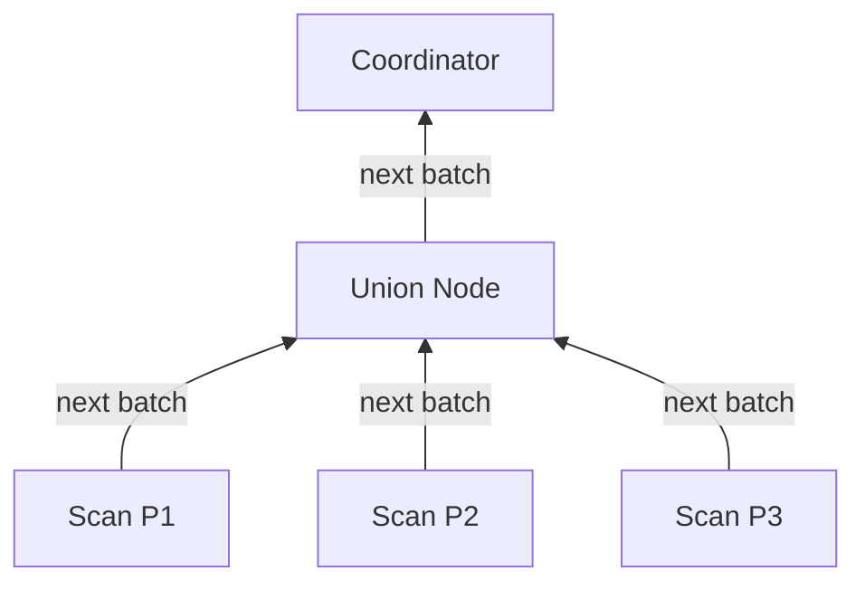
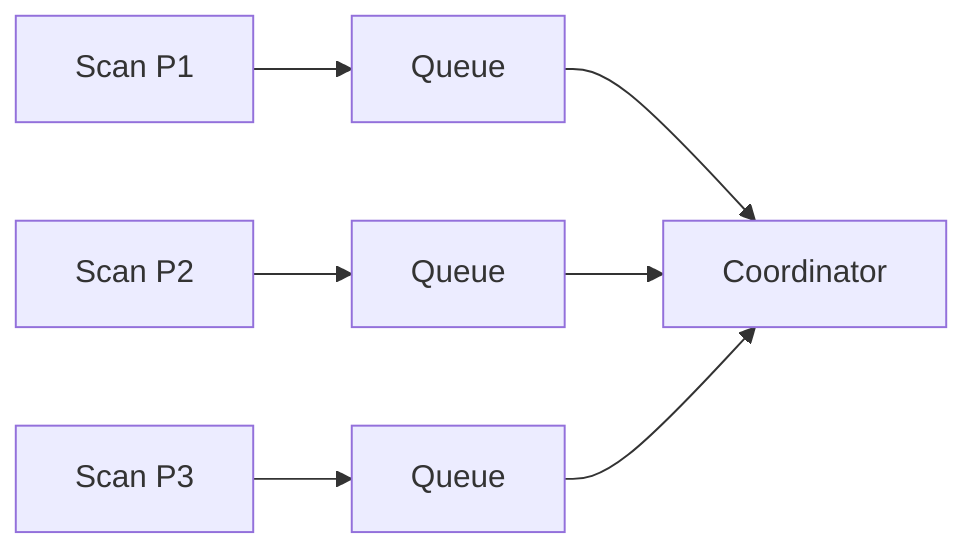

# Union Over Partitions

**Category:** Distributed Patterns
**Impact:** High - Enables parallel partition scanning
**Complexity:** Low

## Overview

Union over partitions transforms a single table scan into parallel scans of individual partitions, with results combined via UNION ALL. This enables maximum parallelism and works synergistically with partition pruning to process only relevant partitions.

## SQL Pattern

```sql
-- Logical: Single table scan
SELECT order_id, customer_id, total
FROM orders
WHERE order_date >= '2024-01-01';
```

**Physical execution:** Ra rewrites this as a union of partition scans:

```sql
-- Physical: Union of partition scans (conceptual)
SELECT * FROM orders_2024_01
UNION ALL
SELECT * FROM orders_2024_02
UNION ALL
SELECT * FROM orders_2024_03
-- ... one query per partition
```

## Relational Algebra

### Logical Plan (Single Scan)

$$
\sigma_{\text{order\_date} \geq \text{'2024-01-01'}}(\text{orders})
$$

### Physical Plan (Union of Partition Scans)

$$
\bigcup_{i=1}^{P} \sigma_{\text{order\_date} \geq \text{'2024-01-01'}}(\text{orders}_i)
$$

Where $P$ is the number of partitions. Each scan executes in parallel on a separate node/thread.

## Parallelism Model

### Sequential Scan (Baseline)

$$
\text{Time}_{\text{sequential}} = \sum_{i=1}^{P} T_{\text{scan}}(orders_i)
$$

Single-threaded, processes partitions one after another.

### Parallel Scan (Union Over Partitions)

$$
\text{Time}_{\text{parallel}} = \max_{i=1}^{P} T_{\text{scan}}(orders_i) + T_{\text{coord}}
$$

All partitions scanned concurrently. Total time = slowest partition + coordination overhead.

**Ideal speedup:** $P$x (limited by partition skew and available parallelism)

## Ra Optimization Rules

1. **[partition-scan-to-union](../../rules/distributed/partition-scan-to-union.rra)** - Converts table scan to partition scans
2. **[parallel-union-execution](../../rules/distributed/parallel-union-execution.rra)** - Enables concurrent execution
3. **[prune-union-branches](../../rules/distributed/prune-union-branches.rra)** - Removes irrelevant partitions

## Cost Analysis

### Without Parallelism

$$
\text{Cost}_{\text{sequential}} = P \times B(R_p) \times C_{\text{io}} + P \times |R_p| \times C_{\text{cpu}}
$$

Where:
- $P$ = number of partitions
- $B(R_p)$ = blocks per partition
- $|R_p|$ = rows per partition

### With Parallelism

$$
\text{Cost}_{\text{parallel}} = \frac{P \times B(R_p) \times C_{\text{io}}}{W} + \frac{P \times |R_p| \times C_{\text{cpu}}}{W} + C_{\text{merge}}
$$

Where:
- $W$ = degree of parallelism (workers/nodes)
- $C_{\text{merge}}$ = cost to combine results

**Speedup:** $\approx W$ (linear with worker count, up to $P$)

## Providing Partition Information

```rust
use ra_core::{PartitionInfo, PartitionStrategy};

let partitions = PartitionInfo {
    strategy: PartitionStrategy::Range {
        column: "order_date".into(),
    },
    partition_count: 48,
    partitions: vec![
        PartitionDef {
            id: "orders_2024_01",
            bounds: ("2024-01-01", "2024-02-01"),
            location: "node1:/data/orders_2024_01",
            row_count: 2_000_000,
        },
        // ... more partitions
    ],
};

optimizer.set_partition_info("orders", partitions);
optimizer.config.max_parallelism = 32; // Use up to 32 workers
```

## Examples

### Time-Series Data Scan

```sql
-- 5 years of data, monthly partitions (60 partitions)
SELECT sensor_id, reading_time, temperature
FROM sensor_readings
WHERE reading_time >= '2024-01-01';
```

**Execution:**
- Prune partitions before 2024: 48 partitions eliminated
- Scan 12 partitions (2024 months) in parallel
- Each worker processes 1 partition
- Combine results via union

**Parallelism:** 12x speedup with 12 workers

### Range Scan with Filtering

```sql
SELECT product_id, SUM(quantity) as total_sold
FROM order_items
WHERE order_date BETWEEN '2024-Q1' AND '2024-Q2'
GROUP BY product_id;
```

**Optimization:**
1. Partition pruning: Scan only Q1-Q2 partitions (6 months)
2. Union over 6 partitions
3. Push-down aggregation per partition
4. Combine partial aggregates

**Parallelism:** 6 workers process partitions concurrently

### Multi-Tenant Query

```sql
-- Hash-partitioned by tenant_id (100 partitions)
SELECT user_id, event_type, COUNT(*)
FROM events
WHERE tenant_id = 'acme-corp'
GROUP BY user_id, event_type;
```

**Execution:**
1. Partition pruning: Determine hash partition for 'acme-corp'
2. Scan only 1 partition (or small subset with replica factor)
3. No union needed (single partition)

**Result:** Fast, isolated tenant queries

## Combining with Other Patterns

### Union + Partition Pruning

```sql
SELECT * FROM orders
WHERE order_date >= '2024-10-01' AND region = 'US';
```

**Plan:**
1. Prune partitions outside date range
2. Union remaining partitions
3. Apply region filter during scan

### Union + Co-located Join

```sql
SELECT o.order_id, c.customer_name
FROM orders o
JOIN customers c ON o.customer_id = c.customer_id
WHERE o.order_date >= '2024-01-01';
```

**Plan:**
1. Union of order partitions (parallel scan)
2. Co-located join per partition (no shuffle)
3. Combine results

### Union + Push-down Aggregation

```sql
SELECT product_id, SUM(sales) as total
FROM sales_fact
WHERE sale_date >= '2024-01-01'
GROUP BY product_id;
```

**Plan:**
1. Union of sales partitions
2. Partial aggregation per partition
3. Final aggregation of partial results

## Partition Skew Handling

When partitions have unequal sizes, parallelism is limited by the largest partition:

```
Partition 1: 100K rows (1 second)
Partition 2: 500K rows (5 seconds)
Partition 3: 10M rows (100 seconds)  <- bottleneck
```

**Total time:** 100 seconds (limited by largest partition)

**Solutions:**
1. **Dynamic splitting:** Break large partitions into sub-ranges
2. **Work stealing:** Idle workers help with remaining partitions
3. **Better partitioning:** Re-partition data for balance

Ra supports dynamic work stealing:

```rust
optimizer.config.enable_work_stealing = true;
optimizer.config.partition_split_threshold = 10_000_000; // Split partitions > 10M rows
```

## Execution Strategies

### Pull-based (Volcano Iterator Model)

Coordinator pulls results from partition scans:



**Pros:** Simple, low memory
**Cons:** Latency from round-robin scheduling

### Push-based (Morsel-Driven Parallelism)

Partition scans push results to coordinator:



**Pros:** Better throughput, work stealing
**Cons:** Higher memory usage

Ra uses push-based by default for better performance.

## Result Ordering

Union over partitions returns results in partition order by default:

```sql
SELECT * FROM orders
WHERE order_date >= '2024-01-01'
ORDER BY order_date;
```

**Optimization:** If partitions are range-partitioned on `order_date`, results are already sorted within each partition. Ra can:
1. Scan partitions in order
2. Use merge (not sort) to combine results
3. Avoid final sort

$$
\text{Cost}_{\text{sort}} = O(n \log n) \rightarrow \text{Cost}_{\text{merge}} = O(n \times P)
$$

For $P \ll \log n$, merge is much cheaper.

## Testing Union Over Partitions

```rust
#[test]
fn test_partition_union_parallelism() {
    let sql = "SELECT * FROM orders WHERE order_date >= '2024-01-01'";

    let plan = optimize(sql)
        .with_partitions(monthly_partitions(48)) // 4 years
        .with_workers(12)
        .build();

    // Verify partition pruning occurred
    assert_eq!(plan.partitions_to_scan(), 12); // Only 2024 partitions

    // Verify parallel execution
    assert_eq!(plan.parallelism(), 12);
    assert!(plan.contains_node_type("UnionAll"));

    // Verify each partition scanned independently
    let partition_scans = plan.find_nodes("PartitionScan");
    assert_eq!(partition_scans.len(), 12);
}
```

## Performance Characteristics

| Partitions | Workers | Sequential Time | Parallel Time | Speedup |
|------------|---------|-----------------|---------------|---------|
| 12 | 1 | 60s | 60s | 1x |
| 12 | 4 | 60s | 15s | 4x |
| 12 | 12 | 60s | 5s | 12x |
| 12 | 24 | 60s | 5s | 12x (limited by partition count) |
| 100 | 32 | 500s | 16s | 31x |

**Key insight:** Speedup limited by `min(partitions, workers)`.

## Common Pitfalls

### [FAIL] Too Many Partitions

```sql
-- 10,000 partitions, each with 100 rows
SELECT * FROM tiny_partitioned_table;
```

Coordination overhead dominates. Too much parallelism for small data.

**Fix:** Use fewer partitions or sequential scan.

### [FAIL] Insufficient Workers

```sql
-- 100 partitions, 4 workers
SELECT * FROM large_table;
```

Only 4 partitions scanned at a time. Still 25x slower than full parallelism.

**Fix:** Increase worker count or use partition grouping.

### [FAIL] No Partition Pruning

```sql
-- Scans all 120 partitions when only 1 needed
SELECT * FROM orders WHERE order_id = 12345;
```

Union over all partitions without pruning wastes parallelism.

**Fix:** Add partition key to WHERE clause if possible.

## Adaptive Execution

Ra can dynamically adjust parallelism at runtime:

```rust
// Start with estimated parallelism
let initial_workers = estimate_optimal_workers(partitions, data_size);

// Adjust based on runtime statistics
if partition_scan_rate < threshold {
    increase_workers(); // Add more parallelism
}

if memory_pressure > threshold {
    decrease_workers(); // Reduce memory usage
}
```

## References

- [Parallel Query Execution](../../features/parallel-execution.md)
- [Partition Pruning](partition-pruning.md) - Complementary optimization
- [Push-down Aggregation](pushdown-aggregation.md) - Per-partition aggregation
- [Partition Scan to Union Rule](../../rules/distributed/partition-scan-to-union.rra)

## Related Patterns

- [Partition Pruning](partition-pruning.md) - Reduces partitions to scan
- [Co-located Joins](co-located-joins.md) - Join within partitions
- [Push-down Aggregation](pushdown-aggregation.md) - Aggregate per partition
