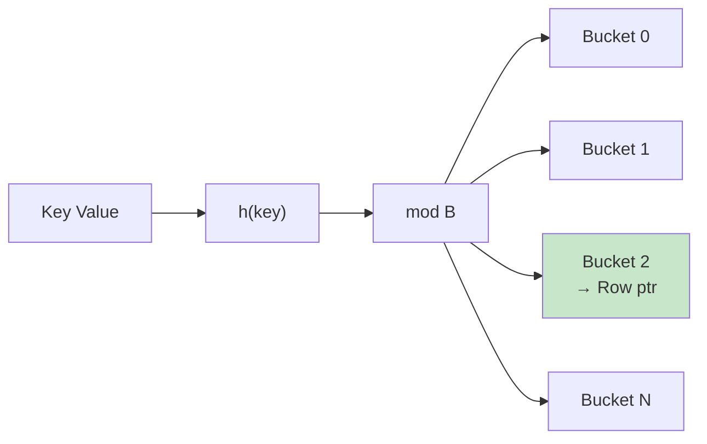

# Hash Indexes

**Category:** Index Structures
**Impact:** High - O(1) lookups for exact matches
**Complexity:** Low

## Overview

Hash indexes use a hash table to map key values directly to row locations, providing constant-time O(1) lookups for exact match queries. Unlike B-tree indexes, hash indexes cannot support range queries or sorting, but offer superior performance for equality predicates.

## Structure



$$
\text{bucket} = h(\text{key}) \bmod B
$$

Where:
- $h$ = hash function (e.g., MurmurHash3, CityHash)
- $B$ = number of buckets
- Each bucket stores pointers to rows with matching hash

## SQL Usage

```sql
-- Create hash index
CREATE INDEX idx_users_email_hash ON users USING HASH (email);

-- Queries that benefit
SELECT * FROM users WHERE email = 'alice@example.com';
SELECT user_id, name FROM users WHERE email IN ('alice@example.com', 'bob@example.com');
```

## Relational Algebra

### Without Index (Table Scan)

$$
\sigma_{\text{email} = \text{'alice@example.com'}}(\text{users})
$$

**Cost:** $O(n)$ - Must scan entire table.

### With Hash Index

$$
\text{hash\_lookup}(\text{users}, \text{email} = \text{'alice@example.com'})
$$

**Cost:** $O(1)$ average case, $O(n)$ worst case (if all keys hash to same bucket).

## Cost Analysis

### Exact Match Lookup

$$
\text{Cost}_{\text{lookup}} = C_{\text{hash}} + C_{\text{bucket}} + k \times C_{\text{io}}
$$

Where:
- $C_{\text{hash}}$ = cost to compute hash value (negligible)
- $C_{\text{bucket}}$ = cost to find bucket (O(1))
- $k$ = number of matching rows (typically 1 for unique keys)
- $C_{\text{io}}$ = cost to read row from disk

**Typical:** 1-2 disk I/Os vs full table scan (1000s of I/Os).

### IN List Lookup

$$
\text{Cost}_{\text{IN}} = n_{\text{values}} \times (\text{Cost}_{\text{lookup}})
$$

For `WHERE key IN (v1, v2, v3, ...)`, each value requires separate hash lookup.

### Insert/Update/Delete

$$
\text{Cost}_{\text{write}} = C_{\text{hash}} + C_{\text{bucket}} + C_{\text{write}}
$$

Hash indexes have low maintenance cost - just update bucket.

## Ra Optimization Rules

1. **[hash-index-lookup](../../rules/physical/index-selection/hash-index-lookup.rra)** - Use hash index for equality
2. **[hash-index-in-list](../../rules/physical/index-selection/hash-index-in-list.rra)** - Use hash index for IN lists
3. **[prefer-hash-over-btree](../../rules/physical/index-selection/prefer-hash-over-btree.rra)** - Choose hash when both exist

## Providing Index Information to Ra

```rust
use ra_core::{IndexDefinition, IndexType};

optimizer.add_index(IndexDefinition {
    table: "users".into(),
    name: "idx_users_email_hash".into(),
    index_type: IndexType::Hash,
    columns: vec!["email".into()],
    unique: true,
    statistics: IndexStatistics {
        buckets: 1024,
        fill_factor: 0.75,
        avg_collision_chain: 1.2,
    },
});
```

## Examples

### User Lookup by Email

```sql
-- Unique email, hash index guarantees O(1)
SELECT user_id, name, created_at
FROM users
WHERE email = 'alice@example.com';
```

**Execution plan:**
```
HashIndexLookup(users, email='alice@example.com')
  → Cost: 1 hash computation + 1 disk read
```

**vs Table Scan:**
```
TableScan(users) + Filter(email='alice@example.com')
  → Cost: 10M rows scanned
```

**Speedup:** ~10,000,000x

### Multi-Value Lookup

```sql
-- Lookup 10 users by email
SELECT user_id, name
FROM users
WHERE email IN (
    'alice@example.com',
    'bob@example.com',
    -- ... 8 more emails
);
```

**Execution:**
- 10 independent hash lookups
- 10 disk reads (if not cached)
- Much faster than table scan

**Cost:** 10 lookups vs full table scan.

### Session Lookup

```sql
CREATE INDEX idx_sessions_token_hash ON sessions USING HASH (token);

-- Every authenticated request
SELECT user_id, expires_at
FROM sessions
WHERE token = 'abc123...xyz';
```

**Critical for performance:** O(1) lookup on every request.

## Hash Index vs B-tree Index

| Feature | Hash Index | B-tree Index |
|---------|------------|--------------|
| **Equality lookups** | O(1) | O(log n) |
| **Range queries** | ❌ Not supported | ✓ O(log n + k) |
| **Sorting** | ❌ No | ✓ Returns sorted |
| **Prefix matching** | ❌ No | ✓ LIKE 'abc%' |
| **Min/Max** | ❌ No | ✓ O(log n) |
| **NULL handling** | ✓ Yes | ✓ Yes |
| **Partial indexes** | ✓ Yes | ✓ Yes |
| **Index-only scans** | ❌ Rare | ✓ Common |
| **Write cost** | Low | Medium |
| **Storage** | Low | Medium |

**Rule of thumb:** Use hash index for columns queried only with `=` or `IN`.

## When to Use Hash Indexes

### ✓ Good Use Cases

1. **Primary key lookups (non-sequential)**
   ```sql
   CREATE INDEX idx_users_uuid_hash ON users USING HASH (user_uuid);
   SELECT * FROM users WHERE user_uuid = 'a1b2c3...';
   ```

2. **Session tokens**
   ```sql
   CREATE INDEX idx_sessions_token_hash ON sessions USING HASH (token);
   SELECT * FROM sessions WHERE token = ?;
   ```

3. **Hash joins** (internal query processing)
   - Hash index on join column accelerates hash join build phase

4. **Foreign key lookups**
   ```sql
   CREATE INDEX idx_orders_customer_hash ON orders USING HASH (customer_id);
   SELECT * FROM orders WHERE customer_id = 12345;
   ```

### ✗ Bad Use Cases

1. **Range queries**
   ```sql
   -- Hash index CANNOT help here
   SELECT * FROM orders WHERE order_date >= '2024-01-01';
   ```

2. **Sorting**
   ```sql
   -- Hash index CANNOT help here
   SELECT * FROM users ORDER BY email;
   ```

3. **Pattern matching**
   ```sql
   -- Hash index CANNOT help here
   SELECT * FROM users WHERE email LIKE '%@example.com';
   ```

4. **Inequality**
   ```sql
   -- Hash index CANNOT help here
   SELECT * FROM products WHERE price < 100;
   ```

## Hash Function Properties

### Good Hash Function

- **Uniform distribution:** Keys spread evenly across buckets
- **Low collision rate:** Few keys hash to same bucket
- **Fast computation:** Minimal CPU overhead

### Common Hash Functions

| Function | Speed | Quality | Use Case |
|----------|-------|---------|----------|
| **MurmurHash3** | Very fast | Excellent | General purpose |
| **CityHash** | Very fast | Excellent | String keys |
| **xxHash** | Fastest | Good | High throughput |
| **SipHash** | Moderate | Excellent (secure) | Untrusted input |

Ra defaults to MurmurHash3.

## Collision Handling

### Separate Chaining (Common)

Each bucket is a linked list of entries:

```
Bucket 5: → Entry(key1, ptr1) → Entry(key2, ptr2) → NULL
Bucket 7: → Entry(key3, ptr3) → NULL
```

**Cost with collisions:** $O(c)$ where $c$ = chain length (average 1-2).

### Open Addressing (Alternative)

On collision, probe for next empty bucket:

```
Bucket 5: Entry(key1, ptr1)
Bucket 6: Entry(key2, ptr2)  ← Collision, stored in next bucket
Bucket 7: Entry(key3, ptr3)
```

**Pros:** Better cache locality
**Cons:** Requires rehashing when full

## Dynamic Resizing

When fill factor exceeds threshold (e.g., 0.75), double bucket count:

$$
B_{\text{new}} = 2 \times B_{\text{old}}
$$

Re-hash all entries with new bucket count.

**Cost:** $O(n)$ one-time operation, amortized $O(1)$ per insert.

Ra monitors fill factor and triggers resize automatically:

```rust
if index.fill_factor() > 0.75 {
    index.resize(index.buckets() * 2);
}
```

## Partial Hash Indexes

Filter indexed values:

```sql
-- Only index active users
CREATE INDEX idx_active_users_email_hash
ON users USING HASH (email)
WHERE status = 'active';
```

**Benefits:**
- Smaller index (faster lookups, less storage)
- Faster writes (fewer index updates)

**Use when:** Only subset of rows queried frequently.

## Testing Hash Index Usage

```rust
#[test]
fn test_hash_index_selection() {
    let sql = "SELECT * FROM users WHERE email = 'alice@example.com'";

    let plan = optimize(sql)
        .with_index(hash_index("users", "email"))
        .build();

    // Verify hash index chosen
    assert!(plan.contains_node_type("HashIndexLookup"));
    assert_eq!(plan.estimate_io_cost(), 1); // Single I/O

    // Verify no table scan
    assert!(!plan.contains_node_type("TableScan"));
}

#[test]
fn test_hash_index_not_used_for_range() {
    let sql = "SELECT * FROM orders WHERE order_date >= '2024-01-01'";

    let plan = optimize(sql)
        .with_index(hash_index("orders", "order_date"))
        .build();

    // Hash index cannot help with range query
    assert!(!plan.contains_node_type("HashIndexLookup"));
}
```

## Performance Characteristics

| Operation | Without Index | With Hash Index | Speedup |
|-----------|---------------|-----------------|---------|
| Single row lookup | 5s (10M rows) | 0.001s | **5,000x** |
| 10-row IN list | 50s | 0.01s | **5,000x** |
| 1000-row IN list | 5000s | 1s | **5,000x** |
| Range query | 5s | 5s (no help) | 1x |

## Common Pitfalls

### ❌ Using Hash Index for Range Queries

```sql
CREATE INDEX idx_orders_date_hash ON orders USING HASH (order_date);

-- This query CANNOT use the hash index
SELECT * FROM orders WHERE order_date >= '2024-01-01';
```

**Fix:** Use B-tree index instead.

### ❌ Hash Index on Low-Cardinality Column

```sql
-- status has only 3 values: 'active', 'inactive', 'suspended'
CREATE INDEX idx_users_status_hash ON users USING HASH (status);
```

**Problem:** Few distinct values → many collisions → slow lookups.

**Fix:** Use bitmap index instead.

### ❌ Hash Index on Sorted Access

```sql
-- Users ordered by email
SELECT * FROM users ORDER BY email;
```

Hash index provides no benefit for sorting.

**Fix:** Use B-tree index which maintains sorted order.

## References

- [B-tree Indexes](btree.md) - Alternative for range queries
- [Bitmap Indexes](bitmap.md) - Alternative for low cardinality
- [Index Selection Rules](../../rules/physical/index-selection/)
- [Hash Join Algorithm](../../features/join-algorithms.md#hash-join)

## Related Patterns

- [B-tree Indexes](btree.md) - More versatile but slower equality
- [Point Lookup Queries](../query-patterns/oltp/point-lookup.md) - Primary use case
- [Covering Indexes](covering.md) - Index-only scan optimization
