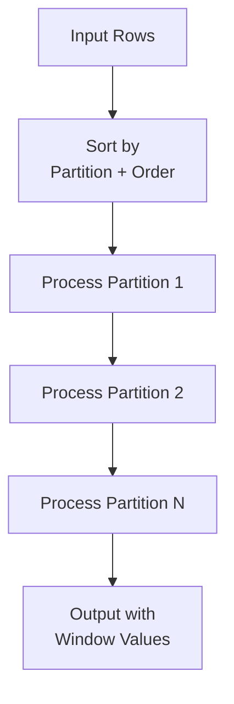

# Window Functions

## Description

Window functions perform calculations across a set of table rows related to the current row, without collapsing rows like GROUP BY. Essential for ranking, running aggregates, and comparative analytics.

## Use Cases

- Row numbering and ranking (ROW_NUMBER, RANK, DENSE_RANK)
- Computing running totals and moving averages
- Finding relative values (LAG, LEAD, FIRST_VALUE, LAST_VALUE)
- Top-N per group
- Percentile calculation
- Gap analysis

## Relational Algebra

Window function operator:

$$
\omega_{\text{PARTITION BY } P \text{ ORDER BY } O; F_1, \ldots, F_n}(R)
$$

Where:
- $P$ = partition columns
- $O$ = ordering columns
- $F_i$ = window function specifications

With frame specification:

$$
\omega_{P, O; F \text{ ROWS/RANGE } [l, u]}(R)
$$

Where $[l, u]$ defines the window frame (e.g., ROWS BETWEEN 2 PRECEDING AND CURRENT ROW).

## How Ra Optimizes



### 1. Window Function Ordering

**Rule:** `logical/window-reorder`

Multiple window functions are reordered to minimize sorts:

$$
\omega_{P_1, O_1; F_1}(\omega_{P_2, O_2; F_2}(R)) \rightarrow \omega_{P_2, O_2; F_2}(\omega_{P_1, O_1; F_1}(R))
$$

If $P_1 = P_2$ and $O_1 \subseteq O_2$, second window reuses sort.

### 2. Sort Elimination

**Rule:** `logical/window-sort-elimination`

If input is already sorted by partition + order:

$$
\tau_{P, O}(\omega_{P, O; F}(R)) \equiv \omega_{P, O; F}(\tau_{P, O}(R))
$$

Single sort serves both operations.

### 3. Partition Pruning

**Rule:** `logical/pushdown/filter-through-window`

Push predicates on partition columns below window:

$$
\sigma_{\theta}(\omega_{P, O; F}(R)) \rightarrow \omega_{P, O; F}(\sigma_{\theta}(R)) \quad \text{if } \theta \text{ only references } P
$$

### 4. Incremental Window Computation

For running aggregates with ROWS frame, Ra uses incremental updates:

$$
\text{SUM}(x) \text{ OVER (ORDER BY t ROWS BETWEEN } n \text{ PRECEDING AND CURRENT ROW)}
$$

Computed as: $\text{sum}_{i} = \text{sum}_{i-1} + x_i - x_{i-n-1}$

Cost: $O(1)$ per row instead of $O(n)$.

## Statistics API

```rust
use ra_optimizer::{Statistics, ColumnStatistics};

optimizer.add_table_stats("sales", Statistics {
    row_count: 10_000_000,
    block_count: 100_000,
});

// Partition column
optimizer.add_column_stats("sales", "region", ColumnStatistics {
    distinct_count: 50,  // Number of partitions
    null_fraction: 0.0,
});

// Order column
optimizer.add_column_stats("sales", "sale_date", ColumnStatistics {
    distinct_count: 1_000,  // Days
    null_fraction: 0.0,
    min_value: Some("2022-01-01"),
    max_value: Some("2024-12-31"),
});

// Measure column
optimizer.add_column_stats("sales", "amount", ColumnStatistics {
    distinct_count: 100_000,
    null_fraction: 0.0,
});
```

### Cost Model

Window function cost:

$$
\text{Cost}_{\text{window}} = C_{\text{sort}} + |R| \times C_{\text{window}}
$$

Where:
- $C_{\text{sort}} = |R| \times \log(|R|) \times C_{\text{cpu}}$ if sort needed
- $C_{\text{window}}$ is per-row window computation cost

## Examples

### ROW_NUMBER for Ranking

```sql
SELECT
  product_id,
  product_name,
  price,
  ROW_NUMBER() OVER (ORDER BY price DESC) as price_rank
FROM products;
```

**Relational Algebra:**

$$
\omega_{\text{ORDER BY price DESC}; \text{ROW\_NUMBER}()}(\text{products})
$$

**Ra Plan:**

```
WindowAgg
  Functions: ROW_NUMBER() OVER (ORDER BY price DESC)
  Sort [price DESC]
    SeqScan [products]
```

### Top-N Per Group

```sql
SELECT *
FROM (
  SELECT
    region,
    product_id,
    sales,
    ROW_NUMBER() OVER (PARTITION BY region ORDER BY sales DESC) as rn
  FROM regional_sales
) ranked
WHERE rn <= 3;
```

**Relational Algebra:**

$$
\sigma_{\text{rn} \leq 3}(\omega_{\text{PARTITION BY region ORDER BY sales DESC}; \text{ROW\_NUMBER}()}(\text{regional\_sales}))
$$

**Ra Plan:**

```
Filter (rn <= 3)
  WindowAgg
    Functions: ROW_NUMBER() OVER (PARTITION BY region ORDER BY sales DESC)
    Sort [region, sales DESC]
      SeqScan [regional_sales]
```

**Optimization:** Ra cannot push filter below window (row numbers computed during window execution).

### Running Total

```sql
SELECT
  sale_date,
  amount,
  SUM(amount) OVER (ORDER BY sale_date ROWS BETWEEN UNBOUNDED PRECEDING AND CURRENT ROW) as running_total
FROM daily_sales
ORDER BY sale_date;
```

**Ra Plan:**

```
WindowAgg
  Functions: SUM(amount) OVER (ORDER BY sale_date ROWS ...)
  Sort [sale_date]
    SeqScan [daily_sales]
```

**Optimization:** Single sort serves both window and final ORDER BY.

### Moving Average

```sql
SELECT
  sale_date,
  amount,
  AVG(amount) OVER (ORDER BY sale_date ROWS BETWEEN 6 PRECEDING AND CURRENT ROW) as moving_avg_7d
FROM daily_sales;
```

**Incremental Computation:**

$$
\text{avg}_i = \frac{\sum_{j=i-6}^{i} x_j}{7}
$$

Ra maintains sliding window of 7 values, updating in $O(1)$ per row.

### LAG/LEAD for Period-over-Period

```sql
SELECT
  product_id,
  month,
  revenue,
  LAG(revenue, 1) OVER (PARTITION BY product_id ORDER BY month) as prev_month_revenue,
  revenue - LAG(revenue, 1) OVER (PARTITION BY product_id ORDER BY month) as growth
FROM monthly_product_revenue;
```

**Ra Plan:**

```
WindowAgg
  Functions:
    LAG(revenue, 1) OVER (PARTITION BY product_id ORDER BY month)
  Sort [product_id, month]
    SeqScan [monthly_product_revenue]
Project [product_id, month, revenue, prev_month_revenue, revenue - prev_month_revenue AS growth]
```

### Multiple Windows with Shared Sorting

```sql
SELECT
  employee_id,
  dept,
  salary,
  AVG(salary) OVER (PARTITION BY dept) as dept_avg,
  RANK() OVER (PARTITION BY dept ORDER BY salary DESC) as dept_rank,
  PERCENT_RANK() OVER (ORDER BY salary) as company_percentile
FROM employees;
```

**Ra Plan Optimization:**

```
WindowAgg [ORDER BY salary]
  Functions: PERCENT_RANK()
  WindowAgg [PARTITION BY dept ORDER BY salary DESC]
    Functions: RANK()
    WindowAgg [PARTITION BY dept]
      Functions: AVG(salary)
      Sort [dept, salary DESC]
        SeqScan [employees]
```

**Sort Reuse:**
1. Sort by (dept, salary DESC)
2. First two windows reuse this sort
3. Third window requires re-sort (different ordering)

## Frame Specifications

### ROWS vs RANGE

**ROWS:** Physical offset

```sql
SUM(amount) OVER (ORDER BY id ROWS BETWEEN 2 PRECEDING AND 2 FOLLOWING)
```

**RANGE:** Logical range based on value

```sql
SUM(amount) OVER (ORDER BY date RANGE BETWEEN INTERVAL '1 day' PRECEDING AND CURRENT ROW)
```

Ra's cost:
- ROWS: $O(1)$ per row with sliding window
- RANGE: $O(\log n)$ per row (requires value comparisons)

## Performance Characteristics

| Pattern | Complexity | Memory |
|---------|-----------|--------|
| Simple ranking (ROW_NUMBER) | $O(n \log n)$ | $O(n)$ for sort |
| Running total (ROWS frame) | $O(n)$ | $O(1)$ sliding window |
| Moving average (ROWS frame) | $O(n)$ | $O(k)$ window size |
| RANGE frame | $O(n \log n)$ | $O(w)$ frame size |
| Multiple windows (same partition/order) | $O(n \log n)$ | $O(n)$ single sort |

## See Also

- [Top-N Queries](../olap/top-n.md) - LIMIT optimization
- [Cumulative Sums](cumulative-sums.md) - Running totals
- [Moving Aggregates](moving-aggregates.md) - Sliding windows
- [Full Table Aggregation](../olap/full-table-aggregation.md) - GROUP BY comparison
- [Rule: Window Reordering](../../../rules/logical/window-reorder.md)

## References

- SQL:2003 Standard, "Window Functions"
- Leis et al., "Query Optimization Through the Looking Glass", *VLDB 2015*
- Bellamkonda et al., "Analytic Functions in Oracle", *VLDB 2009*
