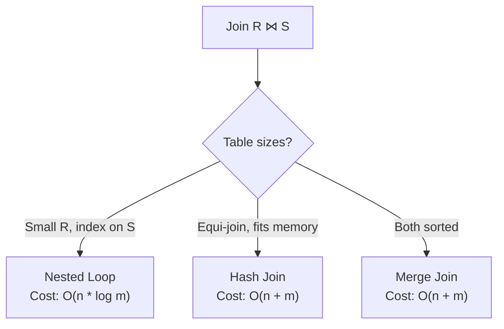

# Inner Join

## Description

Inner join combines rows from two tables based on a join condition, returning only matching rows. Most common join type in relational databases.

## Use Cases

- Orders with customer information
- Products with their categories
- Fact tables joined with dimension tables
- Multi-table analytical queries

## Relational Algebra

Equi-join (most common):

$$
R \bowtie_{R.a = S.b} S
$$

Theta-join (general):

$$
R \bowtie_{\theta} S = \sigma_{\theta}(R \times S)
$$

## How Ra Optimizes

### 1. Join Method Selection

**Rule:** `physical/join-method-selection`



Ra chooses join algorithm based on cost:

| Method | When Used | Cost Formula |
|--------|-----------|--------------|
| Nested Loop | Small $R$ or selective index on $S$ | $\|R\| \times (\|S\| \times C_{\text{probe}} + C_{\text{index}})$ |
| Hash Join | Equi-join, $R$ fits in memory | $\|R\| + \|S\|$ |
| Merge Join | Both sorted on join key | $\|R\| + \|S\|$ (if sorted) |

**Hash Join Cost:**

$$
\text{Cost}_{\text{hash}} = |R| \times (C_{\text{build}} + C_{\text{hash}}) + |S| \times C_{\text{probe}}
$$

**Merge Join Cost:**

$$
\text{Cost}_{\text{merge}} = C_{\text{sort}}(R) + C_{\text{sort}}(S) + (|R| + |S|) \times C_{\text{scan}}
$$

### 2. Join Order Optimization

**Rule:** `logical/join-reorder`

For multi-way joins:

$$
(R \bowtie S) \bowtie T \equiv (R \bowtie T) \bowtie S \equiv (S \bowtie T) \bowtie R
$$

Ra uses dynamic programming to find optimal order:

$$
\text{Cost}(R_1 \bowtie \cdots \bowtie R_n) = \min_{\text{permutations}} \sum \text{Cost}(\text{subtree})
$$

**Heuristic:** Build hash tables on smaller relations.

### 3. Join Predicate Pushdown

**Rule:** `logical/pushdown/filter-through-join`

Push selective predicates before join:

$$
\sigma_{\theta_R}(R \bowtie S) \equiv \sigma_{\theta_R}(R) \bowtie S
$$

Reduces input size to join.

### 4. Bloom Filter Optimization

**Rule:** `physical/bloom-filter-join`

For distributed joins, create Bloom filter from smaller side:

$$
S \bowtie R \rightarrow S \bowtie \sigma_{\text{BloomFilter}(S)}(R)
$$

Filters $R$ early, reducing network transfer.

## Statistics API

```rust
use ra_optimizer::{Statistics, ColumnStatistics, JoinStatistics};

// Left relation
optimizer.add_table_stats("orders", Statistics {
    row_count: 10_000_000,
    block_count: 100_000,
});

optimizer.add_column_stats("orders", "customer_id", ColumnStatistics {
    distinct_count: 500_000,  // FK to customers
    null_fraction: 0.0,
});

// Right relation
optimizer.add_table_stats("customers", Statistics {
    row_count: 500_000,
    block_count: 5_000,
});

optimizer.add_column_stats("customers", "id", ColumnStatistics {
    distinct_count: 500_000,  // PK
    null_fraction: 0.0,
});

// Join cardinality hint (if known)
optimizer.add_join_stats("orders", "customers", JoinStatistics {
    join_type: JoinType::Inner,
    join_cardinality: 10_000_000,  // 1:1 join
    join_selectivity: 1.0,
});
```

### Join Cardinality Estimation

For equi-join $R \bowtie_{R.a = S.b} S$:

$$
|R \bowtie_{R.a = S.b} S| = \frac{|R| \times |S|}{\max(\text{distinct}(R.a), \text{distinct}(S.b))}
$$

Assumes uniform distribution and independence.

## Examples

### Two-Table Join

```sql
SELECT o.order_id, o.total, c.name, c.email
FROM orders o
JOIN customers c ON o.customer_id = c.id
WHERE o.status = 'completed';
```

**Relational Algebra:**

$$
\pi_{\text{attrs}}(\sigma_{\text{status='completed'}}(\text{orders}) \bowtie_{\text{customer\_id=id}} \text{customers})
$$

**Ra Plan:**

```
Project [order_id, total, name, email]
  HashJoin [customer_id = id]
    SeqScan [customers]  -- Build side (smaller)
      (500K rows)
    SeqScan [orders]      -- Probe side
      Filter: status = 'completed'
      (5M rows after filter)
```

**Join Cardinality:** 5M (many-to-one join).

### Star Schema Join

```sql
SELECT d.date, p.product_name, c.country, SUM(f.amount)
FROM fact_sales f
JOIN dim_date d ON f.date_id = d.id
JOIN dim_product p ON f.product_id = p.id
JOIN dim_customer c ON f.customer_id = c.id
WHERE d.year = 2024
GROUP BY d.date, p.product_name, c.country;
```

**Ra Plan:**

```
HashAggregate [date, product_name, country]
  Aggregates: SUM(amount)
  HashJoin [f.customer_id = c.id]
    HashJoin [f.product_id = p.id]
      HashJoin [f.date_id = d.id]
        SeqScan [fact_sales f]
        SeqScan [dim_date d]
          Filter: year = 2024  -- Pushed down
      SeqScan [dim_product p]
    SeqScan [dim_customer c]
```

**Optimization:** Smallest dimension (dim_date with filter) joined first.

### Index Nested Loop Join

```sql
-- Index exists: CREATE INDEX orders_customer_idx ON orders(customer_id)
SELECT c.name, COUNT(*) as order_count
FROM customers c
JOIN orders o ON o.customer_id = c.id
WHERE c.country = 'USA'
GROUP BY c.name;
```

**Ra Plan (if customers filtered to small set):**

```
HashAggregate [name]
  Aggregates: COUNT(*)
  NestedLoopJoin
    SeqScan [customers c]
      Filter: country = 'USA'
      (5K rows)
    IndexScan [orders.customer_idx]  -- Inner loop uses index
      (avg 20 rows per customer)
```

**Cost:** $5{,}000 \times (\log(10M) + 20) \approx 115{,}000$ operations.

**Decision:** Nested loop chosen because outer is small (5K) and inner has index.

### Merge Join

```sql
SELECT *
FROM table1 t1
JOIN table2 t2 ON t1.sorted_col = t2.sorted_col
ORDER BY t1.sorted_col;
```

**Ra Plan (if both tables have sorted indexes or are pre-sorted):**

```
MergeJoin [sorted_col]
  IndexScan [table1.sorted_col_idx]  -- Returns sorted
  IndexScan [table2.sorted_col_idx]  -- Returns sorted
```

**Cost:** $O(|T_1| + |T_2|)$ with no sort overhead.

### Multi-Column Join

```sql
SELECT *
FROM orders o
JOIN order_items oi ON o.id = oi.order_id AND o.tenant_id = oi.tenant_id
WHERE o.tenant_id = 'tenant_123';
```

**Relational Algebra:**

$$
\sigma_{\text{tenant\_id='tenant\_123'}}(\text{orders} \bowtie_{\text{id=order\_id} \land \text{tenant\_id=tenant\_id}} \text{order\_items})
$$

**Ra Plan:**

```
HashJoin [id = order_id AND tenant_id = tenant_id]
  SeqScan [orders]
    Filter: tenant_id = 'tenant_123'
  SeqScan [order_items]
    Filter: tenant_id = 'tenant_123'  -- Pushed down
```

**Optimization:** Predicate on tenant_id pushed to both sides.

## Advanced Optimizations

### Join Elimination

**Rule:** `logical/join-elimination`

If join is on PK/FK and no columns from one side are used:

```sql
-- If only orders.* columns are selected
SELECT o.* FROM orders o JOIN customers c ON o.customer_id = c.id;
```

Becomes:

```sql
SELECT o.* FROM orders o;  -- Join eliminated
```

### Join Order with Predicates

For:

```sql
SELECT * FROM A JOIN B ON A.x = B.x JOIN C ON B.y = C.y
WHERE A.z = 10;
```

Ra considers:
1. $((\sigma_{z=10}(A) \bowtie B) \bowtie C)$ - Apply filter first
2. $(A \bowtie (B \bowtie C))$ then filter
3. $((A \bowtie C) \bowtie B)$ if possible

Chooses order minimizing intermediate result size.

## Performance Characteristics

| Join Type | Typical Rows | Recommended Method | Time Complexity |
|-----------|--------------|-------------------|-----------------|
| PK-FK (1:N) | Left < 10K | Nested Loop with index | $O(n \log m)$ |
| PK-FK (1:N) | Left > 10K | Hash Join | $O(n + m)$ |
| M:N | Any | Hash Join | $O(n + m)$ |
| Both sorted | Any | Merge Join | $O(n + m)$ |
| Distributed | Large tables | Partitioned Hash | $O(n/p + m/p)$ |

## See Also

- [Outer Joins](outer-join.md) - LEFT, RIGHT, FULL joins
- [Semi Joins](semi-join.md) - EXISTS optimization
- [Cross Joins](cross-join.md) - Cartesian products
- [Distributed Patterns: Shuffle Joins](../../distributed-patterns/shuffle-joins.md)
- [Schema Patterns: Star Schema](../../schema-patterns/star-schema.md)
- [Rule: Join Reordering](../../../rules/logical/join-reorder.md)
- [Example: Join Reordering](../../../examples/join-reordering.md)

## References

- Selinger et al., "Access Path Selection in a Relational Database", *SIGMOD 1979*
- Graefe, "Query Evaluation Techniques for Large Databases", *ACM Computing Surveys 1993*
- Neumann, "Efficiently Compiling Efficient Query Plans for Modern Hardware", *VLDB 2011*
