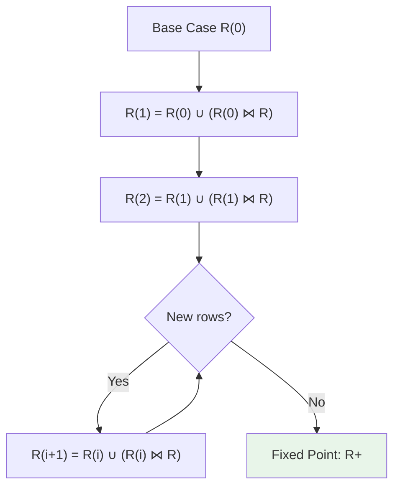

# Transitive Closure

## Description

Computes all reachable nodes in a graph using recursive CTEs. Fundamental pattern for hierarchies, networks, and relationship graphs.

## Use Cases

- Social network friend-of-friend queries
- Organization chart reporting chains
- Bill of materials (parts explosion)
- Graph reachability
- Path finding in networks
- Access control inheritance

## Relational Algebra

Transitive closure operator:

$$
R^+ = R \cup (R \bowtie R) \cup (R \bowtie R \bowtie R) \cup \cdots
$$

Fixed-point semantics:

$$
R^{(0)} = R
$$

$$
R^{(i+1)} = R^{(i)} \cup (R^{(i)} \bowtie R)
$$

$$
R^+ = R^{(n)} \quad \text{where } R^{(n)} = R^{(n+1)}
$$

## How Ra Optimizes



### 1. Iterative Execution

**Rule:** `logical/recursive-cte-to-iteration`

Transform recursive CTE to iteration:

```
Loop:
  1. Compute new_rows = working_table JOIN base_table
  2. working_table = working_table UNION new_rows
  3. If new_rows is empty, terminate
```

**Cost:**

$$
\text{Cost} = \sum_{i=1}^{d} |R^{(i)}| \times C_{\text{join}}
$$

Where $d$ is graph depth (diameter).

### 2. Delta Computation

**Rule:** `physical/recursive-delta-optimization`

Only join newly discovered rows:

$$
\Delta^{(i)} = (R \bowtie \Delta^{(i-1)}) - R^{(i-1)}
$$

Reduces redundant computation.

### 3. Cycle Detection

**Rule:** `physical/recursive-cycle-detection`

Track visited nodes to prevent infinite loops:

```rust
visited_set.insert(node_id);
if visited_set.contains(next_node) {
    skip; // Cycle detected
}
```

### 4. Depth Limiting

**Rule:** `physical/recursive-depth-limit`

Impose maximum depth to prevent runaway queries:

```sql
WITH RECURSIVE cte AS (
  SELECT *, 0 as depth FROM nodes WHERE id = start
  UNION ALL
  SELECT n.*, cte.depth + 1
  FROM nodes n
  JOIN cte ON n.parent_id = cte.id
  WHERE cte.depth < 10  -- Depth limit
)
SELECT * FROM cte;
```

## Statistics API

```rust
use ra_optimizer::{GraphStatistics, RecursiveStatistics};

// Base table (edges)
optimizer.add_table_stats("edges", Statistics {
    row_count: 1_000_000,
});

optimizer.add_column_stats("edges", "from_node", ColumnStatistics {
    distinct_count: 100_000,  // Number of nodes
    null_fraction: 0.0,
});

// Graph characteristics
optimizer.add_graph_stats("edges", GraphStatistics {
    node_count: 100_000,
    edge_count: 1_000_000,
    avg_degree: 10.0,  // Average edges per node
    max_degree: 1000,  // Hub nodes
    diameter: 6,       // Longest shortest path
    is_dag: false,     // Contains cycles
});

// Recursive query stats
optimizer.add_recursive_stats(RecursiveStatistics {
    expected_iterations: 6,    // Based on diameter
    growth_factor: 2.5,        // Fanout per iteration
    max_result_size: 10_000,   // Estimated final result
});
```

## Examples

### Friend-of-Friend (2 Hops)

```sql
WITH RECURSIVE friends AS (
  -- Base case: Direct friends
  SELECT user_id, friend_id, 1 as degree
  FROM friendships
  WHERE user_id = 12345

  UNION

  -- Recursive case: Friends of friends
  SELECT f.user_id, fr.friend_id, f.degree + 1
  FROM friends f
  JOIN friendships fr ON f.friend_id = fr.user_id
  WHERE f.degree < 2
)
SELECT DISTINCT friend_id FROM friends;
```

**Relational Algebra:**

$$
\text{Friends}^{(0)} = \sigma_{\text{user\_id}=12345}(\text{friendships})
$$

$$
\text{Friends}^{(i+1)} = \text{Friends}^{(i)} \cup \pi_{\text{user\_id}, \text{friend\_id}, \text{degree}+1}(\text{Friends}^{(i)} \bowtie_{\text{friend\_id}=\text{user\_id}} \text{friendships})
$$

**Ra Plan:**

```
HashAggregate [DISTINCT friend_id]
  RecursiveCTE [friends]
    Initial:
      Project [user_id, friend_id, 1 AS degree]
        SeqScan [friendships]
          Filter: user_id = 12345
    Iteration:
      HashJoin [f.friend_id = fr.user_id]
        WorkingTable [friends f]
          Filter: degree < 2
        SeqScan [friendships fr]
```

**Execution:**
- Iteration 1: 50 direct friends
- Iteration 2: 50 × 50 = 2,500 friends-of-friends (with duplicates)
- Total: ~500 unique second-degree friends

### Organizational Hierarchy (All Reports)

```sql
WITH RECURSIVE reports AS (
  -- Manager
  SELECT employee_id, name, manager_id, 0 as level
  FROM employees
  WHERE employee_id = 100  -- CEO

  UNION ALL

  -- Direct and indirect reports
  SELECT e.employee_id, e.name, e.manager_id, r.level + 1
  FROM employees e
  JOIN reports r ON e.manager_id = r.employee_id
)
SELECT * FROM reports ORDER BY level, name;
```

**Ra Plan:**

```
Sort [level, name]
  RecursiveCTE [reports]
    Initial:
      Project [employee_id, name, manager_id, 0 AS level]
        IndexScan [employees.pkey]
          Filter: employee_id = 100
    Iteration:
      HashJoin [e.manager_id = r.employee_id]
        IndexScan [employees.manager_idx]  -- Index on manager_id
        WorkingTable [reports r]
```

**Optimization:** Index on `manager_id` enables efficient lookups.

**Execution:**
- Iteration 1: CEO (1 row)
- Iteration 2: Direct reports (10 rows)
- Iteration 3: Level 2 reports (100 rows)
- ...
- Total iterations: Organization depth (typically 4-6)

### Graph Reachability

```sql
WITH RECURSIVE reachable AS (
  -- Starting node
  SELECT node_id, 0 as distance
  FROM nodes
  WHERE node_id = 'node_1'

  UNION

  -- Traverse edges
  SELECT e.to_node, r.distance + 1
  FROM edges e
  JOIN reachable r ON e.from_node = r.node_id
  WHERE r.distance < 10  -- Depth limit
)
SELECT * FROM reachable;
```

**Ra Plan with Delta Optimization:**

```
RecursiveCTE [reachable]
  Initial:
    Project [node_id, 0 AS distance]
      SeqScan [nodes]
        Filter: node_id = 'node_1'

  Iteration (delta):
    HashJoin [e.from_node = delta.node_id]
      SeqScan [edges e]
      DeltaTable [delta]  -- Only new rows from previous iteration
        Filter: distance < 10

    AntiJoin [already visited]
      <output>
      WorkingTable [reachable]  -- Exclude already found nodes
```

**Delta Optimization:**
- Iteration 1: Join 1 node with edges → 10 new nodes
- Iteration 2: Join 10 new nodes with edges → 100 new nodes
- Without delta: Join all 111 nodes with edges
- With delta: Join only 10 new nodes

**Speedup:** $O(d \times |\Delta|)$ vs $O(d \times |R^+|)$

### Bill of Materials (Parts Explosion)

```sql
WITH RECURSIVE bom AS (
  -- Top-level product
  SELECT part_id, component_id, quantity, 1 as level
  FROM part_components
  WHERE part_id = 'BICYCLE_001'

  UNION ALL

  -- Sub-components
  SELECT pc.part_id, pc.component_id, bom.quantity * pc.quantity, bom.level + 1
  FROM part_components pc
  JOIN bom ON pc.part_id = bom.component_id
  WHERE bom.level < 10
)
SELECT component_id, SUM(quantity) as total_quantity
FROM bom
GROUP BY component_id;
```

**Ra Plan:**

```
HashAggregate [component_id]
  Aggregates: SUM(quantity)
  RecursiveCTE [bom]
    Initial:
      Project [part_id, component_id, quantity, 1 AS level]
        SeqScan [part_components]
          Filter: part_id = 'BICYCLE_001'
    Iteration:
      Project [pc.part_id, pc.component_id, bom.quantity * pc.quantity, bom.level + 1]
        HashJoin [pc.part_id = bom.component_id]
          SeqScan [part_components pc]
          WorkingTable [bom]
            Filter: level < 10
```

**Optimization:** Aggregation performed after recursion completes.

### Path Enumeration

```sql
WITH RECURSIVE paths AS (
  -- Starting paths
  SELECT from_node, to_node, ARRAY[from_node, to_node] as path
  FROM edges
  WHERE from_node = 'A'

  UNION

  -- Extend paths
  SELECT p.from_node, e.to_node, p.path || e.to_node
  FROM paths p
  JOIN edges e ON p.to_node = e.from_node
  WHERE NOT (e.to_node = ANY(p.path))  -- Avoid cycles
    AND array_length(p.path, 1) < 10
)
SELECT * FROM paths WHERE to_node = 'Z';
```

**Cycle Detection:**

$$
\text{next\_node} \notin \text{path} \implies \text{extend path}
$$

**Ra Plan:**

```
Filter (to_node = 'Z')
  RecursiveCTE [paths]
    Initial:
      Project [from_node, to_node, ARRAY[from_node, to_node] AS path]
        SeqScan [edges]
          Filter: from_node = 'A'
    Iteration:
      Project [p.from_node, e.to_node, p.path || e.to_node]
        HashJoin [p.to_node = e.from_node]
          SeqScan [edges e]
          WorkingTable [paths p]
            Filter: array_length(path, 1) < 10
        Filter: NOT (e.to_node = ANY(p.path))
```

**Cost:** Exponential in path length without depth limit.

## Performance Characteristics

| Pattern | Iterations | Cost per Iteration | Total Cost |
|---------|-----------|-------------------|-----------|
| Fixed depth (2 hops) | 2 | $O(n \times m)$ | $O(n \times m)$ |
| Shallow graph (d=6) | 6 | $O(m)$ | $O(d \times m)$ |
| Deep graph (d=100) | 100 | $O(m)$ | $O(d \times m)$ |
| Dense graph | $d$ | $O(n^2)$ | $O(d \times n^2)$ |

Where:
- $n$ = number of nodes
- $m$ = number of edges
- $d$ = graph diameter

## Optimization Strategies

### 1. Bidirectional Search

For shortest path between two nodes:

```sql
WITH RECURSIVE forward AS (...), backward AS (...)
SELECT * FROM forward INTERSECT SELECT * FROM backward;
```

Reduces search space from $O(b^d)$ to $O(2 \times b^{d/2})$.

### 2. Materialized Graph Views

Pre-compute transitive closure for static graphs:

```sql
CREATE MATERIALIZED VIEW transitive_closure AS
WITH RECURSIVE closure AS (...)
SELECT * FROM closure;
```

Query time: $O(1)$ lookup vs $O(d \times m)$ recursive.

### 3. Graph Partitioning

For large graphs, partition by community structure:

```sql
-- Edges within community: fast local traversal
-- Edges between communities: indexed bridge edges
```

## See Also

- [Hierarchical Queries](../hierarchical/parent-child.md) - Tree traversal
- [Recursive CTEs](hierarchical-queries.md) - SQL recursive patterns
- [Path Enumeration](path-enumeration.md) - All paths
- [Graph Patterns](../../schema-patterns/graph-schema.md) - Graph schema design

## References

- Agrawal, "Transitive Closure of a Binary Recursive Relation", *PODS 1988*
- Bancilhon & Ramakrishnan, "An Amateur's Introduction to Recursive Query Processing", *SIGMOD 1986*
- Ioannidis & Ramakrishnan, "Efficient Transitive Closure Algorithms", *VLDB 1988*
