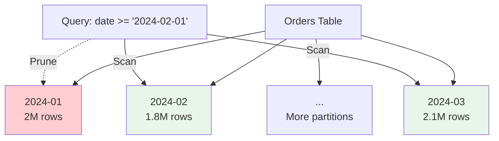

# Partitioned Tables

**Category:** Schema Patterns
**Impact:** Critical - Enables partition pruning (10-100x speedup)
**Complexity:** Medium

## Overview

Partitioned tables divide large tables into smaller, manageable pieces called partitions based on column values. Each partition can be queried independently, enabling parallel processing and partition pruning. This is essential for managing large datasets efficiently.

## Partitioning Strategies



### Range Partitioning

Partition by value ranges, typically used for time-series or sequential data:

```sql
CREATE TABLE orders (
    order_id BIGINT,
    customer_id INTEGER,
    order_date DATE,
    total DECIMAL(10,2)
)
PARTITION BY RANGE (order_date) (
    PARTITION orders_2023_q1 VALUES LESS THAN ('2023-04-01'),
    PARTITION orders_2023_q2 VALUES LESS THAN ('2023-07-01'),
    PARTITION orders_2023_q3 VALUES LESS THAN ('2023-10-01'),
    PARTITION orders_2023_q4 VALUES LESS THAN ('2024-01-01'),
    PARTITION orders_2024_q1 VALUES LESS THAN ('2024-04-01')
);
```

**Best for:**
- Time-series data (dates, timestamps)
- Sequential IDs
- Numeric ranges (age groups, salary bands)

**Pruning quality:** Excellent (90-99% of partitions eliminated for range queries)

### Hash Partitioning

Partition by hash of column value, distributes data evenly:

```sql
CREATE TABLE users (
    user_id BIGINT,
    email VARCHAR(255),
    created_at TIMESTAMP
)
PARTITION BY HASH (user_id)
PARTITIONS 16;
```

**Best for:**
- Tenant isolation (multi-tenant SaaS)
- User data (even distribution)
- Sharding keys

**Pruning quality:** Perfect (100% for equality predicates)

### List Partitioning

Partition by discrete values:

```sql
CREATE TABLE events (
    event_id BIGINT,
    region VARCHAR(10),
    event_type VARCHAR(50),
    created_at TIMESTAMP
)
PARTITION BY LIST (region) (
    PARTITION events_us VALUES IN ('US', 'CA', 'MX'),
    PARTITION events_eu VALUES IN ('UK', 'DE', 'FR', 'ES'),
    PARTITION events_apac VALUES IN ('JP', 'CN', 'IN', 'AU'),
    PARTITION events_other VALUES IN (DEFAULT)
);
```

**Best for:**
- Categorical data (regions, countries, statuses)
- Enum-like columns
- Fixed value sets

**Pruning quality:** Perfect (100% for IN lists)

### Composite Partitioning

Multiple levels of partitioning:

```sql
CREATE TABLE sensor_readings (
    sensor_id INTEGER,
    reading_time TIMESTAMP,
    temperature FLOAT,
    humidity FLOAT
)
PARTITION BY RANGE (reading_time)
SUBPARTITION BY HASH (sensor_id) SUBPARTITIONS 4 (
    PARTITION readings_2024_01 VALUES LESS THAN ('2024-02-01'),
    PARTITION readings_2024_02 VALUES LESS THAN ('2024-03-01'),
    -- ...
);
```

**Result:** 12 months × 4 hash partitions = 48 total partitions

**Best for:**
- Multi-tenant time-series
- Geographic + temporal data
- Hierarchical data organization

## Ra Optimization with Partitions

### Partition Pruning

$$
\sigma_{p}(R) \rightarrow \bigcup_{i \in \text{matching}(p, R)} \sigma_{p}(R_i)
$$

Only scan partitions where predicate $p$ might match.

```sql
-- Only scans Q1 2024 partition
SELECT * FROM orders
WHERE order_date >= '2024-01-01' AND order_date < '2024-04-01';
```

### Partition-Wise Joins

$$
R \bowtie S \rightarrow \bigcup_{i=1}^{P} (R_i \bowtie S_i)
$$

Join matching partitions locally when both tables partitioned on join key.

```sql
-- Both tables hash-partitioned on customer_id
SELECT o.order_id, c.customer_name
FROM orders o
JOIN customers c ON o.customer_id = c.customer_id;
```

### Parallel Partition Scans

$$
\text{scan}(R) \rightarrow \bigcup_{i=1}^{P} \text{scan}(R_i) \quad \text{in parallel}
$$

Each partition scanned by separate worker.

## Providing Partition Metadata to Ra

```rust
use ra_core::{PartitionInfo, PartitionStrategy, PartitionDef};

// Range partitioning
let partitions = PartitionInfo {
    strategy: PartitionStrategy::Range {
        column: "order_date".into(),
    },
    partition_count: 48,
    partitions: vec![
        PartitionDef {
            id: "orders_2024_01",
            bounds: Some(("2024-01-01".into(), "2024-02-01".into())),
            location: "/data/orders_2024_01",
            row_count: 2_500_000,
            size_bytes: 500_000_000,
        },
        // ... more partitions
    ],
};

optimizer.set_partition_info("orders", partitions);
```

## Examples

### Time-Series Data (Range)

```sql
-- IoT sensor data: 1B readings/month
CREATE TABLE sensor_readings (
    sensor_id INTEGER,
    reading_time TIMESTAMP,
    value FLOAT
)
PARTITION BY RANGE (reading_time) INTERVAL '1 month';
```

**Query optimization:**
```sql
-- Last 7 days: Scans 1 partition instead of 48
SELECT sensor_id, AVG(value)
FROM sensor_readings
WHERE reading_time >= CURRENT_DATE - INTERVAL '7 days'
GROUP BY sensor_id;
```

**Speedup:** 48x from partition pruning + 12x from parallelism = **576x total**

### Multi-Tenant SaaS (Hash)

```sql
CREATE TABLE tenant_events (
    event_id BIGINT,
    tenant_id UUID,
    event_type VARCHAR(50),
    created_at TIMESTAMP
)
PARTITION BY HASH (tenant_id) PARTITIONS 32;
```

**Benefits:**
- Tenant isolation (each tenant's data in predictable partition)
- Perfect partition pruning for single-tenant queries
- Load balancing across partitions

```sql
-- Scans only 1 of 32 partitions
SELECT * FROM tenant_events
WHERE tenant_id = 'acme-corp-uuid'
  AND created_at >= '2024-01-01';
```

### Geographic Distribution (List)

```sql
CREATE TABLE sales_transactions (
    transaction_id BIGINT,
    country_code CHAR(2),
    amount DECIMAL(10,2),
    created_at TIMESTAMP
)
PARTITION BY LIST (country_code) (
    PARTITION sales_north_america VALUES IN ('US', 'CA', 'MX'),
    PARTITION sales_europe VALUES IN ('UK', 'DE', 'FR', 'ES', 'IT'),
    PARTITION sales_asia VALUES IN ('CN', 'JP', 'IN', 'KR', 'SG'),
    PARTITION sales_other VALUES IN (DEFAULT)
);
```

**Regional queries:**
```sql
-- Scans only EU partition
SELECT SUM(amount) FROM sales_transactions
WHERE country_code IN ('UK', 'DE', 'FR');
```

## Partition Maintenance

### Adding Partitions

```sql
-- Add new month partition
ALTER TABLE orders
ADD PARTITION orders_2024_05 VALUES LESS THAN ('2024-06-01');
```

Ra automatically includes new partition in future queries.

### Dropping Old Partitions

```sql
-- Drop data older than 2 years
ALTER TABLE orders
DROP PARTITION orders_2022_01;
```

**Much faster than DELETE:** O(1) metadata operation vs full table scan.

### Archiving Partitions

```sql
-- Move old partition to cold storage
ALTER TABLE orders
DETACH PARTITION orders_2022_q1
ARCHIVE TO '/archive/orders_2022_q1';
```

Ra can query archived partitions if metadata retained.

## Partition Sizing

### Too Small (1000s of partitions)

**Problems:**
- High metadata overhead
- Coordinator bottleneck
- Excessive parallelism

**Fix:** Consolidate partitions (e.g., daily → weekly)

### Too Large (few big partitions)

**Problems:**
- Poor pruning effectiveness
- Limited parallelism
- Slow partition scans

**Fix:** Split partitions (e.g., monthly → weekly)

### Optimal Size

**Rule of thumb:**
- **Time-series:** 1 week to 1 month of data per partition
- **Hash:** 10-100 partitions (match worker count)
- **List:** 5-20 categories per partition

**Target partition size:** 100MB - 10GB per partition

## Partition Skew

When partitions have vastly different sizes:

```
Partition 2024-01: 100K rows (balanced)
Partition 2024-02: 150K rows (balanced)
Partition 2024-12: 5M rows (holiday traffic - skewed)
```

**Problem:** One worker processes 97% of data while others are idle.

**Solutions:**
1. **Sub-partition hot partitions:**
   ```sql
   PARTITION BY RANGE (order_date)
   SUBPARTITION BY HASH (order_id) SUBPARTITIONS 10;
   ```

2. **Dynamic splitting:** Ra splits large partitions at runtime

3. **Temporal adjustment:** Use smaller intervals for busy periods

## Cost Model

### Full Table Scan

$$
\text{Cost}_{\text{full}} = B(R) \times C_{\text{io}} + |R| \times C_{\text{cpu}}
$$

### Partitioned Scan with Pruning

$$
\text{Cost}_{\text{pruned}} = \frac{B(R)}{P} \times P_{\text{match}} \times C_{\text{io}} + \frac{|R|}{P} \times P_{\text{match}} \times C_{\text{cpu}}
$$

Where:
- $P$ = total partitions
- $P_{\text{match}}$ = matching partitions

**Speedup:** $\frac{P}{P_{\text{match}}}$ (e.g., 48 partitions, 1 match = 48x)

### Parallel Scan

$$
\text{Cost}_{\text{parallel}} = \frac{\text{Cost}_{\text{pruned}}}{W} + C_{\text{coord}}
$$

Where $W$ = worker count.

## Common Pitfalls

### ❌ Wrong Partition Key

```sql
-- Partitioned by customer_id, but queries filter on order_date
CREATE TABLE orders (...) PARTITION BY HASH (customer_id);

SELECT * FROM orders WHERE order_date >= '2024-01-01';
-- No pruning possible!
```

**Fix:** Partition by the most commonly filtered column.

### ❌ Too Many Partitions

```sql
-- Daily partitions for 10 years = 3650 partitions
PARTITION BY RANGE (created_at) INTERVAL '1 day';
```

**Problems:** Metadata overhead, slow planning.

**Fix:** Use monthly or weekly partitions for long retention.

### ❌ Non-Aligned Partition Boundaries

```sql
-- orders: monthly partitions
-- shipments: weekly partitions
-- Cannot do partition-wise join
```

**Fix:** Align partition boundaries for frequently joined tables.

## Testing Partitioned Tables

```rust
#[test]
fn test_partition_pruning() {
    let sql = "
        SELECT * FROM orders
        WHERE order_date >= '2024-01-01' AND order_date < '2024-02-01'
    ";

    let plan = optimize(sql)
        .with_partitions("orders", range_partitions("order_date", 48))
        .build();

    // Verify only 1 partition scanned
    assert_eq!(plan.partitions_to_scan(), vec!["orders_2024_01"]);
    assert_eq!(plan.partitions_pruned(), 47);

    // Verify speedup estimate
    let full_scan_cost = plan.estimate_cost_full_scan();
    let actual_cost = plan.estimate_cost();
    assert!(actual_cost < full_scan_cost / 40.0); // >40x speedup
}
```

## Performance Impact

| Table Size | Partitions | Query Filter | Pruned Partitions | Speedup |
|------------|------------|--------------|-------------------|---------|
| 1TB | 12 (monthly) | Last month | 11 | 12x |
| 5TB | 48 (monthly) | Q1 2024 | 45 | 16x (pruning + parallelism) |
| 10TB | 100 (daily) | Last 7 days | 93 | 14x |
| 50TB | 16 (hash) | tenant_id = 'x' | 15 | 16x |

## References

- [Partition Pruning Pattern](../distributed-patterns/partition-pruning.md)
- [Union Over Partitions](../distributed-patterns/union-over-partitions.md)
- [Partition-Wise Joins](../distributed-patterns/co-located-joins.md)
- [Time-Series Queries](../query-patterns/temporal/time-series.md)

## Related Patterns

- [Star Schema](star-schema.md) - Often uses partitioned fact tables
- [Sharded Tables](sharded-tables.md) - Distributed variant of partitioning
- [Temporal Tables](temporal-tables.md) - History partitioning
