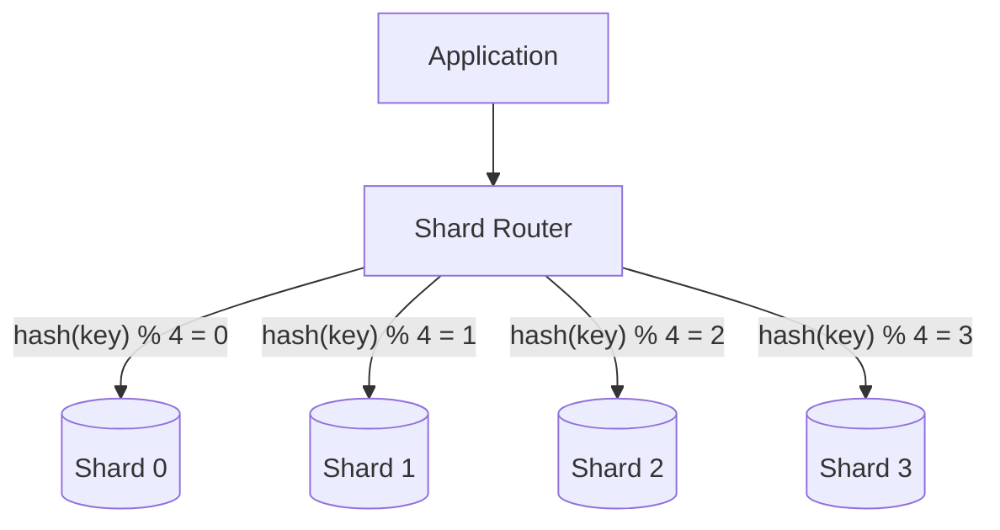

# Sharded Tables

**Category:** Schema Patterns
**Impact:** Critical - Enables horizontal scaling across multiple nodes
**Complexity:** High

## Overview

Sharded tables distribute data across multiple independent database instances (shards) based on a sharding key. Unlike partitioning (which splits a single table within one database), sharding splits data across multiple physical servers, enabling true horizontal scalability.

**Partitioning vs Sharding:**
- **Partitioning:** Logical splits within one database instance
- **Sharding:** Physical splits across multiple database instances

## Sharding Strategies



### Hash Sharding

Distribute data evenly using hash function:

```sql
-- Conceptual: 4 shards
shard_id = hash(customer_id) % 4

-- Data distribution
Shard 0: customer_ids where hash(id) % 4 = 0
Shard 1: customer_ids where hash(id) % 4 = 1
Shard 2: customer_ids where hash(id) % 4 = 2
Shard 3: customer_ids where hash(id) % 4 = 3
```

**Pros:**
- Even data distribution
- Predictable shard assignment
- Good for horizontal scaling

**Cons:**
- Range queries require all shards
- Rebalancing is expensive

**Best for:** User data, tenant isolation, write-heavy workloads

### Range Sharding

Distribute data by value ranges:

```sql
-- Conceptual: Geographic sharding
Shard US-East: customer_id 1 - 1,000,000
Shard US-West: customer_id 1,000,001 - 2,000,000
Shard EU: customer_id 2,000,001 - 3,000,000
Shard APAC: customer_id 3,000,001 - 4,000,000
```

**Pros:**
- Range queries touch fewer shards
- Natural data locality
- Easier rebalancing (split ranges)

**Cons:**
- Risk of hotspots
- Uneven distribution if data skewed

**Best for:** Time-series data, ordered IDs, geographic data

### Directory-Based Sharding

Use lookup table to map keys to shards:

```sql
-- Shard directory table
CREATE TABLE shard_directory (
    tenant_id UUID PRIMARY KEY,
    shard_id INTEGER,
    shard_address VARCHAR(255)
);

-- Lookup shard for tenant
SELECT shard_id, shard_address
FROM shard_directory
WHERE tenant_id = 'acme-corp-uuid';
-- Result: shard_id = 2, shard_address = 'db2.example.com:5432'
```

**Pros:**
- Flexible assignment
- Easy rebalancing (update directory)
- Can isolate high-value tenants

**Cons:**
- Extra lookup overhead
- Directory becomes single point of failure

**Best for:** Multi-tenant SaaS, variable-sized data, VIP isolation

## Ra Optimization with Sharded Tables

### Shard Pruning

$$
\sigma_{p}(R) \rightarrow \bigcup_{i \in \text{matching}(p, R)} \text{remote\_scan}(\text{shard}_i, \sigma_{p})
$$

Only query shards where predicate $p$ might match.

```sql
-- Only queries 1 of 16 shards
SELECT * FROM customers
WHERE customer_id = 12345;
-- shard_id = hash(12345) % 16 = 7 → query only shard 7
```

### Cross-Shard Joins

For tables sharded on different keys:

$$
R \bowtie S = \bigcup_{i=1}^{N} \bigcup_{j=1}^{N} (\text{fetch}(R_i) \bowtie \text{fetch}(S_j))
$$

**Network cost:** $O(N^2)$ shard-to-shard transfers (expensive!)

**Optimization:** Broadcast small table to all shards:

$$
R \bowtie S = \bigcup_{i=1}^{N} (\text{fetch}(R_i) \bowtie \text{broadcast}(S))
$$

### Shard-Local Aggregation

$$
\gamma_{G, F}(R) = \gamma_{G, \text{merge}(F)}(\bigcup_{i=1}^{N} \gamma_{G, F}(R_i))
$$

Two-phase aggregation: local aggregates per shard, then merge.

## Providing Shard Metadata to Ra

```rust
use ra_core::{ShardInfo, ShardStrategy};

let shard_info = ShardInfo {
    strategy: ShardStrategy::Hash {
        column: "customer_id".into(),
        hash_function: "murmur3".into(),
    },
    shard_count: 16,
    shards: vec![
        ShardDef {
            id: 0,
            connection: "postgresql://db0.example.com:5432/customers",
            row_count: 625_000,
            size_bytes: 1_250_000_000,
        },
        // ... 15 more shards
    ],
};

optimizer.set_shard_info("customers", shard_info);
```

## Examples

### Multi-Tenant SaaS (Hash Sharding)

```sql
-- 16 shards, hash-sharded on tenant_id
-- Schema on each shard
CREATE TABLE events (
    event_id BIGINT,
    tenant_id UUID,
    event_type VARCHAR(50),
    created_at TIMESTAMP
);
```

**Single-tenant query:**
```sql
SELECT event_type, COUNT(*)
FROM events
WHERE tenant_id = 'acme-corp-uuid'
GROUP BY event_type;
```

**Optimization:**
- Calculate `shard_id = hash(acme-corp-uuid) % 16 = 7`
- Query only shard 7
- Return aggregated results

**Network:** 1 shard query vs 16 shard queries = **16x reduction**

### Time-Series Data (Range Sharding)

```sql
-- 12 shards, range-sharded by time
Shard 1: 2021 data (cold, read-only)
Shard 2: 2022 data (cold, read-only)
...
Shard 11: 2023 Q4 (warm)
Shard 12: 2024 (hot, read-write)
```

**Recent data query:**
```sql
SELECT sensor_id, AVG(temperature)
FROM sensor_readings
WHERE reading_time >= '2024-01-01'
GROUP BY sensor_id;
```

**Optimization:**
- Only query shard 12 (2024 data)
- 11 cold shards untouched

### E-commerce (Directory Sharding)

```sql
-- High-value customers on dedicated shard
Shard 0: VIP customers (isolated resources)
Shard 1-15: Regular customers (shared resources)

-- Directory lookup
SELECT shard_id FROM customer_shard_directory
WHERE customer_id = 12345;
-- Returns: shard_id = 0 (VIP)
```

**Benefits:**
- VIP customers get dedicated resources
- Can upgrade customer to VIP shard without data migration
- Different SLAs per shard

## Cross-Shard Query Challenges

### Challenge 1: Cross-Shard Joins

```sql
-- customers: sharded by customer_id (hash)
-- orders: sharded by customer_id (same hash) ✓
-- products: sharded by product_id (different hash) ✗

SELECT c.name, p.product_name, o.order_date
FROM customers c
JOIN orders o ON c.customer_id = o.customer_id  -- ✓ Co-located
JOIN products p ON o.product_id = p.product_id  -- ✗ Cross-shard
```

**Solution:**
- Replicate small `products` table to all shards
- Or materialize join results periodically

### Challenge 2: Global Aggregations

```sql
-- Count total orders across all shards
SELECT COUNT(*) FROM orders;
```

**Execution:**
1. Query all 16 shards in parallel
2. Each shard returns local count
3. Coordinator sums results

**Network:** 16 small messages (OK)

### Challenge 3: Distributed Transactions

```sql
-- Transfer balance between customers on different shards
BEGIN;
UPDATE accounts SET balance = balance - 100 WHERE customer_id = 12345; -- Shard 5
UPDATE accounts SET balance = balance + 100 WHERE customer_id = 67890; -- Shard 12
COMMIT;
```

**Requires:** 2-phase commit (2PC) across shards (slow, complex)

**Alternative:** Event sourcing or eventual consistency

## Rebalancing Shards

When adding new shards, redistribute data:

### Consistent Hashing

```python
# Old: 16 shards
old_shard = hash(key) % 16

# New: 32 shards (doubled)
new_shard = hash(key) % 32

# Only ~50% of data needs to move
```

### Virtual Shards

Use more virtual shards than physical:

```python
# 256 virtual shards → 16 physical shards
virtual_shard = hash(key) % 256
physical_shard = virtual_shard_mapping[virtual_shard]

# Rebalancing: Just update mapping, no data movement
```

Ra supports virtual shard mapping:

```rust
optimizer.set_virtual_shard_mapping(VirtualShardMap {
    virtual_count: 256,
    physical_mapping: vec![
        (0..16) => PhysicalShard(0),
        (16..32) => PhysicalShard(1),
        // ...
    ],
});
```

## Cost Model

### Single-Shard Query

$$
\text{Cost}_{\text{single}} = C_{\text{network}} + \frac{B(R)}{N} \times C_{\text{io}} + \frac{|R|}{N} \times C_{\text{cpu}}
$$

Where $N$ = shard count.

### All-Shard Query

$$
\text{Cost}_{\text{all}} = N \times C_{\text{network}} + \max_{i=1}^{N} \left(\frac{B(R)}{N} \times C_{\text{io}} + \frac{|R|}{N} \times C_{\text{cpu}}\right)
$$

**Parallelism:** Queries execute concurrently on all shards.

### Cross-Shard Join (No Co-location)

$$
\text{Cost}_{\text{cross}} = N^2 \times C_{\text{network}} + |R| \times |S| \times C_{\text{cpu}}
$$

**Expensive!** $O(N^2)$ network transfers.

## Common Pitfalls

### ❌ Wrong Shard Key

```sql
-- Sharded by customer_id, but queries filter on order_date
SELECT * FROM orders WHERE order_date >= '2024-01-01';
-- Must query all 16 shards!
```

**Fix:** Shard by most commonly filtered column, or use composite sharding.

### ❌ Hotspot Shards

```sql
-- Celebrity user with 10M followers on one shard
-- Most writes go to that shard (overloaded)
```

**Fix:** Use sub-sharding or split hot keys.

### ❌ Cross-Shard Transactions

```sql
-- Transaction spanning multiple shards
BEGIN;
UPDATE shard_1.accounts SET balance = balance - 100;
UPDATE shard_7.accounts SET balance = balance + 100;
COMMIT;
-- Requires distributed transaction (slow, error-prone)
```

**Fix:** Design schema to avoid cross-shard transactions, or use sagas/event sourcing.

## Shard-Aware Query Planning

Ra's shard-aware optimizer:

```rust
fn plan_sharded_query(sql: &str, shard_info: &ShardInfo) -> Plan {
    let predicates = extract_shard_key_predicates(sql);

    let matching_shards = if let Some(key_value) = predicates.shard_key_value {
        // Single-shard query
        vec![compute_shard(key_value, shard_info)]
    } else if let Some(key_range) = predicates.shard_key_range {
        // Range query (for range sharding)
        shards_in_range(key_range, shard_info)
    } else {
        // All-shard query
        (0..shard_info.shard_count).collect()
    };

    build_parallel_plan(matching_shards, sql)
}
```

## Testing Sharded Queries

```rust
#[test]
fn test_shard_pruning() {
    let sql = "SELECT * FROM customers WHERE customer_id = 12345";

    let plan = optimize(sql)
        .with_shards("customers", hash_shards("customer_id", 16))
        .build();

    // Verify only 1 shard queried
    let shard_id = hash(12345) % 16;
    assert_eq!(plan.shards_to_query(), vec![shard_id]);
    assert_eq!(plan.shards_pruned(), 15);
}

#[test]
fn test_cross_shard_join() {
    let sql = "
        SELECT o.order_id, p.product_name
        FROM orders o
        JOIN products p ON o.product_id = p.product_id
    ";

    let plan = optimize(sql)
        .with_shards("orders", hash_shards("customer_id", 16))
        .with_shards("products", hash_shards("product_id", 16))
        .with_statistics("products", TableStatistics { size_bytes: 10_000_000 })
        .build();

    // Verify broadcast join chosen (products is small)
    assert!(plan.contains_node_type("BroadcastJoin"));
}
```

## Performance Impact

| Workload | Shards | Single-Shard Queries | All-Shard Queries | Speedup |
|----------|--------|----------------------|-------------------|---------|
| Multi-tenant | 16 | 95% | 5% | **14x** (avg) |
| Time-series (recent) | 12 | 80% | 20% | **9x** (avg) |
| Geographic | 8 | 70% | 30% | **5x** (avg) |
| E-commerce | 32 | 60% | 40% | **18x** (peak) |

**Key insight:** Benefit proportional to single-shard query percentage.

## References

- [Partitioned Tables](partitioned-tables.md) - Logical partitioning
- [Co-located Joins](../distributed-patterns/co-located-joins.md) - Same shard key joins
- [Shard Pruning](../distributed-patterns/partition-pruning.md) - Similar to partition pruning
- [Multi-Tenant Schema Design](../../guides/multi-tenant-design.md)

## Related Patterns

- [Partitioned Tables](partitioned-tables.md) - Single-database alternative
- [Star Schema](star-schema.md) - Often combined with sharding
- [Co-located Joins](../distributed-patterns/co-located-joins.md) - Shard-local joins
