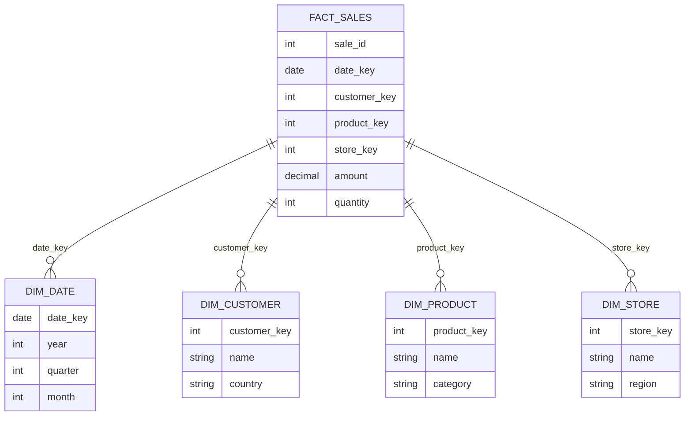

# Star Schema

## Description

Data warehouse design with central fact table surrounded by dimension tables. Optimized for analytical queries with large fact tables and smaller, denormalized dimensions.

## Schema Structure



### Typical Sizes
- **Fact table:** Billions of rows (transaction events)
- **Dimension tables:** Thousands to millions of rows (descriptive attributes)

## Relational Algebra

Star join pattern:

$$
\text{fact} \bowtie_{\theta_1} \text{dim}_1 \bowtie_{\theta_2} \text{dim}_2 \bowtie \cdots \bowtie_{\theta_n} \text{dim}_n
$$

With aggregation:

$$
\gamma_{G; F}(\text{fact} \bowtie \text{dim}_1 \bowtie \cdots \bowtie \text{dim}_n)
$$

## How Ra Optimizes

### 1. Dimension Table Order

**Rule:** `logical/star-join-reorder`

Join dimensions in order of:
1. **Smallest first** (after applying filters)
2. **Most selective predicates**
3. **Build hash tables on dimensions**

$$
\text{Cost}_{\text{star}} = \sum_{i=1}^{n} (C_{\text{build}}(\text{dim}_i)) + C_{\text{probe}}(\text{fact})
$$

### 2. Predicate Pushdown to Dimensions

**Rule:** `logical/pushdown/filter-through-join`

Push dimension predicates before joining to fact:

$$
\sigma_{\theta_{\text{dim}}}(\text{fact} \bowtie \text{dim}) \equiv \text{fact} \bowtie \sigma_{\theta_{\text{dim}}}(\text{dim})
$$

Reduces dimension table size before expensive fact join.

### 3. Dimension Table Elimination

**Rule:** `logical/star-join-dimension-elimination`

If no dimension columns are referenced (only join key), eliminate dimension:

$$
\pi_{\text{fact.*}}(\text{fact} \bowtie_{\text{fk=pk}} \text{dim}) \equiv \text{fact}
$$

### 4. Bitmap Filtering

**Rule:** `physical/star-join-bitmap-filter`

Create Bloom filters from filtered dimensions, apply to fact table:

$$
\text{fact} \bowtie \sigma_{\theta}(\text{dim}) \rightarrow \sigma_{\text{BloomFilter}}(\text{fact}) \bowtie \sigma_{\theta}(\text{dim})
$$

Reduces fact table scan before join.

## Statistics API

```rust
use ra_optimizer::{Statistics, ColumnStatistics, Index};

// Fact table
optimizer.add_table_stats("fact_sales", Statistics {
    row_count: 1_000_000_000,  // 1 billion sales
    block_count: 10_000_000,
    average_row_width: 50,
});

optimizer.add_column_stats("fact_sales", "date_id", ColumnStatistics {
    distinct_count: 2_000,  // ~5 years of days
    null_fraction: 0.0,
});

optimizer.add_column_stats("fact_sales", "product_id", ColumnStatistics {
    distinct_count: 100_000,
    null_fraction: 0.0,
});

optimizer.add_column_stats("fact_sales", "customer_id", ColumnStatistics {
    distinct_count: 5_000_000,
    null_fraction: 0.0,
});

optimizer.add_column_stats("fact_sales", "amount", ColumnStatistics {
    distinct_count: 100_000,
    null_fraction: 0.0,
    min_value: Some(0.01),
    max_value: Some(99999.99),
});

// Dimension tables
optimizer.add_table_stats("dim_date", Statistics {
    row_count: 2_000,
    block_count: 20,
});

optimizer.add_table_stats("dim_product", Statistics {
    row_count: 100_000,
    block_count: 1_000,
});

optimizer.add_table_stats("dim_customer", Statistics {
    row_count: 5_000_000,
    block_count: 50_000,
});

// Indexes on fact table foreign keys
optimizer.add_index("fact_sales", Index {
    name: "fact_sales_date_idx",
    columns: vec!["date_id"],
    index_type: IndexType::BTree,
});
```

## Examples

### Basic Star Query

```sql
SELECT
  d.year,
  p.category,
  SUM(f.amount) as total_sales,
  COUNT(*) as transaction_count
FROM fact_sales f
JOIN dim_date d ON f.date_id = d.id
JOIN dim_product p ON f.product_id = p.id
JOIN dim_customer c ON f.customer_id = c.id
WHERE d.year = 2024
  AND p.category = 'Electronics'
  AND c.country = 'USA'
GROUP BY d.year, p.category;
```

**Relational Algebra:**

$$
\gamma_{\text{year, category}; \text{SUM}(\text{amount}), \text{COUNT}(*)}(
  \text{fact} \bowtie \sigma_{\text{year=2024}}(\text{dim\_date})
  \bowtie \sigma_{\text{category='Electronics'}}(\text{dim\_product})
  \bowtie \sigma_{\text{country='USA'}}(\text{dim\_customer})
)
$$

**Ra Plan:**

```
HashAggregate [year, category]
  Aggregates: SUM(amount), COUNT(*)
  HashJoin [f.customer_id = c.id]
    HashJoin [f.product_id = p.id]
      HashJoin [f.date_id = d.id]
        SeqScan [fact_sales f]
          BitmapFilter [date_bloom, product_bloom, customer_bloom]
        SeqScan [dim_date d]
          Filter: year = 2024
          (365 rows)
      SeqScan [dim_product p]
        Filter: category = 'Electronics'
        (10K rows)
    SeqScan [dim_customer c]
      Filter: country = 'USA'
      (1M rows)
```

**Join Order Rationale:**
1. dim_date filtered first (smallest: 365 rows)
2. dim_product next (10K rows)
3. dim_customer last (1M rows)

**Bloom Filter Optimization:**
- Reduces fact table scan from 1B to ~10M rows (99% filtered)

### Time-Series Star Query

```sql
SELECT
  d.year,
  d.quarter,
  d.month,
  SUM(f.amount) as revenue
FROM fact_sales f
JOIN dim_date d ON f.date_id = d.id
WHERE d.date BETWEEN '2023-01-01' AND '2024-12-31'
GROUP BY d.year, d.quarter, d.month
ORDER BY d.year, d.quarter, d.month;
```

**Ra Plan:**

```
Sort [year, quarter, month]
  HashAggregate [year, quarter, month]
    Aggregates: SUM(amount)
    HashJoin [f.date_id = d.id]
      SeqScan [fact_sales f]
      SeqScan [dim_date d]
        Filter: date BETWEEN '2023-01-01' AND '2024-31'
        (730 rows for 2 years)
```

**Optimization:** Small dimension (730 rows) builds hash table, fact probes.

### Multi-Fact Star Query

```sql
SELECT
  d.date,
  p.product_name,
  COALESCE(SUM(sales.amount), 0) as sales,
  COALESCE(SUM(returns.amount), 0) as returns,
  COALESCE(SUM(sales.amount), 0) - COALESCE(SUM(returns.amount), 0) as net
FROM dim_date d
CROSS JOIN dim_product p
LEFT JOIN fact_sales sales ON sales.date_id = d.id AND sales.product_id = p.id
LEFT JOIN fact_returns returns ON returns.date_id = d.id AND returns.product_id = p.id
WHERE d.year = 2024 AND p.category = 'Electronics'
GROUP BY d.date, p.product_name;
```

**Ra Plan:**

```
HashAggregate [date, product_name]
  Aggregates: SUM(sales.amount), SUM(returns.amount)
  HashJoin [LEFT, returns.date_id = d.id AND returns.product_id = p.id]
    HashJoin [LEFT, sales.date_id = d.id AND sales.product_id = p.id]
      NestedLoopJoin [CROSS]
        SeqScan [dim_date d]
          Filter: year = 2024
        SeqScan [dim_product p]
          Filter: category = 'Electronics'
      SeqScan [fact_sales sales]
    SeqScan [fact_returns returns]
```

## Design Patterns

### Degenerate Dimensions

Dimension attributes stored directly in fact table:

```sql
CREATE TABLE fact_sales (
  date_id INT,
  product_id INT,
  customer_id INT,
  invoice_number VARCHAR(20),  -- Degenerate dimension
  amount DECIMAL(10,2)
);
```

No separate dim_invoice table needed.

### Junk Dimensions

Low-cardinality flags combined into single dimension:

```sql
CREATE TABLE dim_transaction_flags (
  id INT PRIMARY KEY,
  is_online BOOLEAN,
  is_promotion BOOLEAN,
  payment_type VARCHAR(20)
);

-- Instead of 3 separate dimension tables
```

### Role-Playing Dimensions

Single dimension used multiple times:

```sql
SELECT
  order_date.date,
  ship_date.date,
  SUM(f.amount)
FROM fact_orders f
JOIN dim_date order_date ON f.order_date_id = order_date.id
JOIN dim_date ship_date ON f.ship_date_id = ship_date.id
GROUP BY order_date.date, ship_date.date;
```

Ra creates two hash tables from dim_date.

## Performance Characteristics

| Fact Rows | Dimensions | Query Time | Optimization |
|-----------|-----------|-----------|--------------|
| < 1M | Any | < 100ms | In-memory hash joins |
| 1M-100M | < 5 | 100ms-1s | Bitmap filters, partitioning |
| 100M-10B | < 5 | 1-10s | Parallel scan, columnar storage |
| > 10B | < 5 | 10s-1m | Distributed execution, pre-aggregation |

## Index Strategies

### Fact Table Indexes

1. **Date FK Index** - Most selective for time-bound queries
2. **Composite Index** - Common filter combinations
3. **No PK needed** - Fact tables rarely have natural primary key

```sql
CREATE INDEX fact_sales_date_idx ON fact_sales(date_id);
CREATE INDEX fact_sales_date_product_idx ON fact_sales(date_id, product_id);
```

### Dimension Table Indexes

1. **Primary Key** - Clustered index
2. **Attribute Indexes** - For common filters

```sql
CREATE INDEX dim_product_category_idx ON dim_product(category);
CREATE INDEX dim_customer_country_idx ON dim_customer(country);
```

## See Also

- [Snowflake Schema](snowflake-schema.md) - Normalized dimensions
- [Denormalized Schema](denormalized.md) - Single wide table
- [Partitioned Tables](partitioned-tables.md) - Fact table partitioning
- [Full Table Aggregation](../query-patterns/olap/full-table-aggregation.md) - GROUP BY optimization
- [Inner Joins](../query-patterns/joins/inner-join.md) - Join methods
- [Distributed Patterns: Co-located Joins](../distributed-patterns/co-located-joins.md)
- [Rule: Star Join Optimization](../../rules/logical/star-join-optimization.md)

## References

- Kimball & Ross, *The Data Warehouse Toolkit*, 3rd ed., 2013
- O'Neil & O'Neil, "Star Schema Benchmark", *TPCTC 2009*
- Chaudhuri & Dayal, "An Overview of Data Warehousing and OLAP Technology", *SIGMOD Record 1997*
