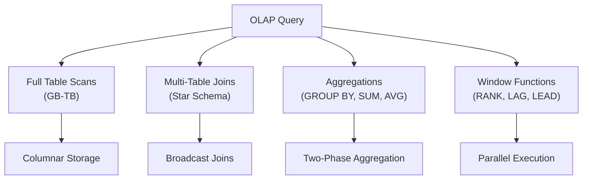

# OLAP Workload

**Category:** Workload Patterns
**Impact:** Critical - Requires different optimization strategy than OLTP
**Complexity:** High

## Overview

OLAP (Online Analytical Processing) workloads are characterized by complex, long-running analytical queries that scan large portions of data, perform aggregations, and support business intelligence and reporting. Unlike OLTP workloads that focus on transactional consistency and low latency, OLAP prioritizes throughput and query complexity.

## Characteristics



| Aspect | OLAP | OLTP (comparison) |
|--------|------|-------------------|
| **Query type** | Complex analytical | Simple transactional |
| **Query duration** | Seconds to minutes | Milliseconds |
| **Data accessed** | Large scans (GB-TB) | Point lookups (KB) |
| **Concurrency** | Low (10-100 queries) | High (1000s of transactions) |
| **Update frequency** | Batch loads | Real-time updates |
| **Schema** | Denormalized (star/snowflake) | Normalized (3NF) |
| **Indexes** | Fewer, columnar | Many B-tree indexes |
| **Joins** | Many, large tables | Few, small tables |
| **Aggregation** | Extensive GROUP BY | Minimal |

## SQL Patterns

### Aggregation Queries

```sql
-- Compute total sales by region and quarter
SELECT
    region,
    EXTRACT(QUARTER FROM order_date) as quarter,
    SUM(amount) as total_sales,
    COUNT(DISTINCT customer_id) as unique_customers,
    AVG(amount) as avg_order_value
FROM sales_fact
WHERE order_date >= '2023-01-01'
GROUP BY region, EXTRACT(QUARTER FROM order_date)
ORDER BY region, quarter;
```

**Characteristics:**
- Scans millions/billions of rows
- Multiple aggregation functions
- GROUP BY with multiple columns
- Date/time extraction functions

### Multi-Table Analytical Joins

```sql
-- Star schema join: Fact table + 5 dimension tables
SELECT
    d.date,
    p.product_name,
    p.category,
    c.customer_segment,
    s.store_name,
    s.region,
    SUM(f.sales_amount) as revenue,
    SUM(f.quantity) as units_sold
FROM sales_fact f
JOIN date_dim d ON f.date_id = d.date_id
JOIN product_dim p ON f.product_id = p.product_id
JOIN customer_dim c ON f.customer_id = c.customer_id
JOIN store_dim s ON f.store_id = s.store_id
WHERE d.year = 2024
GROUP BY d.date, p.product_name, p.category, c.customer_segment, s.store_name, s.region;
```

**Characteristics:**
- Multiple joins (5-10 tables)
- Large fact table (billions of rows)
- Small dimension tables (thousands-millions)
- Broadcast join pattern

### Window Functions

```sql
-- Running totals and rankings
SELECT
    product_id,
    order_date,
    amount,
    SUM(amount) OVER (PARTITION BY product_id ORDER BY order_date) as running_total,
    ROW_NUMBER() OVER (PARTITION BY product_id ORDER BY amount DESC) as rank_in_product,
    LAG(amount) OVER (PARTITION BY product_id ORDER BY order_date) as prev_day_amount
FROM sales
WHERE order_date >= '2024-01-01';
```

**Characteristics:**
- Complex window specifications
- Multiple window functions
- Ordered processing within partitions

### Hierarchical Aggregations (ROLLUP/CUBE)

```sql
-- Sales summary with subtotals and grand total
SELECT
    region,
    product_category,
    YEAR(order_date) as year,
    SUM(amount) as total_sales
FROM sales
GROUP BY ROLLUP(region, product_category, YEAR(order_date));
```

**Characteristics:**
- Multiple aggregation levels
- Subtotals and grand totals
- Exponential combinations for CUBE

## Ra Optimization for OLAP

### Columnar Storage

$$
\text{Cost}_{\text{row}} = n \times w \times C_{\text{io}} \quad \text{vs} \quad \text{Cost}_{\text{col}} = n \times c \times C_{\text{io}}
$$

Where:
- $n$ = number of rows
- $w$ = width of row (all columns)
- $c$ = width of queried columns only

**Speedup:** $\frac{w}{c}$ (typically 5-10x for analytical queries)

```sql
-- Only reads 3 columns instead of all 20
SELECT product_id, SUM(amount), COUNT(*)
FROM sales
GROUP BY product_id;
```

### Partition Pruning

$$
\sigma_{p}(R) \rightarrow \bigcup_{i \in \text{matching}(p)} \sigma_{p}(R_i)
$$

Eliminate partitions that cannot contain matching data.

```sql
-- 5-year table, monthly partitions (60 total)
-- Only scans 3 partitions (Q1 2024)
SELECT SUM(amount) FROM sales
WHERE order_date >= '2024-01-01' AND order_date < '2024-04-01';
```

**Speedup:** 20x from partition pruning alone.

### Broadcast Joins (Dimension Tables)

$$
\text{fact} \bowtie \text{dim} \rightarrow \bigcup_{i=1}^{P} (\text{fact}_i \bowtie \text{broadcast}(\text{dim}))
$$

Replicate small dimension tables to all nodes processing fact table partitions.

**Network savings:** Avoids shuffling billions of fact table rows.

### Two-Phase Aggregation

$$
\gamma_{G, F}(R) = \gamma_{G, \text{merge}(F)}(\bigcup_{i=1}^{P} \gamma_{G, F}(R_i))
$$

Local aggregation per partition, then merge partial results.

**Network reduction:** 10,000x fewer rows transferred for low-cardinality GROUP BY.

### Predicate Pushdown

Push filters to storage layer:

```sql
-- Filter applied during Parquet/ORC file scan
SELECT product_id, SUM(amount)
FROM sales
WHERE amount > 100  -- <- Pushed to file reader
GROUP BY product_id;
```

**Speedup:** Only read matching rows from disk (10-100x reduction).

## Providing Workload Profile to Ra

```rust
use ra_core::WorkloadProfile;

optimizer.set_workload_profile(WorkloadProfile {
    workload_type: WorkloadType::OLAP,
    read_write_ratio: 0.99,  // 99% reads
    avg_query_duration: Duration::from_secs(30),
    concurrency: 20,
    data_scanned_per_query: 100_000_000_000,  // 100GB per query
    aggregation_heavy: true,
    join_heavy: true,
    window_functions_common: true,
});

// Ra adapts:
// - Prefers columnar scans
// - Uses broadcast joins for dimension tables
// - Enables two-phase aggregation
// - Allocates more memory for hash tables
// - Uses larger prefetch buffers
```

## Cost Model Adjustments

### OLAP Cost Model

$$
\begin{align}
\text{Cost}_{\text{OLAP}} &= \text{Cost}_{\text{scan}} + \text{Cost}_{\text{join}} + \text{Cost}_{\text{agg}} \\
&= \frac{B(R)}{P} \times C_{\text{io}} + |R| \times C_{\text{cpu}} \\
&\quad + \frac{|R| \times |S|}{P} \times C_{\text{hash}} \\
&\quad + |\text{groups}| \times C_{\text{agg}}
\end{align}
$$

Key factors:
- **I/O dominates** for large scans
- **Parallelism** ($P$) critical for throughput
- **Memory** for hash joins and aggregations
- **Network** for distributed processing

### OLAP vs OLTP Priorities

**OLTP priorities:**
1. Low latency (< 10ms)
2. High concurrency (1000s)
3. Small data access (KB)
4. Index seeks

**OLAP priorities:**
1. High throughput (GB/s)
2. Parallelism (10-100 cores)
3. Large data access (GB-TB)
4. Sequential scans

Ra adjusts cost parameters based on workload type:

```rust
if workload.workload_type == WorkloadType::OLAP {
    cost_model.sequential_scan_factor = 0.5;  // Favor scans
    cost_model.random_io_penalty = 10.0;      // Penalize random I/O
    cost_model.parallel_benefit = 0.9;        // High parallelism benefit
    cost_model.memory_factor = 2.0;           // Use more memory
}
```

## Query Optimization Examples

### Before Optimization

```sql
SELECT c.customer_name, SUM(o.amount)
FROM orders o
JOIN customers c ON o.customer_id = c.customer_id
WHERE o.order_date >= '2024-01-01'
GROUP BY c.customer_name;
```

**Naive plan:**
1. Full table scan of orders (100M rows)
2. Shuffle orders across network
3. Hash join with customers (10K rows)
4. Shuffle again for aggregation
5. Final aggregation

**Cost:** ~500 seconds

### After Ra Optimization

**Optimized plan:**
1. **Partition pruning:** Scan only 2024 partitions (25M rows)
2. **Filter pushdown:** Apply date filter during scan
3. **Broadcast join:** Replicate customers (10K rows) to all nodes
4. **Two-phase aggregation:**
   - Local: Aggregate on each node
   - Global: Merge 10K groups (not 25M rows)

**Cost:** ~10 seconds

**Speedup:** 50x

### Relational Algebra Transformation

**Before:**
$$
\gamma_{c.\text{customer\_name}, \text{SUM}(o.\text{amount})}(
    \sigma_{o.\text{order\_date} \geq \text{'2024-01-01'}}(o) \bowtie c
)
$$

**After:**
$$
\gamma_{c.\text{customer\_name}, \text{SUM}(\text{partial\_sum})}(
    \bigcup_{i} \gamma_{c.\text{customer\_name}, \text{SUM}(o.\text{amount})}(
        \sigma_{o.\text{order\_date} \geq \text{'2024-01-01'}}(o_i) \bowtie \text{broadcast}(c)
    )
)
$$

## Hardware Configuration

### Memory

**Rule:** $\text{memory} \geq |\text{dimension tables}| + |\text{hash tables}| + |\text{sort buffers}|$

Typical: 64-512GB per node.

```rust
optimizer.config.memory_limit = 256 * 1024 * 1024 * 1024;  // 256GB
optimizer.config.hash_table_memory = 128 * 1024 * 1024 * 1024;  // 128GB
```

### Storage

**Columnar formats:** Parquet, ORC, Arrow

**Compression:** Snappy, Zstd (3-10x compression)

**Layout:** Partition by time, sort by frequently filtered columns

### Network

**Bandwidth:** 10-100 Gbps for distributed OLAP

**Latency:** Less critical than OLTP (milliseconds acceptable)

## Common Pitfalls

### [FAIL] Using Row-Based Storage

```sql
-- Reads all 50 columns even though query only needs 3
SELECT product_id, order_date, amount
FROM sales_row_based;
```

**Fix:** Use columnar storage (Parquet, ORC, Arrow).

**Speedup:** 5-10x

### [FAIL] No Partition Pruning

```sql
-- Scans all 60 months when only Q1 2024 needed
SELECT SUM(amount) FROM sales WHERE order_date >= '2024-01-01';
-- Missing: AND order_date < '2024-04-01'
```

**Fix:** Add upper bound to enable partition pruning.

### [FAIL] Too Many Small Partitions

```sql
-- 5 years $\times$ 365 days = 1825 partitions
-- Metadata overhead kills performance
```

**Fix:** Use monthly or weekly partitions instead.

### [FAIL] Normalized Schema for OLAP

```sql
-- 3NF schema with 15 joins - slow for analytical queries
SELECT ...
FROM orders o
JOIN customers c ...
JOIN addresses a ...
JOIN cities ct ...
-- 12 more joins...
```

**Fix:** Use star schema with denormalized dimension tables.

## Testing OLAP Queries

```rust
#[test]
fn test_olap_optimization() {
    let sql = "
        SELECT c.customer_name, SUM(o.amount)
        FROM orders o
        JOIN customers c ON o.customer_id = c.customer_id
        WHERE o.order_date >= '2024-01-01'
        GROUP BY c.customer_name
    ";

    let plan = optimize(sql)
        .with_workload(WorkloadProfile::olap())
        .with_partitions("orders", monthly_partitions(60))
        .with_statistics("customers", TableStatistics { row_count: 10_000 })
        .with_statistics("orders", TableStatistics { row_count: 100_000_000 })
        .build();

    // Verify OLAP optimizations applied
    assert!(plan.uses_partition_pruning());
    assert!(plan.contains_node_type("BroadcastJoin"));
    assert!(plan.contains_node_type("TwoPhaseAggregate"));
    assert_eq!(plan.partitions_scanned(), 12);  // Only 2024

    // Verify speedup
    let baseline_cost = plan.estimate_cost_without_optimizations();
    let actual_cost = plan.estimate_cost();
    assert!(actual_cost < baseline_cost / 20.0);  // >20x speedup
}
```

## Performance Metrics

| Metric | Target | Typical Range |
|--------|--------|---------------|
| **Query duration** | 5-60 seconds | 1s - 10 minutes |
| **Throughput** | 10-100 GB/s | 1-1000 GB/s |
| **Concurrency** | 10-50 queries | 1-100 |
| **Data scanned** | 10GB - 1TB | 1MB - 10TB |
| **Parallelism** | 10-100 cores | 1-1000 cores |
| **Memory per query** | 10-100GB | 1GB - 1TB |

## References

- [GROUP BY Aggregation](../query-patterns/olap/group-by-aggregation.md)
- [Star Schema](../schema-patterns/star-schema.md)
- [Broadcast Joins](../distributed-patterns/broadcast-joins.md)
- [Push-down Aggregation](../distributed-patterns/pushdown-aggregation.md)
- [Partition Pruning](../distributed-patterns/partition-pruning.md)
- [Columnar Formats](../../features/columnar-storage.md)

## Related Patterns

- [OLTP Workload](oltp.md) - Contrasting workload type
- [HTAP Workload](htap.md) - Hybrid OLTP/OLAP
- [Star Schema](../schema-patterns/star-schema.md) - Common OLAP schema design
- [Batch Processing](batch-processing.md) - ETL and data loading
