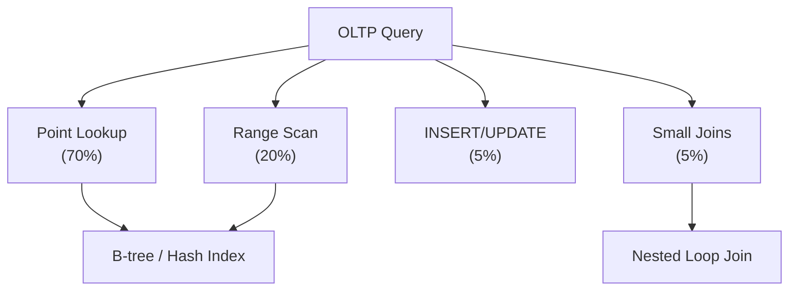

# OLTP Workload

## Description

Online Transaction Processing (OLTP) workload characterized by high-concurrency, short-duration transactions with point lookups, small range scans, and frequent updates.

## Characteristics

- **Query Pattern:** Point lookups (SELECT WHERE id = ?)
- **Transaction Size:** 1-100 rows affected
- **Concurrency:** 100-10,000+ concurrent connections
- **Latency Requirements:** < 10ms per query
- **Read/Write Ratio:** 70% reads, 30% writes (typical)
- **Data Access:** Recent data (last 24 hours = 80% of queries)

## Query Distribution

$$
\text{OLTP Workload} = \begin{cases}
70\% & \text{Point lookups (PK/unique index)} \\
20\% & \text{Small range scans (< 100 rows)} \\
5\% & \text{Single-row INSERT/UPDATE/DELETE} \\
5\% & \text{Small joins (2-3 tables)}
\end{cases}
$$

## How Ra Optimizes



### 1. Index-Centric Execution

**Rule:** `physical/oltp-index-preference`

Ra heavily favors index access for OLTP:

$$
\text{Cost}_{\text{index}} < \text{Cost}_{\text{seq}} \implies \text{Use index even if close}
$$

Threshold for OLTP workload: Use index when $\text{sel} < 0.20$ (vs 0.05 for OLAP).

### 2. Hot Data Caching

**Rule:** `physical/oltp-cache-awareness`

Ra assumes recent data is cached:

$$
\text{Cost}_{\text{cached}} = C_{\text{cpu}} \quad (C_{\text{io}} = 0)
$$

For queries on:
- Primary key lookups
- Recently accessed rows
- Indexes on frequently queried columns

### 3. Minimal Result Sets

**Rule:** `logical/oltp-early-limiting`

Push LIMIT down aggressively:

$$
\sigma_{\theta}(\tau_A(\pi_B(R))) \rightarrow \text{LIMIT-aware scan}
$$

Stop scanning after $n$ matches.

### 4. Prepared Statement Optimization

Ra caches plans for parameterized queries:

```sql
PREPARE get_user AS SELECT * FROM users WHERE id = $1;
```

**Cost:** $O(1)$ plan lookup vs $O(\text{plan time})$ per execution.

## Statistics API

```rust
use ra_optimizer::{WorkloadProfile, CacheProfile};

// OLTP workload profile
optimizer.set_workload_profile(WorkloadProfile {
    workload_type: WorkloadType::OLTP,
    avg_query_latency_ms: 5.0,
    concurrency: 1000,
    cache_hit_ratio: 0.90,  // 90% cache hits
    read_write_ratio: 0.70,  // 70% reads
});

// Cache configuration
optimizer.set_cache_profile(CacheProfile {
    buffer_pool_size_mb: 8192,  // 8 GB
    index_cache_size_mb: 2048,   // 2 GB for indexes
    hot_data_fraction: 0.10,     // 10% of data accessed frequently
});

// Table access patterns
optimizer.add_access_pattern("orders", AccessPattern {
    access_type: AccessType::OLTP,
    selectivity: 0.001,  // Point lookups
    frequency: 1000.0,   // Queries per second
    recency_weight: 0.8,  // Recent data heavily accessed
});
```

## Example Queries

### User Profile Lookup

```sql
SELECT user_id, name, email, avatar_url, created_at
FROM users
WHERE user_id = 12345;
```

**Ra Plan:**

```
IndexScan [users.pkey]
  Filter: user_id = 12345
  (Expected rows: 1, cached: likely)
```

**Optimization:**
- Primary key index: 3-4 I/Os (or 0 if cached)
- No table scan
- Covering index if available

### Order History (Recent)

```sql
SELECT order_id, total, status, created_at
FROM orders
WHERE customer_id = 5678
  AND created_at > NOW() - INTERVAL '30 days'
ORDER BY created_at DESC
LIMIT 10;
```

**Ra Plan:**

```
Limit (10)
  IndexRangeScan [orders.customer_created_idx] (Backward)
    Filter: customer_id = 5678 AND created_at > '2024-02-20'
```

**Optimizations:**
- Composite index $(customer\_id, created\_at)$ enables efficient range scan
- Backward scan eliminates sort
- Limit stops after 10 rows

### Simple JOIN (Order + Customer)

```sql
SELECT o.order_id, o.total, c.name, c.email
FROM orders o
JOIN customers c ON o.customer_id = c.id
WHERE o.order_id = 98765;
```

**Ra Plan:**

```
NestedLoopJoin
  IndexScan [orders.pkey]
    Filter: order_id = 98765
    (1 row)
  IndexScan [customers.pkey]
    Filter: id = $o.customer_id
    (1 row)
```

**Optimization:**
- Nested loop for small result set
- Both lookups use primary key
- Total cost: ~8 I/Os (2 index lookups)

### INSERT with RETURNING

```sql
INSERT INTO orders (customer_id, total, status)
VALUES (5678, 150.00, 'pending')
RETURNING order_id, created_at;
```

**Ra Plan:**

```
Insert [orders]
  Values: (5678, 150.00, 'pending')
  Returning: (order_id, created_at)
```

**Optimizations:**
- No query planning overhead
- Direct insert
- Return generated values without round-trip

## Schema Design for OLTP

### Primary Keys

```sql
CREATE TABLE orders (
  order_id BIGSERIAL PRIMARY KEY,  -- Auto-incrementing
  customer_id INTEGER NOT NULL,
  created_at TIMESTAMP DEFAULT NOW(),
  ...
);
```

**Ra Optimization:** Auto-incrementing PK enables sequential writes, reducing B-tree page splits.

### Covering Indexes

```sql
-- Frequent query: SELECT order_id, total FROM orders WHERE customer_id = ?
CREATE INDEX orders_customer_covering ON orders(customer_id) INCLUDE (order_id, total);
```

**Ra uses index-only scan, eliminating heap access.**

### Partial Indexes for Active Data

```sql
-- 95% of queries are for active orders
CREATE INDEX orders_active_idx ON orders(customer_id, created_at)
WHERE status IN ('pending', 'processing', 'shipped');
```

**Ra benefits:**
- Smaller index (only 20% of rows)
- Faster scans
- Better cache utilization

## Performance Targets

| Metric | Target | Ra Optimization |
|--------|--------|-----------------|
| Point lookup | < 1ms | Index scan + caching |
| Small range scan | < 5ms | Index range scan |
| Simple join (2 tables) | < 5ms | Nested loop + indexes |
| INSERT/UPDATE/DELETE | < 2ms | Direct execution |
| Transaction throughput | 1000+ TPS | Concurrent execution |

## Common OLTP Anti-Patterns

### 1. Sequential Scans in Hot Path

❌ **Bad:**
```sql
SELECT * FROM users WHERE LOWER(email) = 'user@example.com';
```

Function prevents index usage.

✅ **Good:**
```sql
-- Store normalized: email always lowercase
SELECT * FROM users WHERE email = 'user@example.com';
```

### 2. N+1 Query Problem

❌ **Bad:**
```python
orders = db.query("SELECT * FROM orders WHERE customer_id = ?", customer_id)
for order in orders:
    items = db.query("SELECT * FROM order_items WHERE order_id = ?", order.id)
```

**Cost:** $1 + n$ queries.

✅ **Good:**
```python
# Single query with join
results = db.query("""
    SELECT o.*, oi.*
    FROM orders o
    JOIN order_items oi ON oi.order_id = o.id
    WHERE o.customer_id = ?
""", customer_id)
```

### 3. Large OFFSET Pagination

❌ **Bad:**
```sql
SELECT * FROM orders ORDER BY created_at LIMIT 20 OFFSET 100000;
```

**Cost:** Must scan 100,020 rows.

✅ **Good (Keyset Pagination):**
```sql
SELECT * FROM orders
WHERE created_at > '2024-01-15 10:30:00'  -- Last seen
ORDER BY created_at
LIMIT 20;
```

**Cost:** Constant per page.

## OLTP vs OLAP Comparison

| Aspect | OLTP | OLAP |
|--------|------|------|
| Query complexity | Simple | Complex |
| Query duration | ms | seconds-minutes |
| Data volume per query | KB-MB | GB-TB |
| Update frequency | High | Low |
| Index preference | Heavy | Selective |
| Join strategy | Nested loop | Hash/merge |
| Aggregation | Rare | Common |
| Concurrency | High (1000+) | Low (10-100) |

## See Also

- [OLAP Workload](olap.md) - Analytical workload
- [HTAP Workload](htap.md) - Hybrid transactional/analytical
- [Point Lookup](../query-patterns/oltp/point-lookup.md) - Core OLTP pattern
- [Range Scan](../query-patterns/oltp/range-scan.md) - Small range queries
- [B-tree Indexes](../index-structures/btree.md) - Primary index type
- [Covering Indexes](../index-structures/covering.md) - Index-only scans

## References

- Gray & Reuter, *Transaction Processing: Concepts and Techniques*, 1993
- TPC-C Benchmark Specification, [http://www.tpc.org/tpcc/](http://www.tpc.org/tpcc/)
- Harizopoulos et al., "OLTP Through the Looking Glass", *SIGMOD 2008*
