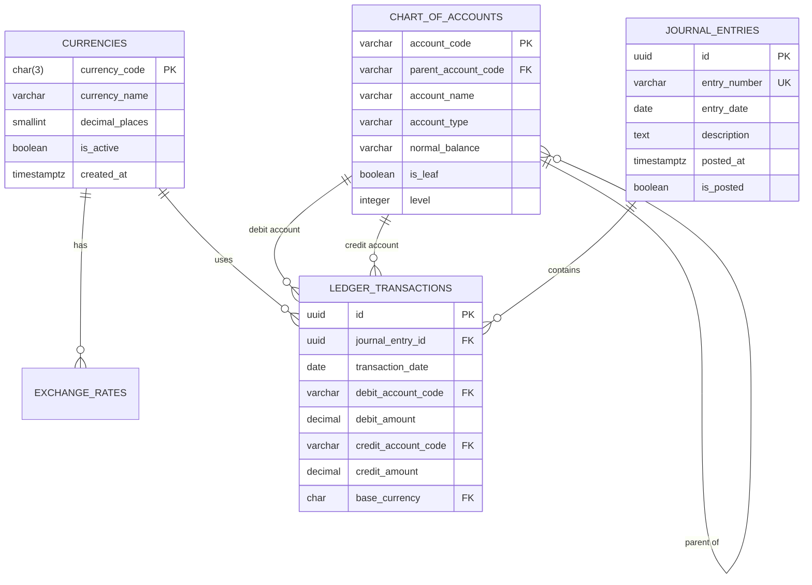

# Chapter 2: Understanding the Schema

## The Foundation of Optimization

Before RA can optimize queries, it needs to understand your data structure. Schema design directly impacts optimization opportunities. Let's explore Alice's ledger schema and see how different design choices enable (or prevent) optimizations.

## Entity Relationship Diagram



## Table Deep Dive

### Chart of Accounts: The Hierarchy

Alice's chart of accounts uses a self-referencing hierarchy:

```sql-interactive
-- View the account hierarchy
WITH RECURSIVE account_tree AS (
    -- Start with root accounts
    SELECT
        account_code,
        account_name,
        account_type,
        1 as depth,
        account_code as path
    FROM chart_of_accounts
    WHERE parent_account_code IS NULL

    UNION ALL

    -- Recursively add children
    SELECT
        c.account_code,
        c.account_name,
        c.account_type,
        p.depth + 1,
        p.path || ' > ' || c.account_code
    FROM chart_of_accounts c
    JOIN account_tree p ON c.parent_account_code = p.account_code
)
SELECT
    REPEAT('  ', depth - 1) || account_name as hierarchy,
    account_type,
    account_code
FROM account_tree
ORDER BY path;
```

**Optimization Impact**: Hierarchical queries are expensive! RA recognizes recursive CTEs and:
- Materializes intermediate results
- Considers index usage on parent_account_code
- May suggest denormalization for frequent queries

### Ledger Transactions: The Design Choice

Alice uses a **single-row model** where each transaction contains both debit and credit:

```sql-interactive
-- Single-row transaction model (Alice's choice)
SELECT
    id,
    debit_account_code,
    debit_amount,
    credit_account_code,
    credit_amount
FROM ledger_transactions
WHERE journal_entry_id = '123e4567-e89b-12d3-a456-426614174000'
LIMIT 5;
```

Alternative: **Two-row model** (separate debit and credit rows):

```sql-interactive
-- Alternative two-row model (not used)
-- This would have different optimization characteristics
SELECT
    transaction_id,
    account_code,
    CASE entry_type
        WHEN 'DEBIT' THEN amount
        ELSE 0
    END as debit,
    CASE entry_type
        WHEN 'CREDIT' THEN amount
        ELSE 0
    END as credit
FROM ledger_entries_alternative
WHERE transaction_id = '123';
```

**Optimization Comparison**:

| Aspect | Single-Row (Current) | Two-Row (Alternative) |
|--------|---------------------|----------------------|
| Account Balance | Requires OR condition | Simple WHERE clause |
| Join Complexity | Two FK joins | One FK join |
| Storage | Less rows, wider | More rows, narrower |
| Index Strategy | Composite indexes | Simple indexes |

## Index Strategy

Let's examine how indexes affect RA's optimization decisions:

```sql-interactive
-- Current indexes
SELECT
    schemaname,
    tablename,
    indexname,
    indexdef
FROM pg_indexes
WHERE schemaname = 'public'
ORDER BY tablename, indexname;
```

### Primary Indexes

```sql-interactive
-- RA recognizes these as clustered/primary:
-- 1. chart_of_accounts(account_code)
-- 2. journal_entries(id)
-- 3. ledger_transactions(id)

-- Check selectivity for account lookups
EXPLAIN SELECT *
FROM ledger_transactions
WHERE debit_account_code = '1010';  -- Cash account
```

### Covering Indexes

A covering index includes all needed columns:

```sql-interactive
-- Without covering index
EXPLAIN SELECT
    transaction_date,
    debit_amount,
    credit_amount
FROM ledger_transactions
WHERE debit_account_code = '1010';

-- With covering index (simulated)
-- CREATE INDEX idx_covering ON ledger_transactions
-- (debit_account_code) INCLUDE (transaction_date, debit_amount, credit_amount);
```

## Statistics and Cardinality

RA uses statistics to estimate result sizes:

```statistics-viewer
{
  "chart_of_accounts": {
    "total_rows": 150,
    "columns": {
      "account_type": {
        "distinct_values": 5,
        "histogram": {
          "ASSET": 30,
          "LIABILITY": 25,
          "EQUITY": 15,
          "REVENUE": 35,
          "EXPENSE": 45
        }
      },
      "is_leaf": {
        "distinct_values": 2,
        "null_fraction": 0,
        "true_fraction": 0.8
      }
    }
  },
  "ledger_transactions": {
    "total_rows": 50000,
    "columns": {
      "transaction_date": {
        "min": "2023-01-01",
        "max": "2024-12-31",
        "distinct_values": 730
      },
      "debit_account_code": {
        "distinct_values": 120,
        "most_common": [
          {"value": "5010", "frequency": 0.15},
          {"value": "1010", "frequency": 0.12},
          {"value": "2010", "frequency": 0.08}
        ]
      }
    }
  }
}
```

## Constraints and Their Impact

Constraints provide guarantees that RA can exploit:

### NOT NULL Constraints

```sql-interactive
-- RA knows these can't be NULL
SELECT
    COUNT(*) as total,
    COUNT(debit_amount) as non_null_debits
FROM ledger_transactions;
-- RA optimizes: COUNT(*) = COUNT(debit_amount)
```

### Check Constraints

```sql-interactive
-- Account type constraint enables partition pruning
SELECT *
FROM chart_of_accounts
WHERE account_type = 'INVALID';  -- RA knows this returns empty
```

### Foreign Key Constraints

```sql-interactive
-- RA can optimize joins with FK knowledge
EXPLAIN SELECT
    je.entry_number,
    lt.debit_amount
FROM journal_entries je
JOIN ledger_transactions lt ON je.id = lt.journal_entry_id
WHERE je.entry_date = '2024-01-15';
-- RA knows: every lt.journal_entry_id has a matching je.id
```

## Materialized Views

Alice creates a materialized view for account balances:

```sql-interactive
-- Materialized view definition
CREATE MATERIALIZED VIEW account_balances AS
SELECT
    a.account_code,
    a.account_name,
    a.account_type,
    COALESCE(SUM(
        CASE
            WHEN t.debit_account_code = a.account_code
            THEN t.debit_amount
            ELSE 0
        END
    ), 0) as total_debits,
    COALESCE(SUM(
        CASE
            WHEN t.credit_account_code = a.account_code
            THEN t.credit_amount
            ELSE 0
        END
    ), 0) as total_credits,
    COALESCE(SUM(
        CASE
            WHEN t.debit_account_code = a.account_code
            THEN t.debit_amount
            ELSE -t.credit_amount
        END
    ), 0) as balance
FROM chart_of_accounts a
LEFT JOIN ledger_transactions t
    ON t.debit_account_code = a.account_code
    OR t.credit_account_code = a.account_code
GROUP BY a.account_code, a.account_name, a.account_type;

-- RA can rewrite queries to use this view
EXPLAIN SELECT balance
FROM account_balances  -- Uses materialized view
WHERE account_code = '1010';
```

## Schema Evolution Patterns

As Alice's business grows, her schema evolves:

### Year 1: Simple and Clean
```sql
-- 100 transactions/month
-- No indexes needed
-- Full table scans are fast enough
```

### Year 2: Adding Indexes
```sql
-- 1,000 transactions/month
CREATE INDEX idx_transaction_date ON ledger_transactions(transaction_date);
CREATE INDEX idx_debit_account ON ledger_transactions(debit_account_code);
```

### Year 3: Partitioning
```sql
-- 10,000 transactions/month
-- Partition by transaction_date
CREATE TABLE ledger_transactions_2024 PARTITION OF ledger_transactions
FOR VALUES FROM ('2024-01-01') TO ('2025-01-01');
```

## Interactive Schema Explorer

```schema-explorer
// Try different query patterns and see which indexes help

const queries = [
  {
    name: "Daily Cash Balance",
    sql: "SELECT SUM(debit_amount - credit_amount) FROM ledger_transactions WHERE account_code = '1010' AND transaction_date = CURRENT_DATE",
    indexes: ["account_code", "transaction_date", "composite(account_code, transaction_date)"]
  },
  {
    name: "Monthly P&L",
    sql: "SELECT account_type, SUM(amount) FROM ... WHERE account_type IN ('REVENUE', 'EXPENSE')",
    indexes: ["account_type", "transaction_date"]
  }
];

// Visualize index impact on each query
```

## Design Decisions and Tradeoffs

### Decision 1: Single vs Multi-Row Transactions

Alice chose single-row because:
- [x] Guarantees debit = credit in one row
- [x] Simpler balance calculations
- [FAIL] Complex account filtering (needs OR)
- [FAIL] Difficult to index efficiently

### Decision 2: UUID vs Sequential IDs

Alice chose UUIDs because:
- [x] No coordination needed for ID generation
- [x] Easier data migration and merging
- [FAIL] Larger index size
- [FAIL] Poor locality of reference

### Decision 3: Materialized View Strategy

Alice materialized account_balances because:
- [x] Fast balance lookups
- [x] Reduces complex joins
- [FAIL] Refresh overhead
- [FAIL] Storage duplication

## Optimization Opportunities

Based on this schema, RA can apply these optimizations:

1. **Index Selection**: Choose between multiple indexes
2. **Join Reordering**: Optimize multi-table joins
3. **Predicate Pushdown**: Filter early in the plan
4. **Materialized View Rewriting**: Use precomputed results
5. **Partition Pruning**: Skip irrelevant partitions

## Practice Exercise

Which index would most improve this query?

```sql-interactive
-- Alice's most common query
SELECT
    a.account_name,
    COUNT(t.id) as transaction_count,
    SUM(t.debit_amount) as total_debits
FROM chart_of_accounts a
JOIN ledger_transactions t ON t.debit_account_code = a.account_code
WHERE a.account_type = 'EXPENSE'
  AND t.transaction_date >= DATE_TRUNC('month', CURRENT_DATE)
GROUP BY a.account_code, a.account_name
ORDER BY total_debits DESC;
```

Options:
1. `CREATE INDEX ON ledger_transactions(transaction_date)`
2. `CREATE INDEX ON ledger_transactions(debit_account_code, transaction_date)`
3. `CREATE INDEX ON chart_of_accounts(account_type)`
4. `CREATE INDEX ON ledger_transactions(transaction_date, debit_account_code)`

*Think about selectivity and join order...*

## Key Takeaways

1. **Schema design constrains optimization options**
   - Table structure determines join strategies
   - Data types affect index choices
   - Constraints enable optimizations

2. **Indexes are a tradeoff**
   - Speed up reads
   - Slow down writes
   - Consume storage

3. **Statistics drive decisions**
   - Cardinality estimates affect join order
   - Selectivity determines index usage
   - Histograms improve range queries

4. **Materialized views trade space for time**
   - Precompute expensive operations
   - Must balance freshness vs performance

## Next Steps

Now that you understand the schema, let's start optimizing queries! In [Chapter 3: Basic Queries](03-basic-queries.md), we'll see how RA transforms simple SELECTs into efficient execution plans.

---

* Learning Note: Good schema design is the foundation of performance. No optimizer can fully compensate for poor design choices.*