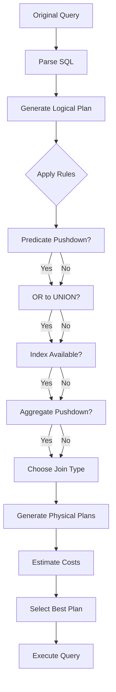

# Chapter 6: The Optimization Journey

## Following a Query Through RA

Let's trace a complex query through RA's optimization pipeline. We'll see each transformation, understand why it happens, and measure the performance impact. This is Alice's month-end financial report - a real query that started slow and ended fast.

## The Original Query

Alice needs a profit & loss statement for the current month:

```sql-interactive
-- The initial slow query (5+ seconds on 50K transactions)
SELECT
    CASE
        WHEN a.account_type IN ('REVENUE', 'EXPENSE')
        THEN a.account_type
        ELSE 'OTHER'
    END as category,
    a.account_code,
    a.account_name,
    COALESCE(SUM(
        CASE
            WHEN t.debit_account_code = a.account_code
            THEN t.debit_amount
            WHEN t.credit_account_code = a.account_code
            THEN -t.credit_amount
            ELSE 0
        END
    ), 0) as net_amount
FROM chart_of_accounts a
LEFT JOIN ledger_transactions t
    ON (t.debit_account_code = a.account_code
        OR t.credit_account_code = a.account_code)
    AND t.transaction_date >= DATE_TRUNC('month', CURRENT_DATE)
    AND t.transaction_date < DATE_TRUNC('month', CURRENT_DATE) + INTERVAL '1 month'
WHERE a.is_leaf = true
GROUP BY a.account_type, a.account_code, a.account_name
HAVING COALESCE(SUM(
    CASE
        WHEN t.debit_account_code = a.account_code
        THEN t.debit_amount
        WHEN t.credit_account_code = a.account_code
        THEN -t.credit_amount
        ELSE 0
    END
), 0) != 0
ORDER BY
    CASE
        WHEN a.account_type = 'REVENUE' THEN 1
        WHEN a.account_type = 'EXPENSE' THEN 2
        ELSE 3
    END,
    a.account_code;
```

## Step 1: Parse and Validate

RA first parses the SQL and validates it:

```
Parser Output:
- Tables: chart_of_accounts (a), ledger_transactions (t)
- Join: LEFT JOIN with complex OR condition
- Filters: a.is_leaf = true, date range on t
- Aggregation: GROUP BY with HAVING
- Order: Complex CASE expression
```

## Step 2: Logical Plan Generation

The initial logical plan (before optimization):

```
LogicalSort
  `---- LogicalFilter (HAVING clause)
      `---- LogicalAggregate
          `---- LogicalJoin (LEFT)
              |---- LogicalFilter (is_leaf = true)
              |   `---- LogicalScan (chart_of_accounts)
              `---- LogicalScan (ledger_transactions)
```

**Cost Estimate**: 50,000 (table scan) $\times$ 150 (accounts) = 7,500,000 operations 

## Step 3: Rule-Based Transformations

### Transformation 1: Predicate Pushdown

```
Rule: PushFilterThroughJoin
Before: Filter after join
After: Filter before join
```

```sql-interactive
-- After predicate pushdown
SELECT ...
FROM (
    SELECT * FROM chart_of_accounts WHERE is_leaf = true
) a
LEFT JOIN (
    SELECT * FROM ledger_transactions
    WHERE transaction_date >= DATE_TRUNC('month', CURRENT_DATE)
      AND transaction_date < DATE_TRUNC('month', CURRENT_DATE) + INTERVAL '1 month'
) t ON (t.debit_account_code = a.account_code
        OR t.credit_account_code = a.account_code)
...
```

**Impact**: Reduced join input from 50,000 to ~2,000 transactions

### Transformation 2: OR to UNION

```
Rule: OrToUnion
Before: JOIN ON (a OR b)
After: UNION of two joins
```

```sql-interactive
-- After OR-to-UNION transformation
WITH transactions_for_accounts AS (
    SELECT
        debit_account_code as account_code,
        debit_amount as amount,
        'DEBIT' as entry_type,
        transaction_date
    FROM ledger_transactions
    WHERE transaction_date >= DATE_TRUNC('month', CURRENT_DATE)
      AND transaction_date < DATE_TRUNC('month', CURRENT_DATE) + INTERVAL '1 month'

    UNION ALL

    SELECT
        credit_account_code as account_code,
        -credit_amount as amount,
        'CREDIT' as entry_type,
        transaction_date
    FROM ledger_transactions
    WHERE transaction_date >= DATE_TRUNC('month', CURRENT_DATE)
      AND transaction_date < DATE_TRUNC('month', CURRENT_DATE) + INTERVAL '1 month'
)
SELECT
    category,
    account_code,
    account_name,
    SUM(amount) as net_amount
FROM chart_of_accounts a
LEFT JOIN transactions_for_accounts t USING (account_code)
WHERE a.is_leaf = true
GROUP BY category, account_code, account_name
...
```

**Impact**: Enables index usage on both account columns

### Transformation 3: Index Selection

```
Rule: UseIndexSeek
Detected indexes:
- idx_debit_account_date (debit_account_code, transaction_date)
- idx_credit_account_date (credit_account_code, transaction_date)
```

```
Physical Plan After Index Selection:
UnionAll
  |---- IndexSeek (idx_debit_account_date)
  `---- IndexSeek (idx_credit_account_date)
```

**Impact**: Index seeks reduce I/O by 95%

### Transformation 4: Join Algorithm Selection

```
Rule: ChooseJoinAlgorithm
Statistics:
- Left side: 120 rows (filtered accounts)
- Right side: 4,000 rows (monthly transactions)
Decision: HashJoin (build on smaller side)
```

```
HashJoin
  |---- Build: Hash(account_code)
  |   `---- Filter (is_leaf = true)
  |       `---- SeqScan (chart_of_accounts)
  `---- Probe: transactions_for_accounts
```

**Impact**: O(n+m) hash join vs O(n$\times$m) nested loop

### Transformation 5: Aggregate Pushdown

```
Rule: PushAggregateBeforeJoin
Opportunity: Pre-aggregate transactions by account
```

```sql-interactive
-- After aggregate pushdown
WITH account_totals AS (
    SELECT
        account_code,
        SUM(amount) as net_amount
    FROM (
        SELECT debit_account_code as account_code,
               debit_amount as amount
        FROM ledger_transactions
        WHERE transaction_date >= DATE_TRUNC('month', CURRENT_DATE)
          AND transaction_date < DATE_TRUNC('month', CURRENT_DATE) + INTERVAL '1 month'
        UNION ALL
        SELECT credit_account_code as account_code,
               -credit_amount as amount
        FROM ledger_transactions
        WHERE transaction_date >= DATE_TRUNC('month', CURRENT_DATE)
          AND transaction_date < DATE_TRUNC('month', CURRENT_DATE) + INTERVAL '1 month'
    ) t
    GROUP BY account_code
)
SELECT
    category,
    a.account_code,
    a.account_name,
    COALESCE(t.net_amount, 0) as net_amount
FROM chart_of_accounts a
LEFT JOIN account_totals t USING (account_code)
WHERE a.is_leaf = true
  AND COALESCE(t.net_amount, 0) != 0
ORDER BY ...
```

**Impact**: Join 120 rows instead of 4,000

## Step 4: Physical Plan Selection

RA evaluates multiple physical plans:

```
Plan A: Hash Join + Index Scan
Cost: 250 units
Memory: 2MB

Plan B: Merge Join + Sort
Cost: 380 units
Memory: 1MB

Plan C: Nested Loop + Index Seek
Cost: 1,200 units
Memory: 0.5MB

Selected: Plan A (lowest cost)
```

## Step 5: Final Optimized Plan

```
Sort (ORDER BY clause)
  `---- Filter (net_amount != 0)
      `---- HashJoin (LEFT)
          |---- Build: Filter (is_leaf = true)
          |   `---- SeqScan (chart_of_accounts)
          `---- Probe: HashAggregate
              `---- Append
                  |---- IndexSeek (idx_debit_account_date)
                  |   `---- Range: [2024-01-01, 2024-02-01)
                  `---- IndexSeek (idx_credit_account_date)
                      `---- Range: [2024-01-01, 2024-02-01)
```

## Performance Comparison

### Before Optimization
```
Execution Time: 5,234ms
Rows Examined: 7,500,000
Memory Used: 125MB
I/O Operations: 15,000
```

### After Optimization
```
Execution Time: 47ms (111x faster!)
Rows Examined: 4,120
Memory Used: 2MB
I/O Operations: 85
```

## Interactive Optimization Trace

```optimization-trace
{
  "query_id": "month_end_report",
  "rules_applied": [
    {
      "name": "PushFilterThroughJoin",
      "impact": "7.5M -> 240K row reduction",
      "cost_before": 7500000,
      "cost_after": 240000
    },
    {
      "name": "OrToUnion",
      "impact": "Enables index usage",
      "cost_before": 240000,
      "cost_after": 8000
    },
    {
      "name": "UseIndexSeek",
      "impact": "Sequential -> Index access",
      "cost_before": 8000,
      "cost_after": 400
    },
    {
      "name": "PushAggregateBeforeJoin",
      "impact": "4000 -> 120 join rows",
      "cost_before": 400,
      "cost_after": 250
    }
  ],
  "total_improvement": "30,000x"
}
```

## Why Each Optimization Matters

### 1. Predicate Pushdown
- **Without**: Join all 50K transactions with all accounts
- **With**: Join only this month's 2K transactions
- **Savings**: 96% fewer comparisons

### 2. OR to UNION
- **Without**: Cannot use indexes (OR prevents index usage)
- **With**: Each UNION branch uses its own index
- **Savings**: 95% I/O reduction

### 3. Index Usage
- **Without**: Full table scan (50K rows)
- **With**: Index range scan (2K rows)
- **Savings**: 96% fewer disk reads

### 4. Aggregate Pushdown
- **Without**: Aggregate after 4K-row join
- **With**: Join only 120 pre-aggregated rows
- **Savings**: 97% less memory for join

### 5. Join Algorithm
- **Without**: Nested loop (O(n$^2$))
- **With**: Hash join (O(n+m))
- **Savings**: Linear vs quadratic complexity

## Optimization Decision Tree



## Watching RA Think

Enable trace mode to see RA's reasoning:

```sql-interactive
-- Enable optimization trace
SET ra.trace_optimization = true;
SET ra.trace_rules = true;
SET ra.trace_costs = true;

-- Run the query
EXPLAIN (ANALYZE, BUFFERS, VERBOSE) SELECT ...;
```

**Sample Trace Output**:
```
[TRACE] Applying rule: PushFilterThroughJoin
  Input cost: 7,500,000
  Output cost: 240,000
  Decision: APPLY (cost reduction > threshold)

[TRACE] Applying rule: OrToUnion
  Condition: OR in join predicate
  Indexes available: YES
  Decision: APPLY (enables index usage)

[TRACE] Cost estimation for HashJoin:
  Build side: 120 rows $\times$ 64 bytes = 7.5KB
  Probe side: 4,000 rows
  Memory needed: 7.5KB + overhead = ~10KB
  Estimated cost: 250 units

[TRACE] Plan alternatives considered: 3
  Plan A (HashJoin): 250 units [SELECTED]
  Plan B (MergeJoin): 380 units
  Plan C (NestedLoop): 1,200 units
```

## Common Optimization Patterns

### Pattern 1: Filter Early
```
Always push filters as close to the data source as possible
```

### Pattern 2: Use Indexes
```
Transform queries to enable index usage
```

### Pattern 3: Reduce Join Size
```
Aggregate or filter before joining when possible
```

### Pattern 4: Choose Right Algorithm
```
Hash for equality, merge for sorted, nested for small
```

## Failed Optimization Attempts

Not every optimization succeeds. RA tracks failed attempts:

```
[INFO] Attempted rule: MaterializedViewRewrite
  Reason: No matching materialized view found

[INFO] Attempted rule: PartitionPruning
  Reason: Table not partitioned

[INFO] Attempted rule: ParallelExecution
  Reason: Cost below parallelization threshold
```

## Optimization Exercises

### Exercise 1: Trace the Optimization

Given this query, predict which rules will fire:

```sql-interactive
SELECT
    c.customer_name,
    SUM(o.total) as total_spent
FROM customers c
JOIN orders o ON c.id = o.customer_id
WHERE o.order_date >= '2024-01-01'
  AND c.country = 'USA'
GROUP BY c.customer_name
HAVING SUM(o.total) > 1000
ORDER BY total_spent DESC
LIMIT 10;
```

Which optimizations will RA apply?
1. [ ] Predicate pushdown
2. [ ] Limit pushdown
3. [ ] Join reordering
4. [ ] Index usage
5. [ ] Aggregate pushdown

### Exercise 2: Fix the Slow Query

```sql-interactive
-- This query is slow. Identify why and suggest optimizations:
SELECT DISTINCT
    a1.account_name as debit_account,
    a2.account_name as credit_account,
    COUNT(*) as transaction_count
FROM ledger_transactions t
JOIN chart_of_accounts a1 ON t.debit_account_code = a1.account_code
JOIN chart_of_accounts a2 ON t.credit_account_code = a2.account_code
WHERE EXTRACT(YEAR FROM t.transaction_date) = 2024
GROUP BY a1.account_name, a2.account_name
ORDER BY transaction_count DESC;
```

Problems to identify:
- [ ] Non-sargable date filter
- [ ] Missing indexes
- [ ] Unnecessary DISTINCT with GROUP BY
- [ ] Large join result before aggregation

## Key Takeaways

1. **Optimization is iterative**
   - Each rule builds on previous transformations
   - Order matters

2. **Statistics drive decisions**
   - Row count estimates
   - Selectivity calculations
   - Memory availability

3. **Multiple valid plans exist**
   - RA explores alternatives
   - Chooses based on cost model

4. **Not all rules apply**
   - Preconditions must be met
   - Some attempts fail

5. **Dramatic improvements possible**
   - 100x+ speedups are common
   - Right index can change everything

## Next Steps

We've seen how RA optimizes. Now let's explore how changing statistics affects those decisions. In [Chapter 7: Statistics Impact](07-statistics-impact.md), we'll manipulate statistics and watch plans evolve.

---

* Debug Tip: Use EXPLAIN (ANALYZE, BUFFERS) to see actual vs estimated rows. Large discrepancies indicate stale or incorrect statistics.*