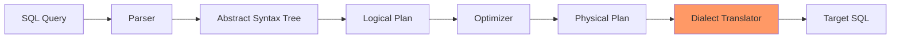

# Chapter 8: Cross-Database Query Translation

## One Query, Many Databases

Alice's business is expanding. She needs to support customers using different databases: PostgreSQL for the main system, SQLite for mobile apps, MySQL for the web store, and even DuckDB for analytics. RA can translate and optimize queries for each dialect. Let's explore how.

## SQL Dialect Differences

Despite SQL standards, databases have significant differences:

```sql-interactive
-- The "same" query in different dialects

-- PostgreSQL (Alice's main system)
SELECT
    account_name,
    EXTRACT(YEAR FROM transaction_date) as year,
    SUM(debit_amount)::NUMERIC(15,2) as total
FROM ledger_transactions
WHERE transaction_date >= CURRENT_DATE - INTERVAL '1 year'
GROUP BY account_name, EXTRACT(YEAR FROM transaction_date)
LIMIT 10 OFFSET 20;

-- MySQL translation
SELECT
    account_name,
    YEAR(transaction_date) as year,
    CAST(SUM(debit_amount) AS DECIMAL(15,2)) as total
FROM ledger_transactions
WHERE transaction_date >= DATE_SUB(CURDATE(), INTERVAL 1 YEAR)
GROUP BY account_name, YEAR(transaction_date)
LIMIT 10 OFFSET 20;

-- SQLite translation
SELECT
    account_name,
    CAST(strftime('%Y', transaction_date) AS INTEGER) as year,
    ROUND(SUM(debit_amount), 2) as total
FROM ledger_transactions
WHERE transaction_date >= date('now', '-1 year')
GROUP BY account_name, strftime('%Y', transaction_date)
LIMIT 10 OFFSET 20;

-- SQL Server translation
SELECT
    account_name,
    YEAR(transaction_date) as year,
    CAST(SUM(debit_amount) AS DECIMAL(15,2)) as total
FROM ledger_transactions
WHERE transaction_date >= DATEADD(year, -1, GETDATE())
GROUP BY account_name, YEAR(transaction_date)
ORDER BY account_name
OFFSET 20 ROWS FETCH NEXT 10 ROWS ONLY;
```

## RA's Translation Pipeline



## Interactive Dialect Translator

```dialect-translator
{
  "source_query": "SELECT * FROM accounts WHERE created_at >= CURRENT_DATE - INTERVAL '30 days'",
  "target_dialects": [
    "PostgreSQL",
    "MySQL",
    "SQLite",
    "SQL Server",
    "DuckDB",
    "Snowflake"
  ],
  "options": {
    "preserve_semantics": true,
    "optimize_for_target": true,
    "handle_missing_features": "emulate"
  }
}
```

## Common Translation Patterns

### Date/Time Functions

```sql-interactive
-- Source (Standard SQL)
SELECT
    transaction_date,
    EXTRACT(YEAR FROM transaction_date) as year,
    EXTRACT(MONTH FROM transaction_date) as month,
    EXTRACT(DAY FROM transaction_date) as day,
    CURRENT_DATE as today,
    CURRENT_TIMESTAMP as now
FROM ledger_transactions;

-- PostgreSQL: Native support
-- (Same as source)

-- MySQL
SELECT
    transaction_date,
    YEAR(transaction_date) as year,
    MONTH(transaction_date) as month,
    DAY(transaction_date) as day,
    CURDATE() as today,
    NOW() as now
FROM ledger_transactions;

-- SQLite
SELECT
    transaction_date,
    CAST(strftime('%Y', transaction_date) AS INTEGER) as year,
    CAST(strftime('%m', transaction_date) AS INTEGER) as month,
    CAST(strftime('%d', transaction_date) AS INTEGER) as day,
    date('now') as today,
    datetime('now') as now
FROM ledger_transactions;
```

### String Operations

```sql-interactive
-- Source
SELECT
    account_name || ' (' || account_code || ')' as display_name,
    SUBSTRING(account_code FROM 1 FOR 2) as category,
    UPPER(account_type) as type_upper,
    LENGTH(description) as desc_length
FROM chart_of_accounts;

-- MySQL (different concatenation)
SELECT
    CONCAT(account_name, ' (', account_code, ')') as display_name,
    SUBSTRING(account_code, 1, 2) as category,
    UPPER(account_type) as type_upper,
    CHAR_LENGTH(description) as desc_length
FROM chart_of_accounts;

-- SQL Server (different functions)
SELECT
    account_name + ' (' + account_code + ')' as display_name,
    SUBSTRING(account_code, 1, 2) as category,
    UPPER(account_type) as type_upper,
    LEN(description) as desc_length
FROM chart_of_accounts;
```

### Window Functions

```sql-interactive
-- Source (Standard SQL)
SELECT
    account_code,
    transaction_date,
    debit_amount,
    SUM(debit_amount) OVER (
        PARTITION BY account_code
        ORDER BY transaction_date
        ROWS BETWEEN UNBOUNDED PRECEDING AND CURRENT ROW
    ) as running_total
FROM ledger_transactions;

-- MySQL (before 8.0 - no window functions!)
SELECT
    t1.account_code,
    t1.transaction_date,
    t1.debit_amount,
    (SELECT SUM(t2.debit_amount)
     FROM ledger_transactions t2
     WHERE t2.account_code = t1.account_code
       AND t2.transaction_date <= t1.transaction_date) as running_total
FROM ledger_transactions t1;

-- SQLite (3.25+ has window functions)
-- Same as source

-- DuckDB (full support)
-- Same as source
```

## Feature Compatibility Matrix

```feature-matrix
| Feature | PostgreSQL | MySQL 8+ | SQLite 3.35+ | SQL Server | DuckDB |
|---------|------------|----------|--------------|------------|---------|
| CTEs | [x] | [x] | [x] | [x] | [x] |
| Recursive CTEs | [x] | [x] | [x] | [x] | [x] |
| Window Functions | [x] | [x] | [x] | [x] | [x] |
| LATERAL joins | [x] | [x] (8.0.14+) | [FAIL] | [x] (APPLY) | [x] |
| Arrays | [x] | [x] (JSON) | [FAIL] | [FAIL] | [x] |
| Full Outer Join | [x] | [FAIL] | [FAIL] | [x] | [x] |
| EXCEPT ALL | [x] | [FAIL] | [FAIL] | [x] | [x] |
| Materialized Views | [x] | [FAIL] | [FAIL] | [x] (Indexed) | [FAIL] |
| Partial Indexes | [x] | [FAIL] | [x] | [x] (Filtered) | [FAIL] |
```

## Handling Missing Features

### Strategy 1: Emulation

When target lacks a feature, RA emulates it:

```sql-interactive
-- Source: FULL OUTER JOIN (not in MySQL)
SELECT
    COALESCE(d.account_code, c.account_code) as account_code,
    d.total_debits,
    c.total_credits
FROM debit_summary d
FULL OUTER JOIN credit_summary c
    ON d.account_code = c.account_code;

-- MySQL emulation using UNION
SELECT
    account_code,
    total_debits,
    total_credits
FROM (
    SELECT
        d.account_code,
        d.total_debits,
        c.total_credits
    FROM debit_summary d
    LEFT JOIN credit_summary c
        ON d.account_code = c.account_code

    UNION

    SELECT
        c.account_code,
        d.total_debits,
        c.total_credits
    FROM credit_summary c
    LEFT JOIN debit_summary d
        ON c.account_code = d.account_code
    WHERE d.account_code IS NULL
) combined;
```

### Strategy 2: Approximation

Some features can be approximated:

```sql-interactive
-- Source: Median calculation (PostgreSQL)
SELECT
    account_type,
    PERCENTILE_CONT(0.5) WITHIN GROUP (ORDER BY debit_amount) as median
FROM ledger_transactions
GROUP BY account_type;

-- MySQL approximation
SELECT
    account_type,
    AVG(debit_amount) as median_approximate
FROM (
    SELECT
        account_type,
        debit_amount,
        ROW_NUMBER() OVER (PARTITION BY account_type ORDER BY debit_amount) as rn,
        COUNT(*) OVER (PARTITION BY account_type) as cnt
    FROM ledger_transactions
) ranked
WHERE rn IN (FLOOR((cnt+1)/2), CEIL((cnt+1)/2))
GROUP BY account_type;

-- SQLite (no window functions in older versions)
-- Falls back to average as approximation
SELECT
    account_type,
    AVG(debit_amount) as median_approximate
FROM ledger_transactions
GROUP BY account_type;
```

### Strategy 3: Feature Detection

RA detects available features:

```sql-interactive
-- RA checks database capabilities
SELECT
    CASE
        WHEN EXISTS (
            SELECT 1 FROM information_schema.routines
            WHERE routine_name = 'json_extract'
        ) THEN 'JSON supported'
        ELSE 'JSON not supported'
    END as json_support,
    CASE
        WHEN version() LIKE '%PostgreSQL 14%' THEN 'MERGE supported'
        WHEN version() LIKE '%PostgreSQL 13%' THEN 'MERGE not supported'
    END as merge_support;
```

## Optimization Differences

Different databases optimize differently:

### PostgreSQL: Cost-Based

```sql-interactive
-- PostgreSQL uses statistics heavily
EXPLAIN (ANALYZE, BUFFERS) SELECT
    account_type,
    COUNT(*) as cnt
FROM chart_of_accounts
GROUP BY account_type;

-- Plan: HashAggregate (if few groups)
-- Plan: GroupAggregate (if pre-sorted)
```

### MySQL: Rule-Based + Cost

```sql-interactive
-- MySQL mixes rules and costs
EXPLAIN FORMAT=JSON SELECT
    account_type,
    COUNT(*) as cnt
FROM chart_of_accounts
GROUP BY account_type;

-- Often prefers index even when not optimal
```

### SQLite: Simple and Fast

```sql-interactive
-- SQLite keeps it simple
EXPLAIN QUERY PLAN SELECT
    account_type,
    COUNT(*) as cnt
FROM chart_of_accounts
GROUP BY account_type;

-- Usually: SCAN + TEMP B-TREE for GROUP BY
```

## Data Type Mapping

```sql-interactive
-- Source PostgreSQL types
CREATE TABLE account_metadata (
    id SERIAL PRIMARY KEY,                    -- Auto-increment
    account_uuid UUID,                         -- UUID type
    metadata JSONB,                           -- Binary JSON
    tags TEXT[],                              -- Array
    amount NUMERIC(15,2),                     -- Precise decimal
    created_at TIMESTAMPTZ,                   -- Timezone-aware
    is_active BOOLEAN                        -- Boolean
);

-- MySQL translation
CREATE TABLE account_metadata (
    id INT AUTO_INCREMENT PRIMARY KEY,        -- Different syntax
    account_uuid CHAR(36),                    -- No UUID type
    metadata JSON,                            -- Text JSON
    tags JSON,                                -- Arrays as JSON
    amount DECIMAL(15,2),                     -- Same precision
    created_at TIMESTAMP,                     -- No timezone
    is_active TINYINT(1)                     -- No boolean
);

-- SQLite translation
CREATE TABLE account_metadata (
    id INTEGER PRIMARY KEY AUTOINCREMENT,     -- Different syntax
    account_uuid TEXT,                        -- Everything is TEXT
    metadata TEXT,                            -- JSON as TEXT
    tags TEXT,                                -- Arrays as TEXT
    amount REAL,                              -- Approximate decimal
    created_at TEXT,                          -- Dates as TEXT
    is_active INTEGER                        -- Boolean as INT
);
```

## Index Translation

```sql-interactive
-- PostgreSQL: Partial index
CREATE INDEX idx_active_accounts
ON chart_of_accounts (account_code)
WHERE is_active = true;

-- MySQL: No partial indexes
-- Workaround: Include column in index
CREATE INDEX idx_active_accounts
ON chart_of_accounts (is_active, account_code);

-- SQL Server: Filtered index
CREATE INDEX idx_active_accounts
ON chart_of_accounts (account_code)
WHERE is_active = 1;

-- SQLite: Supports partial indexes
CREATE INDEX idx_active_accounts
ON chart_of_accounts (account_code)
WHERE is_active = 1;
```

## Transaction Handling

```sql-interactive
-- PostgreSQL: Savepoints
BEGIN;
    INSERT INTO ledger_transactions ...;
    SAVEPOINT before_update;
    UPDATE chart_of_accounts ...;
    -- Oops, rollback just the update
    ROLLBACK TO SAVEPOINT before_update;
    INSERT INTO audit_log ...;
COMMIT;

-- MySQL: Different syntax
START TRANSACTION;
    INSERT INTO ledger_transactions ...;
    SAVEPOINT before_update;
    UPDATE chart_of_accounts ...;
    -- Oops, rollback just the update
    ROLLBACK TO before_update;  -- No SAVEPOINT keyword
    INSERT INTO audit_log ...;
COMMIT;

-- SQLite: Limited savepoints
BEGIN TRANSACTION;
    INSERT INTO ledger_transactions ...;
    SAVEPOINT before_update;
    UPDATE chart_of_accounts ...;
    -- Oops, rollback just the update
    ROLLBACK TO before_update;
    INSERT INTO audit_log ...;
COMMIT;
```

## Performance Hints Translation

```sql-interactive
-- PostgreSQL hints (via pg_hint_plan)
/*+ SeqScan(ledger_transactions) */
SELECT * FROM ledger_transactions
WHERE account_code = '1010';

-- MySQL hints
SELECT /*+ NO_INDEX(ledger_transactions idx_account) */
    * FROM ledger_transactions
WHERE account_code = '1010';

-- Oracle-style hints
SELECT /*+ FULL(t) */
    * FROM ledger_transactions t
WHERE account_code = '1010';

-- SQL Server hints
SELECT * FROM ledger_transactions WITH (INDEX(0))
WHERE account_code = '1010';
```

## Cross-Database Best Practices

### Write Portable SQL

```sql-interactive
-- Avoid: Database-specific syntax
SELECT TOP 10 * FROM accounts;  -- SQL Server only

-- Prefer: Standard SQL
SELECT * FROM accounts
LIMIT 10;  -- More portable

-- Or with full standard compliance
SELECT * FROM accounts
FETCH FIRST 10 ROWS ONLY;  -- SQL:2008 standard
```

### Use Common Subset

```sql-interactive
-- Avoid: Fancy features
WITH RECURSIVE cte AS (...)
SELECT * FROM cte
LATERAL JOIN ...;

-- Prefer: Widely supported features
SELECT *
FROM table1 t1
JOIN table2 t2 ON t1.id = t2.id;
```

### Abstract Database Layer

```javascript
// RA's approach: Abstract dialect differences
class DialectTranslator {
  translateDateAdd(amount, unit) {
    switch(this.dialect) {
      case 'postgresql':
        return `CURRENT_DATE + INTERVAL '${amount} ${unit}'`;
      case 'mysql':
        return `DATE_ADD(CURDATE(), INTERVAL ${amount} ${unit})`;
      case 'sqlite':
        return `date('now', '+${amount} ${unit}')`;
      case 'sqlserver':
        return `DATEADD(${unit}, ${amount}, GETDATE())`;
    }
  }
}
```

## Testing Across Databases

```sql-interactive
-- RA's test suite runs on all databases
-- Test: Running total calculation

-- Create test data (portable)
CREATE TABLE test_data (
    id INTEGER,
    amount DECIMAL(10,2),
    trans_date DATE
);

INSERT INTO test_data VALUES
    (1, 100.00, '2024-01-01'),
    (2, 200.00, '2024-01-02'),
    (3, 150.00, '2024-01-03');

-- Test query (needs translation)
SELECT
    id,
    amount,
    SUM(amount) OVER (ORDER BY trans_date) as running_total
FROM test_data;

-- Verify results match across all databases
```

## Practice Exercises

### Exercise 1: Translate Complex Query

Translate this PostgreSQL query to MySQL and SQLite:

```sql-interactive
-- PostgreSQL original
WITH monthly_summary AS (
    SELECT
        DATE_TRUNC('month', transaction_date) as month,
        account_type,
        SUM(debit_amount) as total,
        ARRAY_AGG(DISTINCT debit_account_code) as accounts
    FROM ledger_transactions t
    JOIN chart_of_accounts a ON t.debit_account_code = a.account_code
    WHERE transaction_date >= CURRENT_DATE - INTERVAL '6 months'
    GROUP BY DATE_TRUNC('month', transaction_date), account_type
)
SELECT
    month,
    account_type,
    total,
    CARDINALITY(accounts) as unique_accounts,
    LAG(total, 1) OVER (PARTITION BY account_type ORDER BY month) as prev_month
FROM monthly_summary;

-- Your MySQL translation:
-- ...

-- Your SQLite translation:
-- ...
```

### Exercise 2: Feature Detection

Write a query that detects database capabilities:

```sql-interactive
-- Detect:
-- 1. Window function support
-- 2. CTE support
-- 3. JSON support
-- 4. Array support

-- Your detection query:
-- ...
```

## Key Takeaways

1. **SQL isn't truly standard**
   - Each database has extensions
   - Syntax varies significantly
   - Features differ

2. **Translation preserves semantics**
   - Same results, different syntax
   - Performance may vary
   - Some features need emulation

3. **Know your target database**
   - Version matters
   - Feature availability
   - Performance characteristics

4. **Test across databases**
   - Verify translations
   - Check performance
   - Validate results

5. **Abstract when possible**
   - Use ORMs or query builders
   - Create dialect layers
   - Write portable SQL

## Next Steps

Different databases run on different hardware. How does RA adapt to available resources? In [Chapter 9: Hardware Awareness](09-hardware-awareness.md), we'll see how CPU, memory, and disk characteristics influence optimization.

---

* Compatibility Tip: When writing cross-database SQL, stick to SQL-92 features for maximum portability. Use database-specific features only when the performance gain justifies the complexity.*