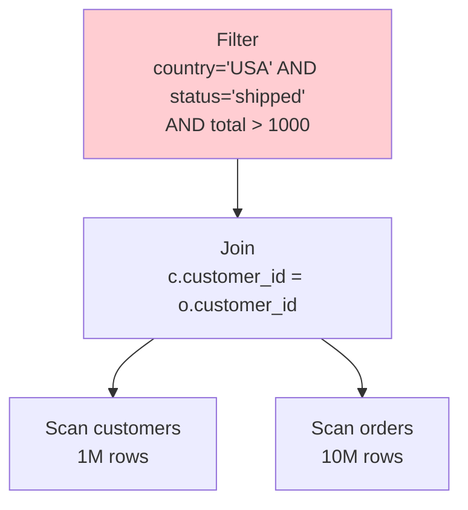
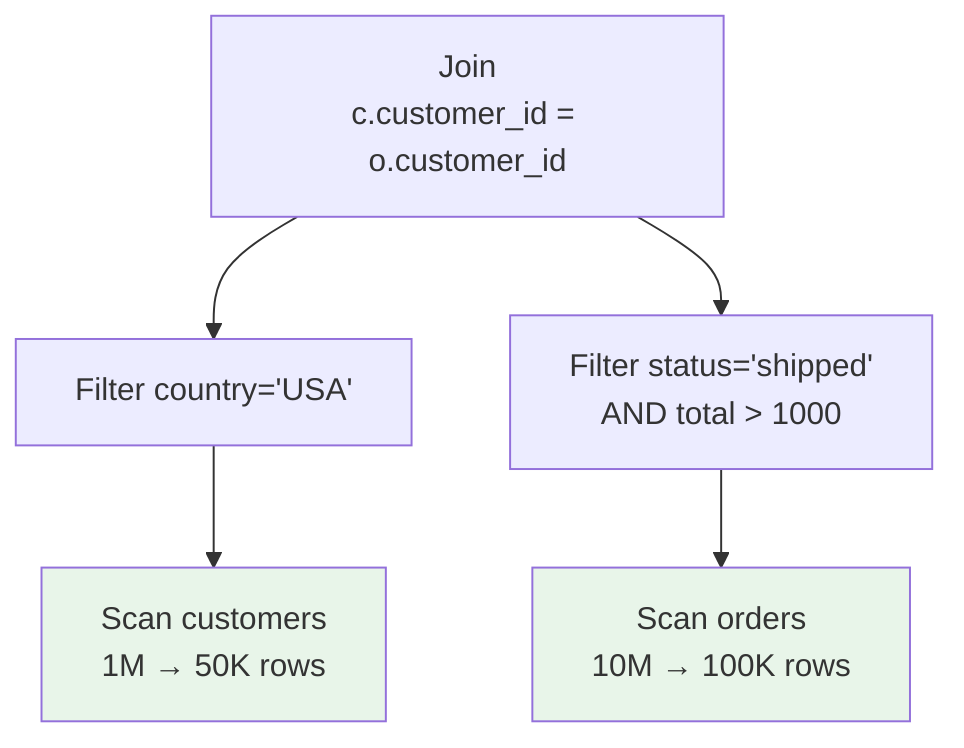

# Predicate Pushdown Example

This example demonstrates how RA optimizes queries by pushing filter predicates down through joins and other operators to reduce data movement and processing.

## The Query

```sql
SELECT c.name, o.order_id, o.total
FROM customers c
JOIN orders o ON c.customer_id = o.customer_id
WHERE c.country = 'USA'
  AND o.status = 'shipped'
  AND o.total > 1000;
```

## Before Optimization

The naive execution plan scans all customers and orders, performs the join, then filters:



**Problem**: We join 1M x 10M rows before filtering, processing billions of intermediate tuples.

## After Predicate Pushdown

RA pushes predicates to the earliest possible point:



## Optimization Steps

1. **Predicate Analysis**: RA analyzes which predicates reference which tables
2. **Pushdown Rules**: Apply transformation rules to push predicates through joins
3. **Cost Estimation**: Verify the pushed-down plan has lower cost

## Running the Example

```bash
# See the optimization in action
cargo run --bin ra-cli -- optimize \
  "SELECT c.name, o.order_id, o.total \
   FROM customers c \
   JOIN orders o ON c.customer_id = o.customer_id \
   WHERE c.country = 'USA' AND o.status = 'shipped' AND o.total > 1000"

# Explain the transformation steps
cargo run --bin ra-cli -- explain --verbose \
  "SELECT c.name, o.order_id, o.total \
   FROM customers c \
   JOIN orders o ON c.customer_id = o.customer_id \
   WHERE c.country = 'USA' AND o.status = 'shipped' AND o.total > 1000"
```

## Performance Impact

With typical data distributions:
- **Before**: Join processes 10 billion intermediate rows
- **After**: Join processes 5 million intermediate rows
- **Speedup**: 2000x reduction in intermediate data
- **I/O Savings**: 95% reduction in data read from disk

## Advanced Pushdown Scenarios

### Through Aggregations

```sql
-- Original
SELECT category, AVG(price) as avg_price
FROM products
GROUP BY category
HAVING AVG(price) > 100;

-- Can't push HAVING through GROUP BY
-- But can push WHERE predicates before aggregation
```

### Through Outer Joins

```sql
-- Original
SELECT *
FROM orders o
LEFT JOIN customers c ON o.customer_id = c.id
WHERE c.country = 'USA';

-- Predicate on outer table converts LEFT JOIN to INNER JOIN
-- Then pushdown is safe
```

### Through Subqueries

```sql
-- Original
SELECT * FROM (
  SELECT * FROM orders WHERE year = 2024
) AS recent_orders
WHERE status = 'pending';

-- Pushed down
SELECT * FROM orders
WHERE year = 2024 AND status = 'pending';
```

## Related Optimizations

- **[Join Reordering](join-reordering.md)** - Optimize join order after pushdown
- **[Index Selection](index-selection.md)** - Use indexes on pushed predicates
- **[Partition Pruning](../features/partition-pruning.md)** - Skip entire partitions