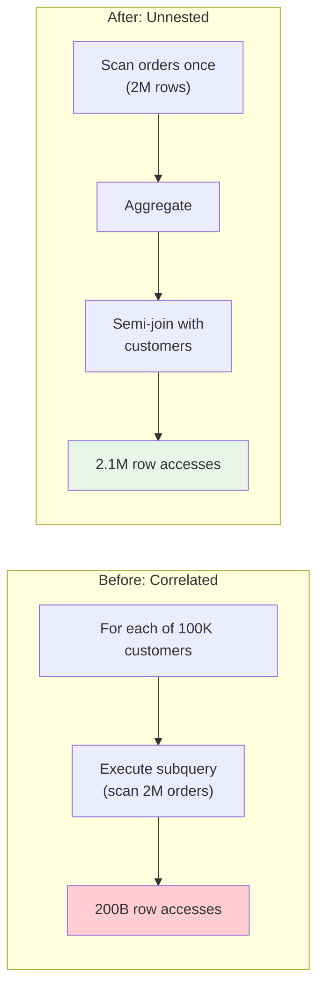

# Example: Subquery Unnesting

This example demonstrates how correlated subqueries are transformed
into joins for more efficient execution.

## Scenario

Find customers who have placed orders totaling more than $10,000:

```sql
SELECT c.name, c.email
FROM customers c
WHERE c.id IN (
    SELECT o.customer_id
    FROM orders o
    GROUP BY o.customer_id
    HAVING SUM(o.amount) > 10000
);
```

**Table statistics:**
- customers: 100,000 rows
- orders: 2,000,000 rows
- Average orders per customer: 20
- ~5% of customers exceed $10,000 total

## Problem: Correlated Execution



Without unnesting, the subquery executes once per customer row:

```
Project [c.name, c.email]
  └─ Filter [c.id IN (subquery)]
      └─ Scan [customers, 100K rows]
          └─ (for each row) SubqueryScan
              └─ Filter [SUM(amount) > 10000]
                  └─ Aggregate [customer_id, SUM(amount)]
                      └─ Filter [o.customer_id = c.id]
                          └─ Scan [orders, 2M rows]
```

**Cost:** 100,000 subquery executions, each scanning up to 2M rows.
Effective cost: ~200 billion row accesses.

## Step 1: Decorrelation

Rule applied: `subquery-to-semi-join`

Convert the `IN (subquery)` to a semi-join:

```
Project [c.name, c.email]
  └─ SemiJoin [c.id = agg.customer_id]
      ├─ Scan [customers, 100K rows]
      └─ Filter [total > 10000]
          └─ Aggregate [customer_id, SUM(amount) AS total]
              └─ Scan [orders, 2M rows]
```

The subquery now executes once and produces a result set. The
semi-join returns customer rows that have a matching aggregated
order total.

## Step 2: Semi-Join to Inner Join

Rule applied: `semi-join-to-inner-join`

When the right side of a semi-join produces at most one row per
join key (guaranteed by GROUP BY customer_id), the semi-join can
be converted to an inner join:

```
Project [c.name, c.email]
  └─ Join [c.id = agg.customer_id]  -- inner join
      ├─ Scan [customers, 100K rows]
      └─ Filter [total > 10000]
          └─ Aggregate [customer_id, SUM(amount) AS total]
              └─ Scan [orders, 2M rows]
```

## Step 3: Join Reordering

Rule applied: `join-commutativity`

The aggregated subquery produces ~5,000 rows (5% of 100K customers).
Build the hash table on the smaller side:

```
Project [c.name, c.email]
  └─ HashJoin [c.id = agg.customer_id]
      ├─ Filter [total > 10000]         -- 5,000 rows (build side)
      │   └─ Aggregate [customer_id, SUM(amount)]
      │       └─ Scan [orders, 2M rows]
      └─ Scan [customers, 100K rows]    -- probe side
```

## Final Optimized Plan

```
Project [c.name, c.email]
  └─ HashJoin [c.id = agg.customer_id]
      ├─ Filter [total > 10000]
      │   └─ HashAggregate [customer_id, SUM(amount) AS total]
      │       └─ Scan [orders, 2M rows]
      └─ Scan [customers, 100K rows]
```

**Cost analysis:**
- Scan orders: 2M rows (once)
- Aggregate: 2M rows -> 100K groups
- Filter: 100K -> 5K rows
- Build hash table: 5K rows
- Probe: 100K customer rows
- **Total: ~2.2M row accesses** (vs ~200 billion correlated)

**Speedup: ~90,000x**

## Subquery Types and Transformations

| Subquery Type          | Transformation            |
|------------------------|---------------------------|
| `WHERE x IN (SELECT ...)`  | Semi-join              |
| `WHERE x NOT IN (SELECT ...)`| Anti-join            |
| `WHERE EXISTS (SELECT ...)` | Semi-join             |
| `WHERE x = (SELECT ...)`   | Inner join (scalar)    |
| `SELECT (SELECT ...)`      | Left outer join        |

## When Unnesting Does Not Apply

- **Correlated lateral joins** with side effects
- **Volatile functions** in the subquery (e.g., `random()`)
- **LIMIT in subquery** may change semantics when converted to join
- **Double negation** patterns (`NOT IN` with NULLs) require careful
  handling to preserve three-valued logic

## Rules Applied

1. **subquery-to-semi-join** -- Decorrelate IN subquery to semi-join
2. **semi-join-to-inner-join** -- Convert semi-join when right side
   has unique join keys
3. **join-commutativity** -- Swap join sides for smaller build table

## Key Takeaways

1. **Correlated subqueries are nested loops** -- they execute the
   inner query once per outer row, which is catastrophic for large
   tables.
2. **Decorrelation converts O(N*M) to O(N+M)** -- the subquery
   executes once and the result is joined.
3. **Semi-joins preserve semantics** -- they return outer rows
   without duplicating them, matching `IN` / `EXISTS` behavior.
4. **Aggregation reduces join input** -- filtering after aggregation
   shrinks the join's build side.

## Next Steps

- [Simple Optimization Example](simple-optimization.md)
- [Distributed Join Strategies](distributed-join-strategies.md)
- [Rule Authoring Guide](../rule-authoring.md)
