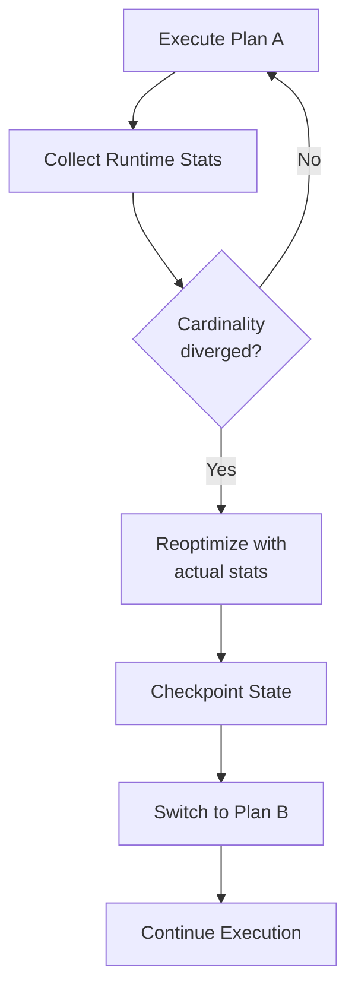

# Adaptive Execution

The `ra-adaptive` crate provides runtime reoptimization and
mid-query plan switching.

## Overview

Static optimization relies on estimated statistics that may be
inaccurate. Adaptive execution monitors runtime statistics and
triggers reoptimization when actual cardinalities diverge from
estimates.

## Components



- **Runtime statistics collection** -- Monitors row counts, execution
  time, and memory usage per operator
- **Reoptimization triggers** -- Conditions that detect when the
  current plan is suboptimal
- **Plan switching** -- Mid-execution transition to a better plan
- **Checkpointing** -- Save and restore operator state across plan
  transitions

## Architecture

```
ra-adaptive/
  runtime_stats.rs   Runtime statistics collection
  triggers.rs        Reoptimization trigger conditions
  plan_switch.rs     Mid-execution plan switching
  executor.rs        Adaptive query executor
  checkpoint.rs      Checkpoint/restart for plan transitions
```

## Further Reading

- [Architecture](../architecture.md) -- Overall system design
- [Cost Models](../guides/cost-models.md) -- Static cost estimation
