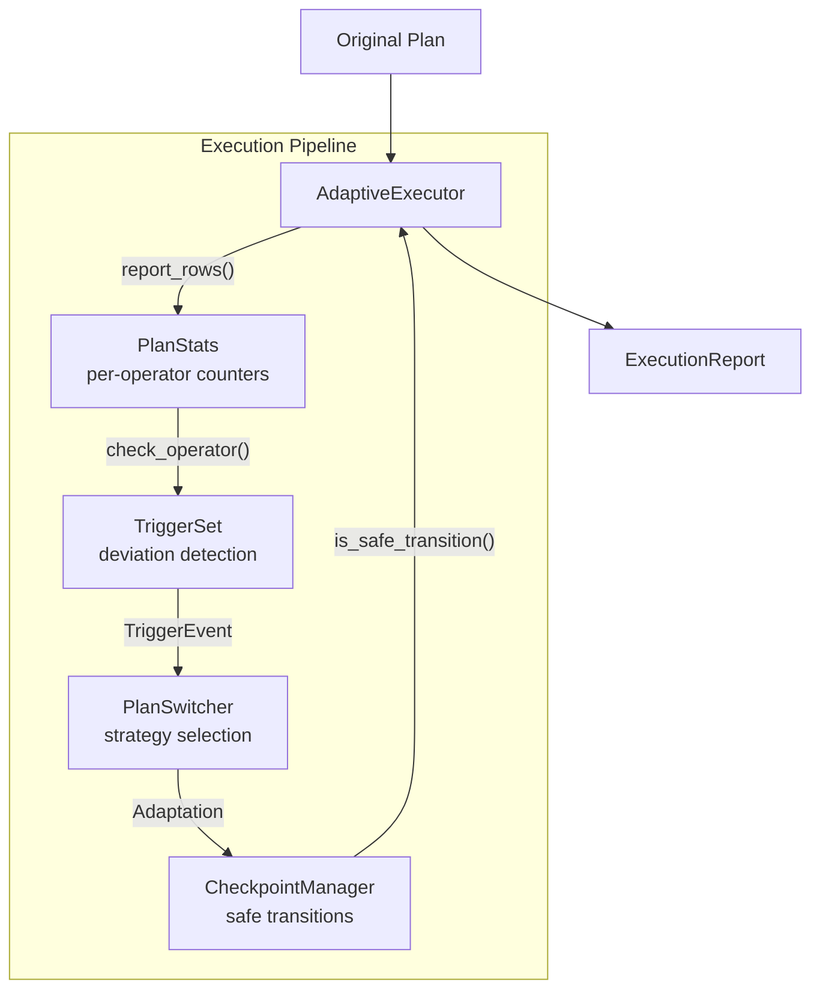
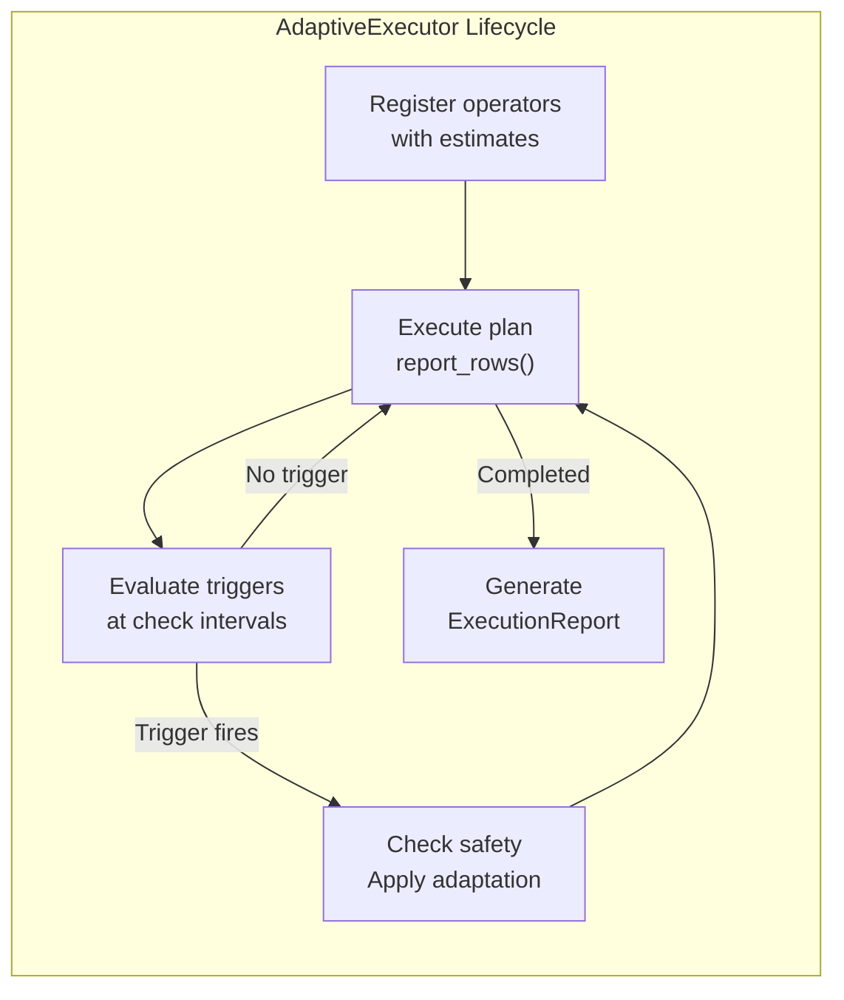

# Adaptive Execution

The `ra-adaptive` crate provides runtime reoptimization and
mid-query plan switching. Traditional query optimizers commit to a
single execution plan based on estimated statistics. When those
estimates are wrong -- and they often are -- the query runs with
a suboptimal plan until it finishes. Adaptive execution fixes
this by monitoring actual runtime behavior and switching strategies
mid-flight.

## Why Adaptive Execution

Static optimization fails in predictable ways:

- **Stale statistics**: Row counts and histograms drift between
  `ANALYZE` runs.
- **Correlation blindness**: Standard statistics assume column
  independence. Real data has correlations.
- **Parameterized queries**: A plan optimized for one parameter
  value may perform poorly for another.
- **Data skew**: A few hot keys dominate a column's distribution,
  causing hash-partitioned joins to produce straggler nodes.

Adaptive execution addresses all of these by treating the execution
plan as a hypothesis that runtime observations can falsify.

## Architecture

The adaptive execution pipeline consists of five components that
work together during query execution:

```
ra-adaptive/
  runtime_stats.rs   Per-operator statistics collection
  triggers.rs        Deviation detection and trigger evaluation
  plan_switch.rs     Strategy selection and plan switching
  checkpoint.rs      Safe transition state management
  executor.rs        Orchestration of the feedback loop
  batch.rs           Batch-mode execution with feedback loops
```

### Component Interaction



## Runtime Statistics Collection

As rows flow through each operator, the executor collects:

| Metric | Type | Purpose |
|--------|------|---------|
| `actual_rows` | `u64` | Running row count for cardinality checking |
| `estimated_rows` | `f64` | Optimizer's prediction (set at registration) |
| `elapsed` | `Duration` | Wall-clock time in the operator |
| `peak_memory_bytes` | `u64` | High-water mark for memory pressure |
| `column_sketches` | `HashMap<String, ColumnSketch>` | Per-column distribution sketches |

Column sketches are lightweight runtime summaries that track:

- **`approx_distinct`**: Approximate NDV (distinct value count)
- **`null_count`**: NULLs observed
- **`most_frequent`**: The single most common value and its count
- **`is_skewed(threshold)`**: Whether a value dominates the
  distribution beyond a threshold fraction

```rust
use ra_adaptive::runtime_stats::{PlanStats, OperatorStats};

let mut plan_stats = PlanStats::new();

// Register operators with their optimizer estimates
plan_stats.register(1, 100_000.0);  // scan: estimated 100K rows
plan_stats.register(2, 50_000.0);   // join: estimated 50K rows

// As execution proceeds, record actual rows
plan_stats.record_rows(1, 10_000);  // batch of 10K from scan
plan_stats.record_rows(2, 85_000);  // join producing more than expected

// Check cardinality ratio
let join_stats = plan_stats.get(2).unwrap();
let ratio = join_stats.cardinality_ratio();
// ratio = Some(1.7) -- 70% more rows than expected
```

## Reoptimization Triggers

Triggers detect when runtime reality has diverged far enough from
the optimizer's model to warrant action. Four trigger types exist:

### Cardinality Underestimate

Fires when `actual_rows / estimated_rows` exceeds a threshold
(default: 10x). This is the most common trigger -- the optimizer
underestimated a table's cardinality or a join's selectivity, and
the chosen algorithm (e.g., nested-loop) is now orders of magnitude
slower than alternatives (e.g., hash join).

### Cardinality Overestimate

Fires when `estimated_rows / actual_rows` exceeds a threshold
(default: 10x). The optimizer over-allocated resources. A hash
join with a massive hash table may be slower than a simple
nested-loop for what turns out to be a tiny result set.

### Skew Detection

Fires when a single value accounts for more than a threshold
fraction (default: 50%) of a column's rows in a join input.
Skewed joins cause a single partition to become a bottleneck.

### Memory Pressure

Fires when `peak_memory_bytes` exceeds a multiple (default: 3x) of
the budgeted memory for an operator. This signals that the operator
should spill to disk or switch to an external algorithm.

### Configuration

```rust
use ra_adaptive::triggers::TriggerConfig;

let config = TriggerConfig {
    cardinality_overcount_ratio: 10.0,   // underestimate threshold
    cardinality_undercount_ratio: 10.0,  // overestimate threshold
    skew_fraction: 0.5,                  // skew detection
    memory_ratio: 3.0,                   // memory pressure
    min_rows_for_cardinality: 1000,      // avoid noise on small data
};
```

The `min_rows_for_cardinality` parameter prevents triggers from
firing on small intermediate results where statistical noise can
produce false alarms.

## Plan Switching

When a trigger fires, the `PlanSwitcher` decides what adaptation
to apply. Four adaptation types are supported:

### Join Algorithm Switch

Switch between nested-loop, hash join, and sort-merge join
at a defined row count threshold.

```
Trigger: CardinalityUnderestimate at a nested-loop join
Action:  SwitchJoinStrategy(NestedLoop -> HashJoin)
```

The default threshold is 10,000 rows: below this, nested-loop is
preferred; above, hash join.

### Join Input Swap

Swap the left and right inputs of a join when the smaller
table is on the wrong side. For outer joins, the join type
is adjusted accordingly (`LeftOuter` becomes `RightOuter`).

```
Trigger: SkewDetected
Action:  SwapJoinInputs(node_id)
```

### Full Reoptimization

When cardinality estimates are so far off (> 100x) that local
operator-level fixes are insufficient, the entire plan tree
is re-optimized with corrected statistics.

```
Trigger: CardinalityUnderestimate with deviation > 100x
Action:  ReoptimizePlan(new_plan)
```

### Spill to Disk

When memory pressure triggers, signal the affected operator to
switch from an in-memory algorithm to an external (disk-backed)
variant.

```
Trigger: MemoryPressure
Action:  SpillToDisk(node_id)
```

## Checkpointing

Plan switches can only happen safely at operator boundaries where
intermediate state is recoverable. The `CheckpointManager` tracks
execution progress at each operator and determines safe transition
points.

A checkpoint records:

- **`node_id`**: Which operator
- **`sequence`**: Ordering for replay
- **`state`**: `NotStarted`, `InProgress { rows_emitted }`, or
  `Completed { total_rows }`
- **`materialized`**: Whether buffered rows are available for replay

### Safety Rules

A plan switch is safe when:

1. The target operator is in-progress (not yet completed), so the
   new strategy can still improve performance.
2. The operator has at least one checkpoint, so intermediate state
   is recoverable.

For full reoptimization (`ReoptimizePlan`), all operators that
have started must have checkpoints.

```rust
use ra_adaptive::checkpoint::{CheckpointManager, CheckpointState};
use ra_adaptive::plan_switch::{Adaptation, JoinStrategy};

let mut mgr = CheckpointManager::new();

// Record progress
mgr.record(1, CheckpointState::InProgress { rows_emitted: 5000 });

// Check if a switch is safe
let adaptation = Adaptation::SwitchJoinStrategy {
    node_id: 1,
    from: JoinStrategy::NestedLoop,
    to: JoinStrategy::HashJoin,
};
assert!(mgr.is_safe_transition(&adaptation));
```

## Adaptive Executor

The `AdaptiveExecutor` ties everything together. It is the main
entry point for adaptive query execution:



### Configuration

```rust
use ra_adaptive::executor::AdaptiveConfig;

let config = AdaptiveConfig {
    // Evaluate triggers every 10K rows
    check_interval_rows: 10_000,
    // Maximum 5 adaptations per query
    max_adaptations: 5,
    // Trigger thresholds (see TriggerConfig above)
    trigger_config: TriggerConfig::default(),
    // Enable/disable adaptive execution
    enabled: true,
};
```

### End-to-End Example

```rust
use ra_adaptive::executor::{AdaptiveConfig, AdaptiveExecutor};
use ra_adaptive::plan_switch::JoinStrategy;
use ra_core::algebra::{JoinType, RelExpr};

// Build a join plan
let plan = RelExpr::Join {
    join_type: JoinType::Inner,
    condition: /* ... */,
    left: Box::new(RelExpr::scan("orders")),
    right: Box::new(RelExpr::scan("customers")),
};

// Create executor with adaptive monitoring
let mut executor = AdaptiveExecutor::new(plan);

// Register join operator: optimizer estimates 1,000 rows
executor.register_join(1, 1_000.0, JoinStrategy::NestedLoop);

// Simulate execution: actual cardinality is 100x the estimate
for _ in 0..10 {
    let adaptations = executor.report_rows(1, 10_000);
    for adaptation in &adaptations {
        println!("Applied: {:?}", adaptation);
    }
}

// Inspect final state
let report = executor.report();
assert!(report.was_adapted);
assert_eq!(
    executor.join_strategy(1),
    Some(JoinStrategy::HashJoin),
);
```

In this example, the executor starts with a nested-loop join
(appropriate for the estimated 1,000 rows), detects that actual
cardinality is 100x higher, and switches to a hash join mid-execution.

### Execution Report

After execution, the `ExecutionReport` provides diagnostics:

- **`final_plan`**: The plan after all adaptations
- **`was_adapted`**: Whether any adaptations occurred
- **`adaptation_count`**: Number of adaptations applied
- **`adaptations`**: Detailed record of each adaptation (trigger,
  adaptation type, rows at switch point)
- **`final_stats`**: Per-operator summary (estimated vs actual rows,
  cardinality ratio)

## Batch-Mode Execution

For workloads that process queries in batches (e.g., analytics
pipelines), `ra-adaptive` provides a batch executor that collects
feedback after each batch and applies corrections to the statistics
state before optimizing the next batch.

Three feedback modes control how aggressively statistics are updated:

| Mode | Behavior | Risk |
|------|----------|------|
| `ConfidenceOnly` | Adjust confidence scores without changing statistics | Safe but slow to converge |
| `IncrementalStats` | Update confidence and apply row count corrections | Balanced; default |
| `FullReanalyze` | Replace statistics entirely with latest snapshot | Fast convergence but may oscillate |

## Comparison with Static Planning

| Aspect | Static Planning | Adaptive Execution |
|--------|----------------|-------------------|
| Statistics required | Accurate, up-to-date | Best-effort; runtime corrects |
| Plan commitment | Single plan for entire query | Plan can change mid-execution |
| Correlated columns | Assumes independence | Observes actual selectivity |
| Skew handling | Must be pre-detected | Detected at runtime |
| Memory management | Based on estimates | Responds to actual usage |
| Overhead | None at runtime | Per-operator monitoring cost |
| Best for | Short OLTP queries | Long-running analytical queries |

### When to Use Adaptive Execution

Enable adaptive execution when:

- Queries join large tables where cardinality estimates are uncertain
- Statistics are stale or unavailable
- Data distribution changes frequently
- Queries use parameterized values that produce different selectivities
- Hash joins risk memory pressure from underestimated build sides

Disable it when:

- Queries are very short (< 1000 rows total) -- monitoring overhead
  is not justified
- Statistics are known to be accurate (e.g., freshly analyzed
  tables with no DML)
- The query uses only index lookups with well-bounded cardinality

## Performance Characteristics

- **Monitoring overhead**: One counter increment per row per operator.
  Trigger evaluation happens only at `check_interval_rows` boundaries.
- **Checkpoint cost**: Recording a checkpoint is O(1) -- it stores
  a node ID, sequence number, and row count.
- **Plan switch cost**: Applying a `SwitchJoinStrategy` is a
  constant-time metadata update. `SwapJoinInputs` clones the plan
  tree once. `ReoptimizePlan` re-runs the optimizer, which is bounded
  by the e-graph saturation timeout.
- **Memory**: Per-operator stats are fixed-size. Column sketches add
  one entry per tracked column.

## Progressive Re-optimization

For queries with multiple join stages, Ra supports progressive
re-optimization through the Plan Stitch technique. Stitch points
are placed at natural operator boundaries:

- **`JoinBuildComplete`**: After the build side of a hash join
  materializes
- **`AggregateInput`**: Before aggregation consumes its input
- **`SortInput`**: During sort input scanning
- **`SubqueryBoundary`**: At subquery materialization points

At each stitch point, the executor compares actual cardinality
against the estimate. If the divergence factor exceeds the threshold
(default: 2x), the remaining plan is re-optimized with corrected
statistics and stitched onto the already-completed operators.

## Further Reading

- [Statistics Streaming](../guides/statistics-streaming.md) --
  How statistics are ingested and maintained.
- [Architecture: Dataflow Architecture](../architecture.md#dataflow-architecture) --
  How adaptive execution integrates with differential dataflow.
- [Cost Models](../guides/cost-models.md) -- Static cost estimation
  that provides the baseline for adaptive correction.
