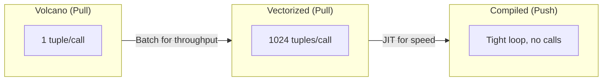
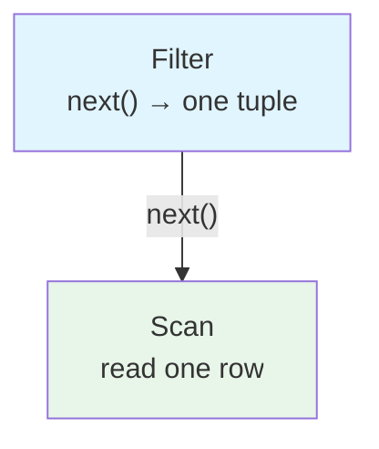
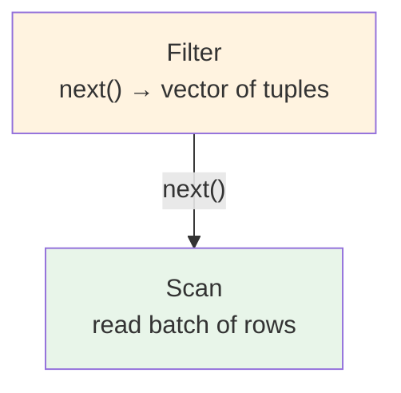
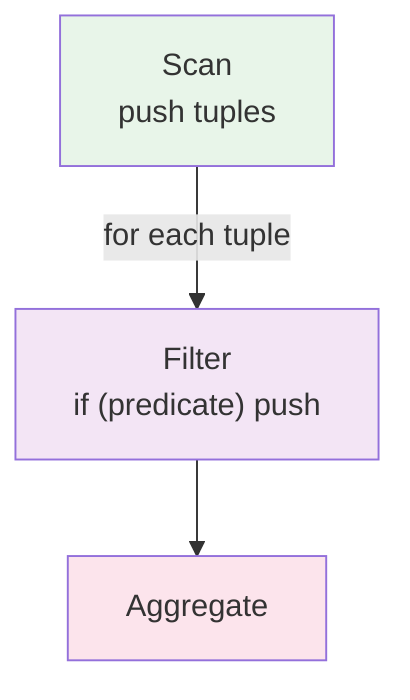
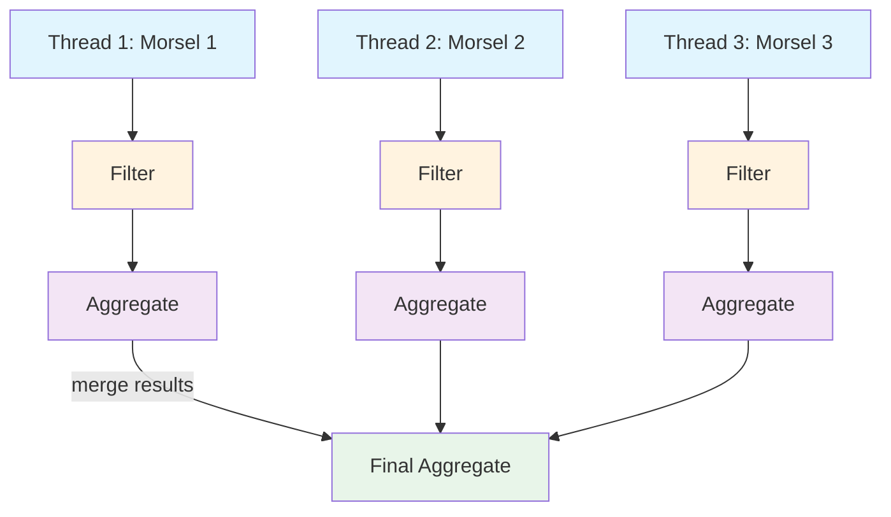
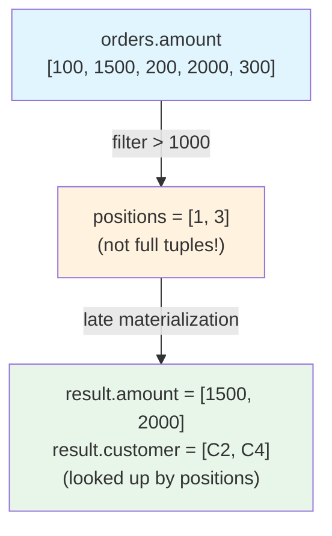

# Query Execution Models

This document describes different query execution models and how they influence optimization rules.

## Overview

Query execution models define how operators process data at runtime. The choice of execution model significantly impacts which optimization rules are applicable and beneficial.



## Execution Models

### 1. Volcano / Iterator Model

**Used by:** PostgreSQL, MySQL, SQLite, Oracle (traditional)

**Description:**
- Pull-based iterator interface
- Each operator implements `open()`, `next()`, `close()`
- Processes one tuple at a time
- Control flow passes up through operator tree

**Characteristics:**


**Advantages:**
- Simple to implement
- Low memory footprint
- Pipelining between operators
- Natural for streaming results

**Disadvantages:**
- High interpretation overhead (virtual function calls)
- Poor CPU cache utilization
- Limited vectorization opportunities
- Difficult to optimize across operator boundaries

**Optimization Implications:**
- Focus on reducing tuple flow (predicate pushdown)
- Join order matters significantly
- Index selection critical
- Materialization points important

**Example Rules Specific to Volcano:**
- Early materialization of expressions
- Index-only scans to avoid tuple reconstruction
- Sort avoidance (exploit existing order)

---

### 2. Vectorized / Batch Processing Model

**Used by:** DuckDB, ClickHouse, Apache Arrow, Snowflake

**Description:**
- Pull-based like Volcano but processes batches
- Each operator processes vectors of tuples (typically 1024-8192)
- Amortizes interpretation overhead
- Enables SIMD vectorization

**Characteristics:**


**Advantages:**
- Much lower interpretation overhead
- Excellent CPU cache utilization
- SIMD vectorization opportunities
- Good balance of simplicity and performance

**Disadvantages:**
- Higher memory usage (batch buffers)
- Fixed batch sizes may not suit all workloads
- Still some interpretation overhead between batches

**Optimization Implications:**
- Batch size tuning matters
- Vectorizable operations preferred
- Column pruning even more important
- Compression-aware execution

**Example Rules Specific to Vectorized:**
- Prefer hash aggregation over sort-based
- Late materialization (column-at-a-time)
- Expression batching
- Filter ordering by selectivity

**DuckDB-Specific Optimizations:**
- Perfect hash joins for low-cardinality joins
- Adaptive filter pushdown (runtime statistics)
- Parallel scan with work stealing
- Zone maps for Parquet predicate pushdown

---

### 3. Push-Based / Compiled Model

**Used by:** HyPer, Umbra, SQL Server (batch mode), Apache Spark (Tungsten)

**Description:**
- Push-based data flow
- Generates code (JIT compilation)
- Processes data through tight loops
- Minimal interpretation overhead

**Characteristics:**


**Generated Code Example:**
```rust
for row in table_scan() {
    if row.amount > 1000 {  // filter inlined
        aggregate(row);      // push to next op
    }
}
```

**Advantages:**
- Minimal interpretation overhead
- Excellent CPU cache utilization
- Compiler optimizations (loop unrolling, inlining)
- Tight inner loops

**Disadvantages:**
- Compilation overhead
- Complex implementation
- Harder to debug
- Limited by compilation time

**Optimization Implications:**
- Prefer simple expressions (easier to compile)
- Pipeline breakers (sorts, hash joins) are expensive
- Materialization decisions critical
- Branch prediction matters

**Example Rules Specific to Push-Based:**
- Fuse operators into pipelines
- Hoist invariant expressions out of loops
- Prefer indexed access to avoid full scans
- Specialize code for common cases

---

### 4. Morsel-Driven Parallelism

**Used by:** HyPer, Umbra, MemSQL (SingleStore)

**Description:**
- Parallelizes pipeline execution
- Processes data in "morsels" (small batches)
- NUMA-aware scheduling
- Work stealing for load balancing

**Characteristics:**


**Advantages:**
- Excellent scalability on multi-core
- NUMA-aware (process data on local memory)
- Dynamic load balancing
- Cache-efficient morsels

**Disadvantages:**
- Complex scheduling logic
- Requires careful synchronization
- Not beneficial for small queries

**Optimization Implications:**
- Parallelize scans and pipeline breakers
- Avoid global state
- Partition-aware execution
- Balance morsel size vs. scheduling overhead

**Example Rules Specific to Morsel-Driven:**
- Insert exchange operators at pipeline breakers
- Prefer local aggregation before global
- Partition data by NUMA node
- Size morsels for L3 cache

---

### 5. Differential Dataflow / Streaming Model

**Used by:** Materialize, Differential Dataflow, Naiad

**Description:**
- Incremental computation over changing data
- Maintains materialized views incrementally
- Tracks data as (value, time, multiplicity) triples
- Computes deltas (differences) rather than full results

**Characteristics:**
```
Input Changes ($\Delta$):
  +1 row: (order_id=123, amount=1500)
  -1 row: (order_id=100, amount=500)

Materialized View:
  Query: SELECT customer_id, SUM(amount)
         FROM orders GROUP BY customer_id

Incremental Update:
  customer_1: $\Delta$ amount = +1500 - 500 = +1000
  -> Update view with delta, not full recomputation
```

**Core Concepts:**

**Timely Dataflow:**
- Computation organized as dataflow graph
- Data flows through operators with timestamps
- Operators emit outputs when inputs are complete for a timestamp
- Enables pipelined, parallel execution

**Differential Dataflow:**
- Extends timely with collection types
- Maintains arrangements (indexed views)
- Tracks changes (insertions/deletions) with multiplicity
- Only recomputes affected parts

**Advantages:**
- Incremental view maintenance
- Handles streaming and batch uniformly
- Automatic incrementalization
- Scales to large datasets
- Consistent results across temporal queries

**Disadvantages:**
- Memory overhead (maintain arrangements)
- Complex implementation
- Learning curve for query authors
- Not suitable for all workloads

**Optimization Implications:**
- Arrangement selection critical (what to index)
- Join order for minimal intermediate state
- Delta queries vs. full queries
- Temporal filter pushdown
- Minimize arrangement cardinality

**Materialize-Specific Optimizations:**

**1. Arrangement Selection:**
```sql
-- Query: Find high-value orders per customer
SELECT customer_id, COUNT(*)
FROM orders
WHERE amount > 1000
GROUP BY customer_id

-- Optimizer decides which arrangements to maintain:
Option A: Arrange orders by customer_id, apply filter after
Option B: Arrange filtered orders (amount > 1000) by customer_id
          -> Better: smaller arrangement
```

**2. Join Ordering for Incrementality:**
- Prefer to join small delta against large collection
- Maintain arrangements on stable (rarely changing) sides
- Use semi-joins to avoid building large intermediate results

**3. Temporal Filters:**
```sql
-- Temporal filter: Only recent data
SELECT * FROM orders
WHERE order_time > NOW() - INTERVAL '1 hour'

-- Optimizer: Maintain sliding window arrangement
-- Garbage collect old data automatically
```

**4. Delta Queries:**
```rust
// Instead of:
SELECT COUNT(*) FROM orders  -- Full recomputation

// Materialize maintains:
previous_count + $\Delta$ count  // Incremental update
```

**Example Rules Specific to Differential:**
- `temporal-filter-pushdown.rra` - Push temporal predicates to source
- `arrangement-selection.rra` - Choose which indexes to maintain
- `differential-join.rra` - Join deltas efficiently
- `join-order-for-incrementality.rra` - Order joins for minimal state
- `arrangement-sharing.rra` - Reuse arrangements across queries

**When to Use:**
- Real-time analytics (dashboards)
- Streaming ETL pipelines
- Change data capture (CDC) scenarios
- Temporal queries (time-series, event processing)
- Incremental view maintenance

---

### 6. Column-at-a-Time / X100 Model

**Used by:** MonetDB, VectorWise (Actian Vector)

**Description:**
- Vectorized execution pioneered by MonetDB
- Processes entire columns at a time
- Late materialization (work with positions, not tuples)
- Cache-conscious operators

**Characteristics:**


**Core Concepts:**

**1. Late Materialization:**
- Don't construct full tuples until needed
- Work with column positions (offsets)
- Project only required columns at the end

**2. Column-wise Primitives:**
```c
// Traditional tuple-at-a-time:
for each tuple:
    if (tuple.amount > 1000)
        result.add(tuple)

// Column-at-a-time:
positions = select_gt(amount_col, 1000)  // SIMD-friendly
result_amount = gather(amount_col, positions)
result_customer = gather(customer_col, positions)
```

**3. Cache-Conscious Processing:**
- Entire columns fit in CPU cache
- Sequential access patterns
- Excellent prefetching behavior

**Advantages:**
- Exceptional scan performance
- SIMD vectorization (process 4-16 values per instruction)
- Minimal tuple reconstruction overhead
- Excellent CPU cache utilization
- Compression-friendly (columnar data)

**Disadvantages:**
- High memory bandwidth requirements
- Not ideal for point queries
- Materialization points need careful placement
- Join implementation more complex

**Optimization Implications:**
- Column pruning extremely important
- Late materialization preferred
- Operator ordering by selectivity
- Minimize intermediate column materialization
- Exploit column compression

**MonetDB-Specific Optimizations:**

**1. Database Cracking:**
```sql
-- On first query with filter:
SELECT * FROM orders WHERE region = 'US'

-- MonetDB "cracks" the region column:
-- Partitions data: [region='US' | region!='US']
-- Remembers partition for future queries
-- No upfront indexing cost!
```

**2. Column Imprints:**
- Lightweight indexes on cache lines
- Bit vector per cache line indicates value ranges
- Fast elimination of irrelevant cache lines

**3. Sideways Cracking:**
```sql
-- Query 1 cracks on region
SELECT * FROM orders WHERE region = 'US'

-- Query 2 on different column uses existing cracks
SELECT * FROM orders WHERE amount > 1000 AND region = 'US'
-- Optimizer: Apply amount filter only to US partition
```

**4. Late Materialization Example:**
```sql
SELECT customer_name, order_total
FROM orders
WHERE amount > 1000 AND region = 'US'

Execution:
1. positions₁ = select(amount_col, > 1000)     // positions [1,3,7,9]
2. positions₂ = select(region_col, = 'US')     // positions [1,2,3,8,9]
3. positions  = intersect(positions₁, positions₂) // positions [1,3,9]
4. names  = gather(customer_name_col, positions)  // only now materialize
5. totals = gather(order_total_col, positions)
```

**Example Rules Specific to Column-at-a-Time:**
- `late-materialization.rra` - Defer tuple reconstruction
- `column-pruning-aggressive.rra` - Eliminate unused columns early
- `filter-ordering-by-selectivity.rra` - Apply most selective filters first
- `position-based-join.rra` - Join on positions before materialization
- `column-cracking.rra` - Adaptive indexing during query execution

**When to Use:**
- OLAP / Analytics workloads
- Scans over large datasets
- Aggregation queries
- Columnar storage formats (Parquet, ORC)
- Read-heavy workloads

**Performance Characteristics:**
```
Benchmark: Scan 100M rows, filter 1%, project 2 columns

Tuple-at-a-time:  12,000 ms
Vectorized (1K):   3,500 ms
Column-at-a-time:    800 ms  <- 15x faster than tuple-at-a-time
```

---

## Execution Model Selection

Different execution models excel at different workloads:

| Model | Best For | Avoid For |
|-------|----------|-----------|
| Volcano | OLTP, low latency, streaming | Large scans, analytics |
| Vectorized | Mixed workloads, general-purpose | Maximum throughput |
| Push-based | Read-heavy, complex queries | Frequent re-compilation |
| Morsel-driven | Multi-core analytics | Single-threaded, small data |
| Differential | Streaming, incremental views | One-shot batch queries |
| Column-at-a-time | Large scans, aggregations | Point queries, updates |

## Hybrid Approaches

Modern systems often combine multiple models:

**SQL Server:**
- Row mode (Volcano) for OLTP
- Batch mode (Vectorized) for analytics
- Adaptive execution switches between modes

**PostgreSQL with JIT:**
- Standard Volcano execution
- JIT compilation for hot paths
- Best of both worlds for complex queries

**Materialize:**
- Differential dataflow for incremental computation
- Vectorized operators within differential framework
- Streaming and batch unified

## Rule Applicability Matrix

| Optimization | Volcano | Vectorized | Push-Based | Morsel | Differential | Column |
|--------------|---------|------------|------------|--------|--------------|--------|
| Predicate Pushdown | [x][x][x] | [x][x][x] | [x][x][x] | [x][x][x] | [x][x][x] | [x][x][x] |
| Join Reordering | [x][x][x] | [x][x][x] | [x][x][x] | [x][x] | [x][x][x] | [x][x] |
| Late Materialization | [x] | [x][x] | [x][x] | [x][x] | [x] | [x][x][x] |
| Pipeline Fusion | [x] | [x] | [x][x][x] | [x][x][x] | [x][x] | [x] |
| Vectorization | [FAIL] | [x][x][x] | [x][x] | [x][x][x] | [x][x] | [x][x][x] |
| Parallelization | [x] | [x][x] | [x][x] | [x][x][x] | [x][x][x] | [x][x] |
| Incremental | [FAIL] | [FAIL] | [FAIL] | [FAIL] | [x][x][x] | [FAIL] |
| Column Cracking | [FAIL] | [FAIL] | [FAIL] | [FAIL] | [FAIL] | [x][x][x] |

## References

**Academic Papers:**
- Graefe, Goetz. "Volcano - An Extensible and Parallel Query Evaluation System." ICDE 1994.
- Boncz, Peter A., et al. "MonetDB/X100: Hyper-Pipelining Query Execution." CIDR 2005.
- Neumann, Thomas. "Efficiently Compiling Efficient Query Plans for Modern Hardware." VLDB 2011.
- Idreos, Stratos, et al. "Database Cracking." CIDR 2007.
- McSherry, Frank, et al. "Differential Dataflow." CIDR 2013.
- Leis, Viktor, et al. "Morsel-Driven Parallelism." SIGMOD 2014.

**Database Documentation:**
- PostgreSQL: https://www.postgresql.org/docs/current/executor.html
- MonetDB: https://www.monetdb.org/documentation-Jan2022/developer-guide/
- Materialize: https://materialize.com/docs/overview/how-materialize-works/
- DuckDB: https://duckdb.org/docs/internals/execution
