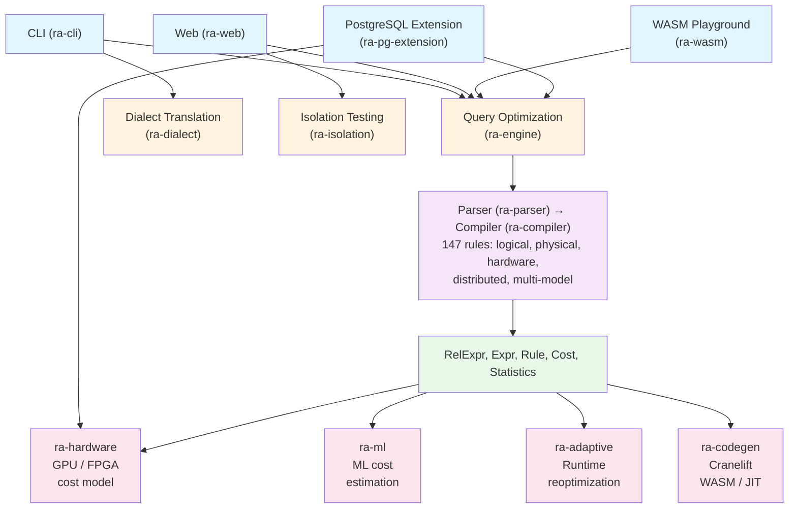
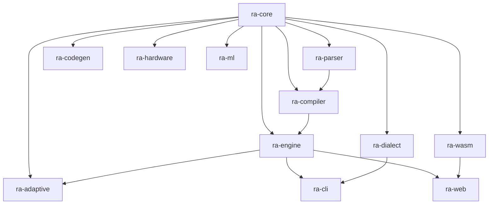
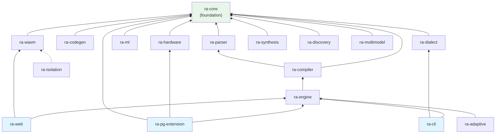
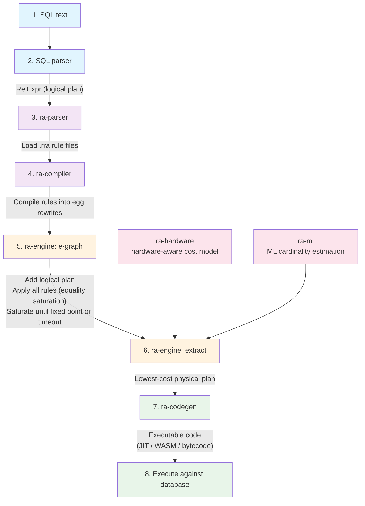
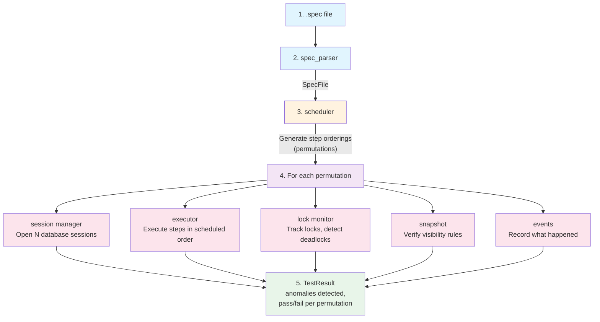
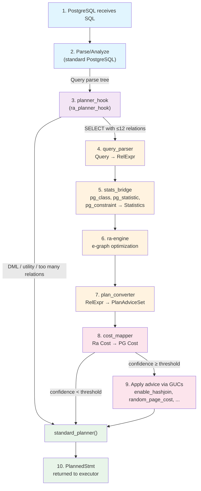

# Platform Architecture

This document provides a high-level overview of the Relational Algebra
Rule System as an integrated platform, covering how the crates
connect and the data flows between them.

## System Overview

The platform codifies database query optimization knowledge into a
single system that can parse, validate, optimize, execute, and
translate SQL across database engines.



## Crate Dependency Graph





## Data Flow: Query Optimization

A SQL query flows through the system as follows:



## Data Flow: Dialect Translation

```mermaid
graph TD
    D1["1. SQL text<br/>(source dialect)"] --> D2["2. sqlparser: parse"]
    D2 -->|AST| D3["3. ra-dialect: rewrite passes"]
    D3 -->|"Function rewriting (CONCAT vs &#124;&#124;)<br/>Operator rewriting (:: vs CAST)<br/>LIMIT/OFFSET syntax<br/>Date/time functions<br/>Type mappings"| D4["4. sqlparser: render"]
    D4 -->|"SQL text (target dialect)"| D5["5. Warnings about<br/>semantic differences"]

    style D1 fill:#e1f5fe
    style D2 fill:#e1f5fe
    style D3 fill:#fff3e0
    style D4 fill:#e8f5e9
    style D5 fill:#fce4ec
```



## Data Flow: Isolation Testing



## Data Flow: PostgreSQL Planner Hook

When loaded as a PostgreSQL extension via `shared_preload_libraries`,
Ra intercepts SELECT queries through the planner hook mechanism:



The extension reads PostgreSQL catalog statistics (via syscache, not
SPI) and uses hardware detection to tune cost parameters. On any error,
it falls back to the standard planner. See
[PostgreSQL Integration](../integrations/postgresql.md) for full details.

## Crate Summaries

### Foundation

| Crate       | Purpose                                    |
|-------------|--------------------------------------------|
| ra-core     | Shared types: RelExpr, Expr, Cost, Rule    |
| ra-parser   | Parse .rra literate rule files             |
| ra-compiler | Compile and index rules, type checking     |

### Optimization

| Crate       | Purpose                                    |
|-------------|--------------------------------------------|
| ra-engine   | E-graph optimization (egg), extraction     |
| ra-hardware | GPU/FPGA/SIMD/NUMA cost models             |
| ra-ml       | Neural network cardinality estimation      |
| ra-adaptive | Runtime reoptimization, plan switching     |
| ra-codegen  | JIT compilation (Cranelift), WASM, bytecode|

### Translation and Testing

| Crate        | Purpose                                   |
|--------------|-------------------------------------------|
| ra-dialect   | SQL dialect translation (6 dialects)      |
| ra-isolation | Cross-database isolation testing          |
| ra-wasm      | WASM database adapters (SQLite, DuckDB)   |

### Rule Discovery

| Crate        | Purpose                                   |
|--------------|-------------------------------------------|
| ra-synthesis | Natural language to SQL generation        |
| ra-discovery | Automatic rule mining from execution logs |
| ra-multimodel| Graph, document, time-series rules        |

### Applications

| Crate             | Purpose                                      |
|-------------------|----------------------------------------------|
| ra-cli            | Command-line interface                       |
| ra-web            | Web explorer backend (Rocket.rs)             |
| ra-pg-extension   | PostgreSQL planner hook (pgrx, PG 13--18)    |

## Rule Categories

The 147 rules are organized into 5 major categories:

### Logical Rules (20 rules)

Transform query plans while preserving semantics:
- Predicate pushdown (5 rules)
- Join reordering (5 rules)
- Projection pushdown (3 rules)
- Expression simplification (5 rules)
- Set operations (2 rules)

### Hardware Rules (21 rules)

Accelerate operators using specialized hardware:
- GPU operators (8 rules) -- parallel scan, hash join, aggregation
- FPGA streaming (4 rules) -- filter, compression, regex
- CPU acceleration (5 rules) -- SIMD, NUMA, cache, prefetch
- Data placement (4 rules) -- transfer, caching, memory management

### Distributed Rules (36 rules)

Optimize queries across multiple nodes:
- Exchange placement (4 rules)
- Data movement minimization (5 rules)
- Distributed joins (7 rules) -- broadcast, shuffle, co-located
- Partial aggregation (3 rules)
- Partition pruning (3 rules)
- Distributed sort/topN (3 rules)
- Co-location strategies (5 rules)
- Stage planning (3 rules)

### Multi-Model Rules (30 rules)

Optimize non-relational query patterns:
- Graph traversal (10 rules) -- path, pattern matching
- Document queries (10 rules) -- nested pushdown, pipelines
- Time-series (10 rules) -- range pruning, downsampling

### Physical and Database-Specific

Physical operator selection, index strategies, and engine-specific
optimizations (categories defined but not yet populated with rules).

## Configuration

### Optimization Budget

The engine respects time and iteration budgets:

```rust
OptimizationConfig {
    timeout_ms: 1000,      // max wall-clock time
    max_iterations: 100,   // max e-graph iterations
    cost_model: Box::new(HardwareCostModel::new(profile)),
}
```

### Hardware Profiles

Preset hardware profiles configure cost models:

- `HardwareProfile::gpu_server()` -- NVIDIA A100 80 GB, PCIe 4.0
- `HardwareProfile::fpga_appliance()` -- Xilinx Alveo U280
- `HardwareProfile::cpu_only()` -- Dual Xeon, DDR5

## Extension Points

1. **Custom Rules** -- Add `.rra` files to `rules/` directory
2. **Custom Cost Models** -- Implement `CostModel` trait
3. **Custom Backends** -- Implement code generation for new targets
4. **Custom Dialects** -- Add `Dialect` variants and translation rules
5. **Custom Adapters** -- Implement `DatabaseAdapter` for new engines

## References

- [Architecture details](architecture.md)
- [Rule authoring guide](rule-authoring.md)
- [API reference](api-reference.md)
- [Cost models](cost-models.md)
- [Hardware acceleration](hardware-acceleration.md)
- [Dialect translation](dialect-translation.md)
- [Isolation testing](isolation-testing.md)
- [WASM databases](wasm-databases.md)
- [Execution models](execution-models.md)
- [PostgreSQL integration](../integrations/postgresql.md)
