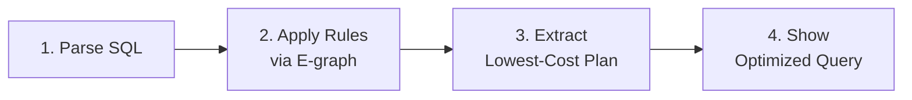

# Getting Started with RA

This guide demonstrates RA's major features through practical examples. RA is a query optimizer that transforms SQL queries into optimal execution plans using 1,327+ transformation rules, equality saturation, and cost-based optimization.

## Installation

### Prerequisites

- Rust 1.85+ with cargo
- (Optional) Nix for reproducible builds
- (Optional) Docker for web UI

### Build from Source

```bash
# Using Nix (recommended for reproducible builds)
nix develop
cargo build --release

# Without Nix
cargo build --release

# Install the CLI
cargo install --path crates/ra-cli

# Verify installation
cargo test --all-features
```

::: tip
Examples in this guide use the short form `ra-cli <command>`, which assumes the
binary is installed on your `PATH`. During development you can also run
`cargo run --bin ra-cli -- <args>` from the workspace root.
:::

## Quick Start: Basic Optimization

Optimize your first SQL query:

```bash
ra-cli optimize \
  "SELECT * FROM orders WHERE amount > 1000 AND status = 'active'"
```

RA will:



## Major Features

### 1. Dialect Translation

Translate queries between 20+ database dialects:

```bash
# PostgreSQL to MySQL
ra-cli translate \
  --from postgres --to mysql \
  "SELECT * FROM orders WHERE created_at > NOW() - INTERVAL '7 days'"

# Oracle to SQLite
ra-cli translate \
  --from oracle --to sqlite \
  "SELECT * FROM dual WHERE ROWNUM <= 10"

# SQL Server to DuckDB
ra-cli translate \
  --from sqlserver --to duckdb \
  "SELECT TOP 10 * FROM orders WITH (NOLOCK)"
```

### 2. Hardware-Aware Optimization

Optimize for specific hardware configurations:

```bash
# Desktop/workstation profile
ra-cli optimize \
  --hardware-profile desktop \
  "SELECT SUM(amount) FROM large_dataset GROUP BY category"

# Server profile for high-end hardware
ra-cli optimize \
  --hardware-profile server \
  "SELECT * FROM orders WHERE amount BETWEEN 100 AND 1000"

# GPU-accelerated server profile
ra-cli optimize \
  --hardware-profile gpu-server \
  "SELECT * FROM large_dataset GROUP BY category"

# Automatically detect optimal profile
ra-cli optimize \
  --hardware-profile auto \
  "SELECT * FROM orders WHERE status = 'active'"
```

Available hardware profiles: `edge`, `mobile`, `laptop`, `desktop`, `server`, `gpu-server`, `auto` (default)

### 3. Statistics Timeline

Track how statistics change over time for better optimization:

```bash
# Import historical statistics
ra-cli stats import \
  --timeline stats-history.json

# Optimize with time-aware statistics
ra-cli optimize \
  --stats-time "2024-03-15T10:00:00Z" \
  "SELECT * FROM orders WHERE date = '2024-03-15'"

# Export statistics timeline
ra-cli stats export \
  --format json \
  --output current-stats.json
```

### 4. Cost Model Configuration

Configure cost models for your specific hardware and workload:

**Example cost model structure:** See [cost-model.json example](/examples/cost-model.json) for a complete cost model configuration including CPU costs, I/O costs, memory costs, join costs, hardware acceleration settings, and isolation costs.

The cost model includes calibration for:
- **CPU costs**: tuple processing, operator costs, parallelization overhead
- **I/O costs**: sequential vs random page costs, effective I/O concurrency
- **Memory costs**: work_mem, hash/sort memory costs, cache effectiveness
- **Network costs**: latency, bandwidth, cross-AZ/region costs
- **Join algorithms**: nested loop, hash join, merge join costs
- **Aggregation**: group by, hash aggregate, sort aggregate
- **Hardware acceleration**: SIMD, GPU availability and speedup factors
- **Storage formats**: row vs columnar, Parquet pushdown effectiveness

### 5. Index-Aware Optimization

Leverage indexes during optimization:

```bash
# Optimize with index metadata
ra-cli optimize \
  --hardware-profile server \
  "SELECT customer_id, order_date, total FROM orders WHERE status = 'shipped'"

# RA will automatically consider available indexes when optimizing
# See the Index Selection example for detailed index optimization
```

### 6. MIN/MAX Shortcuts

Leverage metadata for instant MIN/MAX results:

```bash
# Traditional scan (before optimization)
ra-cli explain \
  "SELECT MIN(id), MAX(id) FROM billion_row_table"
# Output: Full table scan required

# With optimization
ra-cli optimize \
  "SELECT MIN(id), MAX(id) FROM billion_row_table"
# RA automatically applies MIN/MAX shortcuts when appropriate
```

### 7. COUNT(*) Metadata Optimization

Use table metadata for instant counts:

```bash
# Optimize count queries
ra-cli optimize \
  "SELECT COUNT(*) FROM large_table"
# RA automatically uses metadata shortcuts when applicable

# Complex COUNT with filters
ra-cli optimize \
  "SELECT COUNT(*) FROM orders WHERE year = 2024"
# RA uses partition metadata if available
```

### 8. Parallel Query Execution

Distribute query execution across multiple cores:

```bash
# Parallel aggregation
ra-cli optimize \
  --hardware-profile server \
  "SELECT category, SUM(amount) FROM sales GROUP BY category"

# Parallel join optimization
ra-cli optimize \
  --hardware-profile server \
  "SELECT * FROM orders o JOIN customers c ON o.customer_id = c.id"

# RA automatically considers parallelism based on hardware profile
```

### 9. Bitmap Index Scans

Optimize queries using bitmap indexes:

```bash
# Single bitmap index
ra-cli optimize \
  "SELECT * FROM products WHERE color = 'red'"

# Bitmap AND operation
ra-cli optimize \
  "SELECT * FROM products WHERE color = 'red' AND size = 'large'"

# Bitmap OR with multiple conditions
ra-cli optimize \
  "SELECT * FROM orders WHERE (status = 'pending' OR status = 'processing')
   AND priority = 'high'"

# RA automatically considers bitmap indexes when appropriate
```

### 10. Large Join Optimization

Handle complex join graphs efficiently:

```bash
# Star schema optimization
ra-cli optimize \
  "SELECT * FROM fact_sales f
   JOIN dim_product p ON f.product_id = p.id
   JOIN dim_customer c ON f.customer_id = c.id
   JOIN dim_time t ON f.time_id = t.id
   WHERE t.year = 2024"

# Complex multi-way joins
ra-cli optimize \
  "SELECT * FROM t1 JOIN t2 ON ... JOIN t3 ON ... JOIN t4 ON ..."

# RA automatically determines optimal join order and algorithm
```

### 11. Parquet Predicate Pushdown

Push filters directly to Parquet file readers:

```bash
# Basic predicate pushdown
ra-cli optimize \
  "SELECT * FROM parquet_table WHERE year = 2024 AND month = 3"
# RA automatically pushes predicates to Parquet readers

# Column pruning with Parquet
ra-cli optimize \
  "SELECT customer_id, total FROM large_parquet_dataset"
# RA automatically prunes unnecessary columns

# Statistics-based pruning
ra-cli optimize \
  "SELECT * FROM events WHERE timestamp BETWEEN '2024-01-01' AND '2024-01-31'"
# RA leverages Parquet statistics when available
```

### 12. WASM Integration

RA supports running queries in WebAssembly environments. See the [WASM integration guide](features/wasm-databases.md) for details on deploying RA in browser or edge environments.

### 13. Web UI Usage

Launch the interactive web interface for visual optimization:

```bash
# Start the web UI
./scripts/docker-compose-up.sh

# Or without Docker
ra-web-ui -- --port 8000
```

Open http://localhost:8000 to:
- Visualize query plans as graphs
- Step through optimization rules
- Compare before/after plans
- Explore the e-graph structure
- Test different cost models
- Profile query performance

### 14. Advanced Rule Control

Fine-grained control over transformation rules:

```bash
# View rules that were applied
ra-cli optimize \
  --rules-applied \
  "SELECT * FROM t1 JOIN t2 WHERE t1.x > 10"

# View rules that were evaluated but not applied
ra-cli optimize \
  --rules-evaluated \
  "SELECT * FROM orders"

# Show detailed optimizer statistics
ra-cli optimize \
  --stats \
  "SELECT * FROM complex_query"
```

### 15. Rule Advisor

Eliminate irrelevant rules before optimization using the three-stage Rule Advisor:

```bash
# Filter rules for PostgreSQL — excludes DocumentDB, Oracle, XML, vector, FTS rules
ra-cli optimize \
  --rule-advisor --rule-advisor-db postgresql \
  "SELECT u.name FROM users u JOIN orders o ON u.id = o.user_id WHERE u.age > 18"

# Enable learning to improve rule ordering over time
ra-cli optimize \
  --rule-advisor --rule-advisor-learn --rule-advisor-db postgresql \
  "SELECT * FROM products WHERE category = 'electronics'"

# View advisor filtering statistics
ra-cli optimize \
  --rule-advisor --rule-advisor-db postgresql --verbose \
  "SELECT * FROM orders JOIN items ON orders.id = items.order_id"
```

### 16. Distributed Query Optimization

Optimize queries for distributed execution. See the [federated queries](features/federated-queries.md) and [distributed optimization](features/distributed-optimization.md) guides for details on distributed query planning.

## Understanding Output

### Plan Explanation

See detailed transformation steps:

```bash
ra-cli explain \
  --verbose \
  "SELECT c.name, SUM(o.total)
   FROM customers c
   JOIN orders o ON c.id = o.customer_id
   GROUP BY c.name"
```

Output shows:
- Initial logical plan
- Each transformation rule applied
- Cost at each step
- Final optimized plan
- Estimated performance improvement

### Visual Diff

Compare original and optimized plans:

```bash
ra-cli optimize \
  --diff side-by-side \
  --highlight-changes \
  "SELECT * FROM large_table WHERE complex_conditions"
```

### Performance Metrics

Get detailed performance analysis:

```bash
ra-cli benchmark \
  --iterations 100 \
  --warmup 10 \
  "SELECT * FROM orders WHERE status = 'pending'"
```

## Configuration

### Global Settings

Create `~/.ra/config.toml`:

```toml
[optimizer]
default_timeout_ms = 5000
max_iterations = 100
enable_parallel = true

[cost_model]
cpu_tuple_cost = 0.01
seq_page_cost = 1.0
random_page_cost = 4.0

[rules]
enable_all = true
disabled = ["RiskyRule1", "ExperimentalRule2"]

[hardware]
cpu_cores = 8
memory_gb = 32
gpu_available = true
```

### Per-Project Configuration

Create `.ra-config.yaml` in your project:

```yaml
database: postgres
version: "14"
statistics:
  source: "pg_stats"
  update_frequency: "daily"
indexes:
  - table: orders
    columns: [customer_id, order_date]
  - table: products
    columns: [category, price]
cost_calibration:
  profile: "custom-hardware.json"
```

## Troubleshooting

### Common Issues

**Query takes too long to optimize:**
```bash
# Use resource budgets
ra-cli optimize \
  --resource-budget interactive \
  --max-time 500ms \
  "YOUR_QUERY"
```

**Out of memory during optimization:**
```bash
# Limit e-graph size
ra-cli optimize \
  --max-egraph-nodes 10000 \
  --memory-limit 1GB \
  "YOUR_QUERY"
```

**Unexpected plan chosen:**
```bash
# Debug cost model
ra-cli debug-costs \
  --trace \
  "YOUR_QUERY"
```

### Getting Help

```bash
# Show available commands
ra-cli help

# Get help for specific command
ra-cli optimize --help

# Validate your query
ra-cli validate "YOUR_QUERY"

# Check rule compatibility
ra-cli check-rules --query "YOUR_QUERY"
```

## Recent Performance Features

### Plan Cache

Ra caches optimized plans by query template, delivering 37x speedup
for OLTP workloads with repeated query patterns:

- Cold start: ~325 us per query (full optimization)
- Cached lookup: ~0.46 us per query (706x faster)
- Hit rate: 97.5% with 5 query templates

### Rule Complexity Prioritization

Rules are sorted by cost-to-benefit ratio before each e-graph
saturation iteration (RFC 0058). High-benefit, low-complexity rules
run first, yielding 20-27% faster optimization on complex queries
without sacrificing plan quality.

### Streaming Statistics

Lock-free ring buffer pipeline for computing running statistics
(mean, variance, percentiles) over query execution metrics. Includes
monitoring adapters for exporting to external observability systems:

- **OpenTelemetry** -- OTLP-compatible metric export
- **Prometheus** -- Exposition format for scraping
- **StatsD** -- UDP protocol for DogStatsD and compatible collectors

### PostgreSQL Extension

Native PostgreSQL integration via `ra_pg_extension` that transparently
optimizes queries at plan time. See the
[PostgreSQL Extension guide](postgresql-extension.md) for installation
and configuration.

### Platform-Specific Optimizations

Ra automatically detects and optimizes for database-specific features:

```bash
# PostgreSQL RUM indexes for full-text search
ra-cli optimize \
  --detect-platform \
  "SELECT title FROM articles WHERE tsv @@ 'optimization' ORDER BY ts_rank(tsv, 'optimization') LIMIT 10"

# Citus distributed query optimization
ra-cli optimize \
  --detect-platform \
  "SELECT customer_id, SUM(total) FROM orders GROUP BY customer_id"

# DocumentDB BSON query optimization
ra-cli optimize \
  --detect-platform \
  "SELECT * FROM collection WHERE data @= '{\"status\": \"active\"}'"

# Oracle JSON Duality views
ra-cli optimize \
  --detect-platform \
  "SELECT * FROM orders_dv WHERE JSON_VALUE(doc, '$.customer.name') = 'Acme'"
```

Supported platforms:
- **PostgreSQL**: RUM indexes, Citus distribution, TOAST/HOT awareness
- **Oracle**: JSON Relational Duality, XMLType optimization
- **SQL Server**: XML indexes (PATH, VALUE, PROPERTY)
- **DocumentDB**: BSON operator selectivity, extended RUM indexes

See [Platform-Specific Optimizations](features/platform-optimizations.md) for detailed documentation.

## Next Steps

- **[Architecture](architecture.md)** -- System internals
- **[Benchmarks](benchmarks.md)** -- JOB and TPC-H performance data
- **[PostgreSQL Extension](postgresql-extension.md)** -- Native PostgreSQL integration
- **[Rule Authoring Guide](guides/rule-authoring.md)** -- Write custom transformation rules
- **[Cost Models](guides/cost-models.md)** -- Customize cost estimation
- **[Dialect Translation](guides/dialect-translation.md)** -- Cross-database SQL translation
- **[Testing Guide](guides/testing.md)** -- Test your optimizations
- **[API Reference](api-reference.md)** -- Programmatic usage
- **[Examples](examples/)** -- Complete worked examples
- **[Platform Optimizations](features/platform-optimizations.md)** -- Database-specific features
