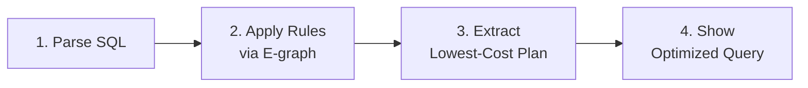

# Getting Started with RA

This guide demonstrates RA's major features through practical examples. RA is a query optimizer that transforms SQL queries into optimal execution plans using 1,327+ transformation rules, equality saturation, and cost-based optimization.

## Installation

### Prerequisites

- Rust 1.85+ with cargo
- (Optional) Nix for reproducible builds
- (Optional) Docker for web UI

### Build from Source

```bash
# Using Nix (recommended for reproducible builds)
nix develop
cargo build --release

# Without Nix
cargo build --release

# Install the CLI
cargo install --path crates/ra-cli

# Verify installation
cargo test --all-features
```

::: tip
Examples in this guide use the short form `ra-cli <command>`, which assumes the
binary is installed on your `PATH`. During development you can also run
`cargo run --bin ra-cli -- <args>` from the workspace root.
:::

## Quick Start: Basic Optimization

Optimize your first SQL query:

```bash
ra-cli optimize \
  "SELECT * FROM orders WHERE amount > 1000 AND status = 'active'"
```

RA will:



## Major Features

### 1. Dialect Translation

Translate queries between 20+ database dialects:

```bash
# PostgreSQL to MySQL
ra-cli translate \
  --from postgres --to mysql \
  "SELECT * FROM orders WHERE created_at > NOW() - INTERVAL '7 days'"

# Oracle to SQLite
ra-cli translate \
  --from oracle --to sqlite \
  "SELECT * FROM dual WHERE ROWNUM <= 10"

# SQL Server to DuckDB
ra-cli translate \
  --from sqlserver --to duckdb \
  "SELECT TOP 10 * FROM orders WITH (NOLOCK)"
```

### 2. Hardware-Aware Optimization

Optimize for specific hardware configurations:

```bash
# GPU-accelerated execution
ra-cli optimize \
  --hardware gpu \
  --gpu-memory 8GB \
  "SELECT SUM(amount) FROM large_dataset GROUP BY category"

# CPU SIMD vectorization
ra-cli optimize \
  --hardware cpu \
  --simd avx512 \
  --cache-size "L1:32KB,L2:256KB,L3:16MB" \
  "SELECT * FROM orders WHERE amount BETWEEN 100 AND 1000"

# FPGA acceleration for specific operations
ra-cli optimize \
  --hardware fpga \
  --fpga-profile stream-processing \
  "SELECT * FROM stream WHERE event_type = 'click'"
```

### 3. Statistics Timeline

Track how statistics change over time for better optimization:

```bash
# Import historical statistics
ra-cli stats import \
  --timeline stats-history.json

# Optimize with time-aware statistics
ra-cli optimize \
  --stats-time "2024-03-15T10:00:00Z" \
  "SELECT * FROM orders WHERE date = '2024-03-15'"

# Export statistics timeline
ra-cli stats export \
  --format json \
  --output current-stats.json
```

### 4. Cost Model Calibration

Calibrate cost models to your specific hardware:

```bash
# Run calibration benchmarks
ra-cli calibrate \
  --workload tpch \
  --scale-factor 10 \
  --output cost-model.json

# Use calibrated model
ra-cli optimize \
  --cost-model cost-model.json \
  "SELECT * FROM lineitem l JOIN orders o ON l.orderkey = o.orderkey"

# Compare cost models
ra-cli compare-costs \
  --model1 default \
  --model2 cost-model.json \
  "SELECT COUNT(*) FROM large_table"
```

**Example cost model structure:** See [cost-model.json example](/examples/cost-model.json) for a complete cost model configuration including CPU costs, I/O costs, memory costs, join costs, hardware acceleration settings, and isolation costs.

The cost model includes calibration for:
- **CPU costs**: tuple processing, operator costs, parallelization overhead
- **I/O costs**: sequential vs random page costs, effective I/O concurrency
- **Memory costs**: work_mem, hash/sort memory costs, cache effectiveness
- **Network costs**: latency, bandwidth, cross-AZ/region costs
- **Join algorithms**: nested loop, hash join, merge join costs
- **Aggregation**: group by, hash aggregate, sort aggregate
- **Hardware acceleration**: SIMD, GPU availability and speedup factors
- **Storage formats**: row vs columnar, Parquet pushdown effectiveness

### 5. Covering Index Optimization

Automatically suggest and use covering indexes:

```bash
# Analyze query for index opportunities
ra-cli analyze-indexes \
  "SELECT customer_id, order_date, total FROM orders WHERE status = 'shipped'"

# Output:
# Suggested covering index: CREATE INDEX idx_orders_covering
#   ON orders(status) INCLUDE (customer_id, order_date, total)
# Estimated performance improvement: 85% reduction in I/O

# Optimize with index awareness
ra-cli optimize \
  --indexes indexes.yaml \
  "SELECT customer_id, total FROM orders WHERE status = 'shipped'"
```

### 6. MIN/MAX Shortcuts

Leverage metadata for instant MIN/MAX results:

```bash
# Traditional scan (before optimization)
ra-cli explain \
  "SELECT MIN(id), MAX(id) FROM billion_row_table"
# Output: Full table scan required

# With MIN/MAX shortcut optimization
ra-cli optimize \
  --enable-shortcuts \
  "SELECT MIN(id), MAX(id) FROM billion_row_table"
# Output: Metadata lookup - instant result, no scan needed
```

### 7. COUNT(*) Metadata Optimization

Use table metadata for instant counts:

```bash
# Enable metadata shortcuts
ra-cli optimize \
  --enable-metadata \
  "SELECT COUNT(*) FROM large_table"
# Output: Returns count from metadata - O(1) operation

# Complex COUNT with filters (partial metadata use)
ra-cli optimize \
  --enable-metadata \
  "SELECT COUNT(*) FROM orders WHERE year = 2024"
# Output: Uses partition metadata if available
```

### 8. Parallel Query Execution

Distribute query execution across multiple cores:

```bash
# Parallel aggregation
ra-cli optimize \
  --parallel \
  --threads 8 \
  "SELECT category, SUM(amount) FROM sales GROUP BY category"

# Parallel join with repartitioning
ra-cli optimize \
  --parallel \
  --partition-strategy hash \
  "SELECT * FROM orders o JOIN customers c ON o.customer_id = c.id"

# Show parallel execution plan
ra-cli explain \
  --format parallel \
  "SELECT * FROM large_table WHERE complex_condition = true"
```

### 9. Bitmap Index Scans

Optimize queries using bitmap indexes:

```bash
# Single bitmap index
ra-cli optimize \
  --enable-bitmap \
  "SELECT * FROM products WHERE color = 'red'"

# Bitmap AND operation
ra-cli optimize \
  --enable-bitmap \
  "SELECT * FROM products WHERE color = 'red' AND size = 'large'"

# Bitmap OR with multiple conditions
ra-cli optimize \
  --enable-bitmap \
  "SELECT * FROM orders WHERE (status = 'pending' OR status = 'processing')
   AND priority = 'high'"
```

### 10. Large Join Optimization

Handle complex join graphs efficiently:

```bash
# Star schema optimization
ra-cli optimize \
  --join-algorithm star \
  "SELECT * FROM fact_sales f
   JOIN dim_product p ON f.product_id = p.id
   JOIN dim_customer c ON f.customer_id = c.id
   JOIN dim_time t ON f.time_id = t.id
   WHERE t.year = 2024"

# Adaptive join reordering
ra-cli optimize \
  --join-reorder adaptive \
  --max-join-size 10 \
  "SELECT * FROM t1 JOIN t2 ON ... JOIN t3 ON ... JOIN t4 ON ..."

# Bushy join trees for parallel execution
ra-cli optimize \
  --join-tree bushy \
  --parallel \
  "SELECT * FROM large_t1 JOIN large_t2 JOIN large_t3 JOIN large_t4"
```

### 11. Parquet Predicate Pushdown

Push filters directly to Parquet file readers:

```bash
# Basic predicate pushdown
ra-cli optimize \
  --format parquet \
  "SELECT * FROM parquet_table WHERE year = 2024 AND month = 3"
# Output: Reads only relevant row groups, skips 95% of data

# Column pruning with Parquet
ra-cli optimize \
  --format parquet \
  "SELECT customer_id, total FROM large_parquet_dataset"
# Output: Reads only required columns from Parquet files

# Statistics-based pruning
ra-cli optimize \
  --format parquet \
  --use-parquet-stats \
  "SELECT * FROM events WHERE timestamp BETWEEN '2024-01-01' AND '2024-01-31'"
```

### 12. WASM Integration

Run queries in WebAssembly environments:

```bash
# Compile query to WASM
ra-cli compile-wasm \
  --output query.wasm \
  "SELECT * FROM users WHERE active = true"

# Optimize for WASM execution
ra-cli optimize \
  --target wasm \
  --memory-limit 4MB \
  "SELECT COUNT(*) FROM events GROUP BY type"

# Generate WASM-compatible plan
ra-cli plan \
  --format wasm \
  --output plan.json \
  "SELECT * FROM products WHERE price < 100"
```

### 13. Web UI Usage

Launch the interactive web interface for visual optimization:

```bash
# Start the web UI
./scripts/docker-compose-up.sh

# Or without Docker
ra-web-ui -- --port 8000
```

Open http://localhost:8000 to:
- Visualize query plans as graphs
- Step through optimization rules
- Compare before/after plans
- Explore the e-graph structure
- Test different cost models
- Profile query performance

### 14. Advanced Rule Control

Fine-grained control over transformation rules:

```bash
# Disable specific rules
ra-cli optimize \
  --disable-rules "PushFilterThroughJoin,MergeFilters" \
  "SELECT * FROM t1 JOIN t2 WHERE t1.x > 10"

# Use only specific rule categories
ra-cli optimize \
  --rule-categories "logical,physical" \
  --exclude-categories "distributed,hardware" \
  "SELECT * FROM orders"

# Custom rule priorities
ra-cli optimize \
  --rule-config custom-rules.yaml \
  "SELECT * FROM complex_query"
```

### 15. Distributed Query Optimization

Optimize queries for distributed execution:

```bash
# Partition-aware optimization
ra-cli optimize \
  --distributed \
  --partitions "orders:customer_id,products:category" \
  "SELECT * FROM orders o JOIN products p ON o.product_id = p.id"

# Minimize data movement
ra-cli optimize \
  --distributed \
  --optimize-transfers \
  --nodes 4 \
  "SELECT customer_id, SUM(total) FROM orders GROUP BY customer_id"

# Co-location aware joins
ra-cli optimize \
  --distributed \
  --colocation-map colocation.yaml \
  "SELECT * FROM colocated_t1 JOIN colocated_t2 USING (partition_key)"
```

## Understanding Output

### Plan Explanation

See detailed transformation steps:

```bash
ra-cli explain \
  --verbose \
  "SELECT c.name, SUM(o.total)
   FROM customers c
   JOIN orders o ON c.id = o.customer_id
   GROUP BY c.name"
```

Output shows:
- Initial logical plan
- Each transformation rule applied
- Cost at each step
- Final optimized plan
- Estimated performance improvement

### Visual Diff

Compare original and optimized plans:

```bash
ra-cli optimize \
  --diff side-by-side \
  --highlight-changes \
  "SELECT * FROM large_table WHERE complex_conditions"
```

### Performance Metrics

Get detailed performance analysis:

```bash
ra-cli benchmark \
  --iterations 100 \
  --warmup 10 \
  "SELECT * FROM orders WHERE status = 'pending'"
```

## Configuration

### Global Settings

Create `~/.ra/config.toml`:

```toml
[optimizer]
default_timeout_ms = 5000
max_iterations = 100
enable_parallel = true

[cost_model]
cpu_tuple_cost = 0.01
seq_page_cost = 1.0
random_page_cost = 4.0

[rules]
enable_all = true
disabled = ["RiskyRule1", "ExperimentalRule2"]

[hardware]
cpu_cores = 8
memory_gb = 32
gpu_available = true
```

### Per-Project Configuration

Create `.ra-config.yaml` in your project:

```yaml
database: postgres
version: "14"
statistics:
  source: "pg_stats"
  update_frequency: "daily"
indexes:
  - table: orders
    columns: [customer_id, order_date]
  - table: products
    columns: [category, price]
cost_calibration:
  profile: "custom-hardware.json"
```

## Troubleshooting

### Common Issues

**Query takes too long to optimize:**
```bash
# Use resource budgets
ra-cli optimize \
  --resource-budget interactive \
  --max-time 500ms \
  "YOUR_QUERY"
```

**Out of memory during optimization:**
```bash
# Limit e-graph size
ra-cli optimize \
  --max-egraph-nodes 10000 \
  --memory-limit 1GB \
  "YOUR_QUERY"
```

**Unexpected plan chosen:**
```bash
# Debug cost model
ra-cli debug-costs \
  --trace \
  "YOUR_QUERY"
```

### Getting Help

```bash
# Show available commands
ra-cli help

# Get help for specific command
ra-cli optimize --help

# Validate your query
ra-cli validate "YOUR_QUERY"

# Check rule compatibility
ra-cli check-rules --query "YOUR_QUERY"
```

## Next Steps

- **[Architecture](architecture.md)** - Understand system internals
- **[Rule Authoring Guide](guides/rule-authoring.md)** - Write custom transformation rules
- **[Cost Models](guides/cost-models.md)** - Customize cost estimation
- **[Dialect Translation](guides/dialect-translation.md)** - Cross-database SQL translation
- **[Testing Guide](guides/testing.md)** - Test your optimizations
- **[API Reference](api-reference.md)** - Programmatic usage
- **[Examples](examples/)** - Complete worked examples

## Performance Tips

1. **Pre-compile rules** for production:
   ```bash
   ra-cli compile-rules --output rules.bin
   ```

2. **Cache optimization results** for repeated queries:
   ```bash
   ra-cli optimize --cache redis://localhost "QUERY"
   ```

3. **Profile rule performance** to identify bottlenecks:
   ```bash
   ra-cli profile-rules "QUERY"
   ```

4. **Use incremental statistics** for large tables:
   ```bash
   ra-cli stats update --incremental --table orders
   ```

5. **Batch optimize** multiple queries:
   ```bash
   ra-cli batch-optimize queries.sql --output optimized/
   ```

Ready to optimize your queries? Start with basic optimization and explore the advanced features as needed. The RA optimizer adapts to your workload, hardware, and performance requirements.
