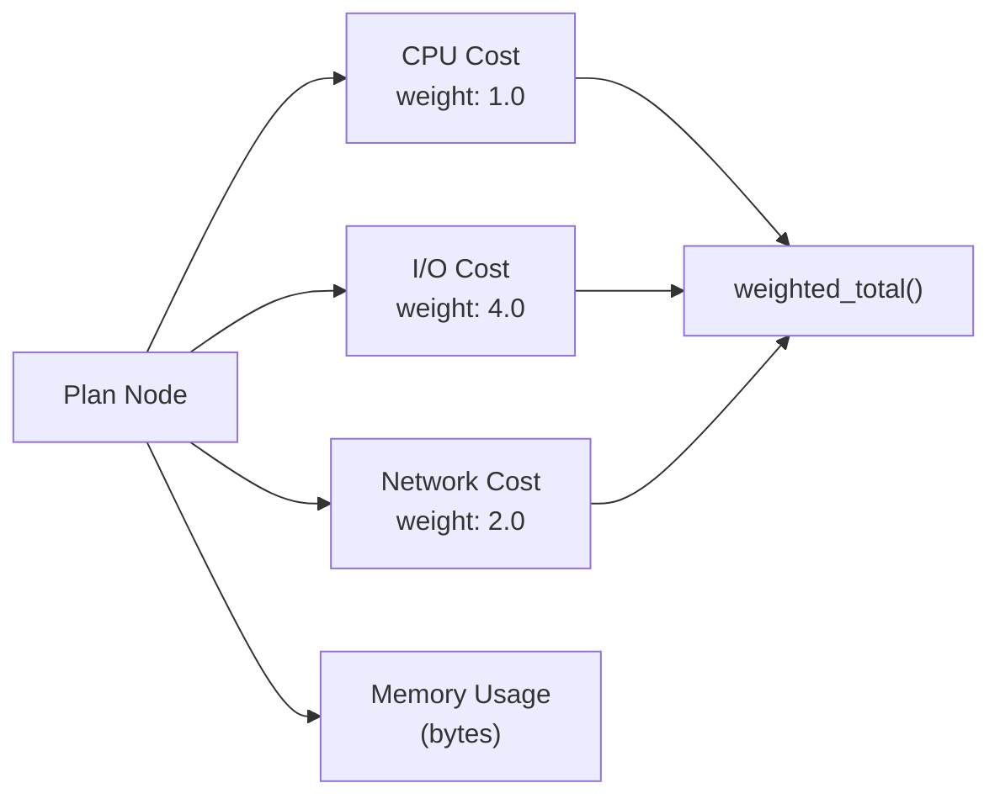

# Cost Models

This document describes the cost estimation framework used by the RA
optimizer to compare alternative query plans and choose the cheapest
one.

## Cost Structure



Every plan node has a `Cost` with four components:

```rust
pub struct Cost {
    pub cpu: f64,      // CPU computation time (arbitrary units)
    pub io: f64,       // I/O cost (disk reads, arbitrary units)
    pub network: f64,  // Network cost (distributed plans)
    pub memory: u64,   // Memory usage in bytes
}
```

The `total()` method computes a weighted scalar:
`cpu * 1.0 + io * 4.0 + network * 2.0`. Custom weights can be set
via `weighted_total(cpu_weight, io_weight, network_weight)`.

## Cost Model Trait

```rust
pub trait CostModel: Debug + Send + Sync {
    fn estimate(
        &self,
        expr: &RelExpr,
        statistics: &dyn StatisticsProvider,
    ) -> Cost;
}
```

Implementations receive a relational expression and statistics for
base tables, and return a cost estimate.

## Built-in Cost Models

### DefaultCostFunction

The simplest comparator, using `Cost::total()` to convert
multi-dimensional cost to a scalar for comparison.

### HardwareCostModel (ra-hardware)

A hardware-aware cost model that estimates execution on CPU, GPU, and
FPGA devices. For each operator it computes:

- CPU cost (baseline)
- GPU cost = PCIe transfer time + GPU compute time
- FPGA cost = pipeline latency

The cheapest option determines the operator placement. See
[hardware-acceleration.md](hardware-acceleration.md) for details.

## Statistics

Cost estimation depends on table and column statistics:

```rust
pub struct Statistics {
    pub row_count: f64,
    pub avg_row_size: u64,
    pub total_size: u64,
    pub columns: HashMap<String, ColumnStats>,
}

pub struct ColumnStats {
    pub distinct_count: f64,
    pub null_fraction: f64,
    pub min_value: Option<String>,
    pub max_value: Option<String>,
    pub avg_length: Option<f64>,
    pub histogram: Option<Histogram>,
}
```

### Selectivity Estimation

- **Equality**: `1 / distinct_count`
- **Range**: Histogram-based when available, otherwise `0.1`
- **Default**: `0.1` when no statistics are available

### Histograms

Two histogram types are supported:
- **Equi-width**: Fixed-width buckets for uniform distributions
- **Equi-depth**: Equal row count per bucket, better for skewed data

## Rule Cost Annotations

Each `.rra` rule file includes a cost model section estimating the
benefit of applying that rule:

```rust
fn estimated_benefit(
    input_stats: &Statistics,
    hardware: &HardwareProfile,
) -> f64 {
    // Returns improvement fraction in [0.0, 1.0]
    // 0.0 = no benefit, 1.0 = eliminates all cost
}
```

The optimizer uses these estimates to prioritize rules during
equality saturation and to guide extraction of the optimal plan.

## Extending the Cost Model

To add a new cost model:

1. Implement the `CostModel` trait
2. Use `Statistics` and `ColumnStats` for input cardinality estimates
3. Return `Cost` with appropriate cpu/io/network/memory values
4. Register the model with the optimization engine
