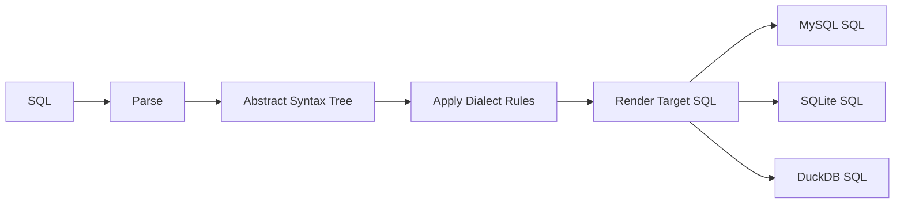

# SQL Dialect Translation

This document describes the ra-dialect crate, which translates SQL
statements between different database dialects.

## Overview



Database systems implement SQL with varying syntax, function names,
operators, and feature support. The dialect translator bridges these
differences, enabling cross-database portability.

## Supported Dialects

| Dialect    | Version | Parser Backend       |
|------------|---------|----------------------|
| PostgreSQL | 9.6+    | sqlparser PostgreSQL  |
| MySQL      | 5.7+    | sqlparser MySQL       |
| SQLite     | 3.x     | sqlparser SQLite      |
| DuckDB     | 0.8+    | sqlparser DuckDB      |
| MSSQL      | 2016+   | sqlparser MsSql       |
| Oracle     | 12c+    | sqlparser Generic     |

## Usage

### Basic Translation

```rust
use ra_dialect::{Dialect, DialectTranslator};

let translator = DialectTranslator::new(
    Dialect::PostgreSql,
    Dialect::MySql,
);
let result = translator.translate(
    "SELECT first_name || ' ' || last_name FROM users",
)?;
// MySQL uses CONCAT() instead of ||
assert!(result.sql.contains("CONCAT"));
```

### Compatibility Matrix

```rust
use ra_dialect::CompatibilityMatrix;

let matrix = CompatibilityMatrix::build();
let table = matrix.to_table();
println!("{table}");
```

This prints a human-readable table showing which features each
dialect supports, partially supports, or lacks entirely.

## Translation Categories

### String Concatenation

| Source        | Target        | Translation                  |
|---------------|---------------|------------------------------|
| PostgreSQL `\|\|` | MySQL      | `CONCAT(a, b)`              |
| PostgreSQL `\|\|` | MSSQL      | `a + b`                     |
| MySQL `CONCAT` | PostgreSQL   | `a \|\| b`                  |

### Date/Time Functions

| Feature             | PostgreSQL           | MySQL                | SQLite               |
|---------------------|----------------------|----------------------|----------------------|
| Current timestamp   | `NOW()`              | `NOW()`              | `datetime('now')`    |
| Date extraction     | `EXTRACT(... FROM)`  | `EXTRACT(... FROM)`  | `strftime()`         |
| Interval arithmetic | `+ INTERVAL '1 day'` | `+ INTERVAL 1 DAY`  | `datetime(x,'+1 day')` |

### LIMIT/OFFSET

| Dialect    | Syntax                              |
|------------|-------------------------------------|
| PostgreSQL | `LIMIT n OFFSET m`                  |
| MySQL      | `LIMIT n OFFSET m` or `LIMIT m, n` |
| MSSQL      | `OFFSET m ROWS FETCH NEXT n ROWS`   |
| Oracle     | `FETCH FIRST n ROWS ONLY`           |

### Boolean Literals

| Dialect    | TRUE / FALSE         |
|------------|----------------------|
| PostgreSQL | `TRUE` / `FALSE`     |
| MySQL      | `TRUE` / `FALSE`     |
| SQLite     | `1` / `0`            |

### Type Casting

| Dialect    | Syntax                          |
|------------|---------------------------------|
| PostgreSQL | `value::type` or `CAST(v AS t)` |
| MySQL      | `CAST(v AS t)`                  |
| SQLite     | `CAST(v AS t)`                  |

## Feature Support Levels

Each SQL feature has a support level per dialect:

- **Full** -- native support, no translation needed
- **Partial** -- supported with restrictions or alternate syntax
- **None** -- not available; translation emits a warning or error

```rust
use ra_dialect::{Dialect, SqlFeature, feature_support};

let support = feature_support(
    Dialect::Sqlite,
    SqlFeature::WindowFunctions,
);
// Returns FeatureSupport::Full for SQLite 3.25+
```

## Translation Warnings

Translations that lose semantics or precision produce warnings:

```rust
let result = translator.translate(sql)?;
for warning in &result.warnings {
    match warning.severity {
        WarningSeverity::Info => { /* cosmetic difference */ }
        WarningSeverity::Warning => { /* possible semantic change */ }
        WarningSeverity::Error => { /* translation may be incorrect */ }
    }
}
```

## Architecture

```
SQL Input (source dialect)
    |
    v
[sqlparser: parse to AST]
    |
    v
[Function rewriting]
    |
    v
[Operator rewriting]
    |
    v
[Type/cast rewriting]
    |
    v
[LIMIT/OFFSET rewriting]
    |
    v
[sqlparser: render to SQL]
    |
    v
SQL Output (target dialect) + Warnings
```

The translator operates on the `sqlparser` AST. Each rewriting pass
is a visitor that transforms nodes matching source-dialect patterns
into target-dialect equivalents.

## Extending

To add a new dialect or translation rule:

1. Add the dialect variant to `Dialect` enum in `dialect.rs`
2. Add function mappings in `functions.rs`
3. Add feature support entries in `dialect.rs`
4. Update the compatibility matrix in `matrix.rs`
5. Add test cases covering positive and negative translations

## References

- [sqlparser-rs](https://github.com/sqlparser-rs/sqlparser-rs) -- SQL parser used internally
- PostgreSQL SQL syntax: https://www.postgresql.org/docs/current/sql.html
- MySQL differences: https://dev.mysql.com/doc/refman/8.0/en/sql-statements.html
- SQLite SQL: https://www.sqlite.org/lang.html
- DuckDB SQL: https://duckdb.org/docs/sql/introduction
