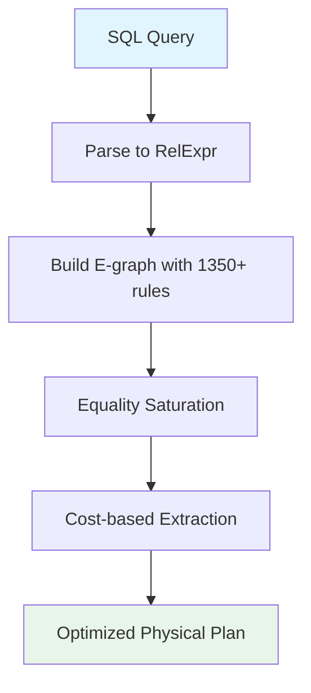

# Optimization Guide

This guide covers using the RA optimizer effectively, including query
optimization workflows, tuning cost models, and interpreting results.

## Query Optimization Workflow



A SQL query like `SELECT * FROM t1 WHERE x > 10` is first parsed into
a relational algebra expression: {{sigma[x > 10](t1)}}
(i.e., $\sigma_{x > 10}(\text{t1})$). The optimizer then explores
equivalent expressions using rewrite rules.

## Running the Optimizer

### Basic Optimization

```bash
ra-cli optimize "SELECT * FROM t1 WHERE x > 10"
```

### With Explanation

```bash
ra-cli explain \
  "SELECT c.name FROM customers c JOIN orders o ON c.id = o.cid"
```

This query becomes {{pi[c.name](customers join[c.id = o.cid] orders)}}
and the optimizer applies rules like predicate pushdown and join
reordering to find the lowest-cost plan.

### With Resource Budgets

Predefined profiles control time, memory, and iteration limits:

```bash
ra-cli optimize "SELECT * FROM t1" \
  --resource-budget interactive
```

See [Resource Budgets](../features/resource-budgets.md) for details.

## Key Transformations

The optimizer applies hundreds of transformation rules. Some
frequently triggered ones:

| Transformation | Before | After |
|----------------|--------|-------|
| Predicate pushdown | {{sigma[p](R join S)}} | {{sigma[p](R) join S}} |
| Join commutativity | {{R join S}} | {{S join R}} |
| Projection pushdown | {{pi[a](R join S)}} | {{pi[a](pi[a,k](R) join pi[a,k](S))}} |

See [Relational Algebra](../concepts/relational-algebra.md) for the
full operator reference.

## Cost Model Tuning

The optimizer uses a multi-dimensional cost model covering CPU, I/O,
memory, and network costs. See [Cost Models](cost-models.md) for the
full framework.

## Plan Comparison

Use `--diff` to compare the original and optimized plans:

```bash
ra-cli optimize "SELECT * FROM t1" \
  --diff side-by-side
```

See [Plan Visualization](../features/plan-visualization.md) for
format options.

## Further Reading

- [Architecture](../architecture.md) -- How the optimizer engine works
- [Rule Authoring](rule-authoring.md) -- Writing transformation rules
- [Cost Models](cost-models.md) -- Cost estimation details
