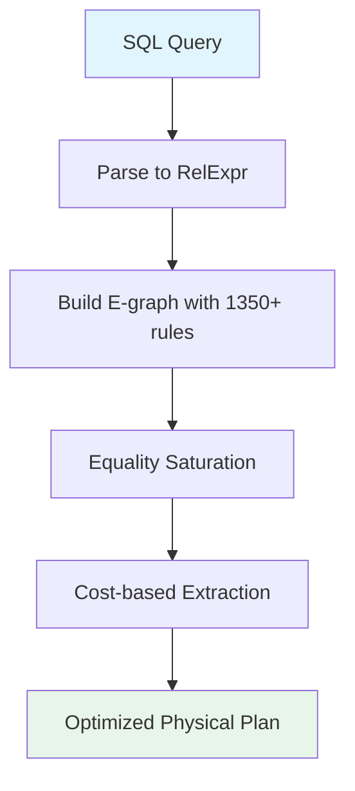

# Optimization Guide

This guide covers using the RA optimizer effectively, including query
optimization workflows, tuning cost models, and interpreting results.

## Query Optimization Workflow



## Running the Optimizer

### Basic Optimization

```bash
cargo run --bin ra-cli -- optimize "SELECT * FROM t1 WHERE x > 10"
```

### With Explanation

```bash
cargo run --bin ra-cli -- explain \
  "SELECT c.name FROM customers c JOIN orders o ON c.id = o.cid"
```

### With Resource Budgets

Predefined profiles control time, memory, and iteration limits:

```bash
cargo run --bin ra-cli -- optimize "SELECT * FROM t1" \
  --resource-budget interactive
```

See [Resource Budgets](../features/resource-budgets.md) for details.

## Cost Model Tuning

The optimizer uses a multi-dimensional cost model covering CPU, I/O,
memory, and network costs. See [Cost Models](cost-models.md) for the
full framework.

## Plan Comparison

Use `--diff` to compare the original and optimized plans:

```bash
cargo run --bin ra-cli -- optimize "SELECT * FROM t1" \
  --diff side-by-side
```

See [Plan Visualization](../features/plan-visualization.md) for
format options.

## Further Reading

- [Architecture](../architecture.md) -- How the optimizer engine works
- [Rule Authoring](rule-authoring.md) -- Writing transformation rules
- [Cost Models](cost-models.md) -- Cost estimation details
