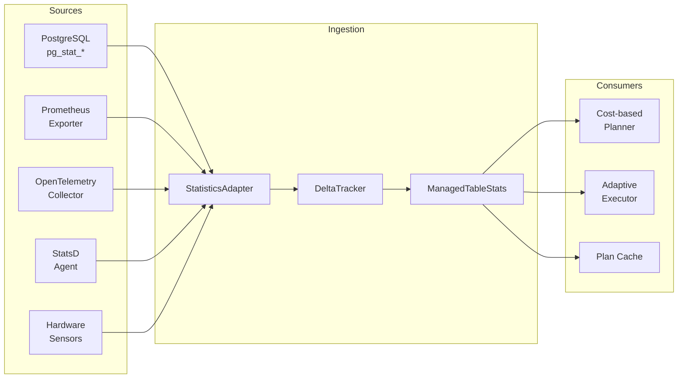
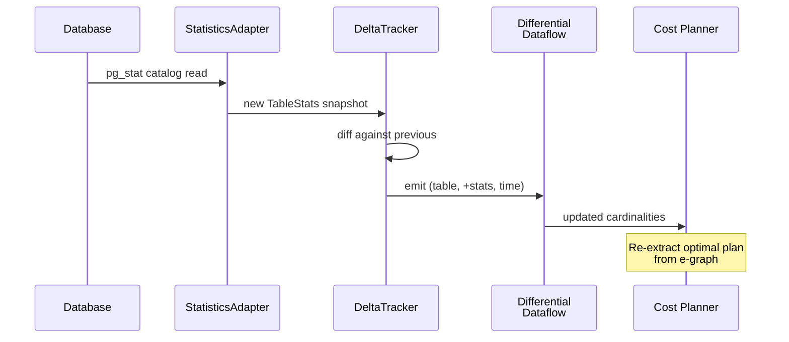
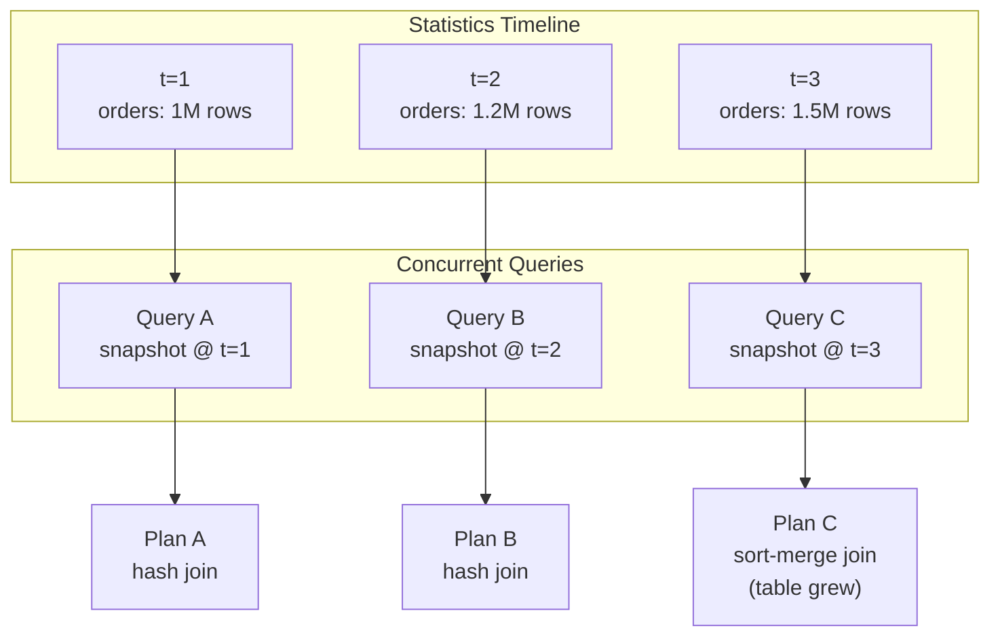

# Statistics Streaming

Ra ingests database statistics as a continuous stream, not as a one-shot
snapshot. This lets the optimizer react to schema changes, data growth, and
workload shifts without manual `ANALYZE` runs. This guide covers the
architecture, supported metrics formats, configuration, and API.

## Architecture Overview

Statistics streaming in Ra consists of three layers:

1. **Sources** -- External systems that produce statistics (databases,
   monitoring agents, Prometheus exporters).
2. **Ingestion pipeline** -- Converts raw metrics into Ra's internal
   `TableStats` / `ColumnStats` representation and feeds them into
   differential dataflow collections.
3. **Consumers** -- The optimizer, adaptive executor, and plan cache,
   which observe statistics changes in real time.



## Statistics Data Model

Ra models statistics at two levels -- tables and columns -- and tracks
metadata about quality and freshness.

### Table Statistics (`TableStats`)

| Field | Type | Description |
|-------|------|-------------|
| `table_name` | `String` | Fully qualified table name |
| `row_count` | `u64` | Total rows in the table |
| `data_size_bytes` | `u64` | On-disk data size |
| `last_analyzed` | `Option<i64>` | Unix timestamp of last ANALYZE |
| `columns` | `HashMap<String, ColumnStats>` | Per-column statistics |

### Column Statistics (`ColumnStats`)

| Field | Type | Description |
|-------|------|-------------|
| `distinct_count` | `u64` | Number of distinct values (NDV) |
| `null_fraction` | `f64` | Fraction of NULL values (0.0--1.0) |
| `avg_width` | `u32` | Average column width in bytes |
| `min_value` | `Option<String>` | Minimum value (string-encoded) |
| `max_value` | `Option<String>` | Maximum value (string-encoded) |
| `histogram` | `Option<Vec<HistogramBucket>>` | Equi-depth histogram |
| `most_common_values` | `Option<Vec<(String, f64)>>` | Top-N values with frequencies |

### Statistics Quality (`StatisticsState`)

Every statistics entry carries quality metadata:

- **`source`** -- How the statistics were gathered: `ExactCount`,
  `Sampled { sample_rate }`, `Histogram`, `MlModel`, `Derived`, or
  `Default`.
- **`confidence`** -- A score from 0.0 to 1.0 reflecting reliability.
  `ExactCount` starts at 1.0; `Default` starts at 0.3.
- **`staleness`** -- Computed from the modification rate since the last
  gather: `Fresh` (< 1% change), `SlightlyStale` (1--5%),
  `ModeratelyStale` (5--20%), `VeryStale` (> 20%).
- **`modifications_since`** -- Accumulated DML count since the last
  gather.

The optimizer uses these signals to weight estimates and trigger
re-analysis:

```rust
use ra_stats::accuracy::{RefreshThreshold, Staleness, StatisticsState};

let threshold = RefreshThreshold::Any(vec![
    RefreshThreshold::Staleness(Staleness::ModeratelyStale),
    RefreshThreshold::Age(3600),          // 1 hour
    RefreshThreshold::Confidence(0.5),    // low confidence
]);

if state.should_refresh(threshold) {
    // Trigger re-analysis from the source database
}
```

## Supported Metrics Formats

### Database Catalog Statistics

The primary source. Ra reads `pg_stat_user_tables`,
`pg_stats`, and equivalent catalog views from connected databases
through the `StatisticsAdapter` trait.

```rust
use ra_stats::integration::{ManagedTableStats, StatisticsAdapter};
use ra_stats::types::{ColumnStats, TableStats};

// Wrap raw catalog data into managed statistics
let mut managed = ManagedTableStats::new(table_stats);

// Record ongoing DML activity
managed.record_modifications(1500);

// Check if statistics need refreshing
if managed.needs_refresh() {
    managed.refresh_from(updated_stats);
}
```

### Prometheus Metrics

System-level metrics (CPU, memory, I/O, network) come from Prometheus
exporters and feed into the hardware cost model:

| Metric | Source | Used For |
|--------|--------|----------|
| `node_cpu_seconds_total` | node_exporter | CPU cost scaling |
| `node_memory_MemAvailable_bytes` | node_exporter | Memory budget |
| `node_disk_read_bytes_total` | node_exporter | I/O cost model |
| `node_network_receive_bytes_total` | node_exporter | Network cost |
| `pg_stat_user_tables_n_tup_ins` | postgres_exporter | Modification tracking |
| `pg_stat_user_tables_n_live_tup` | postgres_exporter | Row count updates |

### OpenTelemetry

Ra accepts OTLP metrics for distributed environments where multiple
database nodes export statistics. Traces from query execution also feed
back into the adaptive executor as execution feedback.

### StatsD

Lightweight counter/gauge protocol for environments that already use
StatsD. Ra maps gauge metrics to statistics fields:

```
ra.table.orders.row_count:1500000|g
ra.table.orders.data_size_bytes:450000000|g
ra.column.orders.customer_id.ndv:75000|g
ra.column.orders.status.null_fraction:0.02|g
```

## Statistics Profiles

Ra ships with predefined profiles that set ingestion parameters for
common workloads. Profiles configure update frequency, staleness
thresholds, and histogram resolution.

```rust
use ra_stats::profiles::StatisticsProfile;

// OLTP: frequent small updates, tight staleness thresholds
let oltp = StatisticsProfile::oltp();

// OLAP: large batch loads, relaxed staleness
let olap = StatisticsProfile::olap();

// Streaming: continuous micro-batches
let streaming = StatisticsProfile::streaming();
```

Each profile sets:

| Parameter | OLTP | OLAP | Streaming |
|-----------|------|------|-----------|
| Staleness threshold | `SlightlyStale` | `ModeratelyStale` | `Fresh` |
| Max age (seconds) | 300 | 3600 | 60 |
| Histogram buckets | 100 | 256 | 50 |
| Confidence decay rate | 0.1 | 0.05 | 0.2 |

## Delta Tracking

The `DeltaTracker` detects changes between successive statistics
snapshots and emits deltas for downstream consumers. This is the
bridge between polling-based statistics collection and Ra's
differential dataflow engine.



The delta tracker computes per-field diffs:

```rust
use ra_stats::delta::DeltaTracker;
use ra_stats::types::TableStats;

let mut tracker = DeltaTracker::new();

// First snapshot: establishes baseline
let delta1 = tracker.update("orders", &initial_stats);
assert!(delta1.is_none()); // No previous state

// Second snapshot: computes diff
let delta2 = tracker.update("orders", &updated_stats);
if let Some(diff) = delta2 {
    println!(
        "row_count changed by {}",
        diff.row_count_delta
    );
    for col_diff in &diff.column_diffs {
        println!(
            "  column {}: NDV {} -> {}",
            col_diff.column,
            col_diff.old_distinct,
            col_diff.new_distinct,
        );
    }
}
```

## System Facts Streaming

Hardware and OS metrics flow through the `ra-hardware` crate's
detection and profiling system. These metrics influence cost model
parameters in real time.

### CPU Metrics

- Architecture detection (x86_64, ARM)
- SIMD capability (SSE4.2, AVX2, AVX-512, NEON)
- Cache hierarchy (L1/L2/L3 sizes and line sizes)
- Core count and frequency

### Memory Metrics

- Total and available memory
- NUMA topology (node count, distances)
- Memory type (DDR4, DDR5, HBM)
- Bandwidth measurements

### Storage Metrics

- Device type (NVMe, SSD, HDD, cloud storage)
- Sequential and random read bandwidth
- IOPS capacity
- PCIe generation and lanes

### Network Metrics

- Link type (Ethernet, InfiniBand, CXL)
- Bandwidth and latency per link
- Network topology for distributed cost estimation

```rust
use ra_hardware::{detect_hardware, CompleteHardwareProfile};

// Auto-detect current hardware
let profile = detect_hardware();

// Or load a predefined profile
let gpu_server = CompleteHardwareProfile::a100_gpu_server();
let fpga_appliance = CompleteHardwareProfile::alveo_fpga();
```

## Concurrent Planner Contexts

Multiple queries can be optimized simultaneously, each seeing a
consistent snapshot of statistics. Ra uses differential dataflow's
logical timestamps to provide snapshot isolation:



Each planner context pins a timestamp and reads a consistent snapshot.
New statistics arriving at later timestamps do not disturb in-progress
optimization. When the optimizer finishes, the adaptive executor takes
over and can observe live statistics updates for mid-execution
re-optimization.

## Timeline Format

Ra includes a TOML-based timeline format for recording and replaying
statistics evolution. This is used for testing, benchmarking, and
demonstrating adaptive behavior.

```toml
[metadata]
description = "Orders table growth scenario"
database = "analytics"
start_time = 0
end_time = 300

[[snapshots]]
time_offset = 0
[snapshots.tables.orders]
row_count = 1_000_000
data_size_bytes = 450_000_000
[snapshots.tables.orders.columns.customer_id]
distinct_count = 75_000
null_fraction = 0.0
avg_width = 8

[[snapshots]]
time_offset = 60
[snapshots.tables.orders]
row_count = 1_200_000
data_size_bytes = 540_000_000

[[events]]
time_offset = 30
kind = "bulk_insert"
table = "orders"
rows_affected = 200_000

[[feedback]]
time_offset = 120
query_id = "q1"
operator = "hash_join_0"
estimated_rows = 50_000
actual_rows = 180_000
```

The `TimelinePlayer` steps through snapshots and applies events:

```rust
use ra_stats::timeline::{Timeline, TimelinePlayer};

let timeline = Timeline::from_toml(toml_string)?;
let mut player = TimelinePlayer::new(&timeline)?;

// Step through snapshots
while let Some(snapshot) = player.advance() {
    let stats = snapshot.table_stats("orders");
    println!("orders row_count = {}", stats.row_count);
}
```

## Execution Feedback Loop

Statistics streaming is not one-directional. The adaptive executor
feeds execution results back into the statistics system, creating a
closed feedback loop.

```rust
use ra_stats::feedback::FeedbackCollector;

let mut collector = FeedbackCollector::new();

// After query execution, record actual vs estimated
collector.record(
    "orders",
    "hash_join_0",
    estimated_rows: 50_000.0,
    actual_rows: 180_000,
);

// Apply corrections to managed statistics
let corrections = collector.compute_corrections();
for correction in corrections {
    managed_stats.apply_correction(&correction);
}
```

This feedback drives three correction modes (from `ra-adaptive`):

| Mode | Behavior | Use Case |
|------|----------|----------|
| `ConfidenceOnly` | Lower confidence scores; don't change row counts | Conservative; avoids oscillation |
| `IncrementalStats` | Adjust confidence and apply row count corrections | Balanced; default for most workloads |
| `FullReanalyze` | Replace statistics entirely with latest snapshot | Aggressive; for large distribution shifts |

## Configuration Reference

### Statistics ingestion

```toml
[statistics]
# How often to poll source databases (seconds)
poll_interval = 30

# Statistics profile: "oltp", "olap", or "streaming"
profile = "oltp"

# Maximum staleness before forced re-analysis
max_staleness = "ModeratelyStale"

# Confidence decay rate (per day)
confidence_decay_rate = 0.1
```

### Hardware metrics

```toml
[hardware]
# Auto-detect hardware on startup
auto_detect = true

# Prometheus endpoint for system metrics
prometheus_url = "http://localhost:9090"

# Scrape interval for hardware metrics (seconds)
scrape_interval = 15
```

### Adaptive execution feedback

```toml
[adaptive]
# Enable adaptive execution
enabled = true

# Feedback mode: "confidence_only", "incremental", or "full_reanalyze"
feedback_mode = "incremental"

# Maximum adaptations per query
max_adaptations = 5

# Row interval for trigger evaluation
check_interval_rows = 10_000
```

## API Reference

### `ra_stats::types`

- **`TableStats`** -- Table-level statistics container.
- **`ColumnStats`** -- Column-level statistics (NDV, null fraction,
  histograms).
- **`HistogramBucket`** -- Single bucket in an equi-depth histogram.

### `ra_stats::integration`

- **`StatisticsAdapter`** -- Trait for converting external statistics
  into Ra's internal representation.
- **`ManagedTableStats`** -- Wraps `TableStats` with lifecycle
  management (staleness tracking, refresh triggers).

### `ra_stats::accuracy`

- **`StatisticsState`** -- Quality metadata: source, confidence,
  staleness.
- **`RefreshThreshold`** -- Composable conditions for triggering
  re-analysis.
- **`QualityMetrics`** -- Computed quality scores (freshness,
  confidence, coverage).

### `ra_stats::delta`

- **`DeltaTracker`** -- Detects changes between successive statistics
  snapshots.

### `ra_stats::skew`

- **`SkewDetector`** -- Analyzes frequency histograms for data skew.
- **`FrequencyHistogram`** -- Frequency distribution representation.
- **`SkewAnalysis`** -- Complete skew analysis result with severity
  and strategy recommendation.

### `ra_stats::timeline`

- **`Timeline`** -- Parsed timeline definition from TOML.
- **`TimelinePlayer`** -- Playback engine for stepping through
  statistics snapshots.
- **`Snapshot`** -- A single statistics snapshot at a point in time.
- **`ExecutionFeedback`** -- Estimated vs actual cardinality record.

### `ra_stats::feedback`

- **`FeedbackCollector`** -- Collects execution feedback for
  statistics correction.

## Further Reading

- [Adaptive Execution](../features/adaptive-execution.md) -- How the
  executor uses statistics at runtime.
- [Architecture: Dataflow Architecture](../architecture.md#dataflow-architecture)
  -- How statistics flow through differential dataflow.
- [Cost Models](cost-models.md) -- How statistics feed into cost
  estimation.
- [Statistics Timeline Format](../features/statistics-timeline-format.md)
  -- Detailed timeline format specification.
