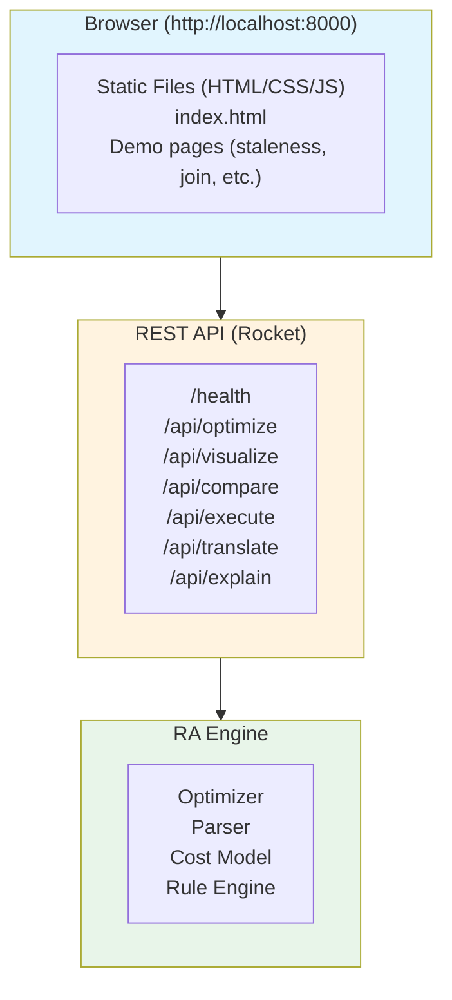

# Web UI Integration

The RA Web Explorer provides a REST API and interactive web interface for query optimization, dialect translation, and plan visualization.

## Architecture

The web UI consists of three layers:

1. **Frontend**: Static HTML/CSS/JavaScript served from `/app/static`
2. **REST API**: Rocket-based HTTP server on port 8000
3. **Backend**: RA optimizer, parser, and engine libraries



## Setup

### Docker (Recommended)

Build and run with Docker Compose:

```bash
docker-compose build ra-web
docker-compose up
```

Or build manually:

```bash
docker build -t ra-web .
docker run -p 8000:8000 ra-web
```

Access at: http://localhost:8000

### Local Development

Build and run without Docker:

```bash
# Build frontend (if exists)
cd web && npm install && npm run build && cd ..

# Build backend
cargo build --release --bin ra-web

# Run backend
ra-web

# Or for development:
cargo run --bin ra-web
```

### Environment Variables

| Variable | Default | Description |
|----------|---------|-------------|
| `ROCKET_PORT` | 8000 | HTTP server port |
| `ROCKET_ADDRESS` | 0.0.0.0 | Bind address |
| `RUST_LOG` | info | Log level (trace, debug, info, warn, error) |
| `STATIC_DIR` | /app/static | Path to frontend static files |

## API Reference

All endpoints return JSON responses. Error responses include:

```json
{
  "error": "error_code",
  "message": "Human-readable error message"
}
```

### Health Check

```http
GET /health
```

**Response:**
```json
"OK"
```

### Optimize Query

Optimize a relational algebra expression using the rule engine.

```http
POST /api/optimize
Content-Type: application/json

{
  "expr": {
    "Filter": {
      "pred": { "Gt": [{ "Column": "age" }, { "Const": 18 }] },
      "input": { "Scan": { "table": "users" } }
    }
  }
}
```

**Response:**
```json
{
  "optimized": {
    "Scan": {
      "table": "users",
      "filter": { "Gt": [{ "Column": "age" }, { "Const": 18 }] }
    }
  },
  "rules_applied": ["predicate-pushdown"],
  "cost_before": 1000.0,
  "cost_after": 120.0
}
```

### Visualize Plan

Build a positioned plan tree for visualization.

```http
POST /api/visualize
Content-Type: application/json

{
  "sql": "SELECT * FROM users WHERE age > 25",
  "hardware_profile": "default"
}
```

**Response:**
```json
{
  "plan": {
    "id": "ra-1",
    "operator_type": "Project",
    "cost": 10.0,
    "rows": 2500,
    "details": [
      { "key": "columns", "value": "*" }
    ],
    "children": [
      {
        "id": "ra-2",
        "operator_type": "Filter",
        "cost": 80.0,
        "rows": 2500,
        "details": [
          { "key": "predicate", "value": "age > 25" }
        ],
        "children": [
          {
            "id": "ra-3",
            "operator_type": "SeqScan",
            "cost": 120.0,
            "rows": 10000,
            "details": [
              { "key": "table", "value": "users" }
            ],
            "children": [],
            "position": { "x": 0.0, "y": 0.0, "width": 160.0, "height": 60.0 }
          }
        ],
        "position": { "x": 0.0, "y": 0.0, "width": 160.0, "height": 60.0 }
      }
    ],
    "position": { "x": 0.0, "y": 0.0, "width": 160.0, "height": 60.0 }
  },
  "total_cost": 210.0,
  "rules_applied": [
    "predicate-pushdown",
    "projection-pruning",
    "join-reordering"
  ]
}
```

### Compare Plans

Compare plans across Ra, PostgreSQL, MySQL, and DuckDB optimizers.

```http
POST /api/compare-plans
Content-Type: application/json

{
  "sql": "SELECT u.name FROM users u JOIN orders o ON u.id = o.user_id WHERE o.total > 100"
}
```

**Response:**
```json
{
  "plans": [
    {
      "optimizer": "Ra",
      "plan": { "...": "..." },
      "total_cost": 515.0,
      "available": true
    },
    {
      "optimizer": "PostgreSQL",
      "plan": { "...": "..." },
      "total_cost": 670.0,
      "available": true
    },
    {
      "optimizer": "MySQL",
      "plan": { "...": "..." },
      "total_cost": 855.0,
      "available": true
    },
    {
      "optimizer": "DuckDB",
      "plan": { "...": "..." },
      "total_cost": 393.0,
      "available": true
    }
  ],
  "summary": {
    "cheapest": "DuckDB",
    "costs": [
      { "optimizer": "Ra", "total_cost": 515.0, "node_count": 4 },
      { "optimizer": "PostgreSQL", "total_cost": 670.0, "node_count": 3 },
      { "optimizer": "MySQL", "total_cost": 855.0, "node_count": 4 },
      { "optimizer": "DuckDB", "total_cost": 393.0, "node_count": 4 }
    ]
  }
}
```

### Execute Query

Execute SQL against a specific database engine.

```http
POST /api/execute
Content-Type: application/json

{
  "sql": "SELECT 1 + 1 AS result",
  "engine": "sqlite"
}
```

**Supported engines:** `sqlite`, `duckdb`, `postgres`, `mysql`

**Response:**
```json
{
  "engine": "sqlite",
  "rows": [
    { "result": 2 }
  ],
  "execution_time_ms": 1.23
}
```

### Translate SQL

Translate SQL between dialects.

```http
POST /api/translate
Content-Type: application/json

{
  "sql": "SELECT * FROM users LIMIT 10",
  "from": "pg",
  "to": "mysql"
}
```

**Supported dialects:** `pg`, `mysql`, `sqlite`, `duckdb`, `mssql`, `oracle`

**Response:**
```json
{
  "from": "pg",
  "to": "mysql",
  "original": "SELECT * FROM users LIMIT 10",
  "translated": "SELECT * FROM users LIMIT 10"
}
```

### Explain Query

Generate execution plan from database.

```http
POST /api/explain
Content-Type: application/json

{
  "sql": "SELECT * FROM users WHERE age > 18",
  "engine": "duckdb",
  "analyze": true
}
```

**Response:**
```json
{
  "engine": "duckdb",
  "analyzed": true,
  "plan": ",-------------------------------,\n|         PROJECTION          |\n`--------------------------------'\n",
  "execution_time_ms": 2.45
}
```

### Compare Results

Execute query on multiple engines and compare results.

```http
POST /api/compare
Content-Type: application/json

{
  "sql": "SELECT 1 + 1 AS result",
  "engines": ["sqlite", "duckdb"]
}
```

**Response:**
```json
{
  "matching": true,
  "results": [
    {
      "engine": "sqlite",
      "rows": [{ "result": 2 }],
      "execution_time_ms": 1.2
    },
    {
      "engine": "duckdb",
      "rows": [{ "result": 2 }],
      "execution_time_ms": 0.8
    }
  ]
}
```

### List Rules

List all available optimization rules.

```http
GET /api/rules
```

**Response:**
```json
{
  "count": 42,
  "rules": [
    {
      "id": "predicate-pushdown",
      "name": "Predicate Pushdown",
      "category": "logical",
      "description": "Push filters closer to data sources"
    }
  ]
}
```

### Share Query

Create a shareable query link.

```http
POST /api/share
Content-Type: application/json

{
  "sql": "SELECT * FROM users"
}
```

**Response:**
```json
{
  "id": "abc123",
  "url": "/api/share/abc123"
}
```

Retrieve shared query:

```http
GET /api/share/{id}
```

**Response:**
```json
{
  "sql": "SELECT * FROM users",
  "created_at": "2026-03-20T12:00:00Z"
}
```

### List Demos

Get available demonstration pages.

```http
GET /api/demos
```

**Response:**
```json
{
  "demos": [
    {
      "id": "staleness-impact",
      "title": "Statistics Staleness Impact",
      "category": "Statistics",
      "description": "Demonstrates how stale statistics affect query optimization"
    }
  ]
}
```

## CORS Configuration

The server sets the following CORS headers for cross-origin requests:

```
Access-Control-Allow-Origin: *
Access-Control-Allow-Methods: GET, POST, OPTIONS
Access-Control-Allow-Headers: Content-Type
Cross-Origin-Embedder-Policy: require-corp
Cross-Origin-Opener-Policy: same-origin
```

These headers enable WASM threading (`SharedArrayBuffer`) in browsers.

## Rate Limiting

Built-in rate limiting protects the API:

- **Limit:** 100 requests per 60 seconds per IP address
- **Exempt endpoints:** `/health`
- **Response on limit:** HTTP 429 Too Many Requests

## Frontend Routes

The static file server serves these pages:

| Route | File | Description |
|-------|------|-------------|
| `/` | index.html | Demo catalog |
| `/staleness-impact.html` | staleness-impact.html | Statistics staleness demo |
| `/hardware-plan.html` | hardware-plan.html | Hardware-adaptive planning |
| `/join-algorithm.html` | join-algorithm.html | Join algorithm selection |
| `/aggregation-strategy.html` | aggregation-strategy.html | Aggregation strategies |
| `/index-selection.html` | index-selection.html | Index selection |
| `/parallel-query.html` | parallel-query.html | Parallel query execution |
| `/gpu-offloading.html` | gpu-offloading.html | GPU offloading |
| `/distributed-query.html` | distributed-query.html | Distributed query planning |
| `/cost-calibration.html` | cost-calibration.html | Cost model calibration |

## Testing

Run integration tests:

```bash
cargo test --package ra-web
```

Tests verify:

- Health endpoint responds
- CORS headers are set correctly
- API endpoints validate input
- Rate limiting works
- Static file serving works
- Query optimization returns valid plans
- Plan visualization produces tree structures

All 27 tests pass in the current implementation.

## Troubleshooting

### Frontend Not Loading

**Problem:** Accessing http://localhost:8000 shows "Not Found"

**Solutions:**

1. Check `STATIC_DIR` environment variable:
   ```bash
   echo $STATIC_DIR
   ```

2. Verify static files exist:
   ```bash
   ls -la /app/static  # Docker
   ls -la crates/ra-web/static  # Local
   ```

3. Check server logs:
   ```bash
   docker logs ra-web
   ```

### API Returns 500 Error

**Problem:** API endpoints return Internal Server Error

**Solutions:**

1. Check request payload matches API schema
2. Verify SQL syntax is valid
3. Check server logs for detailed error:
   ```bash
   RUST_LOG=debug cargo run --bin ra-web
   ```

### CORS Errors in Browser

**Problem:** Browser console shows CORS policy errors

**Solutions:**

1. Verify CORS headers are present:
   ```bash
   curl -i http://localhost:8000/health
   ```

2. Check for cross-origin isolation requirements
3. Use same-origin requests or configure browser

### Port Already in Use

**Problem:** Server fails to start with "address already in use"

**Solutions:**

1. Change port:
   ```bash
   ROCKET_PORT=8001 cargo run --bin ra-web
   ```

2. Find process using port:
   ```bash
   lsof -ti:8000 | xargs kill
   ```

### Rate Limit Exceeded

**Problem:** Receiving HTTP 429 responses

**Solutions:**

1. Wait 60 seconds for rate limit reset
2. Use different IP address
3. Adjust rate limit in code (development only)

## Performance

Typical response times on 2 CPU cores, 512MB RAM:

| Endpoint | P50 | P99 | Notes |
|----------|-----|-----|-------|
| `/health` | <1ms | 2ms | No computation |
| `/api/optimize` | 10ms | 50ms | Depends on query complexity |
| `/api/visualize` | 5ms | 20ms | Simple plan construction |
| `/api/compare-plans` | 20ms | 80ms | 4 optimizers |
| `/api/execute` | 5ms | 100ms | Depends on database |
| `/api/translate` | 3ms | 15ms | AST transformation |

## Security

### Input Validation

All endpoints validate:

- SQL syntax (basic checks)
- JSON schema compliance
- String length limits
- Enum value ranges

### No Authentication

The web UI is designed for local development and demonstrations. For production:

1. Add authentication middleware
2. Use HTTPS (TLS termination at reverse proxy)
3. Restrict network access with firewall rules
4. Enable audit logging

### SQL Injection

The server does not execute arbitrary SQL against production databases. Execution is isolated to:

- SQLite in-memory databases
- DuckDB in-memory databases
- Test databases only

## Deployment

See [Deployment Guide](/Users/gregburd/src/ra/docs/deployment.md) for:

- Docker deployment
- Fly.io cloud hosting
- Kubernetes
- Bare metal / VPS

## Integration Examples

### JavaScript Fetch API

```javascript
// Optimize a query
async function optimizeQuery(sql) {
  const response = await fetch('http://localhost:8000/api/visualize', {
    method: 'POST',
    headers: { 'Content-Type': 'application/json' },
    body: JSON.stringify({ sql })
  });

  if (!response.ok) {
    throw new Error(`HTTP ${response.status}: ${await response.text()}`);
  }

  const data = await response.json();
  return data.plan;
}

// Usage
const plan = await optimizeQuery('SELECT * FROM users WHERE age > 25');
console.log(`Total cost: ${plan.total_cost}`);
```

### Python Requests

```python
import requests

def optimize_query(sql: str) -> dict:
    response = requests.post(
        'http://localhost:8000/api/visualize',
        json={'sql': sql}
    )
    response.raise_for_status()
    return response.json()

# Usage
result = optimize_query('SELECT * FROM users WHERE age > 25')
print(f"Total cost: {result['total_cost']}")
```

### Rust

```rust
use reqwest::Client;
use serde::{Deserialize, Serialize};

#[derive(Serialize)]
struct VisualizeRequest {
    sql: String,
}

#[derive(Deserialize)]
struct VisualizeResponse {
    plan: serde_json::Value,
    total_cost: f64,
    rules_applied: Vec<String>,
}

async fn optimize_query(sql: &str) -> Result<VisualizeResponse, reqwest::Error> {
    let client = Client::new();
    let response = client
        .post("http://localhost:8000/api/visualize")
        .json(&VisualizeRequest { sql: sql.to_string() })
        .send()
        .await?
        .json()
        .await?;

    Ok(response)
}
```

### cURL

```bash
# Optimize query
curl -X POST http://localhost:8000/api/visualize \
  -H 'Content-Type: application/json' \
  -d '{"sql":"SELECT * FROM users WHERE age > 25"}'

# Compare plans
curl -X POST http://localhost:8000/api/compare-plans \
  -H 'Content-Type: application/json' \
  -d '{"sql":"SELECT u.name FROM users u JOIN orders o ON u.id = o.user_id"}'

# Execute query
curl -X POST http://localhost:8000/api/execute \
  -H 'Content-Type: application/json' \
  -d '{"sql":"SELECT 1 + 1","engine":"sqlite"}'
```

## Source Code

| Component | Location |
|-----------|----------|
| Main server | crates/ra-web/src/main.rs |
| API endpoints | crates/ra-web/src/api/ |
| CORS config | crates/ra-web/src/cors.rs |
| Error handling | crates/ra-web/src/errors.rs |
| Rate limiting | crates/ra-web/src/rate_limit.rs |
| WebSocket | crates/ra-web/src/websocket.rs |
| Static files | crates/ra-web/static/ |
| Dockerfile | Dockerfile |
| Docker Compose | docker-compose.yml |

## Contributing

To add new API endpoints:

1. Create handler in `crates/ra-web/src/api/`
2. Add route to `main.rs` `build_rocket()`
3. Add tests in `main.rs` test module
4. Update this documentation

## Support

- Issues: https://codeberg.org/gregburd/ra/issues
- Documentation: docs/readme.md
- API Reference: docs/api-reference.md
