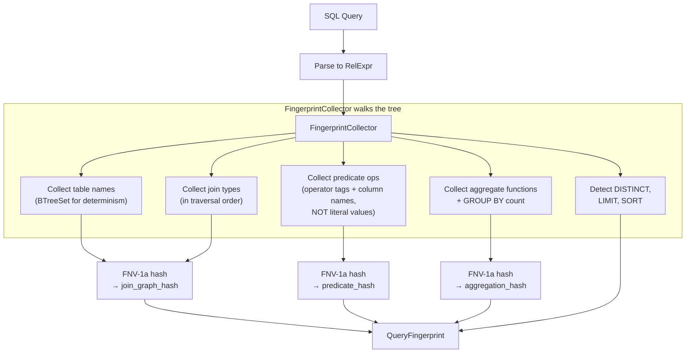
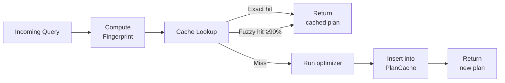

# Genetic Query Fingerprinting

## Overview

Genetic query fingerprinting (RFC 0060) generates compact structural
fingerprints of SQL queries for plan cache reuse. Two queries that differ only
in literal constant values -- such as `WHERE age > 18` and `WHERE age > 65` --
produce **identical fingerprints** and can share the same cached execution plan.

The fingerprint captures three orthogonal dimensions of query structure:

| Dimension | What it captures | Weight |
|-----------|-----------------|--------|
| **Join graph hash** | Tables involved and join topology | 40% |
| **Predicate pattern** | Operator types and column references, ignoring literal values | 30% |
| **Aggregation signature** | GROUP BY shape and aggregate functions | 20% |
| **Structural flags** | DISTINCT, LIMIT, ORDER BY, aggregation presence | 10% |

This enables aggressive plan reuse for OLTP workloads where the same query
template is executed repeatedly with different parameter values.

---

## Architecture

### Fingerprinting pipeline



### Plan cache integration



---

## The QueryFingerprint struct

**Source:** `crates/ra-engine/src/genetic_fingerprint.rs:29-51`

```rust
#[derive(Debug, Clone, PartialEq, Eq, Hash)]
pub struct QueryFingerprint {
    /// Hash of the join graph: tables and join topology.
    pub join_graph_hash: u64,
    /// Hash of the predicate pattern: operator types and column
    /// references, ignoring literal values.
    pub predicate_hash: u64,
    /// Hash of the aggregation signature: GROUP BY column count,
    /// aggregate functions used, HAVING presence.
    pub aggregation_hash: u64,
    /// Number of tables in the query.
    pub table_count: u16,
    /// Number of join operations.
    pub join_count: u16,
    /// Whether the query uses aggregation.
    pub has_aggregation: bool,
    /// Whether the query uses DISTINCT.
    pub has_distinct: bool,
    /// Whether the query has a LIMIT clause.
    pub has_limit: bool,
    /// Whether the query has a sort (ORDER BY).
    pub has_sort: bool,
}
```

The three 64-bit hashes provide 192 bits of structural identity. The additional
metadata fields (`table_count`, `join_count`, flags) enable quick pre-filtering
before computing full similarity scores.

---

## Fingerprint computation

### FingerprintCollector

The `FingerprintCollector` walks a `RelExpr` tree in a single pass,
accumulating structural information.

**Source:** `crates/ra-engine/src/genetic_fingerprint.rs:137-153`

```rust
#[derive(Default)]
struct FingerprintCollector {
    /// Sorted table names for deterministic hashing.
    tables: BTreeSet<String>,
    /// Join types encountered, in traversal order.
    join_types: Vec<JoinType>,
    /// Predicate operator shapes (BinOp discriminants, column refs).
    predicate_ops: Vec<u8>,
    /// Aggregate functions used.
    agg_functions: Vec<AggregateFunction>,
    /// Number of GROUP BY expressions.
    group_by_count: u16,
    /// Structural flags.
    has_distinct: bool,
    has_limit: bool,
    has_sort: bool,
}
```

### Tree traversal

The `visit` method recursively processes each `RelExpr` node:

**Source:** `crates/ra-engine/src/genetic_fingerprint.rs:156-311`

| Node type | Action |
|-----------|--------|
| `Scan` | Add table name to `BTreeSet` |
| `Filter` | Visit predicate expression, recurse into input |
| `Project` | Recurse into input |
| `Join` | Record join type, visit condition, recurse both sides |
| `Aggregate` | Record GROUP BY count, aggregate functions |
| `Sort` / `IncrementalSort` | Set `has_sort = true` |
| `Limit` | Set `has_limit = true` |
| `Distinct` | Set `has_distinct = true` |
| `IndexScan` / `IndexOnlyScan` / `ParallelScan` | Add table name |
| `BitmapIndexScan` / `BitmapHeapScan` | Add table, visit predicates |
| `ParallelHashJoin` | Record join type, visit condition and children |
| `ParallelAggregate` | Record GROUP BY and aggregate functions |
| `Union` / `Intersect` / `Except` | Recurse both sides |
| `CTE` / `RecursiveCTE` | Recurse definition and body |
| `Window` | Recurse input |
| `Values` / `MvScan` | No-op (no structural info) |

### Expression visiting: the key to parameterized matching

The `visit_expr` method records operator structure while **ignoring literal
values**. This is what makes two queries with different constants produce the
same fingerprint.

**Source:** `crates/ra-engine/src/genetic_fingerprint.rs:315-416`

```rust
fn visit_expr(&mut self, expr: &Expr) {
    match expr {
        Expr::Column(col_ref) => {
            // Record column reference structure
            self.predicate_ops.push(0x01);
            if let Some(table) = &col_ref.table {
                for b in table.as_bytes() {
                    self.predicate_ops.push(*b);
                }
            }
            self.predicate_ops.push(0x00); // separator
            for b in col_ref.column.as_bytes() {
                self.predicate_ops.push(*b);
            }
            self.predicate_ops.push(0x00); // separator
        }
        Expr::Const(_) => {
            // Record that there IS a constant, but NOT its value.
            // This is what makes parameterized queries match.
            self.predicate_ops.push(0x02);
        }
        Expr::BinOp { op, left, right } => {
            self.predicate_ops.push(0x03);
            self.predicate_ops
                .push(binop_discriminant(op));
            self.visit_expr(left);
            self.visit_expr(right);
        }
        // ... other expression types
    }
}
```

The byte encoding uses tag bytes to distinguish node types:

| Tag | Node type |
|-----|-----------|
| `0x01` | Column reference |
| `0x02` | Constant (any value) |
| `0x03` | Binary operation |
| `0x04` | Unary operation |
| `0x05` | Function call |
| `0x06` | CASE expression |
| `0x07` | CAST |
| `0x08` | Array literal |
| `0x09` | Array index |
| `0x0A` | Pattern expression |
| `0x0B` | Array slice |

### Hashing with FNV-1a

Each dimension uses an FNV-1a 64-bit hasher for deterministic, fast hashing.

**Source:** `crates/ra-engine/src/genetic_fingerprint.rs:467-494`

```rust
struct FnvHasher {
    state: u64,
}

impl FnvHasher {
    const OFFSET_BASIS: u64 = 0xcbf2_9ce4_8422_2325;
    const PRIME: u64 = 0x0100_0000_01b3;

    fn new() -> Self {
        Self {
            state: Self::OFFSET_BASIS,
        }
    }
}

impl Hasher for FnvHasher {
    fn finish(&self) -> u64 {
        self.state
    }

    fn write(&mut self, bytes: &[u8]) {
        for &byte in bytes {
            self.state ^= u64::from(byte);
            self.state =
                self.state.wrapping_mul(Self::PRIME);
        }
    }
}
```

FNV-1a was chosen over SipHash (Rust's default) for:
- **Determinism**: Same input always produces same output regardless of process
- **Speed**: No per-process random seed initialization
- **Simplicity**: ~10 lines of code, no dependencies

### Building the three hashes

**Source:** `crates/ra-engine/src/genetic_fingerprint.rs:438-464`

```rust
fn compute_join_hash(&self) -> u64 {
    let mut hasher = FnvHasher::new();
    // Sorted tables for deterministic order
    for table in &self.tables {
        table.hash(&mut hasher);
    }
    // Join types in traversal order
    for jt in &self.join_types {
        std::mem::discriminant(jt).hash(&mut hasher);
    }
    hasher.finish()
}

fn compute_predicate_hash(&self) -> u64 {
    let mut hasher = FnvHasher::new();
    self.predicate_ops.hash(&mut hasher);
    hasher.finish()
}

fn compute_aggregation_hash(&self) -> u64 {
    let mut hasher = FnvHasher::new();
    self.group_by_count.hash(&mut hasher);
    for func in &self.agg_functions {
        std::mem::discriminant(func).hash(&mut hasher);
    }
    hasher.finish()
}
```

Note that `tables` uses a `BTreeSet`, ensuring sorted iteration regardless of
insertion order. This makes the join graph hash independent of the order in
which tables appear in the query.

---

## Similarity scoring

### Exact match

Two fingerprints are exact matches if all three hashes are identical:

**Source:** `crates/ra-engine/src/genetic_fingerprint.rs:129-133`

```rust
pub fn is_exact_match(&self, other: &Self) -> bool {
    self.join_graph_hash == other.join_graph_hash
        && self.predicate_hash == other.predicate_hash
        && self.aggregation_hash == other.aggregation_hash
}
```

This is an O(1) operation (three integer comparisons).

### Fuzzy similarity

For queries that are structurally similar but not identical, the `similarity()`
method computes a weighted score:

**Source:** `crates/ra-engine/src/genetic_fingerprint.rs:73-124`

```rust
pub fn similarity(&self, other: &Self) -> f64 {
    let join_match =
        if self.join_graph_hash == other.join_graph_hash {
            1.0
        } else if self.table_count == other.table_count
            && self.join_count == other.join_count
        {
            0.3  // Same shape, different tables
        } else {
            0.0
        };

    let pred_match =
        if self.predicate_hash == other.predicate_hash {
            1.0
        } else {
            0.0
        };

    let agg_match =
        if self.aggregation_hash == other.aggregation_hash {
            1.0
        } else if self.has_aggregation == other.has_aggregation {
            0.3  // Both aggregate, different shape
        } else {
            0.0
        };

    // Structural flags: 4 boolean comparisons
    let mut flag_matches: u32 = 0;
    if self.has_aggregation == other.has_aggregation {
        flag_matches += 1;
    }
    if self.has_distinct == other.has_distinct {
        flag_matches += 1;
    }
    if self.has_limit == other.has_limit {
        flag_matches += 1;
    }
    if self.has_sort == other.has_sort {
        flag_matches += 1;
    }
    let flag_score = f64::from(flag_matches) / 4.0;

    0.4 * join_match
        + 0.3 * pred_match
        + 0.2 * agg_match
        + 0.1 * flag_score
}
```

### Weight rationale

| Dimension | Weight | Rationale |
|-----------|--------|-----------|
| Join graph | 40% | The join structure dominates plan cost. Different join orders require different plans. |
| Predicate pattern | 30% | Predicates determine selectivity and access paths. Different predicates may need different indexes. |
| Aggregation | 20% | Aggregation strategy (hash vs sort) depends on the grouping shape. |
| Flags | 10% | Minor structural differences (LIMIT, DISTINCT) have smaller plan impact. |

### Similarity thresholds

| Score range | Meaning | Cache behavior |
|-------------|---------|---------------|
| 1.0 | Identical structure (parameter variation) | Exact cache hit |
| 0.9 - 1.0 | Very similar (minor differences) | Fuzzy cache hit (default threshold) |
| 0.5 - 0.9 | Partially similar | Cache miss |
| 0.0 - 0.5 | Mostly different | Cache miss |

---

## Plan cache

The `PlanCache` stores optimized plans keyed by `QueryFingerprint` and uses
LRU eviction when full.

### PlanCacheConfig

**Source:** `crates/ra-engine/src/plan_cache.rs:20-40`

```rust
pub struct PlanCacheConfig {
    /// Maximum number of cached plans.
    pub max_entries: usize,
    /// Minimum similarity score for a fuzzy cache hit.
    pub similarity_threshold: f64,
    /// Whether to enable fuzzy matching.
    pub enable_fuzzy_matching: bool,
}

impl Default for PlanCacheConfig {
    fn default() -> Self {
        Self {
            max_entries: 1024,
            similarity_threshold: 0.9,
            enable_fuzzy_matching: true,
        }
    }
}
```

### Cache lookup flow

**Source:** `crates/ra-engine/src/plan_cache.rs:144-175`

```rust
pub fn lookup(
    &mut self,
    fingerprint: &QueryFingerprint,
) -> Option<CacheLookupResult> {
    self.stats.lookups += 1;

    // 1. Try exact match (O(1) HashMap lookup)
    if let Some(&idx) = self.exact_index.get(fingerprint) {
        self.access_counter += 1;
        self.entries[idx].last_access = self.access_counter;
        self.entries[idx].hit_count += 1;
        self.stats.exact_hits += 1;
        return Some(CacheLookupResult {
            plan: self.entries[idx].plan.clone(),
            match_type: CacheMatchType::Exact,
            similarity: 1.0,
        });
    }

    // 2. Try fuzzy match (O(n) scan)
    if self.config.enable_fuzzy_matching {
        if let Some(result) = self.fuzzy_lookup(fingerprint) {
            self.stats.fuzzy_hits += 1;
            return Some(result);
        }
    }

    self.stats.misses += 1;
    None
}
```

Exact match is O(1) via a `HashMap<QueryFingerprint, usize>` index. Fuzzy
matching is O(n) where n is the number of cache entries -- it scans all entries
to find the best match above the similarity threshold.

### LRU eviction

When the cache reaches `max_entries`, the least-recently-used entry is evicted
using a monotonic access counter.

**Source:** `crates/ra-engine/src/plan_cache.rs:268-299`

```rust
fn evict_lru(&mut self) {
    if self.entries.is_empty() {
        return;
    }

    // Find entry with smallest last_access
    let lru_idx = self
        .entries
        .iter()
        .enumerate()
        .min_by_key(|(_, e)| e.last_access)
        .map(|(i, _)| i)
        .expect("entries is non-empty");

    // Remove from exact index
    self.exact_index
        .remove(&self.entries[lru_idx].fingerprint);

    // Swap-remove and fix up moved entry's index
    self.entries.swap_remove(lru_idx);
    if lru_idx < self.entries.len() {
        let moved_fp =
            self.entries[lru_idx].fingerprint.clone();
        self.exact_index.insert(moved_fp, lru_idx);
    }

    self.stats.evictions += 1;
    self.stats.current_entries = self.entries.len();
}
```

### Cache statistics

**Source:** `crates/ra-engine/src/plan_cache.rs:78-106`

```rust
pub struct PlanCacheStats {
    /// Total lookup attempts.
    pub lookups: u64,
    /// Exact fingerprint hits.
    pub exact_hits: u64,
    /// Fuzzy similarity hits.
    pub fuzzy_hits: u64,
    /// Cache misses.
    pub misses: u64,
    /// Number of evictions performed.
    pub evictions: u64,
    /// Current number of entries in the cache.
    pub current_entries: usize,
}

impl PlanCacheStats {
    /// Overall cache hit rate (exact + fuzzy).
    pub fn hit_rate(&self) -> f64 {
        if self.lookups == 0 {
            return 0.0;
        }
        let hits = (self.exact_hits + self.fuzzy_hits) as f64;
        let total = self.lookups as f64;
        hits / total
    }
}
```

---

## Performance characteristics

### Fingerprint computation

| Metric | Value |
|--------|-------|
| Time per fingerprint | < 1ms for typical queries |
| Memory per fingerprint | 28 bytes (3 x u64 + 2 x u16 + 4 x bool) |
| Hash collisions | ~1 in 2^64 per dimension |

### Cache hit rates by workload

| Workload | Expected hit rate | Reason |
|----------|------------------|--------|
| OLTP (prepared statements) | >95% | Same template, varying parameters |
| OLTP (ad-hoc with patterns) | >90% | Most queries follow templates |
| OLAP (ad-hoc analytics) | 20-40% | Diverse query structures |
| Mixed workload | 60-80% | Depends on template ratio |

The test `workload_with_parameter_variations_high_hit_rate` in `plan_cache.rs`
confirms 100% hit rate for a workload of 20 queries differing only in constants:

**Source:** `crates/ra-engine/src/plan_cache.rs:519-540`

```rust
#[test]
fn workload_with_parameter_variations_high_hit_rate() {
    let mut cache = PlanCache::with_defaults();

    let base = make_join_query(1000);
    let fp = QueryFingerprint::from_rel_expr(&base);
    cache.insert(fp, base);

    let mut hits = 0_u32;
    for i in 0..20 {
        let q = make_join_query(i * 100 + 50);
        let qfp = QueryFingerprint::from_rel_expr(&q);
        if cache.lookup(&qfp).is_some() {
            hits += 1;
        }
    }

    assert_eq!(hits, 20);
    assert!(cache.stats().hit_rate() > 0.9);
}
```

### Lookup performance

| Operation | Complexity | Notes |
|-----------|-----------|-------|
| Exact lookup | O(1) | HashMap on QueryFingerprint |
| Fuzzy lookup | O(n) | Linear scan with similarity computation |
| Insert | O(1) amortized | O(n) when eviction is needed |
| Eviction | O(n) | Scan for min last_access |

For a cache of 1024 entries (the default), fuzzy lookup scans ~1024 entries with
3 integer comparisons + 4 boolean comparisons each, which completes in <1ms.

---

## When genetic fingerprinting is valuable

### Good fit: OLTP workloads

```
-- These three queries produce identical fingerprints:
SELECT * FROM users WHERE age > 18;
SELECT * FROM users WHERE age > 25;
SELECT * FROM users WHERE age > 65;

-- Fingerprint: same join_graph_hash, same predicate_hash
-- (Const is tagged as 0x02 regardless of value)
```

### Good fit: Parameterized queries

```
-- Same fingerprint for any string value:
SELECT * FROM users WHERE name = 'Alice';
SELECT * FROM users WHERE name = 'Bob';
```

### Not as useful: Ad-hoc analytics

```
-- Different fingerprints (different tables, joins, aggregations):
SELECT count(*) FROM orders GROUP BY status;
SELECT avg(amount) FROM orders JOIN users ON ... GROUP BY region;
```

These have different join graphs, different predicate patterns, and different
aggregation signatures, so they produce distinct fingerprints and each requires
its own cached plan.

---

## Operator discriminant encoding

Binary and unary operators are encoded as fixed discriminant bytes for stable
hashing:

**Source:** `crates/ra-engine/src/genetic_fingerprint.rs:496-523`

### Binary operators

| Discriminant | Operator |
|-------------|----------|
| 0 | `Eq` (=) |
| 1 | `Ne` (<>) |
| 2 | `Lt` (<) |
| 3 | `Le` (<=) |
| 4 | `Gt` (>) |
| 5 | `Ge` (>=) |
| 6 | `And` |
| 7 | `Or` |
| 8 | `Add` (+) |
| 9 | `Sub` (-) |
| 10 | `Mul` (*) |
| 11 | `Div` (/) |
| 12 | `Mod` (%) |
| 13 | `Concat` |
| 14 | `JsonAccess` |

### Unary operators

| Discriminant | Operator |
|-------------|----------|
| 0 | `Not` |
| 1 | `Neg` |
| 2 | `IsNull` |
| 3 | `IsNotNull` |

---

## Usage example

```rust
use ra_engine::genetic_fingerprint::QueryFingerprint;
use ra_engine::plan_cache::{PlanCache, PlanCacheConfig};
use ra_core::algebra::RelExpr;
use ra_core::expr::{BinOp, ColumnRef, Const, Expr};

// Compute fingerprint
let query = RelExpr::scan("users").filter(Expr::BinOp {
    op: BinOp::Gt,
    left: Box::new(Expr::Column(ColumnRef::new("age"))),
    right: Box::new(Expr::Const(Const::Int(18))),
});
let fp = QueryFingerprint::from_rel_expr(&query);

// Cache the optimized plan
let mut cache = PlanCache::with_defaults();
let optimized_plan = /* optimizer.optimize(&query) */;
cache.insert(fp.clone(), optimized_plan);

// Later: same query with different constant
let query2 = RelExpr::scan("users").filter(Expr::BinOp {
    op: BinOp::Gt,
    left: Box::new(Expr::Column(ColumnRef::new("age"))),
    right: Box::new(Expr::Const(Const::Int(65))),
});
let fp2 = QueryFingerprint::from_rel_expr(&query2);

// Exact cache hit -- same fingerprint
assert!(fp.is_exact_match(&fp2));
let result = cache.lookup(&fp2);
assert!(result.is_some());

// Check cache statistics
let stats = cache.stats();
println!("Hit rate: {:.1}%", stats.hit_rate() * 100.0);
```

---

## Design decisions

### Why three hashes instead of one?

A single hash of the entire `RelExpr` tree would make similarity scoring
impossible. By splitting into three orthogonal dimensions, the fingerprint
enables:

- **Exact matching** when all three hashes agree
- **Fuzzy matching** when most dimensions agree but one differs
- **Quick rejection** when the join graph (highest weight) differs

### Why FNV-1a instead of SipHash?

Rust's default `HashMap` hasher (SipHash) uses a per-process random seed for
DoS resistance. This means the same input produces different hashes across
process restarts, making fingerprints non-portable. FNV-1a is deterministic
and fast, with no cryptographic security needed for plan caching.

### Why BTreeSet for tables?

Table names must be hashed in a deterministic order regardless of how they
appear in the query. `BTreeSet` provides sorted iteration, so
`JOIN users, orders` and `JOIN orders, users` produce the same join graph
hash.

### Why ignore literal values?

In OLTP workloads, the same prepared statement runs thousands of times with
different parameter values. The query plan structure (join order, access paths,
operator types) is determined by the query shape, not the specific constant
values. By treating all constants as equivalent, the fingerprint maximizes
cache hit rates for these workloads.

Note: This design trades plan quality for reuse. A query with `WHERE id = 1`
and `WHERE id = 999999` will use the same plan even if the optimal access
path differs. For critical cases, the optimizer can be configured to bypass
the plan cache.

---

## Source file index

| File | Lines | Description |
|------|-------|-------------|
| [`crates/ra-engine/src/genetic_fingerprint.rs`](../../crates/ra-engine/src/genetic_fingerprint.rs) | 813 | Fingerprint computation and similarity scoring |
| [`crates/ra-engine/src/plan_cache.rs`](../../crates/ra-engine/src/plan_cache.rs) | 542 | LRU plan cache with exact and fuzzy lookup |
