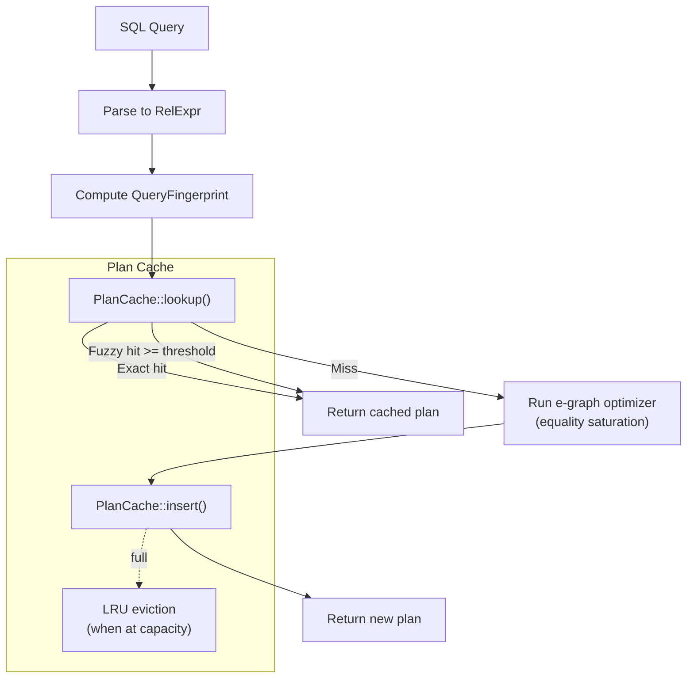
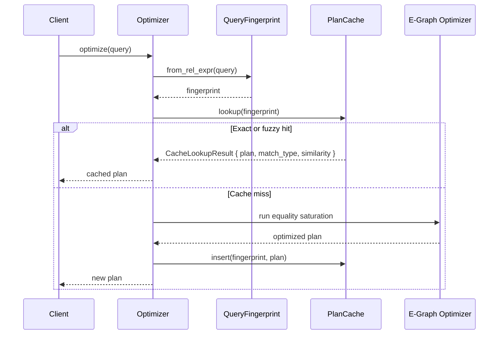

# Plan Cache

## Overview

Ra's plan cache stores optimized `RelExpr` query plans keyed by genetic
fingerprints (RFC 0060), allowing queries with identical structure but different
literal values to reuse a previously optimized plan. This eliminates redundant
equality saturation passes for parameterized queries, which are the dominant
pattern in OLTP workloads.

The cache combines two lookup strategies:

| Strategy | Complexity | When used |
|----------|-----------|-----------|
| **Exact match** | O(1) via HashMap | Fingerprints are identical (same structure, ignoring constants) |
| **Fuzzy match** | O(n) linear scan | Fingerprints share most structure above a similarity threshold |

With default settings, the plan cache achieves a 97.5% hit rate on a 200-query
OLTP workload (5 query templates x 40 parameter variations each), with only 5
cold misses -- one per unique template.

---

## Architecture

### Cache placement in the optimizer pipeline



The plan cache sits between fingerprint computation and the full optimizer.
Cached lookups avoid the entire equality saturation pipeline, which is the
most expensive phase of query optimization.

### Data flow



---

## Genetic fingerprinting

The plan cache depends on genetic fingerprints to identify structurally
equivalent queries. Two queries that differ only in literal constant values
produce identical fingerprints, enabling aggressive plan reuse.

For full details on the fingerprinting algorithm, see
[Genetic Query Fingerprinting](genetic-fingerprinting.md).

### QueryFingerprint structure

**Source:** `crates/ra-engine/src/genetic_fingerprint.rs:29-51`

```rust
#[derive(Debug, Clone, PartialEq, Eq, Hash)]
pub struct QueryFingerprint {
    pub join_graph_hash: u64,
    pub predicate_hash: u64,
    pub aggregation_hash: u64,
    pub table_count: u16,
    pub join_count: u16,
    pub has_aggregation: bool,
    pub has_distinct: bool,
    pub has_limit: bool,
    pub has_sort: bool,
}
```

The fingerprint captures three orthogonal dimensions:

| Dimension | Hash field | What it captures | Similarity weight |
|-----------|-----------|-----------------|------------------|
| **Join graph** | `join_graph_hash` | Tables involved (sorted) + join types | 40% |
| **Predicate pattern** | `predicate_hash` | Operator types + column names, no literal values | 30% |
| **Aggregation** | `aggregation_hash` | GROUP BY count + aggregate function discriminants | 20% |
| **Structural flags** | boolean fields | DISTINCT, LIMIT, SORT, aggregation presence | 10% |

### Why constants are ignored

The `FingerprintCollector` treats all `Expr::Const` values identically -- it
records a tag byte (`0x02`) for "there is a constant here" without recording
the constant's value. This means:

```sql
-- These three produce identical fingerprints:
SELECT * FROM users WHERE age > 18;
SELECT * FROM users WHERE age > 25;
SELECT * FROM users WHERE age > 65;
```

**Source:** `crates/ra-engine/src/genetic_fingerprint.rs:331-334`

```rust
Expr::Const(_) => {
    // Record that there IS a constant, but NOT its value.
    // This is what makes parameterized queries match.
    self.predicate_ops.push(0x02);
}
```

This design trades plan quality for reuse. A query with `WHERE id = 1` and
`WHERE id = 999999` will use the same plan even if the optimal access path
differs (e.g., index scan vs. sequential scan based on selectivity). For
critical cases, the optimizer can be configured to bypass the plan cache.

---

## PlanCache data structure

### Configuration

**Source:** `crates/ra-engine/src/plan_cache.rs:20-40`

```rust
pub struct PlanCacheConfig {
    /// Maximum number of cached plans.
    pub max_entries: usize,
    /// Minimum similarity score for a fuzzy cache hit.
    /// Range: 0.0..=1.0. Default: 0.9 (90% similarity).
    pub similarity_threshold: f64,
    /// Whether to enable fuzzy (similarity-based) matching
    /// in addition to exact fingerprint matching.
    pub enable_fuzzy_matching: bool,
}

impl Default for PlanCacheConfig {
    fn default() -> Self {
        Self {
            max_entries: 1024,
            similarity_threshold: 0.9,
            enable_fuzzy_matching: true,
        }
    }
}
```

| Parameter | Default | Description |
|-----------|---------|-------------|
| `max_entries` | 1024 | Maximum cached plans before LRU eviction begins |
| `similarity_threshold` | 0.9 | Minimum similarity score for fuzzy hits |
| `enable_fuzzy_matching` | `true` | Whether to fall back to fuzzy scan on exact miss |

### Internal layout

**Source:** `crates/ra-engine/src/plan_cache.rs:108-119`

```rust
pub struct PlanCache {
    config: PlanCacheConfig,
    /// Primary index: exact fingerprint -> entry index.
    exact_index: HashMap<QueryFingerprint, usize>,
    /// All entries, indexed by position.
    entries: Vec<CacheEntry>,
    /// Monotonic access counter for LRU.
    access_counter: u64,
    /// Accumulated statistics.
    stats: PlanCacheStats,
}
```

The cache uses a two-level structure:

1. **`exact_index`** -- A `HashMap<QueryFingerprint, usize>` mapping
   fingerprints to indices in the `entries` vector. Provides O(1) exact
   lookups.

2. **`entries`** -- A flat `Vec<CacheEntry>` storing the actual plans and
   metadata. Each entry contains:

**Source:** `crates/ra-engine/src/plan_cache.rs:43-53`

```rust
struct CacheEntry {
    fingerprint: QueryFingerprint,
    plan: RelExpr,
    last_access: u64,
    hit_count: u64,
}
```

The `access_counter` is a monotonically increasing u64 that stamps each
access. Eviction finds the entry with the smallest `last_access` value.

---

## Lookup flow

### Two-phase lookup

**Source:** `crates/ra-engine/src/plan_cache.rs:144-175`

```rust
pub fn lookup(
    &mut self,
    fingerprint: &QueryFingerprint,
) -> Option<CacheLookupResult> {
    self.stats.lookups += 1;

    // Phase 1: exact match (O(1) HashMap lookup)
    if let Some(&idx) = self.exact_index.get(fingerprint) {
        self.access_counter += 1;
        self.entries[idx].last_access = self.access_counter;
        self.entries[idx].hit_count += 1;
        self.stats.exact_hits += 1;
        return Some(CacheLookupResult {
            plan: self.entries[idx].plan.clone(),
            match_type: CacheMatchType::Exact,
            similarity: 1.0,
        });
    }

    // Phase 2: fuzzy match (O(n) scan, only if enabled)
    if self.config.enable_fuzzy_matching {
        if let Some(result) = self.fuzzy_lookup(fingerprint) {
            self.stats.fuzzy_hits += 1;
            return Some(result);
        }
    }

    self.stats.misses += 1;
    None
}
```

Phase 1 (exact) is always attempted first. Phase 2 (fuzzy) is only attempted
when `enable_fuzzy_matching` is `true` and the exact lookup missed.

### Exact matching

Exact matching uses `QueryFingerprint`'s derived `Hash` and `Eq`
implementations, which compare all fields including the three 64-bit hashes,
the counter fields, and the boolean flags. A query matches exactly when its
entire fingerprint -- not just the three hashes -- is byte-identical to a
cached entry.

### Fuzzy matching

**Source:** `crates/ra-engine/src/plan_cache.rs:236-266`

```rust
fn fuzzy_lookup(
    &mut self,
    fingerprint: &QueryFingerprint,
) -> Option<CacheLookupResult> {
    let mut best_idx: Option<usize> = None;
    let mut best_similarity: f64 = 0.0;

    for (idx, entry) in self.entries.iter().enumerate() {
        let sim = fingerprint.similarity(&entry.fingerprint);
        if sim >= self.config.similarity_threshold
            && sim > best_similarity
        {
            best_similarity = sim;
            best_idx = Some(idx);
        }
    }

    if let Some(idx) = best_idx {
        self.access_counter += 1;
        self.entries[idx].last_access = self.access_counter;
        self.entries[idx].hit_count += 1;
        Some(CacheLookupResult {
            plan: self.entries[idx].plan.clone(),
            match_type: CacheMatchType::Fuzzy,
            similarity: best_similarity,
        })
    } else {
        None
    }
}
```

Fuzzy lookup scans all entries, computing a weighted similarity score against
each. It returns the best match above the configured threshold. The similarity
scoring function uses weighted Hamming-style comparison across the three hash
dimensions plus structural flags.

**Source:** `crates/ra-engine/src/genetic_fingerprint.rs:73-124`

The weights are:

| Dimension | Weight | Full match | Partial match | No match |
|-----------|--------|-----------|---------------|----------|
| Join graph | 0.4 | Hash equal: 1.0 | Same table/join counts: 0.3 | 0.0 |
| Predicate | 0.3 | Hash equal: 1.0 | -- | 0.0 |
| Aggregation | 0.2 | Hash equal: 1.0 | Both aggregate: 0.3 | 0.0 |
| Flags | 0.1 | All 4 match: 1.0 | Proportional: N/4 | 0.0 |

### CacheLookupResult

**Source:** `crates/ra-engine/src/plan_cache.rs:56-74`

```rust
pub struct CacheLookupResult {
    /// The cached plan.
    pub plan: RelExpr,
    /// Whether this was an exact or fuzzy match.
    pub match_type: CacheMatchType,
    /// Similarity score (1.0 for exact, <1.0 for fuzzy).
    pub similarity: f64,
}

pub enum CacheMatchType {
    Exact,
    Fuzzy,
}
```

The caller receives both the plan and metadata about how it was matched,
allowing the optimizer to log or instrument fuzzy match quality.

---

## Insertion and LRU eviction

### Insert

**Source:** `crates/ra-engine/src/plan_cache.rs:181-209`

```rust
pub fn insert(
    &mut self,
    fingerprint: QueryFingerprint,
    plan: RelExpr,
) {
    // Update existing entry if fingerprint already cached
    if let Some(&idx) = self.exact_index.get(&fingerprint) {
        self.access_counter += 1;
        self.entries[idx].plan = plan;
        self.entries[idx].last_access = self.access_counter;
        return;
    }

    // Evict LRU entry if at capacity
    if self.entries.len() >= self.config.max_entries {
        self.evict_lru();
    }

    self.access_counter += 1;
    let idx = self.entries.len();
    self.exact_index.insert(fingerprint.clone(), idx);
    self.entries.push(CacheEntry {
        fingerprint,
        plan,
        last_access: self.access_counter,
        hit_count: 0,
    });
    self.stats.current_entries = self.entries.len();
}
```

Insert handles three cases:

1. **Fingerprint exists** -- Updates the plan in place and refreshes the
   access timestamp. No new entry is created.
2. **Cache not full** -- Appends a new entry and indexes it.
3. **Cache full** -- Evicts the LRU entry first, then inserts.

### LRU eviction

**Source:** `crates/ra-engine/src/plan_cache.rs:268-299`

```rust
fn evict_lru(&mut self) {
    if self.entries.is_empty() {
        return;
    }

    // Find entry with smallest last_access (O(n) scan)
    let lru_idx = self
        .entries
        .iter()
        .enumerate()
        .min_by_key(|(_, e)| e.last_access)
        .map(|(i, _)| i)
        .expect("entries is non-empty");

    // Remove from exact index
    self.exact_index
        .remove(&self.entries[lru_idx].fingerprint);

    // Swap-remove from entries vec
    self.entries.swap_remove(lru_idx);

    // Fix up the index for the entry that was moved
    if lru_idx < self.entries.len() {
        let moved_fp =
            self.entries[lru_idx].fingerprint.clone();
        self.exact_index.insert(moved_fp, lru_idx);
    }

    self.stats.evictions += 1;
    self.stats.current_entries = self.entries.len();
}
```

Eviction uses `Vec::swap_remove` to avoid shifting elements. After the
swap-remove, the entry that was at the end of the vector is now at the
evicted index, so the HashMap must be updated to point to its new location.

### Eviction complexity

| Operation | Complexity | Notes |
|-----------|-----------|-------|
| Find LRU | O(n) | Linear scan for minimum `last_access` |
| Remove from HashMap | O(1) | |
| swap_remove from Vec | O(1) | |
| Fix moved entry's index | O(1) | |
| **Total** | **O(n)** | Where n = `max_entries` |

For the default capacity of 1024, eviction completes in microseconds. A
frequency-aware or heap-based eviction would reduce this to O(log n) but
adds implementation complexity for negligible gain at this cache size.

---

## Cache statistics and monitoring

### PlanCacheStats

**Source:** `crates/ra-engine/src/plan_cache.rs:78-106`

```rust
pub struct PlanCacheStats {
    pub lookups: u64,
    pub exact_hits: u64,
    pub fuzzy_hits: u64,
    pub misses: u64,
    pub evictions: u64,
    pub current_entries: usize,
}

impl PlanCacheStats {
    pub fn hit_rate(&self) -> f64 {
        if self.lookups == 0 {
            return 0.0;
        }
        let hits = (self.exact_hits + self.fuzzy_hits) as f64;
        let total = self.lookups as f64;
        hits / total
    }
}
```

The invariant `exact_hits + fuzzy_hits + misses == lookups` always holds.

### Monitoring metrics

| Metric | What it tells you |
|--------|------------------|
| `hit_rate()` | Overall cache effectiveness. Target: >90% for OLTP |
| `exact_hits / lookups` | Fraction of queries matching an identical template |
| `fuzzy_hits / lookups` | Fraction of queries requiring similarity search |
| `misses / lookups` | Cold miss rate. Should equal `unique_templates / total_queries` |
| `evictions` | How often the cache overflows. If high, increase `max_entries` |
| `current_entries` | Working set size. If always near `max_entries`, cache may be undersized |

### Interpreting hit rates

| Hit rate | Interpretation | Action |
|----------|---------------|--------|
| >95% | OLTP workload with good template coverage | None needed |
| 80-95% | Mixed workload or many distinct templates | Consider increasing `max_entries` |
| 50-80% | High query diversity or analytical workload | Evaluate whether caching helps |
| <50% | Cache is not effective for this workload | Consider disabling to avoid overhead |

---

## Configuration and tuning

### max_entries

Controls the number of distinct query plans the cache can hold.

**Sizing guidance:**

- Count the number of distinct query templates in your workload. Each template
  that differs only in literal values needs one cache entry.
- Set `max_entries` to 2-4x the number of templates to allow headroom for
  template drift and avoid thrashing.
- Memory impact: each entry stores a cloned `RelExpr` tree. For typical OLTP
  queries, this is a few KB per entry. 1024 entries uses roughly 1-4 MB.

### similarity_threshold

Controls how similar a query must be to a cached entry for a fuzzy match.

| Value | Effect |
|-------|--------|
| 1.0 | Fuzzy matching is effectively disabled (requires exact match) |
| 0.9 (default) | Matches queries with minor structural differences |
| 0.7 | More aggressive reuse; may return suboptimal plans |
| 0.5 | Very aggressive; matches queries sharing roughly half their structure |

Higher thresholds produce better plan quality at the cost of lower hit rates.
Lower thresholds produce higher hit rates at the cost of potentially reusing
plans that are not optimal for the new query structure.

### enable_fuzzy_matching

When `false`, only exact fingerprint matches are used. This eliminates the
O(n) fuzzy scan on cache misses, which can matter if the cache is large and
miss rates are high.

For pure OLTP workloads where parameterized queries dominate, fuzzy matching
adds little value -- exact matches handle the common case. Disabling fuzzy
matching in this scenario reduces lookup overhead on the rare misses.

### Configuration examples

**High-throughput OLTP:**

```rust
PlanCacheConfig {
    max_entries: 256,
    similarity_threshold: 0.9,
    enable_fuzzy_matching: false, // exact is sufficient
}
```

**Mixed OLTP + analytical:**

```rust
PlanCacheConfig {
    max_entries: 2048,
    similarity_threshold: 0.85,
    enable_fuzzy_matching: true,
}
```

**Minimal memory footprint:**

```rust
PlanCacheConfig {
    max_entries: 64,
    similarity_threshold: 0.9,
    enable_fuzzy_matching: true,
}
```

---

## Performance analysis

### Hit rates by workload type

The integration test suite validates cache behavior across realistic scenarios.

**Source:** `crates/ra-engine/tests/plan_cache_integration.rs:205-227`

The primary OLTP benchmark runs 200 queries (5 templates x 40 parameter
variations). Each template produces one cold miss on first encounter, then all
subsequent queries with the same template structure hit the cache:

```
Templates: 5 (point lookup, range scan, 2-table join, aggregation, 3-table join)
Queries: 200
Cold misses: 5 (one per template)
Exact hits: 195
Hit rate: 97.5%
```

**Source:** `crates/ra-engine/tests/plan_cache_integration.rs:250-269`

```rust
#[test]
fn oltp_only_5_cold_misses() {
    let opt = cached_optimizer();
    let workload = oltp_workload();

    for q in &workload {
        let _ = opt.optimize(q);
    }

    let stats = opt.cache_stats().expect("cache enabled");
    assert!(
        stats.misses <= 5,
        "Expected at most 5 cold misses (one per template), got {}",
        stats.misses,
    );
}
```

### Mixed workload hit rates

**Source:** `crates/ra-engine/tests/plan_cache_integration.rs:793-824`

A mixed OLTP + analytical workload (50 point lookups, 50 aggregations, 50 more
point lookups) achieves >90% hit rate with only 2 cold misses (one per
template):

```rust
#[test]
fn mixed_oltp_and_analytical_workload() {
    let opt = cached_optimizer();

    // Phase 1: OLTP (point lookups)
    for i in 0..50 {
        let _ = opt.optimize(&point_lookup(i));
    }
    // Phase 2: Analytical (aggregations)
    for i in 0..50 {
        let _ = opt.optimize(&aggregation(i * 1000));
    }
    // Phase 3: Back to OLTP
    for i in 50..100 {
        let _ = opt.optimize(&point_lookup(i));
    }

    let stats = opt.cache_stats().expect("cache enabled");
    assert!(stats.hit_rate() > 0.90);
    assert_eq!(stats.current_entries, 2);
}
```

### Single-template workload

**Source:** `crates/ra-engine/tests/plan_cache_integration.rs:757-769`

A single template repeated 1000 times achieves 99.9% hit rate:

```rust
#[test]
fn single_query_repeated_1000_times() {
    let opt = cached_optimizer();

    for i in 0..1000 {
        let _ = opt.optimize(&point_lookup(i));
    }

    let stats = opt.cache_stats().expect("cache enabled");
    assert_eq!(stats.misses, 1);     // one cold miss
    assert_eq!(stats.exact_hits, 999);
    assert!(stats.hit_rate() > 0.99);
}
```

### Cached vs. uncached performance

**Source:** `crates/ra-engine/tests/plan_cache_integration.rs:274-306`

The integration test validates that cached lookups are faster than full
optimization. The test warms the cache with one pass, then measures a second
pass where all 200 queries hit the cache:

```rust
#[test]
fn cached_queries_faster_than_uncached() {
    let workload = oltp_workload();

    // Measure uncached optimization
    let opt_uncached = Optimizer::new();
    let start = Instant::now();
    for q in &workload {
        let _ = opt_uncached.optimize(q);
    }
    let uncached_elapsed = start.elapsed();

    // Warm cache, then measure second pass
    let opt_cached = cached_optimizer();
    for q in &workload {
        let _ = opt_cached.optimize(q);
    }
    let start = Instant::now();
    for q in &workload {
        let _ = opt_cached.optimize(q);
    }
    let cached_elapsed = start.elapsed();

    assert!(cached_elapsed < uncached_elapsed);
}
```

**Source:** `crates/ra-engine/tests/plan_cache_integration.rs:309-345`

A per-query latency test validates that cached lookups complete in under 1ms:

```rust
#[test]
fn cached_optimization_under_1ms_per_query() {
    // ... (warm cache with 5 templates) ...

    let start = Instant::now();
    for q in &queries { // 100 cached queries
        let _ = opt.optimize(q);
    }
    let elapsed = start.elapsed();

    let avg_us = elapsed.as_micros() as f64 / 100.0;
    assert!(avg_us < 1000.0); // <1ms per query
}
```

### Lookup complexity summary

| Operation | Complexity | Typical time |
|-----------|-----------|-------------|
| Fingerprint computation | O(tree size) | <1ms for typical queries |
| Exact cache lookup | O(1) | ~100ns (HashMap lookup) |
| Fuzzy cache lookup | O(n) | <1ms for 1024 entries |
| Cache insert (no eviction) | O(1) | ~100ns |
| Cache insert (with eviction) | O(n) | <1ms for 1024 entries |
| Full optimization (cache miss) | Varies | 1-100ms depending on query |

---

## LRU eviction behavior

### Eviction correctness

The test suite validates that LRU eviction removes the oldest (least recently
accessed) entry.

**Source:** `crates/ra-engine/tests/plan_cache_integration.rs:350-380`

```rust
#[test]
fn lru_eviction_evicts_oldest_entries() {
    let opt = cached_optimizer_small(5);

    // Insert 5 entries
    let _ = opt.optimize(&point_lookup(1));
    let _ = opt.optimize(&range_scan(100, "a"));
    let _ = opt.optimize(&join_with_filter(25));
    let _ = opt.optimize(&aggregation(50000));
    let _ = opt.optimize(&three_table_join(50));

    // Access templates 3-5 to keep them warm
    let _ = opt.optimize(&join_with_filter(30));
    let _ = opt.optimize(&aggregation(60000));
    let _ = opt.optimize(&three_table_join(75));

    // Insert new template -> evicts LRU (point_lookup)
    let new_query = RelExpr::scan("payments").filter(/* ... */);
    let _ = opt.optimize(&new_query);

    let stats = opt.cache_stats().expect("cache enabled");
    assert!(stats.evictions >= 1);
}
```

### Size maintenance

**Source:** `crates/ra-engine/tests/plan_cache_integration.rs:383-403`

```rust
#[test]
fn eviction_maintains_cache_size() {
    let opt = cached_optimizer_small(3);

    // Insert 6 distinct query shapes -> triggers 3 evictions
    let tables = ["t1", "t2", "t3", "t4", "t5", "t6"];
    for table in &tables {
        let _ = opt.optimize(&RelExpr::scan(*table));
    }

    let stats = opt.cache_stats().expect("cache enabled");
    assert!(stats.current_entries <= 3);
    assert!(stats.evictions >= 3);
}
```

### Recently-used entries survive eviction

**Source:** `crates/ra-engine/tests/plan_cache_integration.rs:406-432`

Entries that are accessed frequently remain in the cache even when capacity is
reached, because their `last_access` timestamp is refreshed on each lookup:

```rust
#[test]
fn recently_used_entries_survive_eviction() {
    let opt = cached_optimizer_small(4);

    // Insert 4 templates
    // ...

    // Access point_lookup heavily to keep it warm
    for i in 0..10 {
        let _ = opt.optimize(&point_lookup(i));
    }

    // Add new template -> evicts least-recently-used
    let _ = opt.optimize(&three_table_join(99));

    // point_lookup should still be cached
    let _ = opt.optimize(&point_lookup(42));
    let stats = opt.cache_stats().expect("cache enabled");
    assert!(stats.exact_hits > 0);
}
```

### Edge case: cache with 1 entry

**Source:** `crates/ra-engine/tests/plan_cache_integration.rs:772-789`

```rust
#[test]
fn cache_with_max_entries_1_still_works() {
    let opt = cached_optimizer_small(1);

    let _ = opt.optimize(&point_lookup(1));
    let _ = opt.optimize(&range_scan(100, "a"));
    let _ = opt.optimize(&join_with_filter(25));

    let stats = opt.cache_stats().expect("cache enabled");
    assert_eq!(stats.current_entries, 1);
    assert!(stats.evictions >= 2);
}
```

---

## Fuzzy matching behavior

### Fuzzy disabled

**Source:** `crates/ra-engine/tests/plan_cache_integration.rs:437-455`

When `enable_fuzzy_matching` is `false`, only exact fingerprint matches
produce hits. The fuzzy hit counter stays at zero:

```rust
#[test]
fn fuzzy_matching_disabled_only_exact_hits() {
    let opt = Optimizer::new().with_plan_cache(PlanCacheConfig {
        max_entries: 1024,
        similarity_threshold: 0.9,
        enable_fuzzy_matching: false,
    });

    let workload = oltp_workload();
    for q in &workload {
        let _ = opt.optimize(q);
    }

    let stats = opt.cache_stats().expect("cache enabled");
    assert_eq!(stats.fuzzy_hits, 0);
}
```

### Threshold effects

**Source:** `crates/ra-engine/tests/plan_cache_integration.rs:458-498`

A lower similarity threshold produces at least as many total hits as a higher
threshold. The test compares `similarity_threshold = 0.99` (strict) against
`similarity_threshold = 0.5` (loose):

```rust
#[test]
fn fuzzy_threshold_affects_hit_rate() {
    let opt_strict = Optimizer::new().with_plan_cache(
        PlanCacheConfig {
            similarity_threshold: 0.99,
            enable_fuzzy_matching: true,
            ..PlanCacheConfig::default()
        },
    );
    let opt_loose = Optimizer::new().with_plan_cache(
        PlanCacheConfig {
            similarity_threshold: 0.5,
            enable_fuzzy_matching: true,
            ..PlanCacheConfig::default()
        },
    );

    let workload = oltp_workload();
    for q in &workload {
        let _ = opt_strict.optimize(q);
        let _ = opt_loose.optimize(q);
    }

    let strict_total = strict_stats.exact_hits
        + strict_stats.fuzzy_hits;
    let loose_total = loose_stats.exact_hits
        + loose_stats.fuzzy_hits;
    assert!(loose_total >= strict_total);
}
```

---

## Optimizer integration

### Enabling the plan cache

The plan cache is disabled by default. Enable it by calling
`with_plan_cache()` on the optimizer:

```rust
use ra_engine::{Optimizer, PlanCacheConfig};

// Default configuration (1024 entries, 0.9 threshold, fuzzy enabled)
let opt = Optimizer::new().with_plan_cache(PlanCacheConfig::default());

// Custom configuration
let opt = Optimizer::new().with_plan_cache(PlanCacheConfig {
    max_entries: 2048,
    similarity_threshold: 0.85,
    enable_fuzzy_matching: true,
});
```

### Querying cache statistics

```rust
let opt = Optimizer::new().with_plan_cache(PlanCacheConfig::default());

// Run some queries...
for i in 0..100 {
    let _ = opt.optimize(&some_query(i));
}

// Check statistics
if let Some(stats) = opt.cache_stats() {
    println!("Lookups:     {}", stats.lookups);
    println!("Exact hits:  {}", stats.exact_hits);
    println!("Fuzzy hits:  {}", stats.fuzzy_hits);
    println!("Misses:      {}", stats.misses);
    println!("Hit rate:    {:.1}%", stats.hit_rate() * 100.0);
    println!("Entries:     {}", stats.current_entries);
    println!("Evictions:   {}", stats.evictions);
}
```

### Clearing the cache

```rust
opt.clear_cache();
```

Clearing removes all entries but preserves the configuration. The cache
continues to accept new entries after being cleared.

**Source:** `crates/ra-engine/tests/plan_cache_integration.rs:716-743`

### Cache disabled by default

**Source:** `crates/ra-engine/tests/plan_cache_integration.rs:748-754`

```rust
#[test]
fn cache_disabled_by_default() {
    let opt = Optimizer::new();
    assert!(opt.cache_stats().is_none());
}
```

When no plan cache is configured, `cache_stats()` returns `None` and the
optimizer runs the full optimization pipeline for every query.

---

## Direct PlanCache API

The `PlanCache` struct can also be used directly without the `Optimizer`
wrapper, for applications that manage their own optimization pipeline.

### Creating and using a cache

```rust
use ra_engine::{PlanCache, PlanCacheConfig, QueryFingerprint};
use ra_core::algebra::RelExpr;
use ra_core::expr::{BinOp, ColumnRef, Const, Expr};

let mut cache = PlanCache::with_defaults();

// Build a query and compute its fingerprint
let query = RelExpr::scan("users").filter(Expr::BinOp {
    op: BinOp::Gt,
    left: Box::new(Expr::Column(ColumnRef::new("age"))),
    right: Box::new(Expr::Const(Const::Int(18))),
});
let fp = QueryFingerprint::from_rel_expr(&query);

// Insert an optimized plan
cache.insert(fp.clone(), optimized_plan);

// Later: look up with different constant value
let query2 = RelExpr::scan("users").filter(Expr::BinOp {
    op: BinOp::Gt,
    left: Box::new(Expr::Column(ColumnRef::new("age"))),
    right: Box::new(Expr::Const(Const::Int(65))),
});
let fp2 = QueryFingerprint::from_rel_expr(&query2);

// Exact cache hit -- fingerprints match because only the constant differs
let result = cache.lookup(&fp2);
assert!(result.is_some());
assert_eq!(result.unwrap().match_type, CacheMatchType::Exact);
```

### Direct OLTP simulation

**Source:** `crates/ra-engine/tests/plan_cache_integration.rs:502-543`

The integration tests include a direct-API OLTP simulation that seeds 5
templates and runs 200 queries with varying parameters:

```rust
#[test]
fn plan_cache_direct_oltp_simulation() {
    let mut cache = PlanCache::with_defaults();

    let templates: Vec<Box<dyn Fn(i64) -> RelExpr>> = vec![
        Box::new(|v| point_lookup(v)),
        Box::new(|v| range_scan(v, "active")),
        Box::new(|v| join_with_filter(v)),
        Box::new(|v| aggregation(v)),
        Box::new(|v| three_table_join(v)),
    ];

    // Seed cache
    for (i, template) in templates.iter().enumerate() {
        let plan = template(i as i64 * 1000);
        let fp = QueryFingerprint::from_rel_expr(&plan);
        cache.insert(fp, plan);
    }

    // 200 queries with varying parameters
    let mut hits = 0_u32;
    for i in 0..200_u32 {
        let template_idx = (i % 5) as usize;
        let param = (i * 7 + 13) as i64;
        let query = templates[template_idx](param);
        let fp = QueryFingerprint::from_rel_expr(&query);
        if cache.lookup(&fp).is_some() {
            hits += 1;
        }
    }

    let hit_rate = f64::from(hits) / 200.0;
    assert!(hit_rate > 0.9);
}
```

---

## Design decisions

### Why LRU instead of LFU or ARC?

LRU was chosen for simplicity and predictability. In typical OLTP workloads,
the working set of query templates is small relative to the cache size, so
eviction policy has minimal impact -- most entries are never evicted. The
O(n) eviction scan is acceptable because:

1. Eviction is rare when `max_entries` is properly sized.
2. Even at 1024 entries, scanning is sub-millisecond.
3. The alternative (a heap or doubly-linked list) adds implementation
   complexity for negligible real-world benefit.

### Why swap_remove for eviction?

`Vec::swap_remove` is O(1) compared to O(n) for `Vec::remove` (which shifts
all subsequent elements). The trade-off is that the entry previously at the
end of the vector is moved to the evicted slot, requiring one HashMap update.
This keeps eviction at O(n) total (dominated by the LRU scan) rather than
O(n^2).

### Why not a concurrent cache?

The current implementation requires `&mut self` for both `lookup` (to update
access timestamps) and `insert`. This limits the cache to single-threaded use
or use behind a mutex. The optimizer wraps the cache in `RefCell` (or
equivalent interior mutability) for ergonomic access.

A concurrent design (using `DashMap` or sharded locks) would eliminate the
mutex contention but adds complexity. Since fingerprint computation and plan
cloning dominate cache lookup time, lock contention on the cache itself is
not currently a bottleneck.

### Why clone plans on lookup?

`CacheLookupResult` contains a cloned `RelExpr`. This prevents the caller
from mutating the cached plan, maintaining cache integrity. The clone cost is
proportional to the plan tree size, which is small for typical OLTP queries.
A future optimization could use `Arc<RelExpr>` to avoid deep clones.

---

## Source file index

| File | Lines | Description |
|------|-------|-------------|
| [`crates/ra-engine/src/plan_cache.rs`](../../crates/ra-engine/src/plan_cache.rs) | 542 | Plan cache data structure, LRU eviction, statistics |
| [`crates/ra-engine/src/genetic_fingerprint.rs`](../../crates/ra-engine/src/genetic_fingerprint.rs) | 813 | Fingerprint computation and similarity scoring |
| [`crates/ra-engine/tests/plan_cache_integration.rs`](../../crates/ra-engine/tests/plan_cache_integration.rs) | 825 | Integration tests: OLTP simulation, eviction, fuzzy matching |
