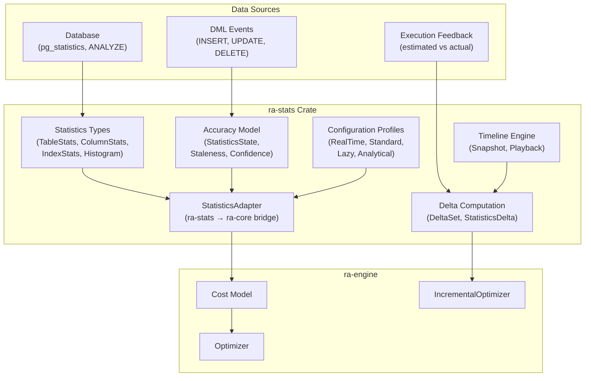

# Streaming Statistics

## Overview

Ra's streaming statistics system tracks how database statistics evolve over
time and provides the optimizer with fresh, accuracy-aware metadata for cost
estimation. The system is built around three core abstractions:

1. **Statistics types** -- A catalog of 20+ statistics types spanning
   table-level, column-level, index, and correlation metrics
2. **Accuracy modeling** -- Staleness tracking, confidence scoring, and
   refresh-threshold logic that tells the optimizer when statistics are too
   stale to trust
3. **Timeline playback** -- A TOML-based format for describing statistics
   evolution over time, with a playback engine for stepping through snapshots

The statistics subsystem lives in the `ra-stats-advanced` crate and integrates with the
optimizer through the `StatisticsAdapter` bridge.

---

## Architecture

### System overview



### Module structure

| Module | File | Purpose |
|--------|------|---------|
| `types` | `crates/ra-stats-advanced/src/types.rs` | Statistics type definitions |
| `accuracy` | `crates/ra-stats-advanced/src/accuracy.rs` | Staleness and confidence tracking |
| `delta` | `crates/ra-stats-advanced/src/delta.rs` | Change detection between snapshots |
| `timeline` | `crates/ra-stats-advanced/src/timeline.rs` | TOML timeline format and playback |
| `integration` | `crates/ra-stats-advanced/src/integration.rs` | Bridge to ra-core cost model |
| `profiles` | `crates/ra-stats-advanced/src/profiles.rs` | Pre-configured accuracy profiles |
| `feedback` | `crates/ra-stats-advanced/src/feedback.rs` | Execution feedback and error tracking |
| `gathering_cost` | `crates/ra-stats-advanced/src/gathering_cost.rs` | Cost estimation for ANALYZE |
| `skew` | `crates/ra-stats-advanced/src/skew.rs` | Data skew detection |
| `index_types` | `crates/ra-stats-advanced/src/index_types.rs` | Index metadata and cost factors |

---

## Statistics types

### Table-level statistics

**Source:** `crates/ra-stats-advanced/src/types.rs:16-32`

```rust
pub struct TableStats {
    /// Total number of rows in the table.
    pub row_count: u64,
    /// Total number of pages (blocks) used.
    pub page_count: u64,
    /// Average row size in bytes.
    pub average_row_size: f64,
    /// Total table size in bytes.
    pub table_size_bytes: u64,
    /// Number of live tuples (MVCC systems).
    pub live_tuples: Option<u64>,
    /// Number of dead tuples (MVCC systems).
    pub dead_tuples: Option<u64>,
    /// Last time statistics were gathered.
    pub last_analyzed: Option<i64>,
}
```

Derived methods:

| Method | Returns | Description |
|--------|---------|-------------|
| `dead_tuple_ratio()` | `f64` | Fraction of dead tuples (0.0 to 1.0) |
| `needs_vacuum(threshold)` | `bool` | Whether dead tuple ratio exceeds threshold |
| `fill_factor()` | `f64` | Average bytes per page |

### Column-level statistics

**Source:** `crates/ra-stats-advanced/src/types.rs:35-51`

```rust
pub struct ColumnStats {
    pub column_id: ColumnId,
    /// Number of distinct values (NDV/cardinality).
    pub ndv: u64,
    /// Fraction of NULL values (0.0 to 1.0).
    pub null_fraction: f64,
    /// Average column width in bytes.
    pub avg_width: f64,
    /// Most common values with frequencies.
    pub mcv: Option<MostCommonValues>,
    /// Histogram for value distribution.
    pub histogram: Option<Histogram>,
    /// Correlation with physical row order (-1.0 to 1.0).
    pub correlation: Option<f64>,
}
```

Key selectivity methods:

```rust
// Equality predicate: 1/NDV adjusted for NULLs
pub fn equality_selectivity(&self) -> f64 {
    if self.ndv == 0 { return 1.0; }
    (1.0 - self.null_fraction) / self.ndv as f64
}

// Range predicate spanning `fraction` of the domain
pub fn range_selectivity(&self, fraction: f64) -> f64 {
    (1.0 - self.null_fraction) * fraction.clamp(0.0, 1.0)
}
```

### Histogram types

**Source:** `crates/ra-stats-advanced/src/types.rs:64-92`

```rust
pub enum Histogram {
    /// Equi-width histogram with bucket boundaries.
    EquiWidth {
        boundaries: Vec<f64>,
        counts: Vec<u64>,
    },
    /// Equi-depth (equi-height) histogram.
    EquiDepth {
        boundaries: Vec<f64>,
        rows_per_bucket: u64,
    },
    /// End-biased histogram (PostgreSQL style).
    EndBiased {
        mcv_fraction: f64,
        boundaries: Vec<f64>,
    },
    /// T-Digest sketch for percentile estimation.
    TDigest {
        centroids: Vec<(f64, u64)>,
    },
}
```

### Sketch types

For approximate queries on large datasets:

```rust
pub enum Sketch {
    /// HyperLogLog for NDV estimation.
    HyperLogLog {
        precision: u8,
        registers: Vec<u8>,
    },
    /// Count-Min Sketch for frequency estimation.
    CountMinSketch {
        width: usize,
        depth: usize,
        counters: Vec<Vec<u64>>,
    },
    /// Bloom filter for membership testing.
    BloomFilter {
        size: usize,
        num_hashes: usize,
        bits: Vec<bool>,
    },
}
```

### Index statistics

**Source:** `crates/ra-stats-advanced/src/types.rs:95-110`

```rust
pub struct IndexStats {
    pub index_id: String,
    /// Clustering factor (1.0 = perfect, row_count = random).
    pub clustering_factor: f64,
    pub leaf_pages: u64,
    pub levels: u32,
    pub avg_leaf_density: f64,
    pub distinct_keys: u64,
}
```

The `range_scan_pages` method estimates I/O cost for range scans based on
clustering factor and selectivity.

---

## Accuracy modeling

### StatisticsState

Tracks the reliability and freshness of statistics.

**Source:** `crates/ra-stats-advanced/src/accuracy.rs:10-22`

```rust
pub struct StatisticsState {
    /// When statistics were gathered (Unix timestamp).
    pub gathered_at: i64,
    /// Source of the statistics.
    pub source: StatisticsSource,
    /// Confidence level (0.0 to 1.0).
    pub confidence: f64,
    /// Number of modifications since gathering.
    pub modifications_since: u64,
    /// Total rows at time of gathering.
    pub rows_at_gathering: u64,
}
```

### Staleness classification

Staleness is computed from the modification ratio:

**Source:** `crates/ra-stats-advanced/src/accuracy.rs:89-106`

```rust
pub fn staleness(&self) -> Staleness {
    if self.rows_at_gathering == 0 {
        return Staleness::Unknown;
    }
    let change_rate =
        self.modifications_since as f64
        / self.rows_at_gathering as f64;

    if change_rate < 0.01 {
        Staleness::Fresh
    } else if change_rate < 0.05 {
        Staleness::SlightlyStale
    } else if change_rate < 0.20 {
        Staleness::ModeratelyStale
    } else {
        Staleness::VeryStale
    }
}
```

### Staleness thresholds

| Level | Change rate | Meaning |
|-------|------------|---------|
| `Fresh` | < 1% | Statistics are current |
| `SlightlyStale` | 1% - 5% | Minor drift, still reliable |
| `ModeratelyStale` | 5% - 20% | Noticeable drift, cost estimates degraded |
| `VeryStale` | > 20% | Major drift, re-analysis recommended |
| `Unknown` | N/A | No rows at gathering time |

### Confidence by source

The confidence score reflects the method used to gather statistics:

**Source:** `crates/ra-stats-advanced/src/accuracy.rs:64-77`

| Source | Confidence | Description |
|--------|-----------|-------------|
| `ExactCount` | 1.0 | Full table scan count |
| `Sampled { sample_rate }` | rate/100 | Block or row sampling |
| `Histogram` | 0.8 | Histogram-based estimation |
| `MlModel` | 0.7 | ML model prediction |
| `Derived` | 0.6 | Computed from other statistics |
| `Default` | 0.3 | Hardcoded default values |

### Confidence decay

Confidence decays exponentially over time:

```rust
pub fn decay_confidence(&mut self, decay_rate: f64) {
    let age_days = self.age_seconds() as f64 / 86400.0;
    self.confidence *= (-decay_rate * age_days).exp();
    self.confidence = self.confidence.max(0.0);
}
```

With a decay rate of 0.1, confidence halves approximately every 7 days.

### Refresh thresholds

The `RefreshThreshold` enum supports flexible refresh policies:

**Source:** `crates/ra-stats-advanced/src/accuracy.rs:152-168`

```rust
pub enum RefreshThreshold {
    Never,
    Age(u64),                       // seconds
    Staleness(Staleness),           // staleness level
    Modifications(u64),             // modification count
    Confidence(f64),                // minimum confidence
    Any(Vec<RefreshThreshold>),     // OR composition
    All(Vec<RefreshThreshold>),     // AND composition
}
```

Example: refresh if statistics are moderately stale OR more than 1 hour old:

```rust
RefreshThreshold::Any(vec![
    RefreshThreshold::Staleness(Staleness::SlightlyStale),
    RefreshThreshold::Age(3600),
])
```

### Quality metrics

The `QualityMetrics` type provides a composite quality score:

**Source:** `crates/ra-stats-advanced/src/accuracy.rs:172-213`

```rust
pub struct QualityMetrics {
    pub quality_score: f64,  // average of below
    pub freshness: f64,      // from staleness level
    pub confidence: f64,     // from source + decay
    pub coverage: f64,       // from source type
}
```

---

## Statistics integration with the optimizer

### StatisticsAdapter

The `StatisticsAdapter` bridges `ra-stats-advanced` types with `ra-core` cost model
types, applying staleness adjustments.

**Source:** `crates/ra-stats-advanced/src/integration.rs:27-108`

```rust
pub struct StatisticsAdapter {
    profile: StatisticsProfile,
    tables: HashMap<String, ManagedTableStats>,
}
```

### Staleness-adjusted cost estimation

When converting to core statistics, the adapter applies a staleness multiplier
to inflate estimates, accounting for the uncertainty of stale data:

**Source:** `crates/ra-stats-advanced/src/integration.rs:84-92`

```rust
fn staleness_factor(state: &StatisticsState) -> f64 {
    match state.staleness() {
        Staleness::Fresh          => 1.0,
        Staleness::SlightlyStale  => 1.05,
        Staleness::ModeratelyStale => 1.2,
        Staleness::VeryStale       => 1.5,
        Staleness::Unknown         => 2.0,
    }
}
```

This causes the optimizer to choose more conservative (robust) plans when
statistics are stale. For example, if row count is 10,000 but statistics are
`VeryStale`, the optimizer sees 15,000 rows, which may tip join strategy
decisions toward hash joins (which handle cardinality estimation errors better)
rather than nested-loop joins.

### ManagedTableStats

**Source:** `crates/ra-stats-advanced/src/integration.rs:12-20`

```rust
pub struct ManagedTableStats {
    /// Core table-level statistics.
    pub table: TableStats,
    /// Per-column statistics keyed by column name.
    pub columns: HashMap<String, ColumnStats>,
    /// Accuracy state tracking staleness and confidence.
    pub state: StatisticsState,
}
```

Each managed table bundles raw statistics with accuracy metadata, enabling the
adapter to make staleness-aware decisions.

---

## Timeline format and playback

### TOML timeline format

The timeline format describes how database statistics evolve over time,
enabling reproducible optimization demos and benchmarks.

**Source:** `crates/ra-stats-advanced/src/timeline.rs:53-87`

```rust
pub struct Timeline {
    pub metadata: TimelineMetadata,
    pub snapshots: Vec<Snapshot>,
    pub events: Vec<TimelineEvent>,
    pub feedback: Vec<ExecutionFeedback>,
}

pub struct TimelineMetadata {
    pub name: String,
    pub description: String,
    pub database: Option<String>,
    pub schema: Option<String>,
    pub scale_factor: Option<f64>,
    pub duration_seconds: Option<u64>,
}
```

Example timeline TOML:

```toml
[metadata]
name = "TPC-H Scale Factor 10 Growth"
description = "Orders table grows from 1M to 1.5M rows over 2 hours"
database = "postgresql"
schema = "TPC-H"
scale_factor = 10.0
duration_seconds = 7200

[[snapshots]]
time_offset = 0
label = "Initial state"

[[snapshots.tables]]
name = "orders"
row_count = 1000000
page_count = 12500
avg_row_size = 100.0

[[snapshots.tables.columns]]
name = "o_orderkey"
ndv = 1000000
null_fraction = 0.0
avg_width = 8.0
correlation = 0.99

[[snapshots]]
time_offset = 3600
label = "After bulk load"

[[snapshots.tables]]
name = "orders"
row_count = 1500000
page_count = 18750
avg_row_size = 100.0

[[events]]
time_offset = 1800
kind = "insert"
table = "orders"
row_count = 500000
description = "Bulk load of new orders"

[[events]]
time_offset = 3600
kind = "analyze"
table = "orders"
description = "Statistics refresh after bulk load"

[[feedback]]
time_offset = 1900
query = "SELECT * FROM orders WHERE o_totalprice > 100"
estimated_rows = 50000.0
actual_rows = 75000.0
```

### Snapshots

Each snapshot captures the state of all tables at a point in time:

**Source:** `crates/ra-stats-advanced/src/timeline.rs:89-143`

```rust
pub struct Snapshot {
    pub time_offset: u64,
    pub label: Option<String>,
    pub tables: Vec<TableSnapshot>,
}

pub struct TableSnapshot {
    pub name: String,
    pub row_count: u64,
    pub page_count: Option<u64>,
    pub avg_row_size: Option<f64>,
    pub table_size_bytes: Option<u64>,
    pub columns: Vec<ColumnSnapshot>,
}

pub struct ColumnSnapshot {
    pub name: String,
    pub ndv: u64,
    pub null_fraction: f64,
    pub avg_width: f64,
    pub correlation: Option<f64>,
    pub min_value: Option<String>,
    pub max_value: Option<String>,
}
```

### Timeline events

Events represent data modifications and system actions:

**Source:** `crates/ra-stats-advanced/src/timeline.rs:150-184`

| Event kind | Description |
|-----------|-------------|
| `Insert` | Bulk insert of rows |
| `Update` | Bulk update |
| `Delete` | Bulk delete |
| `Analyze` | Statistics refresh (ANALYZE) |
| `Reoptimize` | Optimizer triggered re-planning |
| `SchemaChange` | DDL operation |
| `Vacuum` | Compaction / vacuum |

### Execution feedback

Feedback entries compare optimizer estimates against actual execution:

**Source:** `crates/ra-stats-advanced/src/timeline.rs:187-226`

```rust
pub struct ExecutionFeedback {
    pub time_offset: u64,
    pub query: String,
    pub operator: Option<String>,
    pub estimated_rows: f64,
    pub actual_rows: f64,
    pub estimated_cost: Option<f64>,
    pub actual_time_ms: Option<f64>,
}

impl ExecutionFeedback {
    /// Q-error: max(estimated/actual, actual/estimated).
    pub fn q_error(&self) -> f64 {
        let est = self.estimated_rows.max(1.0);
        let act = self.actual_rows.max(1.0);
        (est / act).max(act / est)
    }
}
```

Q-error is the standard metric for cardinality estimation accuracy:
- Q-error = 1.0: perfect estimate
- Q-error = 2.0: off by 2x in either direction
- Q-error = 10.0: off by an order of magnitude

### TimelinePlayer

The playback engine steps through snapshots, providing statistics at each point.

**Source:** `crates/ra-stats-advanced/src/timeline.rs:416-499`

```rust
pub struct TimelinePlayer {
    timeline: Timeline,
    position: PlaybackState,
}

pub enum PlaybackState {
    BeforeStart,
    AtSnapshot(usize),
    AfterEnd,
}
```

Playback operations:

| Method | Action |
|--------|--------|
| `step_forward()` | Advance to next snapshot |
| `step_backward()` | Return to previous snapshot |
| `seek(index)` | Jump to specific snapshot |
| `reset()` | Return to before-start position |
| `current_snapshot()` | Get current snapshot data |
| `current_managed_stats()` | Convert to ManagedTableStats |

The player converts snapshots to `ManagedTableStats` for direct use with the
`StatisticsAdapter`:

**Source:** `crates/ra-stats-advanced/src/timeline.rs:338-400`

```rust
impl Snapshot {
    pub fn to_managed_stats(
        &self,
    ) -> HashMap<String, ManagedTableStats> {
        let mut result = HashMap::new();
        for table in &self.tables {
            let page_count = table.page_count.unwrap_or_else(|| {
                let avg = table.avg_row_size.unwrap_or(100.0);
                let rows_per_page =
                    (8192.0 / avg).max(1.0) as u64;
                (table.row_count / rows_per_page).max(1)
            });

            let table_stats = TableStats {
                row_count: table.row_count,
                page_count,
                average_row_size:
                    table.avg_row_size.unwrap_or(100.0),
                // ...
            };

            // Build column stats
            let mut columns = HashMap::new();
            for col in &table.columns {
                columns.insert(
                    col.name.clone(),
                    ColumnStats { /* ... */ },
                );
            }

            result.insert(
                table.name.clone(),
                ManagedTableStats {
                    table: table_stats,
                    columns,
                    state: StatisticsState::new(
                        StatisticsSource::ExactCount,
                        table.row_count,
                    ),
                },
            );
        }
        result
    }
}
```

---

## Delta computation

### DeltaSet

Computes the minimal set of changes between two statistics snapshots.

**Source:** `crates/ra-stats-advanced/src/delta.rs:140-295`

```rust
pub struct DeltaSet {
    deltas: Vec<StatisticsDelta>,
    pub from_time: u64,
    pub to_time: u64,
}
```

### Delta types

| Variant | Fields | Magnitude |
|---------|--------|-----------|
| `TableRowCount` | old, new row counts | Relative change |
| `ColumnNDV` | old, new NDV | Relative change |
| `ColumnNullFraction` | old, new fractions | Absolute difference |
| `ColumnCorrelation` | old, new correlations | Absolute difference |
| `TableAdded` | table name, row count | Infinity |
| `TableRemoved` | table name, row count | Infinity |
| `StalenessChanged` | old, new staleness | Infinity |

### Computing deltas

**Source:** `crates/ra-stats-advanced/src/delta.rs:161-193`

```rust
pub fn compute(
    prev: &Snapshot, next: &Snapshot
) -> Self {
    let mut deltas = Vec::new();
    let prev_tables = table_map(&prev.tables);
    let next_tables = table_map(&next.tables);

    // Tables in both: compare stats
    for (&name, prev_table) in &prev_tables {
        if let Some(next_table) = next_tables.get(name) {
            diff_table(&mut deltas, name, prev_table, next_table);
        } else {
            deltas.push(StatisticsDelta::TableRemoved {
                table: name.to_string(),
                row_count: prev_table.row_count,
            });
        }
    }

    // Tables only in next
    for (&name, next_table) in &next_tables {
        if !prev_tables.contains_key(name) {
            deltas.push(StatisticsDelta::TableAdded {
                table: name.to_string(),
                row_count: next_table.row_count,
            });
        }
    }

    Self {
        deltas,
        from_time: prev.time_offset,
        to_time: next.time_offset,
    }
}
```

### Reoptimization decision

**Source:** `crates/ra-stats-advanced/src/delta.rs:280-288`

```rust
pub fn needs_full_reoptimization(&self) -> bool {
    // Structural changes (tables added/removed)
    if self.has_structural_changes() {
        return true;
    }
    // Row count changed by more than 50%
    if self.row_count_change_pct() > 50.0 {
        return true;
    }
    // Many small changes
    self.deltas.len() > 10
}
```

### Aggregate metrics

| Method | Returns | Description |
|--------|---------|-------------|
| `max_magnitude()` | `f64` | Largest single change |
| `total_magnitude()` | `f64` | Sum of all finite magnitudes |
| `row_count_change_pct()` | `f64` | Max row count change as percentage |
| `affected_tables()` | `Vec<String>` | Sorted list of affected table names |
| `has_structural_changes()` | `bool` | Any tables added or removed |

---

## Configuration profiles

Pre-configured profiles balance accuracy, cost, and refresh frequency for
different workload patterns.

**Source:** `crates/ra-stats-advanced/src/profiles.rs`

| Profile | Refresh threshold | Use sketches | Description |
|---------|------------------|--------------|-------------|
| `RealTime` | Staleness > Fresh | Yes | Aggressive refresh, low tolerance for staleness |
| `Standard` | Staleness > SlightlyStale | Yes | Balanced for most OLTP workloads |
| `Lazy` | Staleness > ModeratelyStale | No | Reduced overhead, acceptable for stable data |
| `Stale` | Never | No | No automatic refresh |
| `Analytical` | Staleness > SlightlyStale | Yes | Tuned for analytical queries |
| `Streaming` | Staleness > Fresh | Yes | Continuous refresh for streaming ingestion |

---

## Performance characteristics

### Statistics lookup

| Operation | Complexity |
|-----------|-----------|
| Get table stats | O(1) HashMap lookup |
| Get column stats | O(1) HashMap lookup |
| Staleness computation | O(1) arithmetic |
| Quality metrics | O(1) arithmetic |
| Convert to core stats | O(columns) per table |

### Delta computation

| Operation | Complexity |
|-----------|-----------|
| Compute deltas | O(tables x columns) |
| Max magnitude | O(deltas) |
| Affected tables | O(deltas) with HashSet dedup |
| Needs full reoptimization | O(deltas) |

### Timeline playback

| Operation | Complexity |
|-----------|-----------|
| Step forward/backward | O(1) |
| Seek to index | O(1) |
| Convert to managed stats | O(tables x columns) |
| Parse from TOML | O(file size) |

### Memory usage

| Component | Size estimate |
|-----------|--------------|
| TableStats | ~56 bytes |
| ColumnStats | ~80 bytes + histogram/MCV |
| StatisticsState | ~48 bytes |
| ManagedTableStats | ~200 bytes + per-column |
| DeltaSet | ~80 bytes per delta |
| Timeline snapshot | ~200 bytes per table + columns |

---

## Usage example

### Building statistics manually

```rust
use ra_stats::types::{TableStats, ColumnStats};
use ra_stats::accuracy::{StatisticsState, StatisticsSource};
use ra_stats::integration::{ManagedTableStats, StatisticsAdapter};
use ra_stats::profiles::StatisticsProfile;

// Create managed statistics
let managed = ManagedTableStats {
    table: TableStats {
        row_count: 1_000_000,
        page_count: 10_000,
        average_row_size: 100.0,
        table_size_bytes: 100_000_000,
        live_tuples: Some(950_000),
        dead_tuples: Some(50_000),
        last_analyzed: Some(1234567890),
    },
    columns: HashMap::from([(
        "id".to_string(),
        ColumnStats {
            column_id: "id".to_string(),
            ndv: 1_000_000,
            null_fraction: 0.0,
            avg_width: 8.0,
            mcv: None,
            histogram: None,
            correlation: Some(1.0),
        },
    )]),
    state: StatisticsState::new(
        StatisticsSource::ExactCount, 1_000_000
    ),
};

// Bridge to optimizer
let adapter = StatisticsAdapter::new(
    StatisticsProfile::standard()
);
let core_stats = adapter.to_core_statistics(&managed);
```

### Playing back a timeline

```rust
use ra_stats::timeline::{Timeline, TimelinePlayer, PlaybackState};
use ra_stats::delta::DeltaSet;

let toml = std::fs::read_to_string("stats.toml")?;
let timeline = Timeline::from_toml(&toml)?;
let mut player = TimelinePlayer::new(timeline)?;

// Step through snapshots
let mut prev_snap = None;
while player.step_forward() != PlaybackState::AfterEnd {
    let snap = player.current_snapshot().unwrap();
    println!(
        "t={}: {} tables",
        snap.time_offset, snap.tables.len()
    );

    // Compute deltas between consecutive snapshots
    if let Some(prev) = &prev_snap {
        let deltas = DeltaSet::compute(prev, snap);
        if deltas.needs_full_reoptimization() {
            println!("  Full reoptimization needed");
        } else {
            println!(
                "  {} deltas, max magnitude {:.2}",
                deltas.len(),
                deltas.max_magnitude()
            );
        }
    }

    // Get stats for the optimizer
    let stats = snap.to_managed_stats();
    // ... feed to optimizer

    prev_snap = Some(snap.clone());
}
```

### Tracking modifications and staleness

```rust
use ra_stats::accuracy::{StatisticsState, StatisticsSource, Staleness};

let mut state = StatisticsState::new(
    StatisticsSource::ExactCount, 1_000_000
);
assert_eq!(state.staleness(), Staleness::Fresh);

// Record 100K modifications (10% change)
state.record_modifications(100_000);
assert_eq!(state.staleness(), Staleness::ModeratelyStale);

// Check if refresh is needed
use ra_stats::accuracy::RefreshThreshold;
let threshold = RefreshThreshold::Staleness(
    Staleness::SlightlyStale
);
assert!(state.should_refresh(threshold));
```

---

## Integration with incremental optimization

The statistics delta system connects directly with the `IncrementalOptimizer`
(see [Timely/Differential Dataflow](./timely-differential-dataflow.md)) to
decide when queries need re-planning:

1. **Timeline player** advances to a new snapshot
2. **DeltaSet::compute()** identifies what changed
3. If `needs_full_reoptimization()` returns true, all queries are re-planned
4. Otherwise, the incremental optimizer handles targeted reoptimization
5. The **StatisticsAdapter** inflates estimates based on staleness, causing
   the optimizer to choose more conservative plans for uncertain data

This closed loop ensures that:
- Plans stay fresh as data evolves
- Reoptimization cost is proportional to the magnitude of change
- The optimizer accounts for uncertainty in stale statistics

---

## Source file index

| File | Lines | Description |
|------|-------|-------------|
| [`crates/ra-stats-advanced/src/lib.rs`](../../crates/ra-stats-advanced/src/lib.rs) | 122 | Crate root with public API |
| [`crates/ra-stats-advanced/src/types.rs`](../../crates/ra-stats-advanced/src/types.rs) | 1151 | Statistics type catalog |
| [`crates/ra-stats-advanced/src/accuracy.rs`](../../crates/ra-stats-advanced/src/accuracy.rs) | 624 | Staleness and confidence tracking |
| [`crates/ra-stats-advanced/src/delta.rs`](../../crates/ra-stats-advanced/src/delta.rs) | 888 | Delta computation between snapshots |
| [`crates/ra-stats-advanced/src/timeline.rs`](../../crates/ra-stats-advanced/src/timeline.rs) | 800+ | TOML timeline format and playback |
| [`crates/ra-stats-advanced/src/integration.rs`](../../crates/ra-stats-advanced/src/integration.rs) | 259 | Bridge to ra-core cost model |
| [`crates/ra-stats-advanced/src/profiles.rs`](../../crates/ra-stats-advanced/src/profiles.rs) | -- | Pre-configured accuracy profiles |
| [`crates/ra-stats-advanced/src/feedback.rs`](../../crates/ra-stats-advanced/src/feedback.rs) | -- | Execution feedback tracking |
| [`crates/ra-stats-advanced/src/gathering_cost.rs`](../../crates/ra-stats-advanced/src/gathering_cost.rs) | -- | ANALYZE cost estimation |
| [`crates/ra-stats-advanced/src/skew.rs`](../../crates/ra-stats-advanced/src/skew.rs) | -- | Data skew detection |
