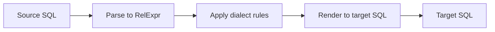
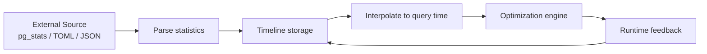
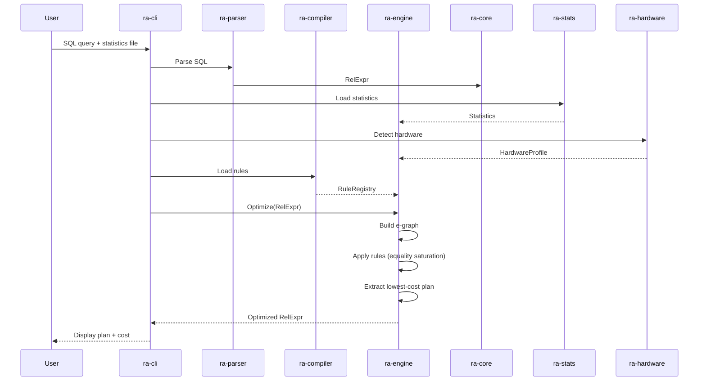

# Component APIs

This document describes how RA's major subsystems interact, their public APIs, and the data flow between them. For the high-level architecture diagram, see [architecture.md](../architecture.md).

---

## Crate Dependency Graph

```mermaid
graph TD
    CLI[ra-cli] --> Engine[ra-engine]
    CLI --> Parser[ra-parser]
    CLI --> Dialect[ra-dialect]
    CLI --> Stats[ra-stats]
    CLI --> Config[ra-config]
    CLI --> Regression[ra-regression]

    TUI[ra-tui] --> Engine
    TUI --> Parser
    TUI --> Config

    Web[ra-web] --> Engine
    Web --> Parser
    Web --> Dialect

    WASM[ra-wasm] --> Engine
    WASM --> Parser

    PGExt[ra-pg-extension] --> Engine
    PGExt --> Core[ra-core]
    PGExt --> Hardware[ra-hardware]

    PGMon[ra-pg-monitor] --> Core
    PGAdv[ra-pg-advisor] --> Core

    Engine --> Core
    Engine --> Hardware
    Engine --> ML[ra-ml]
    Engine --> Stats
    Engine --> Metadata[ra-metadata]
    Parser --> Core
    Dialect --> Core
    Compiler[ra-compiler] --> Core
    Compiler --> Parser
    Codegen[ra-codegen] --> Core
    Adaptive[ra-adaptive] --> Core
    Adaptive --> Engine
    Discovery[ra-discovery] --> Core
    Synthesis[ra-synthesis] --> Core
    Isolation[ra-isolation] --> Core
    Multimodel[ra-multimodel] --> Core
    Catalog[ra-catalog] --> Core
    Cache[ra-cache] --> Core
    Adapters[ra-adapters] --> Core

    style Core fill:#e1f5fe
    style Engine fill:#fff3e0
    style Parser fill:#e8f5e9
```



---

## Core Types (`ra-core`)

The foundation layer. All other crates depend on `ra-core`.

### `RelExpr` -- Relational Algebra AST

The central data structure representing query plans as a tree of relational operators.

**Source**: `crates/ra-core/src/algebra.rs`

Key variants:

| Operator | Description |
|----------|-------------|
| `Scan` | Table scan with optional predicate |
| `Filter` | Selection (sigma) |
| `Project` | Projection (pi) |
| `Join` | Inner/outer/semi/anti joins |
| `Aggregate` | Group-by with aggregate functions |
| `Sort` | Order-by |
| `Limit` | Top-N |
| `Union` / `Intersect` / `Except` | Set operations |
| `Window` | Window functions |
| `CTE` | Common table expressions |
| `Values` | Literal row sets |

`RelExpr` implements `Serialize`, `Deserialize`, and `Clone` for e-graph operations and network transport.

### `Expr` -- Scalar Expressions

**Source**: `crates/ra-core/src/expr.rs`

Represents scalar expressions within relational operators (filter predicates, projection items, join conditions):

- `Column(name)` -- column reference
- `Const(value)` -- literal constant
- `BinOp { op, left, right }` -- binary operation (+, -, =, <, AND, OR, etc.)
- `Function { name, args }` -- function call
- `Case { when_thens, else_ }` -- CASE expressions
- `Subquery(rel_expr)` -- scalar subquery

### `Rule` -- Transformation Rule Metadata

**Source**: `crates/ra-core/src/rule.rs`

Defines the `Rule` trait and metadata types used by the engine to apply transformations:

- Rule ID, name, category, and description
- Pattern (what to match) and application (what to produce)
- Preconditions (when the rule is applicable)
- Cost annotations (whether the rule is cost-neutral, cost-reducing, or may increase cost)

### `Statistics`

**Source**: `crates/ra-core/src/statistics.rs`

Table and column-level statistics used by the cost model:

- Row count (cardinality)
- Column distinct values (NDV)
- NULL fraction
- Min/max values
- Histograms (equi-depth, equi-width)
- Most common values (MCVs)
- Column correlation

### `Facts` -- Database Metadata

**Source**: `crates/ra-core/src/facts.rs`

Schema information consumed by the optimizer:

- Table definitions (columns, types, constraints)
- Index definitions (B-tree, hash, GIN, GiST, etc.)
- Foreign key relationships
- Partitioning schemes
- Materialized views

### `Pattern` -- Rule Pattern Matching

**Source**: `crates/ra-core/src/pattern.rs`

Pattern types for matching `RelExpr` subtrees in rules. Used by `ra-engine` to determine which rules apply to which expression nodes.

### `PhysicalProperties`

**Source**: `crates/ra-core/src/physical_properties.rs`

Tracks physical properties of plan nodes (ordering, partitioning, distribution) to avoid redundant enforce operators.

---

## Optimization Engine (`ra-engine`)

The core optimization pipeline. Takes a `RelExpr` and produces an optimized `RelExpr` using equality saturation.

### Entry Point

**Source**: `crates/ra-engine/src/lib.rs`

The primary API:

```
Input:  RelExpr + Statistics + Facts + HardwareProfile
Output: RelExpr (optimized plan)
```

### E-graph (`egraph.rs`)

**Source**: `crates/ra-engine/src/egraph.rs`

Wraps the [`egg`](https://docs.rs/egg) library for equality saturation:

1. Converts `RelExpr` into egg's e-graph representation
2. Registers rewrite rules (from `rewrite.rs`)
3. Runs equality saturation until saturation or timeout
4. Delegates to `extract.rs` for plan extraction

### Rule Rewrites (`rewrite.rs`)

**Source**: `crates/ra-engine/src/rewrite.rs`

Converts RA's rule definitions into `egg::Rewrite` instances. Handles:

- Pattern matching via egg's pattern language
- Precondition evaluation (delegates to `precondition_eval.rs`)
- Rule metadata attachment for cost analysis

### Cost-Based Extraction (`extract.rs`)

**Source**: `crates/ra-engine/src/extract.rs`

Extracts the lowest-cost equivalent plan from the saturated e-graph. The cost function combines I/O, CPU, memory, and network costs weighted by the hardware profile.

### Cost Model (`cost.rs`)

**Source**: `crates/ra-engine/src/cost.rs`

```
TotalCost = IO_Cost + CPU_Cost + Memory_Cost + Network_Cost
```

Each component is estimated from `Statistics` and `Facts`, then scaled by hardware-specific coefficients from `ra-hardware`.

### Cardinality-Aware Cost (`cardinality_cost.rs`)

**Source**: `crates/ra-engine/src/cardinality_cost.rs`

Enhanced cost estimation that uses histogram and MCV data for accurate selectivity estimates, rather than assuming uniform distribution.

### Specialized Optimizers

| Module | Source | Purpose |
|--------|--------|---------|
| `large_join.rs` | `crates/ra-engine/src/large_join.rs` | Heuristic fallback for joins with 10+ tables |
| `distributed_optimizer.rs` | `crates/ra-engine/src/distributed_optimizer.rs` | Placement and data movement for distributed queries |
| `federated_optimizer.rs` | `crates/ra-engine/src/federated_optimizer.rs` | Cross-database query optimization |
| `column_pruning.rs` | `crates/ra-engine/src/column_pruning.rs` | Remove unused columns from plans |
| `null_simplification.rs` | `crates/ra-engine/src/null_simplification.rs` | Simplify expressions involving NULLs |
| `redundant_join.rs` | `crates/ra-engine/src/redundant_join.rs` | Eliminate unnecessary joins |
| `semi_join.rs` | `crates/ra-engine/src/semi_join.rs` | Semi-join reduction |
| `constraint_optimizer.rs` | `crates/ra-engine/src/constraint_optimizer.rs` | Use constraints for additional optimizations |
| `parquet_pushdown.rs` | `crates/ra-engine/src/parquet_pushdown.rs` | Predicate pushdown for Parquet files |
| `count_metadata.rs` | `crates/ra-engine/src/count_metadata.rs` | COUNT(*) metadata shortcut |
| `covering_index.rs` | `crates/ra-engine/src/covering_index.rs` | Index-only scan optimization |
| `incremental_sort.rs` | `crates/ra-engine/src/incremental_sort.rs` | Incremental sort for partially sorted data |
| `runtime_filters.rs` | `crates/ra-engine/src/runtime_filters.rs` | Runtime filter pushdown (Bloom filters) |
| `trigger_optimizer.rs` | `crates/ra-engine/src/trigger_optimizer.rs` | Trigger-aware optimization |

### Differential Dataflow (`differential.rs`, `timely.rs`)

**Source**: `crates/ra-engine/src/differential.rs`, `crates/ra-engine/src/timely.rs`

Incremental maintenance for rule updates. When rules change, only affected portions of the optimization graph are recomputed, using [timely dataflow](https://github.com/TimelyDataflow/timely-dataflow) and [differential dataflow](https://github.com/TimelyDataflow/differential-dataflow).

### Resource Budgets (`resource_budget.rs`)

**Source**: `crates/ra-engine/src/resource_budget.rs`

Limits optimization time and memory. Configurable timeouts and node count limits prevent the e-graph from growing unbounded.

---

## SQL Parser (`ra-parser`)

Handles parsing of both SQL queries and `.rra` rule files.

### SQL to RelExpr (`sql_to_relexpr.rs`)

**Source**: `crates/ra-parser/src/sql_to_relexpr.rs`

Converts SQL queries into `RelExpr` trees using [`sqlparser`](https://docs.rs/sqlparser) (v0.52). Supports PostgreSQL, MySQL, SQLite, and other dialects.

```
Input:  SQL string + dialect hint
Output: RelExpr
```

### Rule File Parser (`parser.rs`)

**Source**: `crates/ra-parser/src/parser.rs`

Parses `.rra` literate format files:

1. Extract YAML frontmatter (`extractor.rs`)
2. Parse markdown body for code blocks
3. Validate schema against rule requirements (`validator.rs`)
4. Produce `RuleFile` structs

### Formatter (`formatter.rs`)

**Source**: `crates/ra-parser/src/formatter.rs`

Renders `RelExpr` back to SQL or to a formatted relational algebra notation for display.

### MATCH RECOGNIZE (`match_recognize.rs`)

**Source**: `crates/ra-parser/src/match_recognize.rs`

Parser support for SQL:2016 row pattern recognition (`MATCH_RECOGNIZE` clause).

---

## SQL Dialect Translation (`ra-dialect`)

Translates queries between 20+ SQL dialects.

**Source**: `crates/ra-dialect/src/`

### Architecture



- `dialect.rs` -- Dialect definitions and feature matrices
- `translator.rs` -- Dialect-to-dialect translation logic
- `functions.rs` -- Function name and behavior mapping across dialects
- `matrix.rs` -- Feature compatibility matrix
- `backends/` -- Per-dialect rendering backends

---

## Rule Compiler (`ra-compiler`)

Compiles and indexes parsed rules for use by the engine.

**Source**: `crates/ra-compiler/src/`

- `index.rs` -- Builds a searchable index of rules by category, operator, and precondition
- `analyzer.rs` -- Analyzes rule dependencies, conflicts, and redundancies
- `checker.rs` -- Type-checks rule patterns and applications
- `registry.rs` -- Manages the set of loaded, compiled rules

```
Input:  Vec<RuleFile> (from ra-parser)
Output: RuleRegistry (consumed by ra-engine)
```

---

## Code Generation (`ra-codegen`)

Generates executable code from optimized physical plans.

**Source**: `crates/ra-codegen/src/`

| Backend | Source | Description |
|---------|--------|-------------|
| Cranelift | `cranelift_backend.rs` | JIT compilation via Cranelift |
| WASM | `wasm.rs` | WebAssembly compilation via wasmtime |
| Bytecode | `bytecode.rs` | Simple bytecode interpreter |
| Volcano | `volcano.rs` | Volcano-style iterator code generation |
| IR | `ir.rs` | Internal intermediate representation |

---

## Statistics System (`ra-stats`)

Manages table and column statistics with temporal support.

**Source**: `crates/ra-stats/src/`

| Module | Purpose |
|--------|---------|
| `types.rs` | Core statistics types (histograms, MCVs, NDV) |
| `timeline.rs` | Statistics snapshots over time |
| `delta.rs` | Compute deltas between statistics snapshots |
| `profiles.rs` | Predefined statistics profiles for testing |
| `accuracy.rs` | Estimate accuracy metrics |
| `feedback.rs` | Runtime feedback for statistics correction |
| `gathering_cost.rs` | Cost of gathering statistics |
| `index_types.rs` | Index-specific statistics |
| `integration.rs` | Integration with external statistics sources |
| `skew.rs` | Data skew detection and handling |

Statistics flow:



---

## Hardware Detection (`ra-hardware`)

Detects hardware capabilities and adjusts cost model coefficients.

**Source**: `crates/ra-hardware/src/`

- `device.rs` -- Device enum (CPU, GPU, FPGA) and data transfer path modeling
- `profile.rs` -- `HardwareProfile` describing system capabilities (CPU cores, memory, storage type, GPU availability)
- `cost.rs` -- `HardwareCostModel` implementing the `CostModel` trait

Preset profiles: GPU server (A100), FPGA appliance (Alveo), CPU-only systems, laptops, cloud VMs.

See [hardware-acceleration.md](../features/hardware-acceleration.md) for the 21 hardware-specific optimization rules.

---

## Adaptive Execution (`ra-adaptive`)

Runtime reoptimization when actual cardinalities diverge from estimates.

**Source**: `crates/ra-adaptive/src/`

| Module | Purpose |
|--------|---------|
| `runtime_stats.rs` | Collect actual cardinalities during execution |
| `triggers.rs` | Conditions that trigger reoptimization (e.g., estimate off by 10x) |
| `plan_switch.rs` | Mid-execution plan switching |
| `executor.rs` | Adaptive query executor |
| `checkpoint.rs` | Checkpoint/restart for plan transitions |

---

## PostgreSQL Integration

Three crates handle PostgreSQL integration:

### `ra-pg-extension`

**Source**: `crates/ra-pg-extension/src/`

A pgrx-based PostgreSQL extension that hooks into the planner to provide RA optimizer advice. Excluded from the default workspace build (requires PostgreSQL headers).

### `ra-pg-monitor`

**Source**: `crates/ra-pg-monitor/src/`

Monitors PostgreSQL query execution and collects runtime statistics for feedback into the optimizer.

### `ra-pg-advisor`

**Source**: `crates/ra-pg-advisor/src/`

Generates optimization advice (index suggestions, query rewrites) based on workload analysis.

---

## Supporting Crates

| Crate | Purpose |
|-------|---------|
| `ra-config` | Application configuration (TOML-based) |
| `ra-cache` | Query plan caching |
| `ra-catalog` | Schema catalog management |
| `ra-metadata` | Metadata extraction and management |
| `ra-isolation` | Isolation testing framework |
| `ra-multimodel` | Multi-model (document, graph) query support |
| `ra-synthesis` | Natural language to SQL query synthesis |
| `ra-discovery` | Automatic rule discovery from execution logs |
| `ra-ml` | ML-based cardinality estimation (neural network model) |
| `ra-regression` | Query regression detection |
| `ra-adapters` | External database adapters |
| `ra-test-utils` | Shared test utilities |
| `ra-wasm` | WASM bindings for browser use |
| `ra-wasm-docs` | WASM module for interactive documentation |

---

## Data Flow: End-to-End Query Optimization



---

## Extension Points

| Extension | Mechanism | Example |
|-----------|-----------|---------|
| Custom rules | Add `.rra` files to `rules/` | New join rewrite |
| Custom cost model | Implement `CostModel` trait | GPU-specific costs |
| Custom backend | Add to `ra-codegen` | New execution target |
| Custom statistics | Extend `Statistics` types | Custom histogram type |
| Custom dialect | Add to `ra-dialect/backends/` | New SQL dialect |
| Custom adapter | Implement adapter in `ra-adapters` | New database connector |

---

## Related Resources

- **[Architecture](../architecture.md)** - High-level architecture diagrams
- **[Build & Install](./build.md)** - Building from source
- **[API Reference](../api-reference.md)** - Generated API documentation
- **[Rule Authoring Guide](../guides/rule-authoring.md)** - Writing optimization rules
