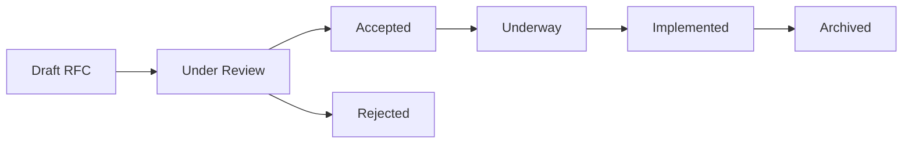

# RFCs (Request for Comments)

This page provides access to all RA optimizer RFCs. The canonical RFC files are maintained in the `/rfcs` directory at the repository root.

**RFC Repository**: [`/rfcs` directory](https://codeberg.org/gregburd/ra/src/branch/main/rfcs)

---

## What is an RFC?

An RFC (Request for Comments) is a design document that describes a proposed feature or significant change to RA. RFCs follow the [Rust RFC process](https://github.com/rust-lang/rfcs) and include:

- **Motivation**: Why are we doing this?
- **Guide-level explanation**: How users will interact with the feature
- **Reference-level explanation**: Technical implementation details
- **Drawbacks**: Why we might NOT do this
- **Rationale and alternatives**: Why this is the best design
- **Prior art**: How other systems solve this problem
- **Unresolved questions**: Open issues to resolve

See [`/rfcs/TEMPLATE.md`](https://codeberg.org/gregburd/ra/src/branch/main/rfcs/TEMPLATE.md) for the full RFC template.

---

## RFC Index

::: info
The RFC index is maintained in [`/rfcs/INDEX.md`](https://codeberg.org/gregburd/ra/src/branch/main/rfcs/INDEX.md).
View it directly for the most up-to-date status.
:::

### Statistics (as of 2026-03-22)

- **Total RFCs**: 45
- **Implemented**: 14 (31%)
- **Underway**: 2 (4%)
- **Accepted**: 12 (27%)
- **Under Review**: 6 (13%)
- **Proposed**: 11 (24%)
- **Rejected**: 0 (0%)

---

## Implemented RFCs

| RFC | Title | Implementation |
|-----|-------|----------------|
| [RFC 0001](https://codeberg.org/gregburd/ra/src/branch/main/rfcs/text/0001-row-pattern-recognition.md) | Row Pattern Recognition | Core feature |
| [RFC 0004](https://codeberg.org/gregburd/ra/src/branch/main/rfcs/text/0004-formal-preconditions.md) | Formal Precondition System | Core feature |
| [RFC 0005](https://codeberg.org/gregburd/ra/src/branch/main/rfcs/text/0005-hardware-aware-optimization.md) | Hardware-Aware Optimization | Core feature |
| [RFC 0006](https://codeberg.org/gregburd/ra/src/branch/main/rfcs/text/0006-distributed-optimization.md) | Distributed Query Optimization | Core feature |
| [RFC 0017](https://codeberg.org/gregburd/ra/src/branch/main/rfcs/text/0017-large-join-graph-fallback.md) | Large Join Graph Optimization Fallback | Join optimizer |
| [RFC 0018](https://codeberg.org/gregburd/ra/src/branch/main/rfcs/text/0018-bitmap-index-scan.md) | Bitmap Index Scan | Physical operators |
| [RFC 0020](https://codeberg.org/gregburd/ra/src/branch/main/rfcs/text/0020-parallel-query-execution.md) | Parallel Query Execution | Execution engine |
| [RFC 0033](https://codeberg.org/gregburd/ra/src/branch/main/rfcs/text/0033-columnar-format-optimization.md) | Columnar Format Optimization | Storage layer |

[View all implemented RFCs →](https://codeberg.org/gregburd/ra/src/branch/main/rfcs/INDEX.md#implemented)

---

## Underway (In Development)

| RFC | Title | Branch/PR |
|-----|-------|-----------|
| [RFC 0002](https://codeberg.org/gregburd/ra/src/branch/main/rfcs/text/0002-pgrx-extension.md) | pgrx PostgreSQL Extension | `feat/pgrx-extension` |
| [RFC 0011](https://codeberg.org/gregburd/ra/src/branch/main/rfcs/text/0011-ascii-movie-recording.md) | ASCII Movie Recording (TUI) | - |

---

## Accepted (Approved, Not Yet Implemented)

| RFC | Title |
|-----|-------|
| [RFC 0003](https://codeberg.org/gregburd/ra/src/branch/main/rfcs/text/0003-plan-advice-integration.md) | pg_plan_advice Integration |
| [RFC 0012](https://codeberg.org/gregburd/ra/src/branch/main/rfcs/text/0012-monitoring-system.md) | Monitoring and Advisory System |
| [RFC 0025](https://codeberg.org/gregburd/ra/src/branch/main/rfcs/text/0025-physical-property-tracking.md) | Physical Property Tracking Framework |
| [RFC 0026](https://codeberg.org/gregburd/ra/src/branch/main/rfcs/text/0026-adaptive-cost-calibration.md) | Adaptive Cost Model Calibration |

[View all accepted RFCs →](https://codeberg.org/gregburd/ra/src/branch/main/rfcs/INDEX.md#accepted-approved-not-yet-implemented)

---

## Proposed (Awaiting Review)

High-priority proposed RFCs from gap analysis (expected 10x-100x performance improvements):

| RFC | Title | Est. Effort | Priority |
|-----|-------|-------------|----------|
| [RFC 0042](https://codeberg.org/gregburd/ra/src/branch/main/rfcs/text/0042-magic-sets-recursive-queries.md) | Magic Sets for Recursive Queries | 4-6 weeks | High |
| [RFC 0043](https://codeberg.org/gregburd/ra/src/branch/main/rfcs/text/0043-groupjoin-eager-aggregation.md) | GroupJoin - Eager Aggregation Before Join | 3-4 weeks | High |
| [RFC 0044](https://codeberg.org/gregburd/ra/src/branch/main/rfcs/text/0044-sideways-information-passing.md) | Sideways Information Passing (SIP) | 4-6 weeks | High |
| [RFC 0045](https://codeberg.org/gregburd/ra/src/branch/main/rfcs/text/0045-runtime-filter-pushdown.md) | Runtime Filter Pushdown with Bloom Filters | 2-3 weeks | High |

[View all proposed RFCs →](https://codeberg.org/gregburd/ra/src/branch/main/rfcs/INDEX.md#proposed-awaiting-review)

---

## How to Propose an RFC

1. **Check existing RFCs**: Make sure your idea isn't already covered
2. **Discuss with maintainers**: Open an issue to get feedback
3. **Copy the template**: `cp rfcs/TEMPLATE.md rfcs/text/NNNN-my-feature.md`
4. **Fill out all sections**: Motivation, design, prior art, etc.
5. **Submit PR**: Create a PR with your RFC
6. **Iterate on feedback**: Address reviewer comments
7. **RFC accepted**: Merged and added to INDEX.md

See [`/rfcs/README.md`](https://codeberg.org/gregburd/ra/src/branch/main/rfcs/README.md) for the full RFC process.

---

## RFC Lifecycle

1. **Draft**: Author creates RFC in `/rfcs/text/`
2. **Under Review**: Community reviews and discusses
3. **Accepted**: Maintainers approve, ready for implementation
4. **Underway**: Implementation in progress
5. **Implemented**: Feature merged to main
6. **Archived**: Moved to `/rfcs/_accepted/YYYY-MM/` with commit hash

---

## Related Resources

- **[Chores & Small Tasks](../chores.md)** - Tasks too small for an RFC
- **[Bug Tracking](../bugs.md)** - Known issues and fixes
- **[Component APIs](../components.md)** - How subsystems interact
- **[Release Process](../release.md)** - When implemented RFCs get released
