# SQL Glossary

A reference of SQL terms, syntax, and semantics across major database systems.

[[toc]]

---

## `SELECT`

**Category:** Query | **SQL Standard:** SQL-86

Retrieves columns from one or more tables. The most fundamental SQL statement, forming the basis of all queries.

**Syntax:**
```sql
SELECT [DISTINCT] column1, column2, expression AS alias
FROM table_name
```

**Related Terms:** [FROM](#from), [DISTINCT](#distinct), [WHERE](#where)

**Database Support:**
| Database | Supported | Notes |
|----------|-----------|-------|
| PostgreSQL | Yes | Full support including `SELECT INTO` |
| MySQL | Yes | Full support |
| SQLite | Yes | Full support |
| Oracle | Yes | Full support |
| SQL Server | Yes | Supports `SELECT TOP` |
| DuckDB | Yes | Full support with `EXCLUDE`/`REPLACE` |

**Visualization:**
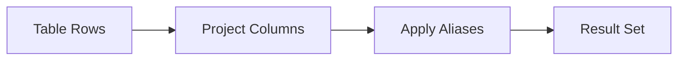

**Examples:**
```sql
-- Select specific columns with alias
SELECT customer_id, first_name || ' ' || last_name AS full_name
FROM customers

-- Select all columns
SELECT * FROM orders WHERE status = 'shipped'
```

---

## `FROM`

**Category:** Query | **SQL Standard:** SQL-86

Specifies the source tables or subqueries to retrieve data from. Supports table aliases and multiple comma-separated sources.

**Syntax:**
```sql
SELECT columns
FROM table1 [AS alias1]
  [JOIN table2 ON condition]
```

**Related Terms:** [SELECT](#select), [JOIN (INNER)](#join-inner), [Subquery](#subquery)

**Database Support:**
| Database | Supported | Notes |
|----------|-----------|-------|
| PostgreSQL | Yes | Supports `FROM LATERAL`, table functions |
| MySQL | Yes | Full support |
| SQLite | Yes | Full support |
| Oracle | Yes | Full support |
| SQL Server | Yes | Supports `CROSS APPLY`/`OUTER APPLY` |
| DuckDB | Yes | Supports `FROM`-first syntax |

**Visualization:**
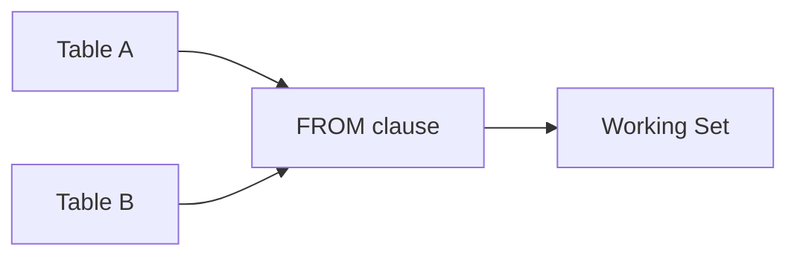

**Examples:**
```sql
-- Multiple tables with aliases
SELECT o.id, c.name
FROM orders o, customers c
WHERE o.customer_id = c.id

-- Subquery as source
SELECT avg_total
FROM (SELECT AVG(total) AS avg_total FROM orders) sub
```

---

## `WHERE`

**Category:** Filtering | **SQL Standard:** SQL-86

Filters rows based on a boolean condition. Evaluated before grouping and aggregation.

**Syntax:**
```sql
SELECT columns
FROM table
WHERE condition [AND|OR condition ...]
```

**Related Terms:** [HAVING](#having), [SELECT](#select), [FROM](#from)

**Database Support:**
| Database | Supported | Notes |
|----------|-----------|-------|
| PostgreSQL | Yes | Full support |
| MySQL | Yes | Full support |
| SQLite | Yes | Full support |
| Oracle | Yes | Full support |
| SQL Server | Yes | Full support |
| DuckDB | Yes | Full support |

**Visualization:**
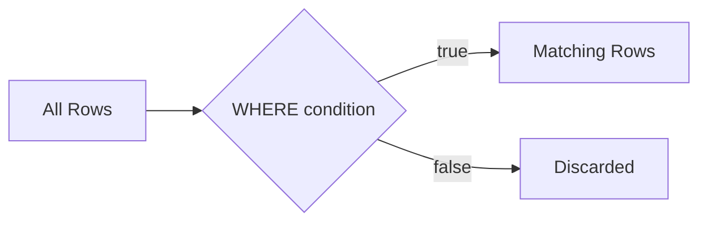

**Examples:**
```sql
-- Compound conditions
SELECT *
FROM products
WHERE price > 100 AND category = 'electronics'

-- Pattern matching and NULLs
SELECT *
FROM customers
WHERE email LIKE '%@example.com' AND deleted_at IS NULL
```

---

## `GROUP BY`

**Category:** Aggregation | **SQL Standard:** SQL-86

Groups rows sharing the same values in specified columns into summary rows. Typically used with aggregate functions.

**Syntax:**
```sql
SELECT column1, aggregate_function(column2)
FROM table
GROUP BY column1
```

**Related Terms:** [HAVING](#having), [Aggregate Functions](#aggregate-functions), [Window Functions](#window-functions)

**Database Support:**
| Database | Supported | Notes |
|----------|-----------|-------|
| PostgreSQL | Yes | Supports `GROUPING SETS`, `CUBE`, `ROLLUP` |
| MySQL | Yes | Non-standard behavior with non-aggregated columns |
| SQLite | Yes | Bare columns pick arbitrary row values |
| Oracle | Yes | Supports `GROUPING SETS`, `CUBE`, `ROLLUP` |
| SQL Server | Yes | Supports `GROUPING SETS`, `CUBE`, `ROLLUP` |
| DuckDB | Yes | Supports `GROUP BY ALL` |

**Visualization:**
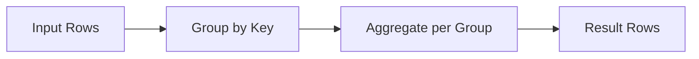

**Examples:**
```sql
-- Count orders per customer
SELECT customer_id, COUNT(*) AS order_count
FROM orders
GROUP BY customer_id

-- Multiple grouping with ROLLUP
SELECT region, product, SUM(sales) AS total
FROM sales_data
GROUP BY ROLLUP(region, product)
```

---

## `HAVING`

**Category:** Aggregation | **SQL Standard:** SQL-86

Filters groups produced by `GROUP BY` based on aggregate conditions. Similar to `WHERE` but operates after grouping.

**Syntax:**
```sql
SELECT column1, aggregate_function(column2)
FROM table
GROUP BY column1
HAVING aggregate_function(column2) condition
```

**Related Terms:** [GROUP BY](#group-by), [WHERE](#where), [Aggregate Functions](#aggregate-functions)

**Database Support:**
| Database | Supported | Notes |
|----------|-----------|-------|
| PostgreSQL | Yes | Full support |
| MySQL | Yes | Full support |
| SQLite | Yes | Full support |
| Oracle | Yes | Full support |
| SQL Server | Yes | Full support |
| DuckDB | Yes | Full support |

**Visualization:**
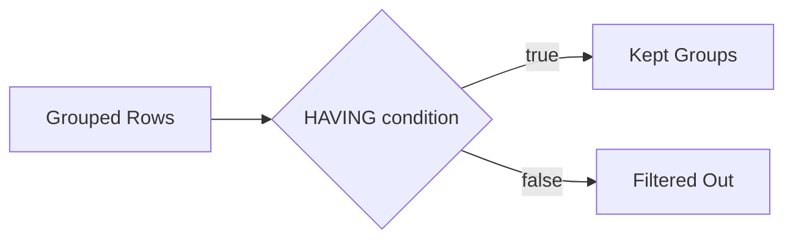

**Examples:**
```sql
-- Customers with more than 5 orders
SELECT customer_id, COUNT(*) AS order_count
FROM orders
GROUP BY customer_id
HAVING COUNT(*) > 5

-- Average order above threshold
SELECT product_id, AVG(quantity) AS avg_qty
FROM order_items
GROUP BY product_id
HAVING AVG(quantity) > 10
```

---

## `ORDER BY`

**Category:** Sorting | **SQL Standard:** SQL-86

Sorts the result set by one or more columns in ascending or descending order. Without `ORDER BY`, row order is non-deterministic.

**Syntax:**
```sql
SELECT columns
FROM table
ORDER BY column1 [ASC|DESC] [NULLS FIRST|LAST]
```

**Related Terms:** [LIMIT](#limit), [SELECT](#select)

**Database Support:**
| Database | Supported | Notes |
|----------|-----------|-------|
| PostgreSQL | Yes | `NULLS FIRST`/`LAST` supported |
| MySQL | Yes | NULLs sort first in ASC |
| SQLite | Yes | NULLs sort first in ASC |
| Oracle | Yes | `NULLS FIRST`/`LAST` supported |
| SQL Server | Yes | No `NULLS FIRST`/`LAST` |
| DuckDB | Yes | `NULLS FIRST`/`LAST` supported |

**Visualization:**


**Examples:**
```sql
-- Sort by multiple columns
SELECT first_name, last_name, hire_date
FROM employees
ORDER BY last_name ASC, hire_date DESC

-- Sort with NULL handling
SELECT name, score
FROM students
ORDER BY score DESC NULLS LAST
```

---

## `LIMIT`

**Category:** Pagination | **SQL Standard:** Not standard (SQL:2008 uses `FETCH FIRST`)

Restricts the number of rows returned. Often combined with `OFFSET` for pagination.

**Syntax:**
```sql
-- MySQL / PostgreSQL / SQLite / DuckDB
SELECT columns FROM table LIMIT count [OFFSET skip]

-- SQL Standard (SQL:2008)
SELECT columns FROM table
OFFSET skip ROWS FETCH FIRST count ROWS ONLY
```

**Related Terms:** [ORDER BY](#order-by), [SELECT](#select)

**Database Support:**
| Database | Supported | Notes |
|----------|-----------|-------|
| PostgreSQL | Yes | Both `LIMIT` and `FETCH FIRST` |
| MySQL | Yes | `LIMIT` only |
| SQLite | Yes | `LIMIT` only |
| Oracle | Yes | `FETCH FIRST` (12c+), `ROWNUM` (legacy) |
| SQL Server | Yes | `TOP` or `FETCH FIRST` (2012+) |
| DuckDB | Yes | Both `LIMIT` and `FETCH FIRST` |

**Examples:**
```sql
-- Top 10 highest-paid employees
SELECT name, salary
FROM employees
ORDER BY salary DESC
LIMIT 10

-- Pagination: page 3, 20 rows per page
SELECT *
FROM products
ORDER BY id
LIMIT 20 OFFSET 40
```

---

## `DISTINCT`

**Category:** Deduplication | **SQL Standard:** SQL-86

Eliminates duplicate rows from the result set. Applied after `SELECT` evaluation.

**Syntax:**
```sql
SELECT DISTINCT column1, column2
FROM table

-- PostgreSQL extension
SELECT DISTINCT ON (column1) column1, column2
FROM table
ORDER BY column1, column2
```

**Related Terms:** [SELECT](#select), [GROUP BY](#group-by), [UNION](#union)

**Database Support:**
| Database | Supported | Notes |
|----------|-----------|-------|
| PostgreSQL | Yes | Supports `DISTINCT ON` |
| MySQL | Yes | Full support |
| SQLite | Yes | Full support |
| Oracle | Yes | Full support |
| SQL Server | Yes | Full support |
| DuckDB | Yes | Supports `DISTINCT ON` |

**Examples:**
```sql
-- Unique cities
SELECT DISTINCT city FROM customers

-- First order per customer (PostgreSQL)
SELECT DISTINCT ON (customer_id)
  customer_id, order_date, total
FROM orders
ORDER BY customer_id, order_date ASC
```

---

## `JOIN (INNER)`

**Category:** Joins | **SQL Standard:** SQL-92

Returns rows that have matching values in both tables. The default join type when `JOIN` is specified without a qualifier.

**Syntax:**
```sql
SELECT columns
FROM table1
[INNER] JOIN table2 ON table1.col = table2.col
```

**Related Terms:** [LEFT JOIN](#left-join), [RIGHT JOIN](#right-join), [FULL OUTER JOIN](#full-outer-join), [CROSS JOIN](#cross-join)

**Database Support:**
| Database | Supported | Notes |
|----------|-----------|-------|
| PostgreSQL | Yes | Full support |
| MySQL | Yes | Full support |
| SQLite | Yes | Full support |
| Oracle | Yes | Full support, legacy `(+)` syntax |
| SQL Server | Yes | Full support |
| DuckDB | Yes | Full support |

**Visualization:**
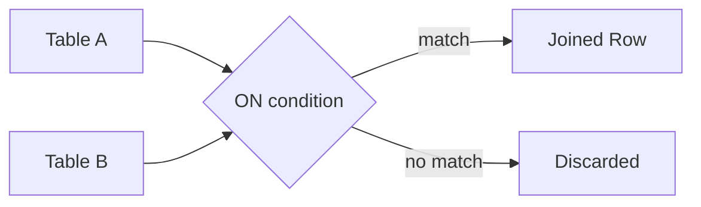

**Examples:**
```sql
-- Orders with customer names
SELECT o.id, c.name, o.total
FROM orders o
INNER JOIN customers c ON o.customer_id = c.id

-- Multi-table join
SELECT e.name, d.department_name, l.city
FROM employees e
JOIN departments d ON e.dept_id = d.id
JOIN locations l ON d.location_id = l.id
```

---

## `LEFT JOIN`

**Category:** Joins | **SQL Standard:** SQL-92

Returns all rows from the left table and matching rows from the right table. Non-matching right-side columns are filled with `NULL`.

**Syntax:**
```sql
SELECT columns
FROM table1
LEFT [OUTER] JOIN table2 ON table1.col = table2.col
```

**Related Terms:** [JOIN (INNER)](#join-inner), [RIGHT JOIN](#right-join), [FULL OUTER JOIN](#full-outer-join)

**Database Support:**
| Database | Supported | Notes |
|----------|-----------|-------|
| PostgreSQL | Yes | Full support |
| MySQL | Yes | Full support |
| SQLite | Yes | Full support |
| Oracle | Yes | Full support, legacy `(+)` syntax |
| SQL Server | Yes | Full support |
| DuckDB | Yes | Full support |

**Visualization:**
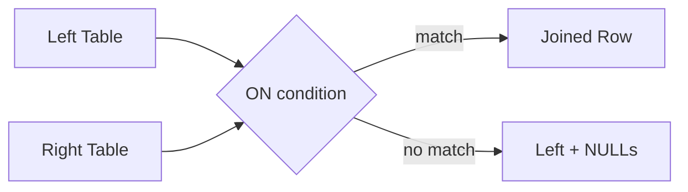

**Examples:**
```sql
-- All customers, even those without orders
SELECT c.name, o.id AS order_id
FROM customers c
LEFT JOIN orders o ON c.id = o.customer_id

-- Find customers with no orders
SELECT c.name
FROM customers c
LEFT JOIN orders o ON c.id = o.customer_id
WHERE o.id IS NULL
```

---

## `RIGHT JOIN`

**Category:** Joins | **SQL Standard:** SQL-92

Returns all rows from the right table and matching rows from the left table. Non-matching left-side columns are filled with `NULL`. Logically equivalent to a `LEFT JOIN` with tables reversed.

**Syntax:**
```sql
SELECT columns
FROM table1
RIGHT [OUTER] JOIN table2 ON table1.col = table2.col
```

**Related Terms:** [JOIN (INNER)](#join-inner), [LEFT JOIN](#left-join), [FULL OUTER JOIN](#full-outer-join)

**Database Support:**
| Database | Supported | Notes |
|----------|-----------|-------|
| PostgreSQL | Yes | Full support |
| MySQL | Yes | Full support |
| SQLite | No | Not supported; use LEFT JOIN instead |
| Oracle | Yes | Full support |
| SQL Server | Yes | Full support |
| DuckDB | Yes | Full support |

**Examples:**
```sql
-- All departments, even those without employees
SELECT e.name, d.department_name
FROM employees e
RIGHT JOIN departments d ON e.dept_id = d.id
```

---

## `FULL OUTER JOIN`

**Category:** Joins | **SQL Standard:** SQL-92

Returns all rows from both tables. Where no match exists, the missing side is filled with `NULL`.

**Syntax:**
```sql
SELECT columns
FROM table1
FULL [OUTER] JOIN table2 ON table1.col = table2.col
```

**Related Terms:** [JOIN (INNER)](#join-inner), [LEFT JOIN](#left-join), [RIGHT JOIN](#right-join)

**Database Support:**
| Database | Supported | Notes |
|----------|-----------|-------|
| PostgreSQL | Yes | Full support |
| MySQL | No | Not natively supported; emulate with `UNION` |
| SQLite | No | Not supported |
| Oracle | Yes | Full support |
| SQL Server | Yes | Full support |
| DuckDB | Yes | Full support |

**Visualization:**
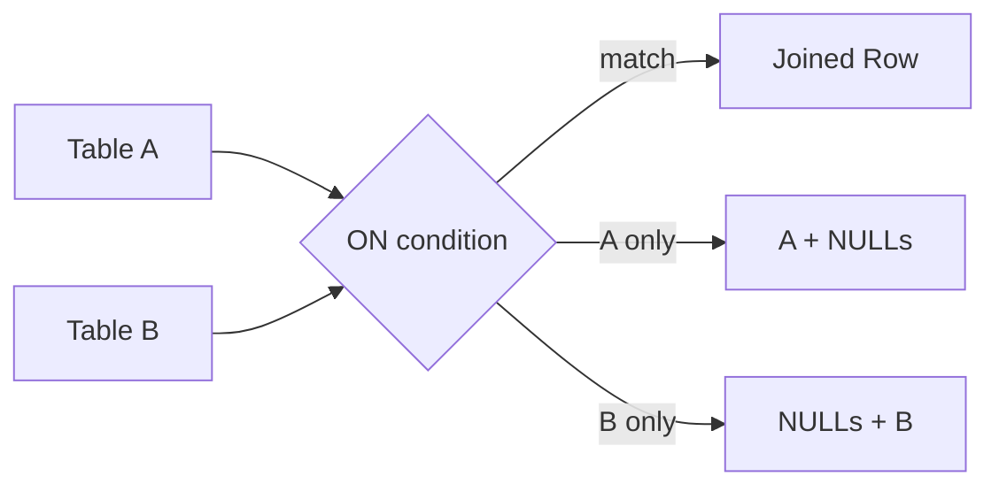

**Examples:**
```sql
-- All employees and departments, matched or not
SELECT e.name, d.department_name
FROM employees e
FULL OUTER JOIN departments d ON e.dept_id = d.id
```

---

## `CROSS JOIN`

**Category:** Joins | **SQL Standard:** SQL-92

Produces the Cartesian product of two tables: every row from the first table paired with every row from the second. No join condition.

**Syntax:**
```sql
SELECT columns
FROM table1 CROSS JOIN table2

-- Equivalent implicit form
SELECT columns
FROM table1, table2
```

**Related Terms:** [JOIN (INNER)](#join-inner), [FROM](#from)

**Database Support:**
| Database | Supported | Notes |
|----------|-----------|-------|
| PostgreSQL | Yes | Full support |
| MySQL | Yes | Full support |
| SQLite | Yes | Full support |
| Oracle | Yes | Full support |
| SQL Server | Yes | Full support |
| DuckDB | Yes | Full support |

**Examples:**
```sql
-- Generate all size/color combinations
SELECT s.size, c.color
FROM sizes s
CROSS JOIN colors c

-- Date and product combinations for reporting
SELECT d.date, p.product_name
FROM dates d
CROSS JOIN products p
```

---

## `UNION`

**Category:** Set Operations | **SQL Standard:** SQL-86

Combines the result sets of two queries, removing duplicates. Both queries must return the same number of columns with compatible types.

**Syntax:**
```sql
SELECT columns FROM table1
UNION [ALL]
SELECT columns FROM table2
```

**Related Terms:** [INTERSECT](#intersect), [EXCEPT](#except), [DISTINCT](#distinct)

**Database Support:**
| Database | Supported | Notes |
|----------|-----------|-------|
| PostgreSQL | Yes | Full support |
| MySQL | Yes | Full support |
| SQLite | Yes | Full support |
| Oracle | Yes | Full support |
| SQL Server | Yes | Full support |
| DuckDB | Yes | Full support |

**Visualization:**
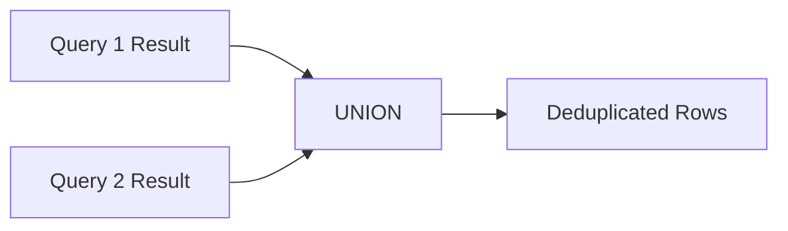

**Examples:**
```sql
-- Active and archived customers
SELECT name, email FROM active_customers
UNION
SELECT name, email FROM archived_customers

-- UNION ALL preserves duplicates (faster)
SELECT product_id FROM online_orders
UNION ALL
SELECT product_id FROM store_orders
```

---

## `INTERSECT`

**Category:** Set Operations | **SQL Standard:** SQL-92

Returns only rows that appear in both result sets. Like `UNION`, both queries must have compatible column structure.

**Syntax:**
```sql
SELECT columns FROM table1
INTERSECT [ALL]
SELECT columns FROM table2
```

**Related Terms:** [UNION](#union), [EXCEPT](#except)

**Database Support:**
| Database | Supported | Notes |
|----------|-----------|-------|
| PostgreSQL | Yes | Supports `INTERSECT ALL` |
| MySQL | Yes | Since 8.0.31 |
| SQLite | Yes | Full support |
| Oracle | Yes | Full support |
| SQL Server | Yes | Full support |
| DuckDB | Yes | Supports `INTERSECT ALL` |

**Examples:**
```sql
-- Customers who ordered both online and in-store
SELECT customer_id FROM online_orders
INTERSECT
SELECT customer_id FROM store_orders
```

---

## `EXCEPT`

**Category:** Set Operations | **SQL Standard:** SQL-92

Returns rows from the first query that do not appear in the second query. Oracle uses `MINUS` as a synonym.

**Syntax:**
```sql
SELECT columns FROM table1
EXCEPT [ALL]
SELECT columns FROM table2
```

**Related Terms:** [UNION](#union), [INTERSECT](#intersect)

**Database Support:**
| Database | Supported | Notes |
|----------|-----------|-------|
| PostgreSQL | Yes | Supports `EXCEPT ALL` |
| MySQL | Yes | Since 8.0.31 |
| SQLite | Yes | Full support |
| Oracle | Yes | Uses `MINUS` keyword |
| SQL Server | Yes | Full support |
| DuckDB | Yes | Supports `EXCEPT ALL` |

**Examples:**
```sql
-- Customers who ordered online but not in-store
SELECT customer_id FROM online_orders
EXCEPT
SELECT customer_id FROM store_orders
```

---

## Aggregate Functions

**Category:** Aggregation | **SQL Standard:** SQL-86

Functions that compute a single result from a set of input rows: `COUNT`, `SUM`, `AVG`, `MIN`, `MAX`.

**Syntax:**
```sql
COUNT(*)         -- count all rows
COUNT(column)    -- count non-NULL values
COUNT(DISTINCT column)  -- count unique non-NULL values
SUM(column)      -- sum of non-NULL values
AVG(column)      -- average of non-NULL values
MIN(column)      -- minimum value
MAX(column)      -- maximum value
```

**Related Terms:** [GROUP BY](#group-by), [HAVING](#having), [Window Functions](#window-functions)

**Database Support:**
| Database | Supported | Notes |
|----------|-----------|-------|
| PostgreSQL | Yes | Additional: `BOOL_AND`, `BOOL_OR`, `STRING_AGG`, `ARRAY_AGG` |
| MySQL | Yes | Additional: `GROUP_CONCAT` |
| SQLite | Yes | Additional: `GROUP_CONCAT`, `TOTAL` |
| Oracle | Yes | Additional: `LISTAGG`, `MEDIAN` |
| SQL Server | Yes | Additional: `STRING_AGG` (2017+) |
| DuckDB | Yes | Additional: `LIST`, `STRING_AGG`, `APPROX_COUNT_DISTINCT` |

**Visualization:**
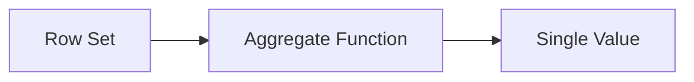

**Examples:**
```sql
-- All core aggregates in one query
SELECT
  COUNT(*) AS total_orders,
  COUNT(DISTINCT customer_id) AS unique_customers,
  SUM(total) AS revenue,
  AVG(total) AS avg_order,
  MIN(total) AS smallest_order,
  MAX(total) AS largest_order
FROM orders
WHERE order_date >= '2025-01-01'
```

---

## Window Functions

**Category:** Analytics | **SQL Standard:** SQL:2003

Perform calculations across a set of rows related to the current row without collapsing them into groups. Defined with `OVER()` clause.

**Syntax:**
```sql
function_name() OVER (
  [PARTITION BY column]
  [ORDER BY column [ASC|DESC]]
  [frame_clause]
)
```

**Related Terms:** [GROUP BY](#group-by), [Aggregate Functions](#aggregate-functions), [ORDER BY](#order-by)

**Database Support:**
| Database | Supported | Notes |
|----------|-----------|-------|
| PostgreSQL | Yes | Full support since 8.4 |
| MySQL | Yes | Since 8.0 |
| SQLite | Yes | Since 3.25.0 |
| Oracle | Yes | Extensive support (analytic functions) |
| SQL Server | Yes | Full support since 2012 |
| DuckDB | Yes | Full support including `QUALIFY` |

**Visualization:**
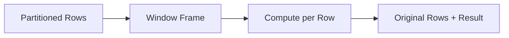

**Common Functions:**
| Function | Description |
|----------|-------------|
| `ROW_NUMBER()` | Sequential integer per partition |
| `RANK()` | Rank with gaps on ties |
| `DENSE_RANK()` | Rank without gaps on ties |
| `NTILE(n)` | Distribute rows into n buckets |
| `LAG(col, n)` | Value from n rows before |
| `LEAD(col, n)` | Value from n rows after |
| `FIRST_VALUE(col)` | First value in window frame |
| `LAST_VALUE(col)` | Last value in window frame |
| `SUM(col) OVER(...)` | Running or partitioned sum |

**Examples:**
```sql
-- Rank employees by salary within department
SELECT
  name, department, salary,
  RANK() OVER (
    PARTITION BY department ORDER BY salary DESC
  ) AS salary_rank
FROM employees

-- Running total of orders
SELECT
  order_date, total,
  SUM(total) OVER (ORDER BY order_date) AS running_total
FROM orders
```

---

## Common Table Expression (CTE)

**Category:** Query Structure | **SQL Standard:** SQL:1999

A named temporary result set defined with `WITH` that exists for the duration of a single query. Improves readability and enables recursion.

**Syntax:**
```sql
WITH cte_name AS (
  SELECT ...
)
SELECT ... FROM cte_name

-- Recursive CTE
WITH RECURSIVE cte_name AS (
  SELECT ...          -- base case
  UNION ALL
  SELECT ...          -- recursive step
  FROM cte_name
  WHERE termination_condition
)
SELECT ... FROM cte_name
```

**Related Terms:** [Subquery](#subquery), [SELECT](#select)

**Database Support:**
| Database | Supported | Notes |
|----------|-----------|-------|
| PostgreSQL | Yes | `WITH RECURSIVE`, materialized/not materialized hints |
| MySQL | Yes | Since 8.0, `WITH RECURSIVE` |
| SQLite | Yes | `WITH RECURSIVE` |
| Oracle | Yes | Uses `WITH` (no `RECURSIVE` keyword needed) |
| SQL Server | Yes | Full support, recursive CTEs |
| DuckDB | Yes | `WITH RECURSIVE` |

**Visualization:**
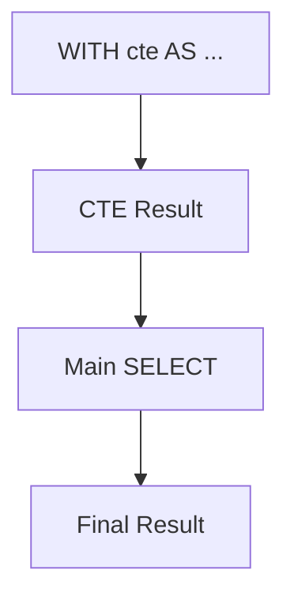

**Examples:**
```sql
-- Named subquery for clarity
WITH high_value_customers AS (
  SELECT customer_id, SUM(total) AS lifetime_value
  FROM orders
  GROUP BY customer_id
  HAVING SUM(total) > 10000
)
SELECT c.name, h.lifetime_value
FROM customers c
JOIN high_value_customers h ON c.id = h.customer_id

-- Recursive: org chart traversal
WITH RECURSIVE org_tree AS (
  SELECT id, name, manager_id, 0 AS depth
  FROM employees
  WHERE manager_id IS NULL
  UNION ALL
  SELECT e.id, e.name, e.manager_id, t.depth + 1
  FROM employees e
  JOIN org_tree t ON e.manager_id = t.id
)
SELECT * FROM org_tree ORDER BY depth, name
```

---

## Subquery

**Category:** Query Structure | **SQL Standard:** SQL-86

A query nested inside another query. Can appear in `SELECT`, `FROM`, `WHERE`, or `HAVING` clauses. Subqueries can be correlated (referencing outer query columns) or uncorrelated.

**Syntax:**
```sql
-- Scalar subquery (returns one value)
SELECT name, (SELECT MAX(total) FROM orders WHERE customer_id = c.id)
FROM customers c

-- IN subquery
SELECT * FROM products
WHERE id IN (SELECT product_id FROM order_items)

-- EXISTS subquery
SELECT * FROM customers c
WHERE EXISTS (SELECT 1 FROM orders o WHERE o.customer_id = c.id)

-- Derived table (FROM subquery)
SELECT * FROM (SELECT id, total FROM orders) AS sub
```

**Related Terms:** [Common Table Expression (CTE)](#common-table-expression-cte), [WHERE](#where), [EXISTS](#exists)

**Database Support:**
| Database | Supported | Notes |
|----------|-----------|-------|
| PostgreSQL | Yes | Full support, `LATERAL` subqueries |
| MySQL | Yes | Improved optimization in 8.0+ |
| SQLite | Yes | Full support |
| Oracle | Yes | Full support |
| SQL Server | Yes | Full support, `CROSS APPLY`/`OUTER APPLY` |
| DuckDB | Yes | Full support |

**Examples:**
```sql
-- Correlated subquery: orders above customer average
SELECT o.*
FROM orders o
WHERE o.total > (
  SELECT AVG(o2.total)
  FROM orders o2
  WHERE o2.customer_id = o.customer_id
)
```

---

## `EXISTS`

**Category:** Predicate | **SQL Standard:** SQL-86

Tests whether a subquery returns any rows. Returns `TRUE` if the subquery produces at least one row, `FALSE` otherwise. Often more efficient than `IN` for correlated checks.

**Syntax:**
```sql
SELECT columns
FROM table1 t1
WHERE EXISTS (
  SELECT 1 FROM table2 t2
  WHERE t2.col = t1.col
)
```

**Related Terms:** [Subquery](#subquery), [WHERE](#where), [IN](#in)

**Database Support:**
| Database | Supported | Notes |
|----------|-----------|-------|
| PostgreSQL | Yes | Full support |
| MySQL | Yes | Full support |
| SQLite | Yes | Full support |
| Oracle | Yes | Full support |
| SQL Server | Yes | Full support |
| DuckDB | Yes | Full support |

**Examples:**
```sql
-- Customers who have placed at least one order
SELECT c.name
FROM customers c
WHERE EXISTS (
  SELECT 1 FROM orders o WHERE o.customer_id = c.id
)

-- NOT EXISTS: customers with no orders
SELECT c.name
FROM customers c
WHERE NOT EXISTS (
  SELECT 1 FROM orders o WHERE o.customer_id = c.id
)
```

---

## `IN`

**Category:** Predicate | **SQL Standard:** SQL-86

Tests whether a value matches any value in a list or subquery result. Equivalent to multiple `OR` conditions.

**Syntax:**
```sql
-- Value list
WHERE column IN (value1, value2, value3)

-- Subquery
WHERE column IN (SELECT col FROM other_table)

-- Negation
WHERE column NOT IN (value1, value2)
```

**Related Terms:** [EXISTS](#exists), [WHERE](#where), [Subquery](#subquery)

**Database Support:**
| Database | Supported | Notes |
|----------|-----------|-------|
| PostgreSQL | Yes | Full support, supports `= ANY(array)` |
| MySQL | Yes | Full support |
| SQLite | Yes | Full support |
| Oracle | Yes | Max 1000 elements in literal list |
| SQL Server | Yes | Full support |
| DuckDB | Yes | Full support |

::: warning
`NOT IN` returns no rows if the subquery contains `NULL` values. Prefer `NOT EXISTS` for NULL-safe anti-joins.
:::

**Examples:**
```sql
-- Literal list
SELECT * FROM products
WHERE category IN ('electronics', 'books', 'clothing')

-- Subquery
SELECT * FROM employees
WHERE department_id IN (
  SELECT id FROM departments WHERE location = 'NYC'
)
```

---

## `CASE`

**Category:** Conditional | **SQL Standard:** SQL-92

Returns different values based on conditions. Works like an if/else expression. Can be used in `SELECT`, `WHERE`, `ORDER BY`, and `GROUP BY`.

**Syntax:**
```sql
-- Searched CASE
CASE
  WHEN condition1 THEN result1
  WHEN condition2 THEN result2
  ELSE default_result
END

-- Simple CASE
CASE expression
  WHEN value1 THEN result1
  WHEN value2 THEN result2
  ELSE default_result
END
```

**Related Terms:** [SELECT](#select), [WHERE](#where)

**Database Support:**
| Database | Supported | Notes |
|----------|-----------|-------|
| PostgreSQL | Yes | Full support |
| MySQL | Yes | Full support, also `IF()` function |
| SQLite | Yes | Full support, also `IIF()` |
| Oracle | Yes | Full support, also `DECODE()` |
| SQL Server | Yes | Full support, also `IIF()` |
| DuckDB | Yes | Full support |

**Examples:**
```sql
-- Categorize orders by size
SELECT
  order_id,
  total,
  CASE
    WHEN total >= 1000 THEN 'large'
    WHEN total >= 100  THEN 'medium'
    ELSE 'small'
  END AS order_size
FROM orders

-- Conditional aggregation
SELECT
  COUNT(CASE WHEN status = 'shipped' THEN 1 END) AS shipped,
  COUNT(CASE WHEN status = 'pending' THEN 1 END) AS pending
FROM orders
```

---

## `INSERT`

**Category:** Data Modification | **SQL Standard:** SQL-86

Adds new rows to a table. Supports single-row inserts, multi-row inserts, and insert-from-select.

**Syntax:**
```sql
-- Single row
INSERT INTO table (col1, col2)
VALUES (val1, val2)

-- Multiple rows
INSERT INTO table (col1, col2)
VALUES (val1, val2), (val3, val4)

-- From query
INSERT INTO table (col1, col2)
SELECT colA, colB FROM other_table
```

**Related Terms:** [UPDATE](#update), [DELETE](#delete), [MERGE](#merge)

**Database Support:**
| Database | Supported | Notes |
|----------|-----------|-------|
| PostgreSQL | Yes | `ON CONFLICT` for upserts, `RETURNING` |
| MySQL | Yes | `ON DUPLICATE KEY UPDATE` |
| SQLite | Yes | `ON CONFLICT`, `OR REPLACE` |
| Oracle | Yes | `INSERT ALL` for multi-table insert |
| SQL Server | Yes | `OUTPUT` clause for returning |
| DuckDB | Yes | `ON CONFLICT`, `RETURNING` |

**Examples:**
```sql
-- Insert with conflict handling (PostgreSQL)
INSERT INTO users (email, name)
VALUES ('alice@example.com', 'Alice')
ON CONFLICT (email) DO UPDATE
SET name = EXCLUDED.name

-- Insert from query
INSERT INTO order_archive (id, customer_id, total)
SELECT id, customer_id, total
FROM orders
WHERE order_date < '2024-01-01'
```

---

## `UPDATE`

**Category:** Data Modification | **SQL Standard:** SQL-86

Modifies existing rows in a table. The `WHERE` clause controls which rows are affected; omitting it updates all rows.

**Syntax:**
```sql
UPDATE table
SET col1 = value1, col2 = value2
WHERE condition
```

**Related Terms:** [INSERT](#insert), [DELETE](#delete), [MERGE](#merge)

**Database Support:**
| Database | Supported | Notes |
|----------|-----------|-------|
| PostgreSQL | Yes | `FROM` clause for joins, `RETURNING` |
| MySQL | Yes | Multi-table `UPDATE ... JOIN` |
| SQLite | Yes | `FROM` clause (3.33+) |
| Oracle | Yes | Correlated subquery or `MERGE` |
| SQL Server | Yes | `FROM` clause for joins, `OUTPUT` |
| DuckDB | Yes | `FROM` clause, `RETURNING` |

**Examples:**
```sql
-- Simple update
UPDATE products
SET price = price * 1.10
WHERE category = 'electronics'

-- Update with join (PostgreSQL)
UPDATE orders o
SET status = 'vip'
FROM customers c
WHERE o.customer_id = c.id AND c.tier = 'gold'
```

---

## `DELETE`

**Category:** Data Modification | **SQL Standard:** SQL-86

Removes rows from a table. The `WHERE` clause controls which rows are removed; omitting it deletes all rows.

**Syntax:**
```sql
DELETE FROM table
WHERE condition
```

**Related Terms:** [INSERT](#insert), [UPDATE](#update), [TRUNCATE](#truncate)

**Database Support:**
| Database | Supported | Notes |
|----------|-----------|-------|
| PostgreSQL | Yes | `USING` for joins, `RETURNING` |
| MySQL | Yes | Multi-table `DELETE ... JOIN` |
| SQLite | Yes | Full support |
| Oracle | Yes | Full support |
| SQL Server | Yes | `FROM` clause for joins, `OUTPUT` |
| DuckDB | Yes | `USING`, `RETURNING` |

**Examples:**
```sql
-- Delete with condition
DELETE FROM sessions
WHERE last_active < NOW() - INTERVAL '30 days'

-- Delete with join (PostgreSQL)
DELETE FROM order_items oi
USING orders o
WHERE oi.order_id = o.id AND o.status = 'cancelled'
```

---

## `MERGE`

**Category:** Data Modification | **SQL Standard:** SQL:2003

Conditionally inserts, updates, or deletes rows based on whether they match a source. Often called "upsert" in simplified forms.

**Syntax:**
```sql
MERGE INTO target
USING source ON target.id = source.id
WHEN MATCHED THEN
  UPDATE SET target.col = source.col
WHEN NOT MATCHED THEN
  INSERT (col) VALUES (source.col)
```

**Related Terms:** [INSERT](#insert), [UPDATE](#update), [DELETE](#delete)

**Database Support:**
| Database | Supported | Notes |
|----------|-----------|-------|
| PostgreSQL | Yes | Since 15, also `INSERT ... ON CONFLICT` |
| MySQL | No | Use `INSERT ... ON DUPLICATE KEY UPDATE` |
| SQLite | No | Use `INSERT ... ON CONFLICT` |
| Oracle | Yes | Full support |
| SQL Server | Yes | Full support |
| DuckDB | Yes | Full support |

**Examples:**
```sql
-- Upsert inventory counts
MERGE INTO inventory t
USING shipments s ON t.product_id = s.product_id
WHEN MATCHED THEN
  UPDATE SET t.quantity = t.quantity + s.quantity
WHEN NOT MATCHED THEN
  INSERT (product_id, quantity)
  VALUES (s.product_id, s.quantity)
```

---

## `TRUNCATE`

**Category:** Data Modification | **SQL Standard:** SQL:2008

Removes all rows from a table. Faster than `DELETE` without a `WHERE` clause because it does not generate individual row delete operations.

**Syntax:**
```sql
TRUNCATE [TABLE] table_name [CASCADE | RESTRICT]
```

**Related Terms:** [DELETE](#delete)

**Database Support:**
| Database | Supported | Notes |
|----------|-----------|-------|
| PostgreSQL | Yes | Supports `CASCADE`, `RESTART IDENTITY` |
| MySQL | Yes | Resets auto-increment |
| SQLite | No | Use `DELETE FROM` instead |
| Oracle | Yes | DDL statement (implicit commit) |
| SQL Server | Yes | Cannot truncate with FK references |
| DuckDB | Yes | Full support |

**Examples:**
```sql
-- Clear staging table before reload
TRUNCATE TABLE staging_data

-- Truncate with cascade (PostgreSQL)
TRUNCATE orders CASCADE
```

---

## `CREATE TABLE`

**Category:** DDL | **SQL Standard:** SQL-86

Defines a new table with columns, data types, and constraints.

**Syntax:**
```sql
CREATE TABLE table_name (
  column1 data_type [constraints],
  column2 data_type [constraints],
  [table_constraints]
)
```

**Related Terms:** [INSERT](#insert), [ALTER TABLE](#alter-table), [DROP TABLE](#drop-table)

**Database Support:**
| Database | Supported | Notes |
|----------|-----------|-------|
| PostgreSQL | Yes | `IF NOT EXISTS`, partitioning, inheritance |
| MySQL | Yes | `IF NOT EXISTS`, engine selection |
| SQLite | Yes | `IF NOT EXISTS`, flexible typing |
| Oracle | Yes | Full support |
| SQL Server | Yes | Full support |
| DuckDB | Yes | `CREATE OR REPLACE`, `CREATE TABLE AS` |

**Examples:**
```sql
-- Table with constraints
CREATE TABLE IF NOT EXISTS orders (
  id          BIGINT GENERATED ALWAYS AS IDENTITY PRIMARY KEY,
  customer_id BIGINT NOT NULL REFERENCES customers(id),
  total       NUMERIC(12, 2) NOT NULL CHECK (total >= 0),
  status      TEXT NOT NULL DEFAULT 'pending',
  created_at  TIMESTAMPTZ NOT NULL DEFAULT NOW()
)

-- Create from query
CREATE TABLE order_summary AS
SELECT customer_id, COUNT(*) AS cnt, SUM(total) AS total
FROM orders
GROUP BY customer_id
```

---

## `ALTER TABLE`

**Category:** DDL | **SQL Standard:** SQL-92

Modifies an existing table structure: add/drop columns, modify types, add/remove constraints.

**Syntax:**
```sql
ALTER TABLE table_name
  ADD [COLUMN] column_name data_type [constraints]

ALTER TABLE table_name
  DROP [COLUMN] column_name [CASCADE]

ALTER TABLE table_name
  ALTER COLUMN column_name SET DATA TYPE new_type
```

**Related Terms:** [CREATE TABLE](#create-table), [DROP TABLE](#drop-table)

**Database Support:**
| Database | Supported | Notes |
|----------|-----------|-------|
| PostgreSQL | Yes | Extensive support, transactional DDL |
| MySQL | Yes | Full support, may rebuild table |
| SQLite | Yes | Limited: add column, rename table/column |
| Oracle | Yes | Full support |
| SQL Server | Yes | Full support |
| DuckDB | Yes | Full support |

**Examples:**
```sql
-- Add a column
ALTER TABLE customers
ADD COLUMN phone TEXT

-- Add a constraint
ALTER TABLE orders
ADD CONSTRAINT positive_total CHECK (total >= 0)

-- Drop a column
ALTER TABLE users
DROP COLUMN legacy_field
```

---

## `DROP TABLE`

**Category:** DDL | **SQL Standard:** SQL-86

Permanently removes a table and all its data from the database.

**Syntax:**
```sql
DROP TABLE [IF EXISTS] table_name [CASCADE | RESTRICT]
```

**Related Terms:** [CREATE TABLE](#create-table), [TRUNCATE](#truncate)

**Database Support:**
| Database | Supported | Notes |
|----------|-----------|-------|
| PostgreSQL | Yes | `IF EXISTS`, `CASCADE` |
| MySQL | Yes | `IF EXISTS` |
| SQLite | Yes | `IF EXISTS` |
| Oracle | Yes | `CASCADE CONSTRAINTS`, `PURGE` |
| SQL Server | Yes | `IF EXISTS` (2016+) |
| DuckDB | Yes | `IF EXISTS`, `CASCADE` |

**Examples:**
```sql
-- Safe drop
DROP TABLE IF EXISTS temp_results

-- Drop with dependent objects (PostgreSQL)
DROP TABLE orders CASCADE
```

---

## `CREATE INDEX`

**Category:** DDL | **SQL Standard:** Implementation-defined

Creates an index on one or more columns to speed up queries. Indexes trade write performance and storage for faster reads.

**Syntax:**
```sql
CREATE [UNIQUE] INDEX [CONCURRENTLY] index_name
ON table_name (column1 [ASC|DESC], column2 ...)
[WHERE condition]   -- partial index
```

**Related Terms:** [SELECT](#select), [WHERE](#where), [CREATE TABLE](#create-table)

**Database Support:**
| Database | Supported | Notes |
|----------|-----------|-------|
| PostgreSQL | Yes | B-tree, Hash, GiST, GIN, BRIN; partial, expression |
| MySQL | Yes | B-tree, Hash, Full-text, Spatial |
| SQLite | Yes | B-tree, partial indexes |
| Oracle | Yes | B-tree, Bitmap, Function-based |
| SQL Server | Yes | Clustered, Non-clustered, Filtered, Columnstore |
| DuckDB | Yes | ART index |

**Examples:**
```sql
-- Composite index
CREATE INDEX idx_orders_customer_date
ON orders (customer_id, order_date DESC)

-- Partial index (PostgreSQL)
CREATE INDEX idx_active_users
ON users (email)
WHERE deleted_at IS NULL

-- Concurrent index creation (no table lock)
CREATE INDEX CONCURRENTLY idx_orders_status
ON orders (status)
```

---

## `VIEW`

**Category:** DDL | **SQL Standard:** SQL-86

A named query stored in the database that acts as a virtual table. Views do not store data; they execute the underlying query when accessed.

**Syntax:**
```sql
CREATE [OR REPLACE] VIEW view_name AS
SELECT columns FROM tables WHERE condition

-- Materialized view (stores results)
CREATE MATERIALIZED VIEW view_name AS
SELECT ...
```

**Related Terms:** [SELECT](#select), [Common Table Expression (CTE)](#common-table-expression-cte)

**Database Support:**
| Database | Supported | Notes |
|----------|-----------|-------|
| PostgreSQL | Yes | Materialized views, updatable views |
| MySQL | Yes | Updatable views with restrictions |
| SQLite | Yes | Read-only views |
| Oracle | Yes | Materialized views with refresh |
| SQL Server | Yes | Indexed views (materialized) |
| DuckDB | Yes | Full support |

**Examples:**
```sql
-- Summary view
CREATE VIEW customer_summary AS
SELECT
  c.id, c.name,
  COUNT(o.id) AS order_count,
  COALESCE(SUM(o.total), 0) AS lifetime_value
FROM customers c
LEFT JOIN orders o ON c.id = o.customer_id
GROUP BY c.id, c.name

-- Query a view like a table
SELECT * FROM customer_summary
WHERE lifetime_value > 5000
```

---

## `LATERAL`

**Category:** Joins | **SQL Standard:** SQL:1999

Allows a subquery in `FROM` to reference columns from preceding tables in the same `FROM` clause. Enables correlated subqueries in the `FROM` position.

**Syntax:**
```sql
SELECT columns
FROM table1 t1
CROSS JOIN LATERAL (
  SELECT ... FROM table2 WHERE table2.col = t1.col
  LIMIT n
) sub
```

**Related Terms:** [Subquery](#subquery), [CROSS JOIN](#cross-join), [FROM](#from)

**Database Support:**
| Database | Supported | Notes |
|----------|-----------|-------|
| PostgreSQL | Yes | Full support |
| MySQL | Yes | Since 8.0.14 |
| SQLite | No | Not supported |
| Oracle | Yes | Since 12c |
| SQL Server | No | Use `CROSS APPLY`/`OUTER APPLY` |
| DuckDB | Yes | Full support |

**Examples:**
```sql
-- Top 3 orders per customer
SELECT c.name, t.order_id, t.total
FROM customers c
CROSS JOIN LATERAL (
  SELECT o.id AS order_id, o.total
  FROM orders o
  WHERE o.customer_id = c.id
  ORDER BY o.total DESC
  LIMIT 3
) t
```

---

## `COALESCE`

**Category:** Null Handling | **SQL Standard:** SQL-92

Returns the first non-NULL argument. A standard, portable way to handle NULL values.

**Syntax:**
```sql
COALESCE(value1, value2, ..., default_value)
```

**Related Terms:** [CASE](#case), [NULL](#null)

**Database Support:**
| Database | Supported | Notes |
|----------|-----------|-------|
| PostgreSQL | Yes | Full support |
| MySQL | Yes | Full support, also `IFNULL()` |
| SQLite | Yes | Full support |
| Oracle | Yes | Full support, also `NVL()` |
| SQL Server | Yes | Full support, also `ISNULL()` |
| DuckDB | Yes | Full support |

**Examples:**
```sql
-- Default for missing values
SELECT
  name,
  COALESCE(phone, email, 'no contact') AS contact_info
FROM customers

-- Replace NULL in aggregation
SELECT
  department,
  COALESCE(SUM(bonus), 0) AS total_bonus
FROM employees
GROUP BY department
```

---

## `NULL`

**Category:** Values | **SQL Standard:** SQL-86

A special marker indicating the absence of a value. NULL is not equal to anything, including itself. Requires `IS NULL` / `IS NOT NULL` for comparison.

**Syntax:**
```sql
WHERE column IS NULL
WHERE column IS NOT NULL

-- Three-valued logic
-- NULL = NULL  ->  NULL (not TRUE)
-- NULL <> 1   ->  NULL (not TRUE)
-- NULL AND TRUE -> NULL
-- NULL OR TRUE  -> TRUE
```

**Related Terms:** [COALESCE](#coalesce), [WHERE](#where), [LEFT JOIN](#left-join)

**Database Support:**
| Database | Supported | Notes |
|----------|-----------|-------|
| PostgreSQL | Yes | `IS DISTINCT FROM` for NULL-safe comparison |
| MySQL | Yes | `<=>` operator for NULL-safe equality |
| SQLite | Yes | `IS` operator for NULL-safe equality |
| Oracle | Yes | Empty string equals NULL |
| SQL Server | Yes | `SET ANSI_NULLS` controls behavior |
| DuckDB | Yes | `IS DISTINCT FROM` |

::: warning
Oracle treats empty strings (`''`) as NULL. This is non-standard and a common source of bugs when porting queries.
:::

**Examples:**
```sql
-- Find rows with missing data
SELECT * FROM customers
WHERE phone IS NULL

-- NULL-safe comparison (PostgreSQL)
SELECT * FROM orders
WHERE shipped_date IS NOT DISTINCT FROM expected_date
```

---

## `CAST`

**Category:** Type Conversion | **SQL Standard:** SQL-92

Converts a value from one data type to another. Fails with an error if the conversion is not possible.

**Syntax:**
```sql
-- Standard
CAST(expression AS target_type)

-- PostgreSQL shorthand
expression::target_type
```

**Related Terms:** [SELECT](#select), [WHERE](#where)

**Database Support:**
| Database | Supported | Notes |
|----------|-----------|-------|
| PostgreSQL | Yes | `::` shorthand, `TRY_CAST` via extensions |
| MySQL | Yes | `CAST`, `CONVERT` |
| SQLite | Yes | `CAST` |
| Oracle | Yes | `CAST`, `TO_NUMBER`, `TO_DATE`, `TO_CHAR` |
| SQL Server | Yes | `CAST`, `CONVERT`, `TRY_CAST` |
| DuckDB | Yes | `CAST`, `::`, `TRY_CAST` |

**Examples:**
```sql
-- Convert types
SELECT CAST('2025-01-15' AS DATE)
SELECT CAST(price AS INTEGER) FROM products

-- PostgreSQL shorthand
SELECT '42'::INTEGER
SELECT total::NUMERIC(10,2) FROM orders
```

---

## `BETWEEN`

**Category:** Predicate | **SQL Standard:** SQL-86

Tests whether a value falls within an inclusive range. Equivalent to `value >= low AND value <= high`.

**Syntax:**
```sql
WHERE column BETWEEN low AND high
WHERE column NOT BETWEEN low AND high
```

**Related Terms:** [WHERE](#where), [IN](#in)

**Database Support:**
| Database | Supported | Notes |
|----------|-----------|-------|
| PostgreSQL | Yes | Full support |
| MySQL | Yes | Full support |
| SQLite | Yes | Full support |
| Oracle | Yes | Full support |
| SQL Server | Yes | Full support |
| DuckDB | Yes | Full support |

**Examples:**
```sql
-- Date range
SELECT * FROM orders
WHERE order_date BETWEEN '2025-01-01' AND '2025-12-31'

-- Numeric range
SELECT * FROM products
WHERE price BETWEEN 10.00 AND 99.99
```

---

## `LIKE`

**Category:** Predicate | **SQL Standard:** SQL-86

Pattern matching on strings. `%` matches any sequence of characters, `_` matches any single character.

**Syntax:**
```sql
WHERE column LIKE pattern
WHERE column NOT LIKE pattern
WHERE column ILIKE pattern   -- case-insensitive (PostgreSQL)
```

**Related Terms:** [WHERE](#where), [CASE](#case)

**Database Support:**
| Database | Supported | Notes |
|----------|-----------|-------|
| PostgreSQL | Yes | `ILIKE` for case-insensitive, `SIMILAR TO` for regex |
| MySQL | Yes | Case-insensitive by default (depends on collation) |
| SQLite | Yes | `LIKE` is case-insensitive for ASCII |
| Oracle | Yes | Case-sensitive by default |
| SQL Server | Yes | Depends on collation |
| DuckDB | Yes | `ILIKE`, `SIMILAR TO` |

**Examples:**
```sql
-- Starts with
SELECT * FROM customers WHERE name LIKE 'A%'

-- Contains
SELECT * FROM products WHERE description LIKE '%organic%'

-- Single character wildcard
SELECT * FROM codes WHERE code LIKE 'A_B_'
```

---

## `GROUP BY GROUPING SETS`

**Category:** Aggregation | **SQL Standard:** SQL:1999

Computes aggregates for multiple grouping combinations in a single query. `CUBE` and `ROLLUP` are shorthand forms.

**Syntax:**
```sql
-- Explicit grouping sets
GROUP BY GROUPING SETS (
  (col1, col2),
  (col1),
  ()
)

-- ROLLUP: hierarchical subtotals
GROUP BY ROLLUP(col1, col2)
-- Equivalent to: (col1, col2), (col1), ()

-- CUBE: all combinations
GROUP BY CUBE(col1, col2)
-- Equivalent to: (col1, col2), (col1), (col2), ()
```

**Related Terms:** [GROUP BY](#group-by), [Aggregate Functions](#aggregate-functions)

**Database Support:**
| Database | Supported | Notes |
|----------|-----------|-------|
| PostgreSQL | Yes | Full support |
| MySQL | Yes | `ROLLUP` only (no `CUBE` or `GROUPING SETS`) |
| SQLite | No | Not supported |
| Oracle | Yes | Full support |
| SQL Server | Yes | Full support |
| DuckDB | Yes | Full support |

**Examples:**
```sql
-- Sales report with subtotals
SELECT
  COALESCE(region, '(all)') AS region,
  COALESCE(product, '(all)') AS product,
  SUM(amount) AS total_sales
FROM sales
GROUP BY ROLLUP(region, product)
ORDER BY region, product
```

---

## `FETCH FIRST`

**Category:** Pagination | **SQL Standard:** SQL:2008

The standard SQL syntax for limiting result rows. Portable alternative to vendor-specific `LIMIT` and `TOP`.

**Syntax:**
```sql
SELECT columns FROM table
ORDER BY column
OFFSET n ROWS
FETCH FIRST m ROWS ONLY
```

**Related Terms:** [LIMIT](#limit), [ORDER BY](#order-by)

**Database Support:**
| Database | Supported | Notes |
|----------|-----------|-------|
| PostgreSQL | Yes | Since 8.4 |
| MySQL | No | Use `LIMIT` |
| SQLite | No | Use `LIMIT` |
| Oracle | Yes | Since 12c |
| SQL Server | Yes | Since 2012 |
| DuckDB | Yes | Full support |

**Examples:**
```sql
-- Standard pagination
SELECT name, salary
FROM employees
ORDER BY salary DESC
OFFSET 10 ROWS
FETCH FIRST 5 ROWS ONLY
```

---

## `QUALIFY`

**Category:** Filtering | **SQL Standard:** Not standard (vendor extension)

Filters rows based on the result of a window function. Eliminates the need for a subquery or CTE to filter window results.

**Syntax:**
```sql
SELECT columns
FROM table
QUALIFY window_function() condition
```

**Related Terms:** [Window Functions](#window-functions), [HAVING](#having), [WHERE](#where)

**Database Support:**
| Database | Supported | Notes |
|----------|-----------|-------|
| PostgreSQL | No | Use subquery or CTE |
| MySQL | No | Use subquery or CTE |
| SQLite | No | Use subquery or CTE |
| Oracle | No | Use subquery or CTE |
| SQL Server | No | Use subquery or CTE |
| DuckDB | Yes | Full support |

**Examples:**
```sql
-- Latest order per customer (DuckDB)
SELECT customer_id, order_date, total
FROM orders
QUALIFY ROW_NUMBER() OVER (
  PARTITION BY customer_id ORDER BY order_date DESC
) = 1

-- Equivalent without QUALIFY
SELECT * FROM (
  SELECT customer_id, order_date, total,
    ROW_NUMBER() OVER (
      PARTITION BY customer_id ORDER BY order_date DESC
    ) AS rn
  FROM orders
) sub
WHERE rn = 1
```

---

## `VALUES`

**Category:** Query | **SQL Standard:** SQL:1999

Constructs a table from literal row values. Can be used standalone or within `INSERT`, CTEs, and `FROM` clauses.

**Syntax:**
```sql
-- Standalone table constructor
VALUES (val1, val2), (val3, val4)

-- In FROM clause
SELECT * FROM (VALUES (1, 'a'), (2, 'b')) AS t(id, letter)
```

**Related Terms:** [INSERT](#insert), [FROM](#from), [Common Table Expression (CTE)](#common-table-expression-cte)

**Database Support:**
| Database | Supported | Notes |
|----------|-----------|-------|
| PostgreSQL | Yes | Full support as standalone query |
| MySQL | Yes | Since 8.0.19 |
| SQLite | Yes | Full support |
| Oracle | No | Use dual table: `SELECT ... FROM DUAL UNION ALL` |
| SQL Server | Yes | Full support |
| DuckDB | Yes | Full support |

**Examples:**
```sql
-- Inline reference data
SELECT m.name, m.code
FROM (VALUES
  ('January', 'JAN'),
  ('February', 'FEB'),
  ('March', 'MAR')
) AS m(name, code)
```

---

## SQL Execution Order

The logical order in which SQL clause are evaluated differs from how they are written. Understanding this order clarifies which clauses can reference aliases, window results, and aggregate values.

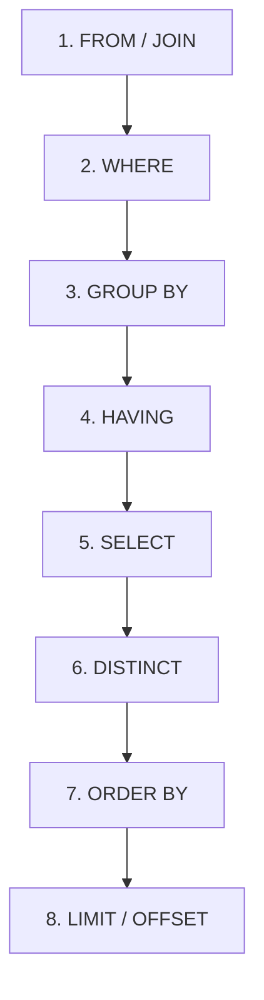

| Step | Clause | What Happens |
|------|--------|-------------|
| 1 | `FROM` / `JOIN` | Tables are loaded and joined |
| 2 | `WHERE` | Rows are filtered (no aggregates here) |
| 3 | `GROUP BY` | Remaining rows are grouped |
| 4 | `HAVING` | Groups are filtered by aggregate conditions |
| 5 | `SELECT` | Columns and expressions are evaluated |
| 6 | `DISTINCT` | Duplicate rows are removed |
| 7 | `ORDER BY` | Results are sorted |
| 8 | `LIMIT`/`OFFSET` | Rows are paginated |
